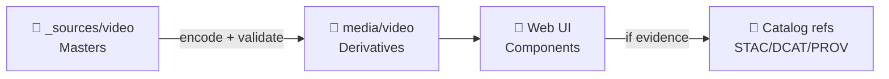

# 🎥 Video Sources (Web UI Media)


> [!NOTE]
> **Path:** `web/assets/media/_sources/video/`  
> This folder holds **master/source** video files for the KFM web app. These are **not** the files we serve directly in production.

---

## ✨ Why this exists

KFM treats content as part of an evidence-aware, contract-driven system. Even when a video is “just UI polish,” we still want:

- ✅ **Clear purpose** (what it’s for / where it appears)
- ✅ **Clear provenance & license** (where it came from / who owns what)
- ✅ **Repeatable outputs** (same inputs → same encoded results)
- ✅ **Accessible playback** (captions/transcripts, reduced-motion support)
- ✅ **Fast load** (sane size + duration budgets)

---

## 🧭 Quick links

- 📘 KFM Master Guide (pipeline + invariants): `../../../../../docs/MASTER_GUIDE_v13.md`
- 🧱 Repo structure standard: `../../../../../docs/standards/KFM_REPO_STRUCTURE_STANDARD.md`
- 🧾 Metadata standards:
  - `../../../../../docs/standards/KFM_STAC_PROFILE.md`
  - `../../../../../docs/standards/KFM_DCAT_PROFILE.md`
  - `../../../../../docs/standards/KFM_PROV_PROFILE.md`
- 🛡️ Governance:
  - `../../../../../docs/governance/ETHICS.md`
  - `../../../../../docs/governance/REVIEW_GATES.md`
- 🧩 Story Node assets (story-specific media belongs here): `../../../../../docs/reports/story_nodes/`

---

## 🗺️ Where should this video live?

| Use case 🧩 | Put the **master** here? | Recommended home 📁 |
|---|---:|---|
| Global UI / branding (hero loop, onboarding, ambient background) | ✅ Yes | `web/assets/media/_sources/video/` |
| Story-specific media (only used in one Story Node) | ⚠️ Prefer No | `docs/reports/story_nodes/**/assets/` |
| Evidence artifact (derived from data, analysis output, animated map layer, etc.) | ❌ No | `data/processed/**` + cataloged (STAC/DCAT/PROV) |
| Huge raw footage (multi‑GB camera originals) | ❌ Usually No | Store externally or via repo policy (e.g., LFS) + commit pointer/manifest |

> [!IMPORTANT]
> This folder is **not** an escape hatch from governance. If a video is part of “evidence,” it should follow the evidence pipeline (catalogs → API → UI), not be hardcoded into the UI.

---

## 🧱 Expected layout (per video)

We strongly prefer **one folder per video slug**:

```text
web/assets/media/_sources/video/
├── 📄 README.md
├── 📁 <slug>/
│   ├── 🎞️ master.mov                 # or master.mp4 (highest reasonable quality)
│   ├── 🧾 meta.json                  # REQUIRED (license + provenance + intent)
│   ├── 💬 captions.en.vtt            # REQUIRED if speech is present
│   ├── 📝 transcript.en.md           # strongly recommended if speech is present
│   └── 🖼️ poster.png                 # optional (can be generated)
└── 📁 _templates/
    └── 🧾 meta.template.json
```

### 🔁 Recommended derivative output location

Derivatives should be generated into a **served/optimized** folder (committed if small; or built in CI):

```text
web/assets/media/video/<slug>/
├── 🎞️ <slug>--720p.mp4
├── 🎞️ <slug>--720p.webm
├── 🎞️ <slug>--1080p.mp4              # optional
├── 🎞️ <slug>--1080p.webm             # optional
├── 🖼️ <slug>--poster.webp
└── 💬 <slug>--captions.en.vtt
```

---

## 🏷️ Naming conventions

### Slug rules ✅
- lowercase + hyphens: `prairie-wind-loop`
- no spaces, no underscores
- stable over time (if the meaning changes, bump version in metadata)

### Derivative naming ✅
Use the slug + “double-dash” suffix style:

- `<slug>--720p.mp4`, `<slug>--720p.webm`
- `<slug>--poster.webp`
- `<slug>--captions.en.vtt`

---

## 🧾 `meta.json` (REQUIRED)

Every video folder must contain `meta.json`. This is our **minimum provenance + intent contract** for UI media.

> [!TIP]
> Keep it boring and explicit. Future-you (and CI) will thank you. 😄

### Minimal template

```json
{
  "id": "video:prairie-wind-loop",
  "slug": "prairie-wind-loop",
  "title": "Prairie Wind Loop",
  "purpose": "ui-background",
  "description": "Short ambient loop used behind the landing hero.",
  "license": {
    "spdx": "CC-BY-4.0",
    "attribution": "Jane Doe",
    "source_url": "https://example.org/source",
    "notes": "Any special restrictions or credit lines."
  },
  "provenance": {
    "created_by": "kfm-team",
    "created_at": "2026-01-17",
    "source_type": "original|third-party|derived",
    "source_files": ["master.mov"],
    "editing_notes": "Color correction + stabilization."
  },
  "media": {
    "has_audio": false,
    "languages": [],
    "captions": [],
    "duration_seconds": 9.8
  },
  "kfm_refs": {
    "stac_item_id": null,
    "dcat_dataset_id": null,
    "prov_bundle_id": null,
    "story_node_slugs": []
  },
  "tags": ["ui", "ambient", "kansas"]
}
```

### `purpose` values (suggested)
- `ui-background` 🌾
- `ui-demo` 🧪
- `tutorial` 🎓
- `branding` 🏛️
- `story-preview` 📚

---

## 🛠️ Build & encode (FFmpeg recipes)

> [!NOTE]
> These commands are **reference defaults**. If the repo provides a media build script (preferred), use that so outputs stay deterministic.

<details>
<summary><strong>📼 MP4 (H.264) — broadly compatible</strong></summary>

```bash
ffmpeg -i master.mov \
  -c:v libx264 -pix_fmt yuv420p -profile:v high -level 4.1 \
  -vf "scale=-2:720,fps=30" \
  -preset slow -crf 23 \
  -movflags +faststart \
  -an \
  prairie-wind-loop--720p.mp4
```
</details>

<details>
<summary><strong>🧊 WebM (VP9) — smaller for Chrome/Firefox</strong></summary>

```bash
ffmpeg -i master.mov \
  -c:v libvpx-vp9 -b:v 0 -crf 32 \
  -vf "scale=-2:720,fps=30" \
  -an \
  prairie-wind-loop--720p.webm
```
</details>

<details>
<summary><strong>🖼️ Poster frame</strong></summary>

```bash
ffmpeg -ss 00:00:01 -i master.mov \
  -vframes 1 -vf "scale=-2:720" \
  prairie-wind-loop--poster.png
```
</details>

<details>
<summary><strong>💬 Captions</strong></summary>

- Use **WebVTT**: `captions.en.vtt`
- Keep timestamps accurate
- If speech exists: captions are **required** (and a transcript is strongly recommended)

Example `<track>` usage is shown below 👇
</details>

---

## ♿ Accessibility requirements

### If the video includes speech 🗣️
- ✅ Provide `captions.<lang>.vtt`
- ✅ Provide `transcript.<lang>.md` (recommended)
- ✅ Avoid autoplay with audio (web UX + accessibility)

### Reduced motion 🧘
If a video is decorative (background loop), the UI should respect:

- `prefers-reduced-motion: reduce`
- show a static poster instead of autoplaying video

---

## 🚀 Using a video in the UI (example)

```html
<video
  autoplay
  muted
  loop
  playsinline
  preload="metadata"
  poster="/assets/media/video/prairie-wind-loop/prairie-wind-loop--poster.webp"
>
  <source
    src="/assets/media/video/prairie-wind-loop/prairie-wind-loop--720p.webm"
    type="video/webm"
  />
  <source
    src="/assets/media/video/prairie-wind-loop/prairie-wind-loop--720p.mp4"
    type="video/mp4"
  />
  <track
    kind="captions"
    src="/assets/media/video/prairie-wind-loop/prairie-wind-loop--captions.en.vtt"
    srclang="en"
    label="English"
    default
  />
</video>
```

> [!TIP]
> Always provide **WebM + MP4** if possible (WebM for size; MP4 for Safari reliability).

---

## ✅ Performance budgets (guidelines)

| Type 🎞️ | Target duration | Target size (per rendition) | Notes |
|---|---:|---:|---|
| Background loop 🌾 | ≤ 12s | WebM ≤ 2–4MB, MP4 ≤ 4–8MB | No audio, 720p is usually enough |
| Tutorial / narration 🎓 | ≤ 2–5 min | As small as feasible | Captions required; consider chunking |
| Story preview 📚 | ≤ 30s | Keep it tight | Poster + captions if voiceover |

---

## 🔒 Licensing & provenance (non-negotiable)

- ✅ Every video must declare **license + attribution** in `meta.json`
- ✅ If third‑party: include **source URL**, terms, and any credit line requirements
- ✅ If original: record **creator**, date, and any constraints (e.g., releases/consent if relevant)
- ✅ Don’t import “random internet clips” without clear rights

> [!IMPORTANT]
> If we can’t confidently describe the rights, we can’t ship it.

---

## 🧪 PR checklist (copy/paste)

- [ ] Added video under `web/assets/media/_sources/video/<slug>/`
- [ ] Added `meta.json` with license + provenance + purpose
- [ ] Generated derivatives (MP4 + WebM) + poster + captions (if applicable)
- [ ] Verified playback in at least Chrome + Safari
- [ ] Confirmed reduced-motion fallback behavior in UI
- [ ] If evidence-related: ensured catalog references (STAC/DCAT/PROV) exist and are linked (don’t hardcode)

---

## 🧬 Media flow (mental model)



---

## ❓ FAQ

### “Can I just drop an MP4 in the UI and call it done?”
If it’s truly decorative UI media, you *can*, but **you still must** add `meta.json` and keep sizes sane. If it’s evidence-related, don’t bypass catalogs/APIs.

### “Why do we keep masters separate from served files?”
So we can:
- re-encode deterministically later (new codecs, better settings),
- keep repo weight manageable,
- maintain provenance + intent cleanly.

### “What if the master is huge?”
Follow repo policy (e.g., LFS or external storage) and store a pointer/manifest + metadata in the repo.

---
