# 🎧 Audio Assets — `web/assets/media/audio/`

[](#-provenance--contracts)
[](#-metadata-sidecars-the-audio-contract)
[](#-accessibility-requirements)
[](#-usage-in-the-web-app)

> 🧭 **KFM rule of thumb:** if a user can *hear it*, we should be able to **trace it, credit it, and reproduce it**.

---

## 🗂️ What lives here

This folder is the **web-front-end distribution** home for audio used by the UI and Story/Focus experiences:
- 🔔 **UI SFX** (clicks, confirmations, warnings)
- 🎙️ **Narration** (voiceover clips for Story Nodes)
- 🌾 **Ambience** (light background loops that support immersion)
- 🎼 **Music beds** (optional, minimal, loopable)

### 🚫 What does *not* belong here
- **Large raw masters** (WAV multitracks, long interviews)  
  → Keep those in the governed data pipeline / storage and publish *web-friendly derivatives* here.
- **Anything without licensing + attribution**  
  → “No mystery layers” applies to media too. If we can’t cite it, we can’t ship it.
- **Sensitive content that violates governance/sovereignty**  
  → Narration can leak sensitive locations or personal data just as easily as a map.

---

## 📁 Directory layout

Recommended structure (feel free to extend, but don’t scatter categories):

```text
web/assets/media/audio/
├─ ui/                # 🖱️ Short UI sounds
│  └─ <asset-slug>/
│     ├─ <asset-slug>.mp3
│     ├─ <asset-slug>.ogg
│     └─ <asset-slug>.meta.json
├─ narration/         # 🎙️ Spoken clips used in stories
│  └─ <asset-slug>/
│     ├─ <asset-slug>.mp3
│     ├─ <asset-slug>.ogg
│     ├─ <asset-slug>.vtt            # ♿ captions (preferred)
│     ├─ <asset-slug>.transcript.md  # 📝 human-friendly transcript
│     └─ <asset-slug>.meta.json
├─ ambience/          # 🌾 Subtle loops (wind, prairie, town)
├─ music/             # 🎼 Optional, keep very small + loopable
└─ _manifests/        # 🧾 Optional: index/registry files used by the app
   └─ audio.index.json
```

---

## 🧱 Provenance & contracts

KFM’s architecture treats **provenance + contracts as first-class**: anything surfaced in UI/Focus must be traceable and validated.  
That principle applies to audio assets the same way it applies to datasets.

### ✅ Non-negotiables
- 🧾 Every shippable audio asset has a **metadata sidecar** (`*.meta.json`)  
- 🪪 Every sidecar includes **license + attribution + source**  
- 🔗 If an asset is referenced by Story Nodes / Focus Mode, reference it by a **stable ID** (not an ad-hoc filename)
- 🚫 No “mystery sounds”: if metadata is missing, the asset is not accepted

---

## 🏷️ Naming: humans + machines

### File/folder naming (human-friendly)
Use **kebab-case** and keep names descriptive:
- ✅ `ui-click-primary`
- ✅ `narration-dust-bowl-intro-en`
- ❌ `final_final_2.mp3`
- ❌ `sound1.mp3`

### Stable IDs (machine-friendly)
Audio **identifiers should be information-free** (stable over time), while filenames can be descriptive.

Recommended:
- `id`: ULID/UUID style (e.g., `aud_01J...`)
- `slug`: descriptive kebab-case (folder name)

Why this matters:
- ✅ filenames can evolve without breaking references
- ✅ Story Nodes / UI configs can remain stable
- ✅ audit logs and provenance stay durable

---

## 🧾 Metadata sidecars: the “audio contract”

Every audio folder ships with:

- `my-sound.meta.json` ✅ required  
- Optional: captions (`.vtt`) + transcript (`.md`) for spoken audio

### Required fields (minimum contract)
| Field | Type | Why |
|---|---:|---|
| `id` | string | Stable reference used by configs + logs |
| `slug` | string | Human-friendly identity |
| `title` | string | Display name |
| `role` | enum | `ui_sfx` / `narration` / `ambience` / `music` |
| `license` | object | Legal clarity (SPDX + URL if available) |
| `attribution` | object | Creator + credit text |
| `sources[]` | array | Provenance (where it came from) |
| `files` | object | Paths + hashes + basic technical info |
| `createdAt` | string | ISO date/time |
| `notes` | string | Anything special (edits, filters, etc.) |

### Example `*.meta.json`

```json
{
  "id": "aud_01JABCDEF1234567890XYZ",
  "slug": "ui-click-primary",
  "title": "UI Click (Primary)",
  "role": "ui_sfx",
  "license": {
    "spdx": "CC0-1.0",
    "url": "https://creativecommons.org/publicdomain/zero/1.0/"
  },
  "attribution": {
    "credit": "Public domain / CC0 sound effect",
    "creator": "Unknown",
    "requiredText": "CC0 — no attribution required (credit appreciated)."
  },
  "sources": [
    {
      "name": "Source Library Name",
      "type": "web",
      "url": "https://example.com/sound/123",
      "accessedAt": "YYYY-MM-DD",
      "licenseSpdx": "CC0-1.0"
    }
  ],
  "files": {
    "mp3": {
      "path": "ui/ui-click-primary/ui-click-primary.mp3",
      "sha256": "<sha256-hash>",
      "sizeBytes": 12345,
      "durationMs": 180
    },
    "ogg": {
      "path": "ui/ui-click-primary/ui-click-primary.ogg",
      "sha256": "<sha256-hash>",
      "sizeBytes": 9876,
      "durationMs": 180
    }
  },
  "accessibility": {
    "hasSpeech": false,
    "captionsVtt": null,
    "transcriptMd": null,
    "language": null
  },
  "createdAt": "YYYY-MM-DDTHH:mm:ssZ",
  "notes": "Trimmed tail, normalized for consistent UI loudness."
}
```

> 🧪 Tip: Treat this JSON like a **contract artifact** — it should be machine-validated in CI (same philosophy as dataset contracts).

---

## 🎚️ Formats & quality guidelines

### Shipping formats (web-ready)
For maximum browser compatibility:
- ✅ `.mp3` (primary)
- ✅ `.ogg` (secondary / open format)

Optional (only if needed for editing, usually **not** committed here):
- ⚠️ `.wav` masters (prefer elsewhere; publish derived formats here)

### Loudness & consistency
We want UI and narration to feel consistent (no surprise blasts). Recommended practices:
- Keep peaks controlled (avoid clipping)
- Normalize categories separately (UI vs narration vs ambience)
- Prefer short fades to prevent clicks/pops on edits

---

## ♿ Accessibility requirements

If audio includes **speech**, it must include at least one:
- ✅ `*.vtt` captions (best for UI integration)
- ✅ `*.transcript.md` (human-readable backup)

Also capture in metadata:
- `accessibility.hasSpeech: true`
- `accessibility.language: "en"` (or relevant language code)

> 🧠 Accessibility is not optional: Story + Focus are designed to be usable by non-developers and broad audiences, which includes people using assistive technology.

---

## ⚡ Performance & UX rules

### ✅ Don’t autoplay
- Browsers often block autoplay with sound
- Autoplay is a UX footgun (and violates “opt-in” expectations for Focus experiences)

If you must preload, prefer:
- `preload="metadata"` for narration
- app-level preloading only for tiny UI SFX

### ✅ Keep assets small
- UI SFX should be tiny and short
- Loops should be subtle and efficient

### ✅ Cache-friendly
If your build pipeline fingerprints assets, great. If not, prefer stable folder structures + metadata hashes for integrity.

---

## 🌐 Usage in the web app

### HTML5 `<audio>` (basic)
```html
<audio controls preload="none">
  <source src="/assets/media/audio/narration/narration-dust-bowl-intro-en/narration-dust-bowl-intro-en.mp3" type="audio/mpeg">
  <source src="/assets/media/audio/narration/narration-dust-bowl-intro-en/narration-dust-bowl-intro-en.ogg" type="audio/ogg">
  Your browser does not support the audio element.
</audio>
```

### HTML5 `<audio>` with captions
```html
<audio controls preload="metadata">
  <source src="/assets/media/audio/narration/my-clip/my-clip.mp3" type="audio/mpeg">
  <source src="/assets/media/audio/narration/my-clip/my-clip.ogg" type="audio/ogg">
  <track kind="captions" src="/assets/media/audio/narration/my-clip/my-clip.vtt" srclang="en" label="English" default>
</audio>
```

### React (simple SFX pattern)
```ts
// Example pattern — keep it user-triggered.
import clickMp3 from "./ui/ui-click-primary/ui-click-primary.mp3";

export function playUiClick(volume = 0.2) {
  const a = new Audio(clickMp3);
  a.volume = volume;
  a.play().catch(() => {
    // Common on first load until the user interacts; safe to ignore/log.
  });
}
```

---

## ➕ Adding a new audio asset (checklist)

### 1) Place files correctly ✅
- [ ] Create a new folder under the right category (e.g., `ui/<slug>/`)
- [ ] Add `.mp3` and `.ogg`

### 2) Add the contract ✅
- [ ] Create `<slug>.meta.json` with license + attribution + source(s)
- [ ] Compute `sha256` hashes and include them

### 3) Accessibility (if speech) ♿
- [ ] Add `.vtt` captions (preferred)
- [ ] Add `.transcript.md` (recommended)
- [ ] Set `hasSpeech`, `language`, and transcript/caption paths in metadata

### 4) Governance sanity check 🛡️
- [ ] No sensitive location leaks
- [ ] No personal data without explicit governance approval
- [ ] AI-generated voices are clearly labeled (and only used where policy allows)

### 5) Validation 🧪
- [ ] Metadata passes validators / CI checks
- [ ] Story Nodes or UI configs reference the asset by **stable ID**, not ad-hoc filenames

---

## 🗺️ How this fits the KFM pipeline (high level)

```mermaid
flowchart LR
  A["🎛️ Source / Recording"] --> B["🎚️ Edit + Encode (mp3/ogg)"]
  B --> C["🧾 Sidecar Contract (*.meta.json)"]
  C --> D["📦 Web Asset Distribution (this folder)"]
  D --> E["🖥️ UI / Story Nodes"]
  E --> F["🔎 Focus Mode (provenance-linked experience)"]
```



---

## 🔍 FAQ / gotchas

**Why won’t audio play on page load?**  
Most browsers require user interaction before playing sound. Keep playback user-triggered.

**Do we really need metadata for tiny UI clicks?**  
Yes. Tiny files still need license clarity and integrity, and it keeps the system consistent.

**Where should long oral histories go?**  
Not here. Publish a web-friendly excerpt here and keep masters + full provenance in the governed data pipeline/storage.

---

## 🔗 Related docs (repo paths)
- `docs/standards/` — metadata profiles, validation expectations
- `docs/templates/` — Story Node templates and governed formats
- `web/story_nodes/` — narrative content that may reference audio assets
