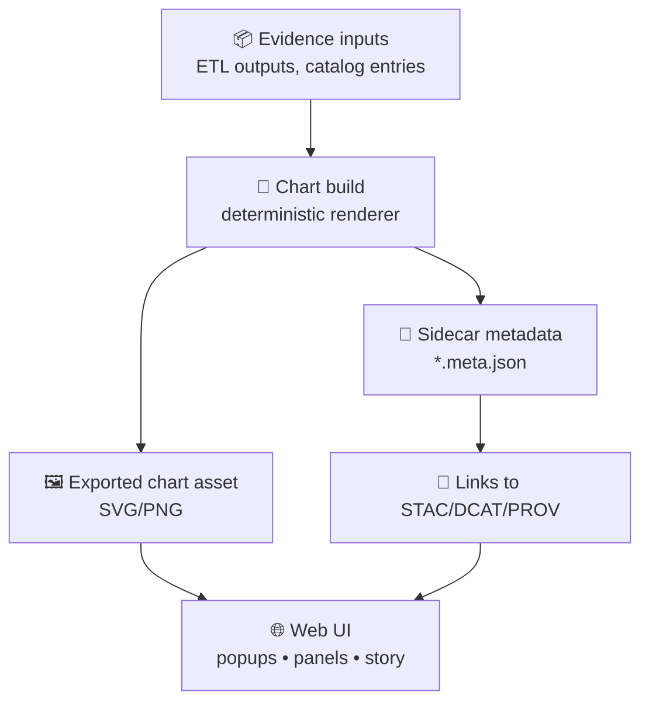

# 📈 Chart Export Assets (`web/assets/media/charts/export/`)


> ⚠️ **Treat this folder as “exported/build artifacts.”**  
> If you’re *designing* charts or writing chart logic, do that upstream (code/specs). This folder is for the **outputs** the UI (and governed narratives) can reference consistently.

---

## 📍 Where you are

```txt
web/
└─ 📁 assets/
   └─ 🎞️ media/
      └─ 📈 charts/
         └─ ✅📦 export/
            └─ 📄 README.md  👈 you’re here 📌 Production-ready chart media (web-optimized, cacheable)
```

---

## 🎯 Purpose

This directory contains **exported chart assets** used by the KFM web UI, especially where we need:

- ⚡ **Fast rendering** (pre-rendered SVG/PNG instead of re-computing)
- 🧾 **Stable, deterministic visuals** (consistent output per dataset + parameters)
- 🧭 **Governed references** from UI + Story/Focus experiences (charts that must remain traceable & reviewable)
- 📱 **Responsive-friendly assets** that can scale cleanly (SVG-first when possible)

Common uses:
- 🪟 Popups / side-panels with mini time-series or “sparkline” summaries
- 📚 Story Nodes / Focus Mode visuals when a static figure is appropriate
- 🧪 QA snapshots for chart regressions (visual diff-friendly outputs)

---

## 🧠 KFM mindset for charts

KFM is built around **contract-first** + **evidence-first** publishing. That matters here:

- Charts should be **derived from cataloged evidence** (STAC/DCAT + PROV lineage), not “mystery data.”
- A chart with *no traceable source* is treated as an error in governed contexts (especially Focus Mode).

In practice, that means every exported chart should have:
- a **stable ID**
- **metadata** that links back to evidence (datasets + provenance)
- **clear labeling** (units, time range, aggregation)

---

## 🗂️ Recommended layout

If this folder is currently empty or being standardized, prefer this structure 👇

```txt
📁 export/
├─ 📁 <domain>/                         # ex: water, air-quality, agriculture
│  ├─ 📁 <dataset_id>/                  # stable ID (dcat/stac-friendly)
│  │  ├─ 🖼️ <chart_id>.svg              # preferred (crisp + small)
│  │  ├─ 🖼️ <chart_id>.png              # optional fallback
│  │  ├─ 🧾 <chart_id>.meta.json        # REQUIRED (source + params + lineage)
│  │  └─ 🧾 <chart_id>.thumb.png        # optional (UI previews)
│  └─ 📁 _shared/                       # shared visuals, legends, symbols
├─ 🧾 manifest.json                     # optional index for UI lookups
└─ 📝 README.md
```

> ✅ **Rule of thumb:** if a human can’t tell *what the chart represents* and *where it came from* using `*.meta.json`, the export isn’t “governed enough” to ship.

---

## 🏷️ Naming conventions

### ✅ File naming rules

- Use **kebab-case** (no spaces, no uppercase).
- Prefer **stable identifiers** over “pretty names.”
- Make **time range & aggregation explicit**.
- Keep IDs readable, but deterministic.

### Suggested pattern

```txt
<domain>--<dataset_id>--<metric>--<chart_type>--<time_window>--<agg>--v<rev>
```

Examples:
- `water--usgs-06711565--discharge--timeseries--30d--daily--v1.svg`
- `air-quality--epa-aqs--pm25--histogram--2010-2020--monthly--v2.png`
- `agriculture--usda-nass--corn-yield--timeseries--1900-2020--annual--v1.svg`

---

## 🧾 Required metadata sidecar (`*.meta.json`)

Every exported chart must ship with a sidecar:

```txt
<chart_id>.svg
<chart_id>.meta.json   ✅ required
```

### Minimal metadata schema (recommended)

```json
{
  "chart_id": "water--usgs-06711565--discharge--timeseries--30d--daily--v1",
  "title": "USGS 06711565 Discharge (Daily, last 30 days)",
  "description": "Daily mean discharge from USGS gauge 06711565 for the most recent 30-day window.",
  "domain": "water",

  "source": {
    "stac_item_ids": ["<stac-item-id>"],
    "dcat_dataset_ids": ["<dcat-dataset-id>"],
    "prov_activity_id": "<prov-activity-id>"
  },

  "parameters": {
    "metric": "discharge",
    "units": "cfs",
    "aggregation": "daily_mean",
    "time_window": "P30D",
    "timezone": "UTC"
  },

  "rendering": {
    "format": "svg",
    "width": 640,
    "height": 240
  },

  "generated": {
    "generated_at": "2026-01-17T00:00:00Z",
    "generator": "scripts/charts/export.ts",
    "git_commit": "<commit-sha>",
    "deterministic": true
  },

  "governance": {
    "license": "<license-id-or-link>",
    "sensitivity": "public",
    "notes": "No sensitive locations or personal data included."
  }
}
```

> 🧩 If the chart is used in Story Nodes / Focus Mode, prefer **explicit links** to STAC/DCAT/PROV identifiers (not just a URL).

---

## 🧬 Provenance rules (non-negotiable in governed views)

When a chart is:
- referenced by a **Story Node**, or
- shown inside **Focus Mode**, or
- used as a **“claim-supporting figure”**

…it must be provenance-linked to the evidence pipeline.

✅ Acceptable:
- Exported chart is itself an **evidence artifact** (registered + lineage)
- Exported chart is a **render of evidence artifacts** and metadata links to them unambiguously

🚫 Not acceptable:
- “I made this chart in Excel” with no dataset IDs
- Screenshots with no source references
- Visuals that can’t be regenerated from versioned inputs

---

## 🎨 Visual standards (maps *and* charts)

Keep charts consistent with KFM’s overall visualization conventions:

- 🎛️ **Colorblind-friendly palettes** (avoid red/green traps)
- 🧷 **Legends include units**
- 🕰️ Time series charts **label the time window** clearly
- 🔁 Keep symbology consistent across similar metrics/datasets

> Tip: if you introduce a new chart style (axes, gridlines, legend placement), document it in the design guide so others can match it.

---

## 🛠️ Add / update a chart (workflow)

### 1) Confirm the evidence exists ✅
- Dataset is registered (DCAT)
- Assets are registered (STAC, if spatial)
- Lineage exists (PROV)

### 2) Generate the export 🧪
- Prefer deterministic, scripted generation (same inputs → same outputs)
- Output SVG first, PNG second

### 3) Write metadata 🧾
- Create `<chart_id>.meta.json`
- Include dataset IDs and provenance activity ID

### 4) Validate ✅
- Units + time range correct
- File size reasonable (SVG optimized)
- No sensitive information leaks

### 5) Reference in UI / content 🔗
- UI should reference charts by `chart_id` (not by “random filename”)
- Story Nodes should reference charts as governed media (with evidence links)

---

## ✅ Export QA checklist

- [ ] Filename follows the naming pattern (kebab-case + stable IDs)
- [ ] `*.meta.json` exists and links to STAC/DCAT/PROV identifiers
- [ ] Units are present and correct
- [ ] Time range is explicit (and timezone is known)
- [ ] Color choices are accessible
- [ ] SVG is optimized / PNG is compressed
- [ ] No PII, sensitive locations, or restricted content embedded
- [ ] Regeneration path is documented (script + commit)

---

## 🧯 What *not* to store here

🚫 Don’t commit:
- Raw datasets (CSV/Parquet/GeoTIFF) — those belong in the governed data pipeline
- One-off screenshots with no metadata
- Private or sensitive figures
- Huge binaries without a clear need (consider LFS or alternative distribution)

---

## 🔗 Related docs (project-level)

From here (`web/assets/media/charts/export/`), common reference paths:

- 📘 Repo root: `../../../../../README.md`
- 🧭 Master guide (v13): `../../../../../docs/MASTER_GUIDE_v13.md`
- 🧾 STAC profile: `../../../../../docs/standards/KFM_STAC_PROFILE.md`
- 🧾 DCAT profile: `../../../../../docs/standards/KFM_DCAT_PROFILE.md`
- 🧾 PROV profile: `../../../../../docs/standards/KFM_PROV_PROFILE.md`
- ✍️ Markdown work protocol: `../../../../../docs/standards/KFM_MARKDOWN_WORK_PROTOCOL.md`

---

## 🗺️ (Optional) Export pipeline map



---

### ✨ Small reminder

If a chart is good enough to ship, it’s good enough to explain:
**title, units, time window, source IDs, and how it was generated**. ✅
