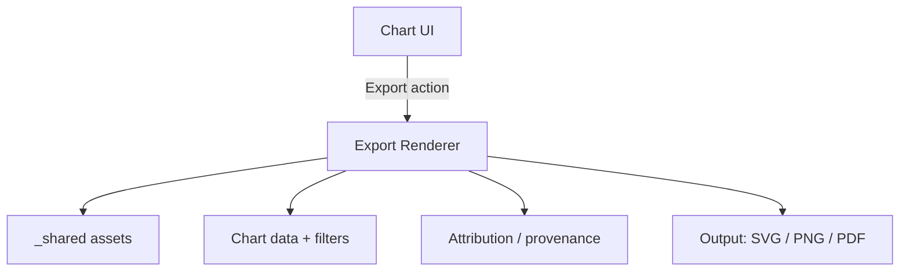

# 📊 KFM Chart Export Shared Assets (`_shared`)


-1f6feb)


> 🎯 **Intent:** This folder contains **shared, reusable assets** used by the KFM chart export system (e.g., exporting charts as **SVG/PNG/PDF** for stories, reports, downloads, and embeds).  
> ✅ Keep exports consistent, traceable, and license-safe.

---

## 🧭 Quick navigation

- 📁 **You are here:** `web/assets/media/charts/export/_shared/`
- 🧩 For app structure & UI components, see: `web/`
- 🧾 For data provenance/contract patterns (project-wide), see: `docs/data/contracts/` (and examples)

---

## 🧱 What belongs in `_shared`

These are **cross-chart** and **cross-feature** export assets—things that multiple charts/export modes reuse:

- 🏷️ **Branding:** logos, wordmarks, watermarks, seals
- 🔤 **Fonts:** export-approved typography (must be license-cleared)
- 🎨 **Export styles:** export-only CSS (print-safe), palettes, chart themes
- 🧩 **Templates:** SVG frames, PDF page shells, legend containers
- 🧷 **UI export adornments:** scale bars, north arrows, “credits footer” blocks, etc.

> [!NOTE]
> If an asset is **specific to one story** or **one dataset**, it probably does **not** belong here.  
> Put one-offs next to the story/content that owns it (or in a feature-scoped folder).

---

## 🚫 What does **not** belong here

- ❌ User uploads or user-generated exports (those are outputs, not shared inputs)
- ❌ Dataset files (GeoJSON/CSV/tiles belong in data pipelines/catalogs)
- ❌ Anything without a clear license/attribution source
- ❌ Temporary files, screenshots, drafts, “final_final2.png”

---

## 🗂️ Recommended layout

> This is a suggested structure—adjust to the repo’s reality as it evolves.

```text
web/assets/media/charts/export/
└── _shared/
    ├── brand/          # logos, wordmarks, watermarks 🏷️
    ├── fonts/          # export-approved fonts 🔤
    ├── styles/         # export CSS/themes 🎨
    ├── templates/      # SVG/PDF templates 🧩
    ├── meta/           # optional: shared schemas & helpers 🧾
    └── README.md       # 👈 you are here
```

---

## 🧾 “No mystery assets” rule (contract-first mindset)

> [!IMPORTANT]
> **Every asset must be self-describing.**  
> If it ships in `_shared`, it must ship with enough metadata to answer:
> - **Where did it come from?**
> - **What license governs it?**
> - **Who/what should be credited?**
> - **How is it allowed to be used?**

### ✅ Required sidecar metadata

For every file you add here, create a sidecar JSON file:

- `kfm-logo.svg`  
- `kfm-logo.svg.meta.json`

<details>
<summary><b>📄 Example: <code>kfm-logo.svg.meta.json</code></b></summary>

```json
{
  "id": "kfm-logo",
  "title": "Kansas Frontier Matrix Logo",
  "asset_type": "image/svg+xml",
  "roles": ["brand:logo", "export:watermark"],
  "source": {
    "origin": "internal",
    "upstream_url": null,
    "notes": "Created for KFM branding kit"
  },
  "license": {
    "spdx": "CC-BY-4.0",
    "attribution": "Kansas Frontier Matrix",
    "restrictions": ["no-trademark-transfer"]
  },
  "provenance": {
    "derived_from": [],
    "edits": [
      "optimized paths",
      "removed editor metadata"
    ]
  },
  "integrity": {
    "sha256": "PUT_SHA256_HERE"
  }
}
```

</details>

### 🧠 Why so strict?

Because export assets can easily “leak” into:
- public-facing reports,
- academic citations,
- institutional deliverables,
- downstream remixes.

So we treat `_shared` like a **mini-catalog**: curated, validated, and attribution-ready.

---

## 🧪 Export determinism & quality rules

### 🖼️ Prefer vectors for charts and marks

- ✅ Use **SVG** for logos, icons, line art, charts, and frames.
- ✅ Use **PNG** only when you truly need raster (photos, textures, heatmap bitmaps, etc.).

### 📏 Raster requirements (when unavoidable)

- Prefer predictable sizing (don’t rely on browser zoom).
- Export targets should include at least:
  - **screen:** 1× and 2×
  - **print:** “print-safe” raster (big enough to look good in PDFs)

### 🔤 Font sanity (export-safe typography)

- Fonts must be:
  - license-cleared ✅
  - embedded/packaged consistently ✅
  - tested in the export path ✅

> [!TIP]
> If exports occur in a headless environment (e.g., server-side rendering), missing fonts will silently degrade typography. Treat fonts as “dependencies,” not “nice to have.”

---

## 🧩 How export flows use `_shared`



Export outputs should be:
- consistent in style,
- branded appropriately,
- accompanied by attribution/citation-ready metadata.

---

## 🧰 Usage patterns

### ✅ Importing assets in code (examples)

<details>
<summary><b>🧩 JS/TS import via URL (bundler-friendly pattern)</b></summary>

```ts
// Example pattern (adjust to the repo’s actual bundler setup)
const logoUrl = new URL(
  "./brand/kfm-logo.svg",
  import.meta.url
).toString();
```

</details>

<details>
<summary><b>🎨 CSS usage (relative URL)</b></summary>

```css
.exportFooterLogo {
  background-image: url("./brand/kfm-logo.svg");
  background-repeat: no-repeat;
  background-size: contain;
}
```

</details>

---

## ✅ Add-a-new-asset checklist

- [ ] Asset placed in the correct subfolder (`brand/`, `fonts/`, `templates/`, etc.)
- [ ] ✅ Sidecar metadata exists: `*.meta.json`
- [ ] ✅ License is explicit (SPDX if possible) + attribution text is included
- [ ] ✅ Optimized (SVGO / PNG optimizer / font subset if relevant)
- [ ] ✅ Tested in at least one export output (SVG + PNG or PDF as applicable)
- [ ] ✅ No private/sensitive info embedded (EXIF, editor usernames, hidden layers)
- [ ] ✅ File naming follows conventions (see below)

---

## 🏷️ Naming conventions

Keep names predictable and diff-friendly:

- ✅ `kebab-case` (lowercase, hyphens)
- ✅ include variant suffixes when necessary:
  - `kfm-logo-dark.svg`
  - `kfm-logo-light.svg`
  - `legend-frame-a4.svg`
- ✅ export target suffixes (only if needed):
  - `watermark@1x.png`
  - `watermark@2x.png`

---

## 🧯 Troubleshooting

### “Export looks different than UI”
- UI can depend on live CSS/layout; exports often run in a controlled layout.
- Make sure export-specific CSS lives in `styles/` (not scattered across features).

### “Fonts changed / spacing broke”
- Confirm font files are included + loaded in the export environment.
- Check that export templates reference the correct font-family names.

### “Logo looks blurry in PDF”
- Use SVG for marks/logos.
- If raster is unavoidable, ensure it’s high resolution for print use cases.

---

## 🛡️ Security & privacy

> [!WARNING]
> `_shared` is not a dumping ground.  
> Treat these assets as **shippable** and **auditable**.

- No personal data in filenames, metadata, or embedded editor fields
- No externally hotlinked assets (bundle what you need)
- No license ambiguity

---

## 🤝 Contributing

PRs welcome! Keep it clean, consistent, and provenance-ready:

- 💡 Prefer small, focused PRs: “Add export footer logo + metadata”
- 🧾 Always include license + attribution
- 🧪 Include a screenshot or sample export output when possible

---

## 📚 Related docs

- `docs/data/contracts/` — contract-first conventions (project-wide)
- `web/` — frontend structure and components (charts live here)
- `docs/` — architecture, standards, audits, and QA expectations
