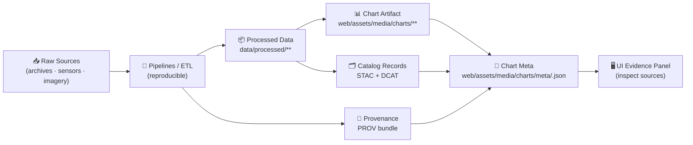

# 📊 Chart Metadata — `web/assets/media/charts/meta/`


> ✅ **Rule of the road:** if a chart shows up in the UI, its **sources + license + processing** must be inspectable. No “mystery charts.”[^kfm_contract_first]

---

## 🧭 What this folder is

This folder holds **metadata sidecars** (“chart cards”) for every chart artifact stored under:

- 📁 `web/assets/media/charts/` → the **rendered outputs** (SVG/PNG/WebP, etc.)
- 📁 `web/assets/media/charts/meta/` → the **auditable metadata** (JSON)

Why we do this (KFM style):

- 🔎 **Provenance-first**: citations + metadata are first-class, and the UI should let users inspect sources.[^kfm_provenance]
- 🧾 **Contract-first**: anything visible must be traceable back to cataloged sources + provable processing.[^kfm_contract_first]
- 🧩 **Standards-aligned**: prefer referencing STAC/DCAT/PROV records for “where it came from + how it was made.”[^kfm_contract_first][^md_standards_alignment]

---

## 🗂️ Folder layout

```text
web/
└── assets/
    └── media/
        └── charts/
            ├── 📈 <chart_id>.svg / <chart_id>.png / <chart_id>.webp
            ├── 🖼️ thumbs/
            │   └── <chart_id>.webp
            └── meta/
                ├── 📘 README.md  (you are here)
                ├── 🧾 <chart_id>.json          # 1 per chart (required)
                ├── 🗃️ index.json               # optional registry for fast UI load
                └── 🧰 schema/
                    └── chart-meta.v1.schema.json  # optional but recommended
```

---

## 🔐 Core rules (non-negotiable)

1. **🧬 Provenance is not optional**  
   If a chart is shipped to the UI, it must point to its evidence chain (datasets + provenance logs).[^kfm_provenance][^kfm_data_contracts]

2. **🧾 The metadata file is the contract**  
   Treat `meta/<chart_id>.json` like a “data contract”: it must include source, license, temporal/spatial extent (when relevant), and processing context.[^kfm_data_contracts]

3. **🚫 No ad-hoc sources**  
   If the data isn’t in the catalog (or isn’t linkable to catalog entries), it doesn’t get published.[^kfm_contract_first]

4. **🧩 Prefer references over duplication**  
   Keep chart meta **thin**. Put heavy lineage details in PROV bundles and link to them here.[^md_boundary_artifacts]

---

## 🏷️ Naming & ID conventions

### ✅ Chart IDs (`<chart_id>`)
Use **stable**, **machine-friendly** IDs:

- ✅ `kebab-case` or `snake_case` (pick one project-wide)
- ✅ start with a domain prefix when useful: `climate_…`, `land_…`, `water_…`, `history_…`
- ✅ avoid spaces, punctuation, and date-only IDs

Examples:
- `climate_precip_annual_by_county`
- `land_cover_change_1985_2024`
- `history_treaties_by_decade`

### ✅ File naming
- Chart artifact: `web/assets/media/charts/<chart_id>.<ext>`
- Metadata: `web/assets/media/charts/meta/<chart_id>.json`

---

## 🧾 Chart Meta Contract (v1)

> Think of this as a **“chart card”**: what it is, where it came from, how it was made, and how to cite it.

### ✅ Required fields

| Field | Type | Example | Why it matters |
|------|------|---------|----------------|
| `id` | `string` | `"climate_precip_annual_by_county"` | Stable key for routing + UI lookup |
| `title` | `string` | `"Annual Precipitation by County (1895–2024)"` | Human-readable display name |
| `summary` | `string` | `"County-level precipitation totals derived from …"` | Short explanation for tooltips/cards |
| `kind` | `string` | `"timeseries"`, `"bar"`, `"heatmap"` | Rendering + UI grouping |
| `artifacts.image` | `string` | `"../climate_precip_annual_by_county.svg"` | The actual chart file |
| `sources[]` | `array<object>` | see below | Human-facing attribution list |
| `contracts.prov` **or** `contracts.dcat` | `string` | `"data/prov/…"` | Hard link to auditable lineage / catalog |
| `license` | `string` | `"CC-BY-4.0"` | Reuse rights must be explicit |
| `generated_by.pipeline` | `string` | `"pipelines/climate/precip_annual_by_county.py"` | “How was it produced?” |
| `generated_by.run_id` | `string` | `"run-2026-01-17T02:20Z"` | Reproducibility + debugging |
| `timestamps.generated_at` | `string (ISO8601)` | `"2026-01-17T02:20:00Z"` | Provenance timeline |

### ⭐ Recommended fields (strongly)

| Field | Type | Example | Notes |
|------|------|---------|------|
| `artifacts.thumb` | `string` | `"../thumbs/<chart_id>.webp"` | Fast previews |
| `artifacts.data` | `string` | `"../../../data/processed/...parquet"` | Optional: if UI can download chart data |
| `extent.temporal` | `object` | `{ "start": "...", "end": "..." }` | Helps UI timeline filtering |
| `extent.spatial` | `object` | bbox + CRS | Only if chart is spatially scoped |
| `quality.uncertainty` | `string` | `"Coverage varies by station density."` | “Trust envelope” for readers |
| `sensitivity` | `string` | `"public"` | Supports CARE-style controls |
| `links` | `object` | `{ "story_node": "...", "docs": "..." }` | Cross-navigation |

> 📌 KFM explicitly treats metadata + lineage as fundamental, with validators/CI preventing incomplete artifacts.[^kfm_contract_first][^kfm_pipelines_ci]

---

## 🔗 Linking charts to KFM catalogs (STAC/DCAT/PROV)

KFM is “contract-first” and uses open standards to capture provenance and dataset identity.[^kfm_contract_first]  
Chart meta should **reference** those records instead of re-describing them.

### `contracts` block (recommended shape)

- `contracts.dcat` → points to a DCAT dataset entry for discoverability
- `contracts.stac` → points to a STAC item/collection if a spatial asset is involved
- `contracts.prov` → points to a PROV bundle describing the processing run

KFM expects STAC/DCAT/PROV alignment + CI validation for evidence artifacts.[^md_standards_alignment][^md_boundary_artifacts]



---

## 🗃️ `index.json` (optional but UI-friendly)

If the front-end prefers a single manifest (faster than crawling the folder), add:

- `web/assets/media/charts/meta/index.json`

Example:

```json
[
  {
    "id": "climate_precip_annual_by_county",
    "title": "Annual Precipitation by County (1895–2024)",
    "meta": "meta/climate_precip_annual_by_county.json",
    "thumb": "thumbs/climate_precip_annual_by_county.webp",
    "kind": "timeseries",
    "tags": ["climate", "precipitation"]
  }
]
```

---

## 🧪 Validation & CI expectations ✅

CI should fail if any published chart metadata violates the contract-first rules (mirrors KFM catalog QA expectations).[^kfm_contract_first][^kfm_pipelines_ci]

Suggested checks:

- ✅ JSON parses
- ✅ required fields exist
- ✅ `artifacts.image` path exists
- ✅ `license` is present (and ideally SPDX/CC compatible)
- ✅ at least one of `contracts.prov` or `contracts.dcat` exists
- ✅ no broken references to `data/processed/**`, `data/stac/**`, `data/catalog/**`, `data/prov/**`
- ✅ optional: hash/size checks for caching & integrity

---

## ➕ Add a new chart (contributor flow)

1. **Generate the chart artifact** 🧪  
   Output to: `web/assets/media/charts/<chart_id>.<svg|png|webp>`

2. **Create a metadata sidecar** 🧾  
   Create: `web/assets/media/charts/meta/<chart_id>.json`

3. **Link to evidence** 🔗  
   Ensure your meta references at least:
   - a PROV lineage file (best), and/or
   - a DCAT catalog entry (minimum)

4. **(Optional) Register it** 🗃️  
   Add an entry to `meta/index.json`

5. **Run validation** ✅  
   (whatever the repo uses: schema validator, lint step, etc.)

---

## ♻️ Update an existing chart (safe changes)

✅ Safe updates:
- refreshing `artifacts.image` output while keeping the same `id`
- updating `timestamps.generated_at`
- adding richer `contracts.*` references
- improving `summary` / `quality.uncertainty`

⚠️ Avoid:
- changing `id` (breaks links)
- removing provenance references
- overwriting licenses/attribution without review

---

## 🧷 Example metadata files

### 1) Minimal (publishable)

```json
{
  "id": "history_treaties_by_decade",
  "title": "Treaties by Decade",
  "summary": "Count of cataloged treaties grouped by decade.",
  "kind": "bar",
  "artifacts": {
    "image": "../history_treaties_by_decade.svg",
    "thumb": "../thumbs/history_treaties_by_decade.webp"
  },
  "sources": [
    {
      "label": "KFM treaty corpus (cataloged)",
      "role": "derived",
      "ref": "dcat:kfm:treaties"
    }
  ],
  "contracts": {
    "dcat": "data/catalog/dcat/kfm_treaties.jsonld",
    "prov": "data/prov/kfm_treaties_timeseries.prov.json"
  },
  "license": "CC-BY-4.0",
  "generated_by": {
    "pipeline": "pipelines/history/treaties_by_decade.py",
    "run_id": "run-2026-01-17T02:20Z"
  },
  "timestamps": {
    "generated_at": "2026-01-17T02:20:00Z"
  },
  "sensitivity": "public"
}
```

### 2) Rich (recommended for flagship charts)

```json
{
  "id": "climate_precip_annual_by_county",
  "title": "Annual Precipitation by County (1895–2024)",
  "summary": "County-level annual precipitation totals derived from gridded climate products and aggregated to county boundaries.",
  "kind": "timeseries+small_multiples",
  "tags": ["climate", "precipitation", "county"],
  "artifacts": {
    "image": "../climate_precip_annual_by_county.svg",
    "thumb": "../thumbs/climate_precip_annual_by_county.webp",
    "data": "../../../data/processed/climate/precip_annual_by_county.parquet",
    "spec": "../../../web/charts/specs/climate_precip_annual_by_county.vega.json"
  },
  "extent": {
    "spatial": {
      "type": "bbox",
      "bbox": [-102.051, 36.993, -94.588, 40.003],
      "crs": "EPSG:4326",
      "label": "Kansas"
    },
    "temporal": { "start": "1895-01-01", "end": "2024-12-31" }
  },
  "sources": [
    {
      "label": "Upstream climate dataset (cataloged)",
      "role": "primary",
      "ref": "dcat:noaa:ncei:precip",
      "license": "public-domain"
    },
    {
      "label": "County boundaries (cataloged)",
      "role": "primary",
      "ref": "stac:kfm:boundaries:counties",
      "license": "public-domain"
    }
  ],
  "contracts": {
    "dcat": "data/catalog/dcat/noaa_precip_annual.jsonld",
    "stac": [
      "data/stac/items/noaa_precip_annual_2024.json",
      "data/stac/items/kansas_counties_boundaries.json"
    ],
    "prov": "data/prov/precip_annual_by_county_run_2026_01_17.prov.json"
  },
  "quality": {
    "uncertainty": "Station density and interpolation methods vary over time; see PROV bundle for parameters and coverage diagnostics."
  },
  "license": "CC-BY-4.0",
  "generated_by": {
    "pipeline": "pipelines/climate/precip_annual_by_county.py",
    "run_id": "run-2026-01-17T02:20Z",
    "git_sha": "abcdef1234567890"
  },
  "timestamps": {
    "generated_at": "2026-01-17T02:20:00Z",
    "updated_at": "2026-01-17T02:20:00Z"
  },
  "sensitivity": "public"
}
```

---

## ✅ Definition of Done (DoD) for publishing a chart

- [ ] Chart file exists in `web/assets/media/charts/`
- [ ] Matching meta file exists in `web/assets/media/charts/meta/`
- [ ] Meta includes **license + attribution**
- [ ] Meta includes **contracts** linking to **PROV and/or DCAT**
- [ ] Any spatial/temporal scope is recorded (when applicable)
- [ ] No broken links to datasets, catalogs, or provenance logs
- [ ] Validation passes in CI

---

## 📚 Source standards & project docs

- 📘 **KFM — Comprehensive Technical Documentation**  [oai_citation:0‡Kansas Frontier Matrix (KFM) – Comprehensive Technical Documentation.pdf](file-service://file-AkqwUuYPp5zePf7pv5SMxi)  
- 🗺️ **MARKDOWN_GUIDE_v13 (STAC/DCAT/PROV alignment policy)**  [oai_citation:1‡MARKDOWN_GUIDE_v13.md.gdoc](file-service://file-UYVruFXfueR8veHMUKeugU)  
- 🧱 **Kansas-Frontier-Matrix Design (architecture + traceability goals)**  [oai_citation:2‡Kansas-Frontier-Matrix_ Open-Source Geospatial Historical Mapping Hub Design.pdf](file-service://file-ShqHKgjxCS9UT9vbcxDNzA)  
- 🧾 **Comprehensive Markdown Guide (FAIR/CARE + license/sensitivity ideas)**  [oai_citation:3‡Comprehensive Markdown Guide_ Syntax, Extensions, and Best Practices.docx](file-service://file-J6rFRcp4ExCCeCdTevQjxz)  

---

## 🔎 Footnotes / Evidence

[^kfm_provenance]: KFM emphasizes provenance-first: every layer/dataset/answer is traceable, and the UI should let users inspect sources.  [oai_citation:4‡Kansas Frontier Matrix (KFM) – Comprehensive Technical Documentation.pdf](file-service://file-AkqwUuYPp5zePf7pv5SMxi)

[^kfm_contract_first]: KFM contract-first / provenance-first rule: anything in UI must be traceable to cataloged sources and provable processing; KFM uses STAC/DCAT/PROV to capture lineage and enforce “no mystery layers.”  [oai_citation:5‡Kansas Frontier Matrix (KFM) – Comprehensive Technical Documentation.pdf](file-service://file-AkqwUuYPp5zePf7pv5SMxi)

[^kfm_data_contracts]: KFM data contracts: metadata JSON must include source, license, spatial/temporal extent, processing steps; validators enforce acceptance into the system.  [oai_citation:6‡Kansas Frontier Matrix (KFM) – Comprehensive Technical Documentation.pdf](file-service://file-AkqwUuYPp5zePf7pv5SMxi)

[^kfm_pipelines_ci]: Pipelines write standardized outputs and update metadata/provenance; validation tooling + CI can block merges if metadata is incomplete or inconsistent.  [oai_citation:7‡Kansas Frontier Matrix (KFM) – Comprehensive Technical Documentation.pdf](file-service://file-AkqwUuYPp5zePf7pv5SMxi)

[^md_standards_alignment]: KFM policy: every dataset/evidence artifact should have STAC + DCAT + PROV records, and CI validates against profiles (including project-specific fields like provenance references and uncertainty indicators).  [oai_citation:8‡MARKDOWN_GUIDE_v13.md.gdoc](file-service://file-UYVruFXfueR8veHMUKeugU)

[^md_boundary_artifacts]: KFM “boundary artifacts” pattern: data becomes publishable only once catalog outputs (STAC/DCAT/PROV) exist in canonical locations.  [oai_citation:9‡MARKDOWN_GUIDE_v13.md.gdoc](file-service://file-UYVruFXfueR8veHMUKeugU)

[^design_stac_like]: KFM design doc describes a geospatial catalog indexed with a STAC-like JSON schema (bbox, time range, source info) to ensure traceability.  [oai_citation:10‡Kansas-Frontier-Matrix_ Open-Source Geospatial Historical Mapping Hub Design.pdf](file-service://file-ShqHKgjxCS9UT9vbcxDNzA)
