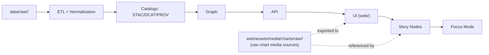

# 📊 Raw Chart Assets (UI Media Sources)

> 📍 **Location:** `web/assets/media/charts/raw/`  
> 🎯 **Goal:** Keep *editable/source* chart materials that support KFM’s UI & narratives (e.g., Story Nodes) — while staying compliant with KFM’s provenance-first pipeline rules.  
>
> KFM’s UI is expected to surface **charts / mini-graphs** in map pop-ups and dataset detail views (e.g., sparklines for recent history). [oai_citation:0‡Kansas Frontier Matrix (KFM) – Comprehensive Technical Documentation.pdf](file-service://file-AkqwUuYPp5zePf7pv5SMxi)  
> KFM also supports **statistical summaries & charts** (backend Python/pandas or small front-end D3-style work) to make data “immediately interpretable.” [oai_citation:1‡Kansas Frontier Matrix (KFM) – Comprehensive Technical Documentation.pdf](file-service://file-AkqwUuYPp5zePf7pv5SMxi)

---

## 🧭 “Raw” here ≠ `data/raw/` (very important)

KFM defines a **strict, inviolable pipeline**:  
**ETL → Catalogs (STAC/DCAT/PROV) → Graph → API → UI → Story Nodes → Focus Mode** [oai_citation:2‡MARKDOWN_GUIDE_v13.md.gdoc](file-service://file-UYVruFXfueR8veHMUKeugU)

And KFM requires raw data staging under canonical data locations like:  
`data/raw/<domain>/ → data/work/<domain>/ → data/processed/<domain>/` (plus required catalog outputs). [oai_citation:3‡MARKDOWN_GUIDE_v13.md.gdoc](file-service://file-UYVruFXfueR8veHMUKeugU)

✅ **So what does “raw” mean in this folder?**  
It means **raw chart *media* sources** (editable graphics, chart specs, working files) — not canonical datasets.

🚫 **No bypassing the pipeline.**  
Any artifact that appears in the UI must be governed, and KFM explicitly disallows “direct access / hard-coding artifacts in the UI” instead of flowing through the API layer and governance rules. [oai_citation:4‡MARKDOWN_GUIDE_v13.md.gdoc](file-service://file-UYVruFXfueR8veHMUKeugU)

---

## 🧩 How this folder fits the system (mental model)



**Reminder:** The UI must not query the graph directly; all governed access flows through the API boundary. [oai_citation:5‡MARKDOWN_GUIDE_v13.md.gdoc](file-service://file-UYVruFXfueR8veHMUKeugU)

---

## 📦 What belongs here

Put **source-quality / editable** chart materials here, such as:

- 🧾 **Chart source data snippets** *(ONLY if they are clearly “demo/sample” and not treated as authoritative)*  
- 📐 **Chart specifications** (e.g., Vega/Vega-Lite JSON, custom configs)
- 🧩 **Editable vector assets** (SVG is preferred for web charts) [oai_citation:6‡responsive-web-design-with-html5-and-css3.pdf](file-service://file-4pQLNMB3Rk5n5vUPTqxpNa) [oai_citation:7‡responsive-web-design-with-html5-and-css3.pdf](file-service://file-4pQLNMB3Rk5n5vUPTqxpNa)
- 🗂️ **Working files** needed to recreate the final exported asset (e.g., spreadsheet sources, design files)
- 📝 **Notes/assumptions** used to generate or interpret the chart

---

## 🚫 What does *not* belong here

- ❌ **Canonical raw datasets** (those belong under `data/raw/<domain>/` and must flow through the pipeline). [oai_citation:8‡MARKDOWN_GUIDE_v13.md.gdoc](file-service://file-UYVruFXfueR8veHMUKeugU)
- ❌ **Sensitive data** (or anything that could leak restricted locations/attributes)  
  KFM tracks sensitivity levels in metadata and enforces access controls; don’t create side-channels via static assets. [oai_citation:9‡Kansas Frontier Matrix (KFM) – Comprehensive Technical Documentation.pdf](file-service://file-AkqwUuYPp5zePf7pv5SMxi) [oai_citation:10‡MARKDOWN_GUIDE_v13.md.gdoc](file-service://file-UYVruFXfueR8veHMUKeugU)
- ❌ **“Final truth” analysis outputs** without provenance  
  Evidence artifacts must be cataloged/traceable before they’re used downstream. [oai_citation:11‡MARKDOWN_GUIDE_v13.md.gdoc](file-service://file-UYVruFXfueR8veHMUKeugU)
- ❌ **Charts used in Focus Mode** that cannot be traced to cataloged sources  
  Focus Mode displays only provenance-linked content; charts shown there must come from cataloged data. [oai_citation:12‡MARKDOWN_GUIDE_v13.md.gdoc](file-service://file-UYVruFXfueR8veHMUKeugU)

---

## 🗂️ Suggested structure (per chart)

```text
web/assets/media/charts/raw/
└─ 🛠️ <chart_slug>/                  # 🛠️ Editable “source workspace” for one chart (not optimized; not guaranteed served)
   ├─ 📄 README.md                    # Chart-specific context: intent, inputs, and exact steps to reproduce exports
   ├─ 🧾 meta.json                    # REQUIRED sidecar: title/id/version, sources, license, provenance, checksums/notes
   ├─ 🎨 source/                      # Raw inputs (editable): data extracts, design files, notes (keep small; no secrets)
   ├─ 🧪📐 spec/                       # Declarative chart specs/config (vega/vega-lite/echarts + params/templates)
   └─ 📦 exports/                     # Optional draft outputs (SVG/PNG) for review (NOT production-optimized)
```

> Keep `exports/` as *draft / intermediate* only. If something is “production-ready,” it typically belongs in the non-raw chart media path (e.g., `web/assets/media/charts/`), depending on your build pipeline.

---

## 🏷️ Naming conventions

### Folder slug
Use `lower_case_with_underscores` and avoid spaces. [oai_citation:13‡Kansas Frontier Matrix (KFM) – Comprehensive Technical Documentation.pdf](file-service://file-AkqwUuYPp5zePf7pv5SMxi)

Recommended pattern:
- `<topic>__<metric>__<geo>__<time_range>`

Example:
- `rainfall__monthly_total__ks_county__2000_2020`

### Dataset/ID alignment (recommended)
KFM uses dataset IDs like `kfm.ks.landcover.2000_2020.v1` (prefix + region + theme + time span + version). [oai_citation:14‡Kansas Frontier Matrix (KFM) – Comprehensive Technical Documentation.pdf](file-service://file-AkqwUuYPp5zePf7pv5SMxi)

If your chart is derived from a dataset, **mirror that identity** in metadata (see below).

---

## 🧾 `meta.json` sidecar (required)

KFM’s standards emphasize catalogability (STAC/DCAT) and lineage (PROV) for any dataset/evidence artifact used downstream. [oai_citation:15‡MARKDOWN_GUIDE_v13.md.gdoc](file-service://file-UYVruFXfueR8veHMUKeugU)  
Even for UI media, we keep a **lightweight provenance/trace record** here.

Create: `web/assets/media/charts/raw/<chart_slug>/meta.json`

```json
{
  "id": "kfm_chart.ks.rainfall.monthly_total.ks_county.2000_2020.v1",
  "title": "Monthly Rainfall Totals by Kansas County (2000–2020)",
  "chart_type": "line",
  "description": "Source chart media used for UI previews and story illustration. Interactive chart uses governed API data.",
  "status": "draft",

  "kfm": {
    "dataset_id": "kfm.ks.rainfall.2000_2020.v1",
    "stac_item_id": "stac:item:…",
    "dcat_dataset_id": "dcat:dataset:…",
    "prov_activity_id": "prov:activity:…",
    "run_id_or_commit": "…"
  },

  "source": {
    "publisher": "…",
    "retrieved_at": "YYYY-MM-DD",
    "license": "CC-BY-4.0",
    "source_url": "https://example.org/dataset"
  },

  "display": {
    "units": "mm",
    "time_zone": "UTC",
    "notes": "Legend includes units; time range shown explicitly."
  },

  "accessibility": {
    "alt": "Line chart showing monthly rainfall totals across selected Kansas counties from 2000 to 2020.",
    "caption": "Monthly rainfall totals (mm) by county, 2000–2020."
  },

  "sensitivity": {
    "classification": "public",
    "notes": "No sensitive locations or restricted attributes."
  }
}
```

> 🔒 KFM expects license + sensitivity to be tracked and enforced at the metadata layer for published artifacts. [oai_citation:16‡Kansas Frontier Matrix (KFM) – Comprehensive Technical Documentation.pdf](file-service://file-AkqwUuYPp5zePf7pv5SMxi)

---

## 🎨 Visual & accessibility conventions

KFM’s visualization guidance emphasizes **clarity, units, time labeling, and consistency**:
- Legends include **units** and clear labels. [oai_citation:17‡Kansas Frontier Matrix (KFM) – Comprehensive Technical Documentation.pdf](file-service://file-AkqwUuYPp5zePf7pv5SMxi)
- For time series visuals, always **label the time displayed** to avoid confusion. [oai_citation:18‡Kansas Frontier Matrix (KFM) – Comprehensive Technical Documentation.pdf](file-service://file-AkqwUuYPp5zePf7pv5SMxi)
- Maintain consistent symbology across similar layers/visualizations and document conventions in a design guide. [oai_citation:19‡Kansas Frontier Matrix (KFM) – Comprehensive Technical Documentation.pdf](file-service://file-AkqwUuYPp5zePf7pv5SMxi)

Color & accessibility:
- Prefer colorblind-friendly palettes; avoid red/green issues. [oai_citation:20‡Kansas Frontier Matrix (KFM) – Comprehensive Technical Documentation.pdf](file-service://file-AkqwUuYPp5zePf7pv5SMxi)

Format:
- Prefer SVG for charts where possible (resolution-independent and often smaller than bitmap images). [oai_citation:21‡responsive-web-design-with-html5-and-css3.pdf](file-service://file-4pQLNMB3Rk5n5vUPTqxpNa) [oai_citation:22‡responsive-web-design-with-html5-and-css3.pdf](file-service://file-4pQLNMB3Rk5n5vUPTqxpNa)

---

## ✅ Adding a new chart (workflow)

1) 📌 **Decide the chart’s role**
- **Interactive / data-driven chart** → must be powered by governed API outputs (don’t ship “real data” via UI static files). [oai_citation:23‡MARKDOWN_GUIDE_v13.md.gdoc](file-service://file-UYVruFXfueR8veHMUKeugU) [oai_citation:24‡MARKDOWN_GUIDE_v13.md.gdoc](file-service://file-UYVruFXfueR8veHMUKeugU)
- **Static illustration** (Story Node image, UI help docs, mock) → can live as media, but still needs traceability.

2) 🗂️ **Create the chart folder**
- `web/assets/media/charts/raw/<chart_slug>/`

3) 🧾 **Add `meta.json`**
- Include dataset IDs + provenance pointers if derived from published data (STAC/DCAT/PROV). [oai_citation:25‡MARKDOWN_GUIDE_v13.md.gdoc](file-service://file-UYVruFXfueR8veHMUKeugU)

4) 🧩 **Add sources/specs**
- Put editable files in `source/`, specs in `spec/`.

5) 🖼️ **Export drafts if needed**
- Put temporary exports in `exports/` (optional).

6) 📝 **Write a chart-specific README**
Include:
- What this chart shows
- How to regenerate exports
- Any assumptions / known limitations
- How it connects to cataloged evidence (IDs)

7) 🧪 **Final check before merge**
- No sensitive info leaked
- Units/time labeled
- `meta.json` filled out
- If used in Focus Mode → confirm provenance-linked + catalog-sourced content only [oai_citation:26‡MARKDOWN_GUIDE_v13.md.gdoc](file-service://file-UYVruFXfueR8veHMUKeugU)

---

## 🔁 Reproducibility & governance notes

- KFM requires **provenance-first publishing** before graph/UI use; datasets and derived artifacts should have STAC/DCAT metadata plus PROV lineage as prerequisites for downstream consumption. [oai_citation:27‡MARKDOWN_GUIDE_v13.md.gdoc](file-service://file-UYVruFXfueR8veHMUKeugU) [oai_citation:28‡MARKDOWN_GUIDE_v13.md.gdoc](file-service://file-UYVruFXfueR8veHMUKeugU)
- ETL/transformations should be deterministic/idempotent, enabling repeatable re-runs without drift (apply the same mindset to chart generation scripts when possible). [oai_citation:29‡MARKDOWN_GUIDE_v13.md.gdoc](file-service://file-UYVruFXfueR8veHMUKeugU)

---

## 🧠 Quick FAQ

**Q: Why do we keep chart “raw” assets in `web/` at all?**  
A: The KFM web app contains UI components (including chart components) and static assets. This folder is meant for **editable chart media sources** that support UI/story content, not canonical datasets. [oai_citation:30‡Kansas Frontier Matrix (KFM) – Comprehensive Technical Documentation.pdf](file-service://file-AkqwUuYPp5zePf7pv5SMxi) [oai_citation:31‡Kansas Frontier Matrix (KFM) – Comprehensive Technical Documentation.pdf](file-service://file-AkqwUuYPp5zePf7pv5SMxi)

**Q: Can Story Nodes reference charts/images?**  
A: Yes — but Story/Focus experiences must stay evidence-first and provenance-linked. Focus Mode has a hard gate for content without provenance, including charts. [oai_citation:32‡MARKDOWN_GUIDE_v13.md.gdoc](file-service://file-UYVruFXfueR8veHMUKeugU)

---

## 📚 Related KFM concepts (for contributors)

- Pipeline ordering & invariants (do not bypass) [oai_citation:33‡MARKDOWN_GUIDE_v13.md.gdoc](file-service://file-UYVruFXfueR8veHMUKeugU)
- STAC/DCAT/PROV alignment expectations [oai_citation:34‡MARKDOWN_GUIDE_v13.md.gdoc](file-service://file-UYVruFXfueR8veHMUKeugU)
- UI includes charts/mini-graphs in pop-ups/details flows [oai_citation:35‡Kansas Frontier Matrix (KFM) – Comprehensive Technical Documentation.pdf](file-service://file-AkqwUuYPp5zePf7pv5SMxi)
- Visualization conventions (units, time labeling, consistency) [oai_citation:36‡Kansas Frontier Matrix (KFM) – Comprehensive Technical Documentation.pdf](file-service://file-AkqwUuYPp5zePf7pv5SMxi)
