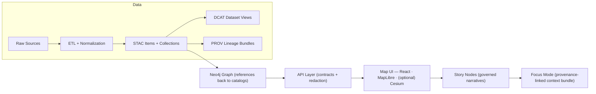

# 🧩 Diagrams (Web UI Assets)

A curated home for **diagram-style illustrations** used by the KFM web experience (ex: onboarding visuals, “how it works” explainers, UI flows, architecture-at-a-glance graphics).  
This folder exists to keep diagram assets **consistent, lightweight, accessible, and properly attributed**.

> [!IMPORTANT]
> KFM is *provenance-first / contract-first*: anything that appears in the UI (and especially Focus Mode) should be traceable, with clear source + license + processing/creation notes — **no “mystery layers.”** [oai_citation:0‡Kansas Frontier Matrix (KFM) – Comprehensive Technical Documentation.pdf](file-service://file-AkqwUuYPp5zePf7pv5SMxi) [oai_citation:1‡Kansas Frontier Matrix (KFM) – Comprehensive Technical Documentation.pdf](file-service://file-AkqwUuYPp5zePf7pv5SMxi)

---

## 🎯 What belongs here

✅ Good fits:
- 🧭 “How KFM works” diagrams (pipeline, trust boundaries, architecture summaries)
- 🗺️ UI feature explainers (Map + timeline + Focus Mode flow)
- 🔁 Process diagrams (ingestion → catalogs → graph → API → UI → Story Nodes)
- 🧠 Concept diagrams (provenance, evidence artifacts, governance gates)
- 🧱 Module diagrams (domain/service/integration/infrastructure boundaries) [oai_citation:2‡Kansas Frontier Matrix (KFM) – Comprehensive Technical Documentation.pdf](file-service://file-AkqwUuYPp5zePf7pv5SMxi)

🚫 Not a fit:
- High-level engineering diagrams meant for design docs → put those in `docs/architecture/diagrams/` [oai_citation:3‡MARKDOWN_GUIDE_v13.md.gdoc](file-service://file-UYVruFXfueR8veHMUKeugU)
- Large raster maps, screenshots, photos (those should live in the appropriate `web/assets/media/...` subfolders)
- Dataset artifacts (those belong in the data pipeline + catalogs, not UI assets) [oai_citation:4‡MARKDOWN_GUIDE_v13.md.gdoc](file-service://file-UYVruFXfueR8veHMUKeugU)

---

## 🗂️ Suggested layout

If you add new diagram families, prefer a light structure like this:

```text
📁 web/assets/media/illustrations/diagrams/
├── 📄 README.md
├── 📁 _src/                    # editable sources (optional but recommended)
│   ├── 🧷 *.drawio
│   ├── 🧷 *.excalidraw
│   └── 🧷 *.fig / *.sketch (if applicable)
├── 📁 svg/                     # exported SVGs (preferred for diagrams)
├── 📁 png/                     # raster fallbacks (only when needed)
└── 📁 meta/                    # provenance + license + usage notes (required)
    └── 🧾 <diagram-name>.meta.json
```

> [!NOTE]
> The repo already distinguishes “documentation diagrams” under `docs/architecture/diagrams/`. This folder is specifically for **web UI consumable assets**. [oai_citation:5‡MARKDOWN_GUIDE_v13.md.gdoc](file-service://file-UYVruFXfueR8veHMUKeugU)

---

## 🧱 Naming conventions

Use **kebab-case**, prefixed by a **category**, and keep names stable:

**Pattern**
```text
<category>--<topic>--<variant>.<ext>
```

**Recommended categories**
- `arch` → architecture / components
- `pipe` → data/publishing pipeline
- `ui` → UI flows / screens / journeys
- `trust` → provenance / governance / safety boundaries
- `kg` → knowledge graph concepts
- `3d` → 3D / Cesium / WebGL concepts (if applicable)

**Examples**
- `pipe--kfm-canonical-flow--overview.svg`
- `ui--focus-mode--journey.svg`
- `trust--provenance-first--rules.svg`
- `arch--clean-layers--domain-service-infra.svg`

---

## 🖼️ Formats & export rules

### ✅ SVG first (diagram default)
SVG is preferred for crisp scaling and small file size.

**SVG requirements**
- Include `<title>` and `<desc>` in the SVG (or ensure equivalent accessible labeling where used).  
- Optimize exported SVGs (ex: SVGO / SVGOMG workflows are commonly used). [oai_citation:6‡responsive-web-design-with-html5-and-css3.pdf](file-service://file-Heg28TVM2nReDYTQ7nPhAK)

> [!TIP]
> If a diagram is used as a standalone ``, make sure the consuming component supplies meaningful `alt` text. If it’s inlined SVG, use `<title>`/`<desc>` for accessibility. [oai_citation:7‡responsive-web-design-with-html5-and-css3.pdf](file-service://file-Heg28TVM2nReDYTQ7nPhAK)

### 🧱 PNG only when necessary
Use PNG for:
- heavy gradients/textures that bloat SVG,
- screenshots/exports that aren’t “diagram-like,”
- compatibility edge-cases.

### 🧪 Keep it lightweight
- Prefer fewer nodes and clean geometry.
- Avoid embedding large raster images inside SVG (it defeats the point).
- If a diagram grows huge, consider splitting into smaller composable diagrams.

---

## ♿ Accessibility checklist

For every diagram that appears in the UI:
- ✅ Clear `alt` text (or `aria-label`/`title`+`desc` for inline SVG)
- ✅ Avoid tiny text (assume mobile)
- ✅ Don’t encode meaning by color alone (use labels, shapes, or patterns)
- ✅ Ensure sufficient contrast for both light/dark backgrounds

---

## 🧾 Provenance + licensing (required)

KFM’s system-wide rule is that anything presented as “official” must be **traceable**, with explicit sources and licenses — and the platform is designed to surface provenance/citations when users ask about UI-visible artifacts. [oai_citation:8‡Kansas Frontier Matrix (KFM) – Comprehensive Technical Documentation.pdf](file-service://file-AkqwUuYPp5zePf7pv5SMxi) [oai_citation:9‡Kansas Frontier Matrix (KFM) – Comprehensive Technical Documentation.pdf](file-service://file-AkqwUuYPp5zePf7pv5SMxi)

### 📄 Metadata sidecar (`meta/<name>.meta.json`)

Each exported diagram **must** have a matching metadata file.  
This is a UI-friendly analogue of the “data contract / provenance record” concept used throughout KFM. [oai_citation:10‡Kansas Frontier Matrix (KFM) – Comprehensive Technical Documentation.pdf](file-service://file-AkqwUuYPp5zePf7pv5SMxi)

**Template**
```json
{
  "id": "pipe--kfm-canonical-flow--overview",
  "title": "KFM Canonical Flow (Overview)",
  "description": "High-level flow from sources → catalogs → graph → API → UI → narratives.",
  "usage": ["web-ui", "docs"],
  "created_by": "KFM Team",
  "created_at": "2026-01-18",
  "last_updated": "2026-01-18",
  "license": "CC-BY-4.0 | MIT | Public-Domain | Other",
  "sources": [
    {
      "type": "internal-doc",
      "ref": "docs/MASTER_GUIDE_v13.md",
      "note": "Canonical pipeline ordering and contracts."
    }
  ],
  "export": {
    "tool": "draw.io | figma | inkscape | other",
    "format": "svg",
    "optimized": true
  },
  "tags": ["pipeline", "provenance", "kfm"]
}
```

> [!WARNING]
> If you can’t state the license/source clearly, **don’t ship the diagram**. This is the same “no unsourced artifacts” trust model applied across KFM. [oai_citation:11‡Kansas Frontier Matrix (KFM) – Comprehensive Technical Documentation.pdf](file-service://file-AkqwUuYPp5zePf7pv5SMxi)

---

## 🧠 Canonical “pipeline” reference (Mermaid)

If you want a source-of-truth diagram-as-code for KFM’s flow, this Mermaid block is a good baseline to export into an SVG for the web UI:



Source inspiration: KFM Master Guide v13 draft content and diagram section. [oai_citation:12‡MARKDOWN_GUIDE_v13.md.gdoc](file-service://file-UYVruFXfueR8veHMUKeugU)

---

## 🧊 3D / WebGL diagrams (when relevant)

If you add diagrams explaining KFM’s 3D capabilities (ex: Cesium scenes, 3D layers, or “3D web GIS” concepts), keep them especially clear: web-based 3D GIS platforms are often described as systems for storing/managing/displaying/analyzing spatial information via the web on a 3D visualization canvas — diagrams should communicate *what runs where* and *how users interact* at a glance. [oai_citation:13‡Archaeological 3D GIS_26_01_12_17_53_09.pdf](file-service://file-6DRx5ELzDPBso9Y5Qcbqm2)

---

## ✅ “Definition of Done” for a new diagram

- [ ] Exported SVG is in `svg/` (or PNG in `png/` with justification)
- [ ] Matching `meta/<diagram>.meta.json` exists
- [ ] License is explicitly stated (and compatible)
- [ ] Accessibility: `alt` text plan + readable labels
- [ ] Optimized (SVG minified / cleaned) [oai_citation:14‡responsive-web-design-with-html5-and-css3.pdf](file-service://file-Heg28TVM2nReDYTQ7nPhAK)
- [ ] No unsourced visuals or “mystery” elements (icons, base maps, screenshots) [oai_citation:15‡Kansas Frontier Matrix (KFM) – Comprehensive Technical Documentation.pdf](file-service://file-AkqwUuYPp5zePf7pv5SMxi)

---

## 🧷 Style notes (keep it consistent)

- 🎛️ Use a consistent stroke weight and corner radius across the set
- 🔤 Prefer 1–2 type sizes; avoid tiny labels
- 🧭 Use directional flow left→right for pipelines unless a reason exists
- 🧩 Keep node text short; push details into captions/tooltips in the UI
- 🌗 Ensure it works on both light and dark backgrounds (or export both variants)

---

## 📚 Source docs used to shape this README

- Kansas Frontier Matrix (KFM) – Comprehensive Technical Documentation  [oai_citation:16‡Kansas Frontier Matrix (KFM) – Comprehensive Technical Documentation.pdf](file-service://file-AkqwUuYPp5zePf7pv5SMxi)  
- MARKDOWN_GUIDE_v13 (Master Guide v13 draft)  [oai_citation:17‡MARKDOWN_GUIDE_v13.md.gdoc](file-service://file-UYVruFXfueR8veHMUKeugU)  
- Responsive Web Design with HTML5 and CSS3 (SVG + optimization refs)  [oai_citation:18‡responsive-web-design-with-html5-and-css3.pdf](file-service://file-Heg28TVM2nReDYTQ7nPhAK)  
- Archaeological 3D GIS (3D web GIS concept framing)  [oai_citation:19‡Archaeological 3D GIS_26_01_12_17_53_09.pdf](file-service://file-6DRx5ELzDPBso9Y5Qcbqm2)  

> [!NOTE]
> KFM docs intentionally use emojis, admonitions, citations, and doc metadata patterns — keep READMEs consistent with that style where it helps scanning. [oai_citation:20‡Kansas Frontier Matrix (KFM) – Comprehensive Technical Documentation.pdf](file-service://file-AkqwUuYPp5zePf7pv5SMxi)
