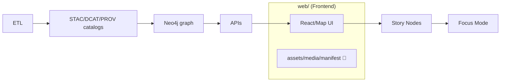

<!-- 📍 Path: web/assets/media/manifest/README.md -->

# 🧾 Web Media Manifests (KFM UI)


This folder contains **machine-readable manifest files** that describe **front-end media assets** used by the KFM web UI (icons, logos, UI imagery, optional PWA install metadata, etc.).  
The goal is to keep **media metadata** (alt text, credits, licensing, provenance) **versioned and auditable** right alongside the web app’s static assets — consistent with KFM’s “citations + metadata are first-class” approach.

---

## 🧭 Where this sits in the KFM pipeline

KFM’s canonical flow (high-level) is:



**This directory is a UI-layer convenience**: it helps the app **render** media with the right accessibility + licensing context.  
It is **not** a backdoor to introduce evidence that bypasses catalogs/contracts/governance.

> [!IMPORTANT]  
> **No unsourced story claims here.** If an image/video is *evidence* for a narrative claim, it must be governed where Story Nodes live (v13: `docs/reports/story_nodes/…`) and/or tracked in catalog/provenance structures — this folder only registers web-consumable media.

---

## 📦 What belongs in `web/assets/media/manifest/`

✅ **Do put here**
- `*.manifest.json` (or `*.manifest.yaml`) files that map **stable asset IDs** → **asset paths/URLs + metadata**
- A `*.webmanifest` / `manifest.webmanifest` file if/when the UI is packaged as a **PWA**
- JSON Schemas *for UI manifests* **only if** the repo convention is to colocate schemas (often schemas live in `schemas/`)

❌ **Do NOT put here**
- Large binaries (raw video masters, uncompressed TIFFs, etc.)
- “Mystery assets” with no license / credit / source
- Data catalogs (STAC/DCAT/PROV) — those belong in `data/catalog/...` / `data/prov/...`
- Story Node governed assets (v13: `docs/reports/story_nodes/**/assets/`)

---

## 🗂️ Typical layout (example)

> Your repo may vary — this is the intended *shape*.

```text
web/assets/media/
├─ 🧷 icons/                      # 🧷 Icon assets actually served (SVG/PNG/WebP) for UI + map + story
├─ 🖼️ images/                     # 🖼️ Deployable UI images (illustrations, screenshots, story figures)
├─ 🎞️ video/                      # 🎞️ Small web-optimized video (mp4/webm; optional; keep short + caption if needed)
└─ 🧾 manifest/                   # 👈 Manifests + metadata (this folder) 📌
   ├─ 📄 README.md                # 📘 How manifests are structured, IDs/naming rules, and CI validation expectations
   ├─ 🧾🗂️ media.manifest.json     # Recommended canonical registry: assetId → file(s) + tags + provenance + license
   ├─ 🧾🧷 icons.manifest.json     # Optional split registry for icons (useful when media.manifest grows large)
   └─ 📱🧾 app.webmanifest         # Optional PWA install manifest (icons, theme colors, start URL)
```

---

## 🧷 “One asset, one ID” rule

KFM’s broader “one canonical home per subsystem” mindset applies here too:
- **Every media item gets a stable ID**
- UI references **IDs**, not raw file paths (paths can change; IDs should not)
- A manifest change is reviewable and diffable ✅

Recommended ID style (pick one and stick to it):
- `ui.logo.primary`
- `ui.icon.layer.water`
- `story.<story-slug>.hero` *(only if the asset is truly shared in the web bundle — otherwise keep it under Story Nodes)*

---

## 🧩 Manifest schema (recommended fields)

> [!NOTE]  
> This is a **recommended** shape aligned with KFM’s provenance-first + accessibility goals.  
> If the repo already has a formal schema under `schemas/`, follow that and keep this as guidance.

### Minimal entry
- `id` — stable identifier
- `type` — `image` | `icon` | `video` | `audio`
- `src` — relative path (preferred) or absolute URL
- `alt` — required for images/icons (empty string allowed only for *decorative* assets)
- `license` — SPDX where possible (e.g., `CC-BY-4.0`, `MIT`) + `licenseUrl` if needed
- `attribution` — human-readable credit line
- `source` — where it came from (URL / archive / internal)
- `hash` — optional but encouraged (`sha256:`…) for integrity tracking

### Example (`media.manifest.json`)
```json
{
  "version": "1.0.0",
  "generatedAt": "2026-01-15",
  "assets": [
    {
      "id": "ui.logo.primary",
      "type": "image",
      "src": "../images/kfm-logo.svg",
      "mime": "image/svg+xml",
      "alt": "Kansas Frontier Matrix logo",
      "attribution": "Kansas Frontier Matrix contributors",
      "license": "CC-BY-4.0",
      "licenseUrl": "https://creativecommons.org/licenses/by/4.0/",
      "source": {
        "kind": "internal",
        "ref": "repo:web/assets/media/images/kfm-logo.svg"
      },
      "hash": "sha256:REPLACE_WITH_REAL_HASH",
      "tags": ["branding", "ui"]
    },
    {
      "id": "ui.icon.timeline",
      "type": "icon",
      "src": "../icons/timeline.svg",
      "mime": "image/svg+xml",
      "alt": "Timeline icon",
      "attribution": "Derived from open icon set (see source URL)",
      "license": "MIT",
      "source": {
        "kind": "external",
        "url": "https://example.com/icon-pack",
        "retrievedAt": "2026-01-10"
      }
    }
  ]
}
```

---

## ♿ Accessibility requirements (non-negotiable)

KFM’s UI aims to be usable and inclusive — manifests help enforce that.

✅ **Images/icons**
- `alt` is **required**
- Use `alt: ""` only if the asset is *purely decorative* and the UI code marks it decorative (e.g., `aria-hidden="true"`)

✅ **Video/audio**
- Provide `transcript` and/or `captions` references if used in user-facing narratives
- Prefer web formats (`webm`, `mp4`, `vtt`) and keep them small

> [!TIP]  
> If an asset has a caption/credit line in the UI, store it in the manifest so it’s not “hidden in JSX”.

---

## 🧾 Licensing & provenance (required)

KFM explicitly avoids license ambiguity. Treat media like datasets:
- If you can’t state the license, you can’t ship the asset.
- Prefer assets that are **openly licensed** or **original**.
- Add attribution in the manifest even if the UI also displays it.

**For external media**, include:
- original URL
- retrieval date
- license/terms URL
- (optional) checksum / integrity

---

## ✅ Adding a new media asset (checklist)

1. **Place the file** in the appropriate media folder  
   (e.g., `web/assets/media/images/…` or `icons/…`)
2. **Register it** in the appropriate manifest (`media.manifest.json` preferred)
3. Ensure the entry includes:
   - `id`, `type`, `src`, `alt`
   - `license`, `attribution`, `source`
4. If the asset is external:
   - confirm license compatibility
   - capture `retrievedAt` + `licenseUrl`
5. (Optional but encouraged) compute and store `sha256` in `hash`
6. Run/confirm:
   - lint/format
   - manifest validation (if CI/schema exists)

---

## 🧪 Validation (recommended)

If/when we formalize this:
- Add a JSON Schema under `schemas/ui/` (or repo’s schema location)
- Add CI to fail PRs when:
  - required fields missing
  - duplicate IDs exist
  - `src` path doesn’t resolve
  - license fields are empty

---

## 🔗 Related docs

- `../../../../docs/MASTER_GUIDE_v13.md` 🧱 *(canonical structure + pipeline ordering)*
- `../../../../data/sources/` 🗃️ *(analogous concept: manifests describing external sources)*
- `../../../../schemas/` 📐 *(if present: contract-first validation for manifests)*

---

## FAQ 🤔

**Why not just import images directly in components?**  
We still can for trivial UI bits, but manifests add: **auditable credit/licensing**, **stable IDs**, and **a11y metadata** in one place.

**Do Story Node assets go here?**  
Generally **no**. Story Node assets should live with the governed story content (v13: `docs/reports/story_nodes/**/assets/`). Use this folder for assets that are part of the **web bundle’s shared UI media**.

**Can manifests point to CDN URLs?**  
Yes — especially for large files — but include provenance + integrity fields when possible.
