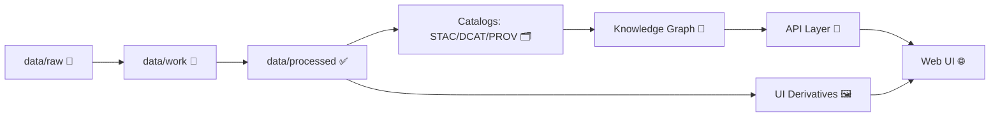

<div align="center">

# 🗺️ `web/assets/media/maps/`

**Web-facing map media** (previews • legends • lightweight overlays) for the KFM interactive map UI 🌐


</div>

---

## 🎯 North Star

KFM is built to make Kansas’s “spatial truth” **searchable, mappable, auditable, and modelable** — with **transparency and traceability** as non‑negotiables. 🧭

> [!IMPORTANT]
> **If it shows up in the UI, it must be traceable.**  
> Any map/media asset used by the Web UI must point back to **cataloged sources** and **provable processing** — no “mystery layers.” 🔍✅

---

## 📌 What this folder is for

This directory holds **web-optimized media** that the front-end can ship quickly and render reliably:

- 🖼️ **Preview images / thumbnails** for map layers, story nodes, galleries, and layer pickers  
- 🧾 **Legends** and lightweight symbology exports (SVG/PNG)  
- 🧩 **Lightweight overlays** (only when truly needed for UI)  
- 🧰 **UI helper media** (masks, frames, small reference images)

This folder is intentionally **not** the canonical home for geospatial datasets.

---

## 🚫 What does NOT belong here

Keep these OUT of the Web UI media bundle:

- 🧱 **Raw scans** / original imagery (belongs in `data/raw/...`)  
- ✅ **Canonical processed datasets** like COGs / GeoParquet / full GeoJSON collections (belongs in `data/processed/...` + catalogs)  
- 🧊 **Huge tilesets** / `.mbtiles` / multi-GB artifacts (use DVC/remotes or a tile service)  
- 🔒 Anything restricted/sensitive (and anything without a clear license)

> [!NOTE]
> Big artifacts should be versioned and distributed in a way that **doesn’t bloat Git** (e.g., DVC or remote storage). The web bundle must stay lean. 🪶

---

## 🔄 Where this folder sits in the KFM pipeline

The project’s hard rule is: **ETL → Catalogs → Graph → API → UI**.  
This folder is a *UI convenience layer* — it should never bypass provenance.



---

## 📁 Recommended folder layout

> You can adapt this structure, but keep the spirit: **organized, predictable, provenance-linked**.

```text
web/assets/media/maps/
├─ 📄 README.md                      # 📍 you are here: what map-media is, naming rules, and how the UI consumes it
│
├─ 🖼️ previews/                      # 🖼️ Thumbnails / layer cards (small, web-optimized)
│  ├─ 🖼️ <layer-id>.webp             # Preview image used in catalogs, pickers, and Story Nodes
│  └─ 🧾 <layer-id>.meta.json        # Provenance + attribution + generation params for the preview
│
├─ 🧾 legends/                       # 🧾 Legend / symbology exports (human-facing)
│  ├─ 🧷 <layer-id>.svg              # Legend graphic (SVG preferred for crisp scaling)
│  └─ 🧾 <layer-id>.meta.json        # Provenance + references to styles/ramps/patterns used in the legend
│
├─ 🧩 overlays/                      # 🧩 ONLY small/needed UI overlays (not full datasets)
│  ├─ 🖼️ <overlay-id>.png            # Overlay image (heatmap stamp, inset, guide overlay, etc.)
│  ├─ 🗺️🧾 <overlay-id>.overlay.json  # Placement contract: bounds/CRS/projection + opacity defaults
│  └─ 🧾 <overlay-id>.meta.json      # Provenance + licensing + how/why this overlay exists
│
└─ 🗺️ manifests/                    # 🗺️ Optional UI indexes / rollups (fast startup discovery)
   └─ 🧾🗂️ layers.media.index.json   # Index: layerId → preview/legend/overlay pointers + tags
```

---

## 🧾 Provenance + Metadata rules (required)

KFM treats metadata as first-class. Every asset here must have enough context to:

1) **Attribute** the source correctly  
2) **Prove** where it came from (which dataset + processing)  
3) **Link** back to the canonical catalogs (STAC/DCAT/PROV)  
4) **Respect license terms** (including derivative works)

> [!TIP]
> Think “metadata about the media.” Include identification, quality notes, spatial reference context, distribution/license, citation/attribution, and temporal information when applicable. 📇

### ✅ Required: sidecar `*.meta.json`

For every media file you add, include a sibling `*.meta.json`.

Example:
- `previews/usgs_topo_1896.webp`
- `previews/usgs_topo_1896.meta.json`

### Minimal recommended `*.meta.json` schema

```json
{
  "id": "kfm.media.preview.usgs_topo_1896",
  "role": "preview",
  "for_layer_id": "kfm.layer.usgs_topo_1896",
  "title": "USGS Topographic Map Preview (1896)",
  "created": "2026-01-15",
  "created_by": "kfm",
  "license": "Public Domain OR SPDX-ID",
  "attribution": "Source org / archive / collection",
  "derived_from": {
    "stac_item": "data/stac/items/usgs_topo_1896.json",
    "prov_record": "data/prov/usgs_topo_1896.prov.json"
  },
  "integrity": {
    "sha256": "<optional-but-recommended>"
  },
  "notes": "Preview-only derivative. Not for analysis."
}
```

> [!WARNING]
> If you can’t point `derived_from` to a cataloged dataset (or explain why it’s exempt), the asset does **not** ship. 🚫

---

## 🧩 Overlay-specific metadata: `*.overlay.json` (when used)

Only needed for *simple image overlays* the UI places on the map (e.g., “historical scan overlay (compressed) for demo”).

```json
{
  "id": "kfm.overlay.territory_1854_demo",
  "image": "./territory_1854_demo.png",
  "crs": "EPSG:4326",
  "bounds_wgs84": [-102.05, 36.99, -94.59, 40.00],
  "opacity_default": 0.65,
  "zoom_hint": { "min": 5, "max": 12 }
}
```

> [!NOTE]
> For serious overlays, the canonical path is: **georeference → export COG → publish STAC/DCAT/PROV → serve as tiles**.  
> Overlays here are for UI convenience only.

---

## 🏷️ Naming conventions

Keep it boring and searchable ✅

- Use **kebab-case**: `usgs-topo-1896.webp`
- Prefer **stable IDs** that match the layer/catalog IDs
- Include time when it matters: `railroads-1870-1900.preview.webp`
- Avoid spaces, avoid “final_final2”, avoid ambiguous “map1.png” 😅

---

## 🧪 Quality + performance guidelines

### Web performance
- Prefer **WebP** for previews (`.webp`) unless there’s a compatibility reason
- Keep previews small (aim for “fast to load” over “pixel-perfect”)
- If you need SVG legends, keep them optimized/minified
- Automate conversions where possible (repeatable builds reduce mistakes 🤖)

### Visual consistency
- Previews should share a consistent aspect ratio (so layer pickers don’t jump)
- Legends should be readable at typical UI sizes (test on mobile + desktop)

---

## ✅ “Definition of Done” checklist (for any new asset)

- [ ] File is placed in the correct subfolder (`previews/`, `legends/`, `overlays/`, …)
- [ ] A matching `*.meta.json` exists and is complete
- [ ] `derived_from.stac_item` + `derived_from.prov_record` link to canonical records
- [ ] License + attribution are explicit (and compatible with intended use)
- [ ] Asset is reasonably sized for a web bundle
- [ ] UI renders it correctly (no broken imports/paths)

---

## 🔗 Related docs & standards (recommended reading)

From this folder, these are usually the “next clicks”:

- `../../../../docs/standards/` 📏 (STAC/DCAT/PROV profiles, ontology protocols)
- `../../../../docs/templates/` 🧩 (governed templates for story nodes & changes)
- `../../../../docs/governance/` 🔒 (FAIR/CARE, review gates)
- `../../../../docs/data/contracts/examples/README.md` 🧾 (data contract examples)
- `../../../../data/stac/` 🗂️ (catalog records)
- `../../../../data/prov/` 🧬 (lineage/provenance)

---

## 📚 Project references used to shape this README

- Kansas Frontier Matrix (KFM) – Comprehensive Technical Documentation  
- MARKDOWN_GUIDE_v13 (pipeline invariants + governance expectations)  
- Kansas-Frontier-Matrix: Open-Source Geospatial Historical Mapping Hub Design  
- Making Maps: A Visual Guide to Map Design for GIS (metadata + copyright considerations)

<!-- Tooling source anchors (safe to remove if you don’t want them in-repo):
 [oai_citation:0‡Kansas Frontier Matrix (KFM) – Comprehensive Technical Documentation.pdf](file-service://file-AkqwUuYPp5zePf7pv5SMxi)
 [oai_citation:1‡Kansas Frontier Matrix (KFM) – Comprehensive Technical Documentation.pdf](file-service://file-AkqwUuYPp5zePf7pv5SMxi)
 [oai_citation:2‡Kansas-Frontier-Matrix_ Open-Source Geospatial Historical Mapping Hub Design.pdf](file-service://file-BJN3xmP44EHc9NRCccCn4H)
 [oai_citation:3‡MARKDOWN_GUIDE_v13.md.gdoc](file-service://file-UYVruFXfueR8veHMUKeugU)
 [oai_citation:4‡making-maps-a-visual-guide-to-map-design-for-gis.pdf](file-service://file-51FgWTn7uFXenxztXw29bP)
-->
