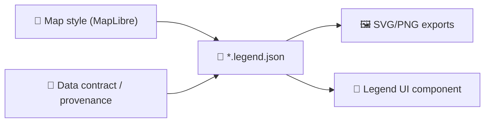

# 🗺️ Map Legends (UI + Assets)


> ✅ **Purpose:** Legends explain symbology, classes, units, and time context for map layers — so users can interpret the map without guessing.  
> 🧭 **Rule of thumb:** If a layer can be toggled on, it should have a legend (even if the legend is a single “line style” row).

---

## 📍 Location

`web/assets/media/maps/legends/`

This folder is the **single source of truth** for legend visuals and legend definitions used by the Web map UI.

---

## 🧠 How legends fit into the KFM web stack

- The web UI is expected to show **layer-aware legends** (per-layer, per-style) and keep them **in sync** with what the user is currently viewing.
- Legends should **update when data/time changes**, and should expose enough context (units, classification method, time) to avoid misinterpretation.

---

## 📦 What belongs here

| 🧩 Artifact | Extension(s) | When to use | Notes |
|---|---|---|---|
| **Vector legend** | `.svg` | Primary (crisp at any DPI) | Preferred for icons + line samples + small swatches |
| **Raster legend** | `.png` | Fallback / exports | Use when SVG isn’t feasible (e.g., texture-heavy) |
| **Legend definition** | `.legend.json` | Data-driven UI legend | Powers dynamic legend UI (swatches, labels, units, ranges) |
| **Legend metadata** | `.meta.json` | Provenance & traceability | Connects legend ↔ layer ↔ source ↔ style ↔ version |
| **Manifest (optional)** | `manifest.json` | Quick lookup | Helpful for bundlers, preloading, or layer panels |

---

## 🗂️ Suggested directory structure

> Keep this folder predictable. The goal is “find the legend in ≤ 10 seconds.”

```text
🗂️ web/assets/media/maps/legends/
├── 📄 README.md
├── 📄 manifest.json                # optional index for fast lookups
├── 🧪 _templates/                  # starter files + examples
│   ├── 🧾 legend.legend.json
│   └── 🧾 legend.meta.json
└── 🗂️ layers/
    └── 🗂️ <layer-id>/
        ├── 🖼️ <layer-id>--default.svg
        ├── 🖼️ <layer-id>--default.png
        ├── 🧾 <layer-id>--default.legend.json
        └── 🧾 <layer-id>--default.meta.json
```

---

## 🏷️ Naming & versioning conventions

### ✅ File naming
Use **kebab-case**, and keep names “boring but searchable”:

```
<layer-id>--<variant>.<ext>
<layer-id>--<variant>.legend.json
<layer-id>--<variant>.meta.json
```

Examples:
- `railroads-1885--historic.svg`
- `landcover-2020--light.legend.json`
- `temperature--ramp.meta.json`

### 🔁 Versioning (when needed)
If a legend’s meaning changes (class breaks, units, semantics), bump a version in metadata:

- `legend_version: 1.0.0 → 1.1.0` for class-break tweaks  
- `legend_version: 1.x → 2.0.0` for semantic changes (units/meaning)

---

## 🎨 Legend design rules (cartography + UX)

### 1) 🧮 Quantitative ramps & choropleths
- Prefer **4–8 classes** for readability on screens (avoid “rainbow confetti”).  
- Always include:
  - **Units** (e.g., `°C`, `mm`, `%`, `people / sq mi`)
  - **Classification method** (e.g., quantiles, natural breaks) *when applicable*
  - **Time context** for temporal layers (e.g., `2021`, `May 2021`, `1850–1870`)

✅ Convention: when mapping “more vs less”, use **darker = more** unless you have a strong reason not to (and then be explicit in the legend).

### 2) 📍 Graduated / proportional symbols
Be explicit whether the map is:

- **Classified** (a few discrete sizes), or  
- **Unclassified** (continuous scale)

For unclassified proportional symbols, include **representative symbol sizes** in the legend (not just a single dot).

### 3) 🧵 Lines, boundaries, routes
Legends for linework should show:
- Stroke width (as used on-map)
- Dash pattern (if any)
- Endpoint / casing rules (if any)
- Optional: “historic vs current” styling cues

### 4) 🌊 Surface-style legends (contours / filled contours)
If a layer uses contours or filled contours:
- Include **contour interval** if relevant
- Keep the legend aligned with the visual convention (“dark = more”)

---

## ♿ Accessibility & clarity

- ✅ Use colorblind-friendly palettes when possible (and avoid relying on color alone).
- ✅ Keep text short, unambiguous, and consistent (“High / Medium / Low” is usually too vague without units).
- ✅ If the legend is used in the UI: ensure it remains legible at small sizes (mobile).

---

## 🧾 Provenance-first legends (no “mystery swatches”)

KFM is built around **contract-first metadata**. Apply the same rigor to legends:

- Every legend should have a **`.meta.json`** that ties it to:
  - the layer(s) it explains
  - the style source (e.g., style JSON layer IDs)
  - the dataset source / license references
  - the units and meaning of classes

### Example `*.meta.json`
```json
{
  "legend_id": "landcover-2020--default",
  "legend_version": "1.0.0",
  "layer_id": "landcover-2020",
  "variant": "default",
  "generated_from": {
    "type": "map-style",
    "ref": "map-style.json#layers[landcover]"
  },
  "semantics": {
    "units": null,
    "classification": "categorical"
  },
  "provenance": {
    "sources": [
      {
        "title": "Source Name",
        "license": "CC-BY-4.0",
        "citation": "..."
      }
    ]
  },
  "updated_at": "YYYY-MM-DD"
}
```

---

## 🧩 Data-driven legends (`*.legend.json`) — recommended

Prefer defining the legend in JSON and letting the UI render it, so:
- the legend stays consistent across devices,
- the UI can adapt to time filters,
- we can reuse the same definition for SVG/PNG exports.

### Minimal `*.legend.json` shape
```json
{
  "title": "NLCD Land Cover Classification",
  "kind": "categorical",
  "items": [
    { "label": "11 Open Water", "color": "#466b9f" },
    { "label": "21 Developed, Open Space", "color": "#dec5c5" }
  ],
  "notes": "Optional short clarification (units/time/etc)."
}
```

### UI pattern (swatch + label rows)
A good legend UI is usually a simple stack of rows:
- ◼️ color swatch
- 🏷️ human-readable label

If you’re building a new component, keep layout consistent (padding, swatch size, alignment).

---

## 🧰 SVG implementation tips (performance + consistency)

- Pick **one delivery mechanism** for SVGs and stick to it (sprite, data-URI, or inline).  
- Automate asset generation where possible (reduces human error & makes results predictable).  
- Beware: CSS media queries inside an SVG behave differently depending on whether the SVG is embedded inline vs via ``.

---

## ✅ PR checklist

- [ ] Legend matches the map’s styling **exactly** (stroke widths, dash patterns, swatch colors).
- [ ] Legend includes **units** and **time context** when relevant.
- [ ] `*.meta.json` exists and references sources/license (provenance-first).
- [ ] `*.legend.json` (if used) matches UI rendering and exported assets.
- [ ] Verified at mobile-ish width (no truncated labels / broken wrapping).
- [ ] File sizes are sane (SVG optimized; PNG compressed).

---

## 🔮 Optional: Legend pipeline diagram


