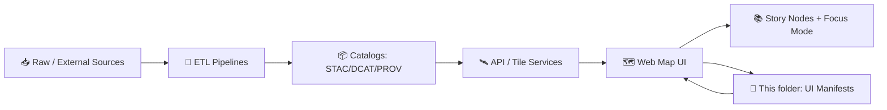

# 🗺️ Map Layer Manifests (UI Layer Registry)


This folder contains **frontend-facing JSON manifests** that power the **Map UI layer catalog** (layer list ✅, legend ✅, time slider ✅, attributions ✅).  
Think of these manifests as the **client’s “layer registry config”**: small, cacheable assets that tell the UI **what layers exist** and **how to load + present them**.

> [!IMPORTANT]
> **No “mystery layers.”** If it can show up on the map, it must be traceable to cataloged metadata (license + provenance).  
> These manifests are *UI wiring*, not a replacement for the data catalog.

---

## 🎯 What belongs here

✅ **UI manifests** for map layers, grouped collections, and registry entrypoints:
- 🧩 “Layer” manifests (one per layer)
- 🗂️ Optional “Collection” manifests (groups / bundles)
- 🧭 A “Registry” manifest (one stable entrypoint listing all available layers)

❌ Not here:
- Raw datasets
- ETL inputs/outputs
- “data/sources/” ingestion manifests (those are for pipelines to fetch external sources)

---

## 🧠 How this fits in the KFM pipeline



**Rule of thumb:**  
- Catalogs + provenance are the **truth** ✅  
- Manifests are the **UI glue** ✅  
- The UI should be able to derive **attribution + citations** from referenced catalog artifacts ✅

---

## 📁 Suggested directory layout

> This repo may evolve — treat this as the preferred convention for consistency.

```text
📦 web/assets/media/maps/manifests/
├─ 📄 README.md
├─ 🧭 registry.json                  # recommended single entrypoint
├─ 🧩 layers/
│  ├─ tornado-tracks.v1.json
│  ├─ usgs-topo-1890s.v1.json
│  └─ ...
├─ 🗂️ collections/                   # optional UI bundles
│  ├─ hazards.json
│  ├─ historical-maps.json
│  └─ ...
└─ 🧾 schemas/                        # optional but strongly recommended
   └─ kfm.map-layer-manifest.v1.schema.json
```

---

## 🧩 Manifest types

### 1) 🧩 Layer manifest
A single renderable map layer (vector, raster, terrain, external service, etc.).

**Responsibilities**
- Provide UI metadata (title, description, group, legend, default visibility)
- Describe *how to load* the layer (tiles/GeoJSON endpoint/COG/WMS/etc.)
- Provide *enough* temporal + attribution info for the time slider + credits UI
- Reference canonical **catalog + provenance** artifacts

---

### 2) 🧭 Registry manifest
A stable list of available layers and their ordering in the UI.

**Responsibilities**
- Provide a single URL the UI can fetch at startup
- Support sorting/grouping/search-friendly tags
- Allow “feature flags” (enable/disable) without code changes

---

### 3) 🗂️ Collection manifest (optional)
A UX grouping for:
- “Era packs” (e.g., 1850–1900)
- “Topic packs” (hazards / hydrology / land use)
- Story-driven bundles

---

## 🧱 Contract-first + provenance-first requirements

### ✅ “Definition of Done” for a layer manifest
A layer is **not considered publishable** until it satisfies:

- [ ] **Catalog reference exists** (data contract / catalog dataset entry)
- [ ] **License + attribution** can be displayed in UI (directly or via contract reference)
- [ ] **Provenance reference exists** (PROV, run log, or lineage bundle)
- [ ] **Temporal behavior is declared** (static date OR time range OR time field mapping)
- [ ] **No secrets** (no tokens, no API keys, no private endpoints)
- [ ] **No leakage** (respects sensitivity + redaction constraints)

> [!NOTE]
> If a layer is sensitive/restricted, the manifest should either:
> - omit it from `registry.json`, **or**
> - include explicit access rules (so the UI cannot accidentally expose it)

---

## 🧾 Suggested Layer Manifest Schema (v1)

> This is a pragmatic, UI-centric schema. Keep it small. Push heavy metadata to the catalog.

### Required fields (recommended)
| Field | Type | Why it exists |
|------|------|---------------|
| `manifest_version` | `string` (SemVer) | Enables safe evolution + validation |
| `id` | `string` | Stable identifier (kebab-case) |
| `title` | `string` | UI label |
| `description` | `string` | UI help text |
| `kind` | `"vector" \| "raster" \| "terrain" \| "external"` | Rendering path |
| `ui` | `object` | Default visibility, grouping, legend, zoom |
| `data` | `object` | Contract/prov refs + assets endpoints |
| `render` | `object` | MapLibre/Leaflet/Cesium-specific wiring |

### Strongly recommended fields
| Field | Type | Notes |
|------|------|------|
| `tags` | `string[]` | Improves search + filtering |
| `temporal` | `object` | Time slider behavior |
| `spatial` | `object` | bbox/crs hints (optional if contract has it) |
| `access` | `object` | classification + redaction rules |

---

## 🧪 Example: Layer Manifest (Vector Tiles + Time Slider)

> Example only — adjust to your actual tile stack (PMTiles/XYZ/API/etc.).

```json
{
  "manifest_version": "1.0.0",
  "id": "tornado-tracks",
  "title": "Tornado Tracks",
  "description": "Historical tornado tracks with intensity and date attributes.",
  "kind": "vector",
  "tags": ["hazards", "weather", "noaa", "tornado"],
  "ui": {
    "group": "Hazards",
    "default_visible": false,
    "min_zoom": 0,
    "max_zoom": 14,
    "opacity": 0.85,
    "legend": {
      "title": "F/EF Scale",
      "items": [
        { "label": "EF0–EF1", "symbol": "line" },
        { "label": "EF2–EF3", "symbol": "line" },
        { "label": "EF4–EF5", "symbol": "line" }
      ]
    }
  },
  "temporal": {
    "mode": "feature-field",
    "field": "event_date",
    "format": "iso8601",
    "start": "1950-01-01",
    "end": "2025-12-31"
  },
  "data": {
    "catalog_dataset_id": "hazards.noaa.storm-events.tornado-tracks",
    "contract_ref": "/data/catalog/dcat/hazards.noaa.storm-events.tornado-tracks.json",
    "prov_ref": "/data/prov/hazards.noaa.storm-events.tornado-tracks.prov.jsonld",
    "attribution": "NOAA Storm Events Database",
    "license": "Public Domain",
    "assets": {
      "tiles": "https://example.org/tiles/tornado-tracks/{z}/{x}/{y}.pbf",
      "tilejson": "https://example.org/tiles/tornado-tracks/tilejson.json"
    }
  },
  "render": {
    "maplibre": {
      "source": {
        "type": "vector",
        "tiles": ["https://example.org/tiles/tornado-tracks/{z}/{x}/{y}.pbf"],
        "minzoom": 0,
        "maxzoom": 14
      },
      "layers": [
        {
          "id": "tornado-tracks-line",
          "type": "line",
          "source-layer": "tracks",
          "paint": {
            "line-width": 2
          }
        }
      ]
    }
  }
}
```

---

## 🧪 Example: Layer Manifest (Raster COG / Static Year)

```json
{
  "manifest_version": "1.0.0",
  "id": "usgs-topo-1890s",
  "title": "USGS Topographic Map (1890s)",
  "description": "Georeferenced historical topo scan served as a COG or raster tiles.",
  "kind": "raster",
  "tags": ["historical", "usgs", "topo"],
  "ui": {
    "group": "Historical Maps",
    "default_visible": false,
    "min_zoom": 0,
    "max_zoom": 18,
    "opacity": 0.7
  },
  "temporal": {
    "mode": "static",
    "year": 1895
  },
  "data": {
    "catalog_dataset_id": "maps.usgs.topo.1890s",
    "contract_ref": "/data/catalog/dcat/maps.usgs.topo.1890s.json",
    "prov_ref": "/data/prov/maps.usgs.topo.1890s.prov.jsonld",
    "attribution": "USGS (historical map scan)",
    "license": "Public Domain",
    "assets": {
      "cog": "https://example.org/cogs/usgs-topo-1890s.cog.tif"
    }
  },
  "render": {
    "maplibre": {
      "note": "If using COGs directly, you may load via a server-side tile endpoint (recommended) or a client COG plugin."
    }
  }
}
```

---

## ➕ Adding a new layer (recommended workflow)

1) **Catalog it first** 🧾  
   - Create/verify the dataset’s contract (license, spatial/temporal extent, schema expectations).
   - Ensure provenance exists (PROV / run log / lineage bundle).

2) **Publish/host the renderable asset** 🛰️  
   - Vector tiles, raster tiles, PMTiles, COG endpoint, WMS/WMTS, etc.
   - Confirm CORS + caching headers if served cross-origin.

3) **Create a layer manifest** 🧩  
   - Place under `layers/<layer-id>.v<MAJOR>.json`
   - Keep `id` stable and human-readable.

4) **Register it** 🧭  
   - Add it to `registry.json` (preferred) or an appropriate collection manifest.

5) **Validate** ✅  
   - JSON schema validation (if schema exists)
   - Link checks (contract/prov refs resolve)
   - Quick visual smoke test in the map viewer

---

## ✅ Validation checklist (practical)

**Structural**
- [ ] JSON parses
- [ ] `manifest_version` + `id` present
- [ ] `kind` recognized
- [ ] `ui.group` set
- [ ] `data.contract_ref` present (or a resolvable `catalog_dataset_id`)
- [ ] `license` + `attribution` present (or derivable)

**Operational**
- [ ] Tiles/COG/WMS endpoint reachable
- [ ] CORS works in browser
- [ ] MapLibre source/layer config loads
- [ ] Legend renders
- [ ] Time slider behavior correct (if temporal)

**Governance / Safety**
- [ ] No secrets or tokens
- [ ] Sensitivity respected (no over-zoom / no raw coords for restricted datasets)
- [ ] No “UI-only claims” that contradict the catalog metadata

---

## 🔁 Versioning rules (treat manifests like API contracts)

- **`manifest_version` is SemVer**
  - Breaking changes → bump MAJOR
  - Backward-compatible additions → bump MINOR
  - Fixes → bump PATCH
- **Never reuse an `id` for a different dataset.**
- Prefer filename convention: `layers/<id>.v<MAJOR>.json`
  - Example: `tornado-tracks.v1.json`, `tornado-tracks.v2.json`

---

## 🎨 Map design + accessibility tips

- 🎛️ Keep legends explicit (units, symbology meaning)
- 🌈 Prefer colorblind-friendly palettes + high-contrast support
- 🧭 Use consistent icons + naming across eras/domains
- 🧩 If the layer is “historical,” consider a visual cue (sepia tone, dashed outlines, etc.) so users don’t confuse it with current data

---

## 🔗 Related (recommended) project docs

- 📦 Data contracts / metadata examples: `docs/data/contracts/examples/`
- 🧬 Provenance bundles: `data/prov/`
- 🛰️ Spatial catalogs: `data/stac/` + `data/catalog/dcat/`
- 🗺️ Map viewer (UI): `web/viewers/` (if present)

---

## 🧯 FAQ

### “Why not load everything directly from the catalog?”
You *can*, but the UI usually benefits from a small, stable, cacheable **registry** for fast startup and consistent UX. The manifest references the catalog for truth and citations.

### “Is this the same as `data/sources/` manifests?”
No.  
- `data/sources/` manifests describe **external sources for ingestion** (URLs, license, expected schema).  
- `web/.../manifests/` describes **UI layers for visualization** (what users can toggle and how to render it).

---
