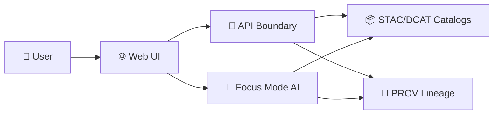

# 🧭 Workflow Screenshots

   

> 🧩 This directory contains **step-by-step UI workflow screenshots** for the Kansas Frontier Matrix (KFM) web app.  
> ✅ Goal: make workflows **teachable**, **testable**, and **auditable** — with sources/citations visible wherever possible.

---

## ✨ What lives here

Use this folder for **repeatable** UI workflows such as:

- 🗺️ Adding / toggling map layers  
- 🔎 Searching the graph / catalog  
- 🧾 Inspecting metadata & provenance panels  
- 🤖 Using Focus Mode AI (with citations visible)  
- 📤 Export / share flows (where applicable)  
- 🧪 QA / regression reference flows (before vs after)

These screenshots are treated like **evidence artifacts**: they should be reproducible, clearly named, and paired with lightweight documentation.

---

## 🗂️ Recommended structure

Keep each workflow in its own folder (kebab-case). Number screenshots so ordering is deterministic.

```text
📁 web/assets/media/screenshots/workflows/
├── 📄 README.md
├── 📁 _template/
│   ├── 📄 workflow.md
│   ├── 📄 workflow.meta.yml
│   └── 🖼️ 00_cover.webp
└── 📁 <workflow-slug>/
    ├── 📄 workflow.md
    ├── 📄 workflow.meta.yml
    ├── 🖼️ 00_cover.webp
    ├── 🖼️ 01_<action>.webp
    ├── 🖼️ 02_<action>.webp
    └── 🖼️ 03_<result>.webp
```

> 💡 If you don’t want a `_template/` directory, copy/paste the templates in this README instead.

---

## 📸 Image rules

### ✅ File formats
- **Preferred:** `.webp` (small + fast)
- **Allowed:** `.png` (only when lossless detail is required)
- **Avoid:** `.jpg` for UI (text artifacts)

### 📏 Size and clarity targets
- Keep the workflow set readable at a glance:
  - **Desktop viewport:** pick one and stay consistent (e.g., `1440×900` or `1920×1080`)
  - **Browser zoom:** `100%`
- Target file sizes:
  - **Ideal:** ≤ `350 KB` per screenshot
  - **Hard ceiling:** ≤ `1 MB` unless there’s a strong reason

### 🧠 Capture consistency
- Use the same:
  - Theme (light/dark)
  - Base map style (if relevant)
  - UI density (compact/comfortable)
  - Sidebar state (open/closed) per step
- When the workflow is about transparency/provenance, **show the provenance UI** (source drawer, metadata panel, citations list, etc.) as part of the screenshots.

---

## 🧾 Provenance-first workflow expectations

KFM’s UI philosophy is “no mystery layers / no black boxes.” Workflows should **demonstrate traceability**:

- 🧩 If a layer appears: include at least one screenshot where the **layer source / metadata** is visible.
- 🤖 If AI is used: include at least one screenshot where **citations/sources are visible** and AI output is clearly labeled.
- 🔁 Every workflow should be replayable: include preconditions and validation steps in `workflow.md`.

---

## 🔐 Privacy, security, and redaction

Before committing screenshots:

- ❌ Don’t capture API keys, tokens, cookies, auth headers, or internal URLs.
- ❌ Don’t capture private emails, phone numbers, real addresses, or identifying account info.
- ✅ Prefer test accounts + synthetic data.
- ✅ If redaction is needed:
  - Blur/box sensitive fields
  - Re-capture if the sensitive content is widespread (best option)

> 🛡️ Treat screenshots like logs: if it shouldn’t be in a public issue, it shouldn’t be in this folder.

---

## 🧰 Workflow documentation files

### `workflow.md` minimum contents

Each workflow folder should include a `workflow.md` that answers:

- 🧭 What is this workflow for?
- 🧪 Preconditions (data loaded, role permissions, environment)
- 🔁 Steps (with screenshot references)
- ✅ Validation steps (how to confirm success)
- 🧾 Provenance touchpoints (where sources/citations appear)

**Suggested template:**

```markdown
---
id: <workflow-slug>
title: <Human readable title>
owner: <@github-handle or team>
last_verified: YYYY-MM-DD
app_version: <git sha or tag>
environment: <local|staging|prod>
tags:
  - ui
  - workflow
  - provenance
---

# <Title>

## Purpose
What user problem does this solve? What does “done” look like?

## Preconditions
- User role:
- Required datasets (STAC/DCAT/PROV references if applicable):
- Starting UI state:

## Steps
1. Do the thing.
   - Screenshot: `01_<action>.webp`

2. Confirm provenance.
   - Screenshot: `02_<metadata-panel>.webp`

## Validation
- Expected UI output:
- Expected metadata visible:
- Common failure modes:
```

### `workflow.meta.yml` recommended fields

Use this when you want structured indexing later:

```yaml
id: <workflow-slug>
title: <Human readable title>
owner: <@github-handle or team>
last_verified: YYYY-MM-DD
app_version: <git sha or tag>
environment: local
screenshots:
  - file: 00_cover.webp
    alt: Overview of the workflow
  - file: 01_open-panel.webp
    alt: Open the layers panel
```

---

## 🏷️ Naming convention

Use **two-digit** step prefixes, then a short action label:

✅ Good:
- `00_cover.webp`
- `01_open-layer-panel.webp`
- `02_select-dataset.webp`
- `03_view-provenance.webp`
- `04_result-map.webp`

❌ Avoid:
- `step1.webp`
- `final_final.webp`
- `Screenshot 2026-01-17 at 9.12.02 PM.png`

---

## 🔗 How to reference these screenshots

### In Markdown docs
Use relative links that make sense from the doc’s location. Example (from repo root):

```md

```

### In longer docs
Use HTML for consistent sizing:

```html
/03_view-provenance.webp"
  width="820"
  alt="Provenance panel open with source details visible"
/>
```

---

## 🧪 Definition of done checklist

Before merging:

- [ ] 📁 Workflow has its own folder: `web/assets/media/screenshots/workflows/<workflow-slug>/`
- [ ] 🖼️ Screenshots are numbered and readable (no blurry text)
- [ ] 🧾 `workflow.md` exists and includes **preconditions + validation**
- [ ] 🔎 At least one screenshot shows **source / provenance / citations** when applicable
- [ ] 🔐 No secrets / personal info captured
- [ ] 🪶 File sizes are reasonable for repo health

---

## 🧭 Workflow index

> 🧩 Keep this updated as workflows grow.

| Workflow folder | What it demonstrates | Last verified | Owner |
|---|---|---:|---|
| `example-workflow` | Example placeholder | YYYY-MM-DD | @owner |
| `layer-add-geojson` | Add GeoJSON layer and inspect source | YYYY-MM-DD | @owner |
| `focus-mode-citations` | Focus Mode response with citations visible | YYYY-MM-DD | @owner |

---

## 🗺️ Optional architecture view

If your workflow crosses boundaries (UI → API → catalogs), keep screenshots honest about where truth comes from:



---

## 🤝 Contributing

- 🧱 Add a new workflow folder
- 🧾 Add `workflow.md` (and optional `workflow.meta.yml`)
- 🧭 Update the index table above
- ✅ Open a PR with a clear title like: `docs(ui): add workflow screenshots for <feature>`

---

### 🔝 Back to top
[⬆️ Jump to top](#-workflow-screenshots)
