<!--
📍 Path: web/assets/media/screenshots/workflows/_template/README.md
Purpose: Reusable scaffold for workflow screenshot packs used across the KFM Web UI + docs.
-->

# 🧩 Workflow Screenshot Pack — `_template` 📸

   

> [!IMPORTANT]
> **Don’t commit real workflow screenshots into `_template/`.**  
> Copy this folder into a new sibling folder (e.g. `web/assets/media/screenshots/workflows/<workflow_slug>/`) and work there.

---

## 🎯 What this folder is for

A **workflow screenshot pack** is a curated, ordered set of UI screenshots that documents a **single end-to-end user flow** in the Kansas Frontier Matrix (KFM) Web UI (layer toggle → source inspection → timeline → story/focus context, etc.). KFM’s mission explicitly emphasizes transparency: every layer/dataset/AI answer should be traceable, and the UI should let users inspect sources. This template helps ensure workflow screenshots reinforce that trust model. [^kfm-vision]

Common uses:
- 🧭 Step-by-step docs for contributors + reviewers
- ✅ PR evidence (before/after UI changes), aligning with manual QA expectations
- 🎓 Educator / “story mode” support content (workflow packs can later evolve into Story steps)

---

## 🚀 Quick start (copy → rename → capture)

1. **Copy** this folder:
   - From: `web/assets/media/screenshots/workflows/_template/`
   - To: `web/assets/media/screenshots/workflows/<workflow_slug>/`

2. **Rename** placeholders:
   - `<workflow_slug>` → `kebab-case` (example: `search-layer-provenance`)
   - `<workflow_title>` → short human title

3. **Capture** screenshots following the standards below (especially provenance + CARE/sensitivity).

4. **Add** a `manifest.yml` (recommended) and optionally a `steps.md` (template below).

---

## 🗂️ Recommended folder layout

> [!TIP]
> This structure is intentionally simple, git-friendly, and “self-sorting” (step numbers).  

```text
📁 web/assets/media/screenshots/workflows/
├── 📁 _template/
│   └── 📄 README.md   ← you are here
├── 📁 <workflow_slug>/
│   ├── 📄 README.md          ← workflow-specific notes (copy this file)
│   ├── 📄 manifest.yml       ← metadata + provenance pointers (recommended)
│   ├── 📄 steps.md           ← human-readable step script (optional)
│   └── 📁 shots/
│       ├── 🖼️ 00-cover.png
│       ├── 🖼️ 01-open-app.png
│       ├── 🖼️ 02-search.png
│       ├── 🖼️ 03-layer-info-provenance.png
│       └── 🖼️ 04-timeline.png
```

> [!NOTE]
> Repo structure explicitly includes `web/` as the canonical home for the front-end, so keeping workflow packs under `web/...` matches the “one canonical home per subsystem” direction. [^kfm-repo-layout]

---

## 🧱 KFM guardrails this template is designed to enforce

### 1) Provenance-first (no “mystery layers”)
- Every workflow pack should demonstrate how the UI exposes **source + provenance** (layer info panel, citations, metadata, etc.).  
- Do not capture screenshots of ad-hoc/unregistered layers or local-only “demo” data without provenance. KFM prohibits unsourced layers in the official catalog (“no mystery layers”). [^kfm-contracts]

### 2) Evidence-first narrative (and the pipeline ordering is sacred)
KFM’s invariants include strict ordering (ETL → catalogs → graph → API → UI → story nodes → focus mode) and evidence-first narrative gates. Workflow screenshots should only depict flows that align with that governed pipeline. [^kfm-invariants]

### 3) CARE / sovereignty & sensitivity: **no leaks**
- Never publish screenshots that reveal sensitive coordinates, restricted sites, private data, or anything that violates sovereignty rules.  
- Outputs can’t be “less restricted” than inputs; classification propagates end-to-end. [^kfm-classification]  
- Focus Mode rules explicitly prohibit sensitive location leaks and require provenance-linked content. [^kfm-focus-mode-rules]

### 4) AI content must be opt-in + clearly labeled
If your workflow includes Focus Mode AI:
- Ensure screenshots show **AI output is visibly labeled**, and includes citations/links to records (or equivalent). [^kfm-vision]  
- Follow the hard gate concept: only provenance-linked content should appear in Focus Mode. [^kfm-focus-mode-rules]

---

## 📸 Screenshot standards

### Capture settings (recommended defaults)
- **Desktop viewport:** 1440×900 or 1366×768
- **Zoom:** 100% (avoid browser zoom unless demonstrating accessibility)
- **Theme:** default theme (unless the workflow is explicitly theme-related)
- **Language:** default locale unless the workflow is localization-related

### Required UI elements to include (when relevant)
The Web UI is expected to include common elements like:
- layer list/catalog, search bar, legends, timeline slider, and popups/side panels for feature detail. [^kfm-web-ui-elements]

If your workflow touches one of these, include at least **one screenshot** where it’s visible.

### Provenance “receipt” shot (required)
Every workflow pack must include at least one screenshot that demonstrates:
- **Where the source is shown** (layer info, legend attribution, metadata panel, etc.)
- Enough UI context to verify that the content is provenance-linked and not “black box” [^kfm-vision]

> [!TIP]
> A good default is: `03-layer-info-provenance.png`

### Image hygiene
- Use descriptive names + keep file sizes reasonable.
- Prefer dedicated folders (like `shots/`), and include captions/alt text when embedding screenshots in docs. [^md-images]

---

## 🏷️ Naming conventions

### File names
Use **zero-padded step numbers** so screenshots sort correctly everywhere:

- ✅ `00-cover.png`
- ✅ `01-open-app.png`
- ✅ `02-search.png`
- ✅ `03-layer-info-provenance.png`

Avoid:
- ❌ spaces
- ❌ uppercase
- ❌ vague names like `screenshot1.png`

### Variants (optional)
If you have parallel variants, suffix them:
- `03-layer-info-provenance--desktop.png`
- `03-layer-info-provenance--mobile.png`
- `03-layer-info-provenance--dark.png`

---

## 🧾 `manifest.yml` template (recommended)

> [!NOTE]
> This manifest is not a “governed Story Node,” but it borrows the same mindset: **traceability, repeatability, and clear metadata**. [^kfm-vision]

Create: `web/assets/media/screenshots/workflows/<workflow_slug>/manifest.yml`

```yml
# 🧩 Workflow Screenshot Pack Manifest
workflow:
  slug: "<workflow_slug>"               # kebab-case
  title: "<workflow_title>"             # human-readable
  status: "draft"                       # draft | reviewed | published
  owner: "<github_handle_or_team>"
  created: "YYYY-MM-DD"
  updated: "YYYY-MM-DD"

capture:
  app_area: "web"                       # web | story_mode | focus_mode
  viewport: "1440x900"
  theme: "default"
  locale: "en-US"
  environment: "local|staging|prod"
  build_ref: "<git_sha_or_tag>"
  notes: "Any flags, seed data, or setup steps."

governance:
  sensitivity: "public"                 # public | internal | restricted
  care_notes: "Redactions/generalizations applied where needed."

provenance:
  # Link to canonical catalog/graph identifiers where possible.
  dcat_dataset_ids: []
  stac_collection_ids: []
  stac_item_ids: []
  prov_bundle_ids: []
  graph_entity_ids: []
  ui_layer_ids: []

assets:
  shots_dir: "shots"
  cover: "00-cover.png"
  steps:
    - id: "01"
      file: "01-open-app.png"
      description: "Open the app to the default map view."
    - id: "02"
      file: "02-search.png"
      description: "Use search to locate a place/dataset."
    - id: "03"
      file: "03-layer-info-provenance.png"
      description: "Open layer info and verify source/provenance."
```

---

## 🪜 `steps.md` template (optional, but handy)

Create: `web/assets/media/screenshots/workflows/<workflow_slug>/steps.md`

```md
# 🪜 Workflow Steps — <workflow_title>

## Setup
- Environment:
- Account (if any):
- Feature flags:
- Dataset/layer(s):
- Safety notes (PII/sensitive locations):

---

## Steps

### 01 — Open app
- Action: Navigate to the map view
- Expected: Base map loads; layer catalog visible
- Screenshot: `shots/01-open-app.png`

### 02 — Search
- Action: Search for <place | dataset | entity>
- Expected: Search results list; map camera updates
- Screenshot: `shots/02-search.png`

### 03 — Inspect provenance
- Action: Open layer info / metadata panel
- Expected: Source shown, citations/metadata visible
- Screenshot: `shots/03-layer-info-provenance.png`
```

---

## ✅ Definition of Done (DoD) checklist

Use this before considering a workflow pack “review-ready”:

- [ ] Folder is **not** `_template/`; it lives at `.../workflows/<workflow_slug>/`
- [ ] Screenshots are **zero-padded** and sort correctly
- [ ] There is a clear **cover** screenshot (`00-cover.png`)
- [ ] At least one screenshot shows **provenance/source inspection UI** [^kfm-vision]
- [ ] No “mystery layers” / ad-hoc unsourced data shown [^kfm-contracts]
- [ ] No sensitive location leaks; redaction/generalization applied where needed [^kfm-focus-mode-rules]
- [ ] If AI content is shown: it’s clearly labeled and includes citations/links [^kfm-focus-mode-rules]
- [ ] (Recommended) `manifest.yml` present and filled
- [ ] (Optional) `steps.md` present and matches screenshots

---

## 🔁 Maintenance & PR usage

- UI changes should ship with **updated workflow screenshots** when they affect documented flows.
- Major UI changes often include attached screenshots and manual review; workflow packs make that repeatable. [^kfm-qa-screenshots]

---

## 🧭 Workflow-to-Story alignment (optional)

KFM Story Mode uses Markdown + JSON config and can drive map actions per step (activate layers, set camera, set timeline). If your workflow is likely to become a Story, keep the step numbering aligned to ease migration. [^kfm-story-json-steps]

```mermaid
flowchart TD
  A["Pick user flow 🧭"] --> B["Verify data is published (STAC/DCAT/PROV) ✅"]
  B --> C["Run Web UI (governed API) 🌐"]
  C --> D["Perform steps + capture 📸"]
  D --> E["Provenance/CARE review 🧾⚖️"]
  E --> F["Add manifest + steps 🧩"]
  F --> G["Use in PR / docs / Story Mode 🧠"]
```



---

## 📚 Source notes (project grounding)

[^kfm-vision]: KFM mission, provenance-first principles, and “UI lets users inspect sources” + Focus Mode AI advisory/evidence-backed framing.  [oai_citation:0‡Kansas Frontier Matrix (KFM) – Comprehensive Technical Documentation.pdf](file-service://file-AkqwUuYPp5zePf7pv5SMxi)

[^kfm-contracts]: Data contracts + validators + “no mystery layers” principle.  [oai_citation:1‡Kansas Frontier Matrix (KFM) – Comprehensive Technical Documentation.pdf](file-service://file-AkqwUuYPp5zePf7pv5SMxi)

[^kfm-invariants]: Pipeline ordering invariants + provenance-first/evidence-first narrative constraints.  [oai_citation:2‡MARKDOWN_GUIDE_v13.md.gdoc](file-service://file-UYVruFXfueR8veHMUKeugU)

[^kfm-classification]: Sovereignty & classification propagation (outputs can’t be less restricted than inputs) + UI safeguards for sensitive locations.  [oai_citation:3‡MARKDOWN_GUIDE_v13.md.gdoc](file-service://file-UYVruFXfueR8veHMUKeugU)

[^kfm-focus-mode-rules]: Focus Mode hard gate: only provenance-linked content; AI opt-in/transparent; no sensitive location leaks.  [oai_citation:4‡MARKDOWN_GUIDE_v13.md.gdoc](file-service://file-UYVruFXfueR8veHMUKeugU)

[^kfm-repo-layout]: Expected repo top-levels include `web/` as the front-end home.  [oai_citation:5‡MARKDOWN_GUIDE_v13.md.gdoc](file-service://file-UYVruFXfueR8veHMUKeugU)

[^kfm-web-ui-elements]: Web UI standard elements (layer list/catalog, search, legends, timeline slider, feature panels).  [oai_citation:6‡Kansas Frontier Matrix (KFM) – Comprehensive Technical Documentation.pdf](file-service://file-AkqwUuYPp5zePf7pv5SMxi)

[^kfm-qa-screenshots]: Manual QA / review practices mention attaching screenshots of new UI and validating story/schema.  [oai_citation:7‡Kansas Frontier Matrix (KFM) – Comprehensive Technical Documentation.pdf](file-service://file-AkqwUuYPp5zePf7pv5SMxi)

[^kfm-story-json-steps]: Story content uses Markdown + JSON config with step-driven map actions (layers, camera, timeline).  [oai_citation:8‡Kansas Frontier Matrix (KFM) – Comprehensive Technical Documentation.pdf](file-service://file-AkqwUuYPp5zePf7pv5SMxi)

[^md-images]: Image/screenshot best practices (alt text, sizing, dedicated folder, captions).  [oai_citation:9‡Comprehensive Markdown Guide_ Syntax, Extensions, and Best Practices.docx](file-service://file-J6rFRcp4ExCCeCdTevQjxz)
