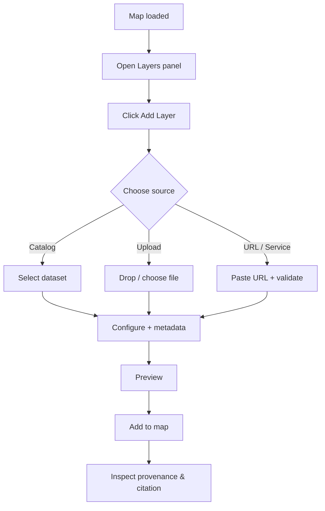

# 🧩 Add a Layer — Screenshot Workflow 📸

> 📁 **Folder:** `web/assets/media/screenshots/workflows/add-a-layer/`  
> 🎯 **Goal:** Keep docs screenshots consistent, current, and **provenance-forward** (no “mystery layers”).

---

## 🌾 Why this workflow matters (KFM principles)

KFM is explicitly built around **provenance-first mapping**: every layer should be traceable and users should be able to inspect sources and references directly in the UI.[^kfm_provenance]  
In practice, that means our “Add a Layer” screenshots **must** show the provenance/citation surface area (or at least where it’s accessed), not just the map result.[^kfm_mapbehindmap]

> ✅ If the screenshot set doesn’t demonstrate “where did this come from?”, it’s incomplete.

---

## 🧱 Screenshot standards

### ✅ Capture settings
- 🖥️ **Viewport:** 1440×900 (or a stable preset used across all UI workflows)
- 🔍 **Browser zoom:** 100%
- 🧼 **Clean state:** no dev overlays, no extensions UI, no notification popups
- 🗺️ **Map framing:** use a consistent Kansas-ish view (same zoom/center across the set)
- 🙈 **Privacy:** no emails, tokens, file system paths, or personal names visible

### 🖼️ File format
- Prefer: **PNG** (sharp UI text)
- Avoid: JPG (blur), animated GIF (unless explicitly needed)

---

## 🏷️ Naming convention

Use a stable, sortable naming scheme:

`NN-add-a-layer__<slug>.png`

**Examples**
- `00-add-a-layer__map-baseline.png`
- `03-add-a-layer__source-picker.png`
- `07-add-a-layer__provenance-citation.png`

> Tip: keep filenames stable once referenced in docs. If UI changes, overwrite the file (don’t rename) unless the step meaning changes.

---

## 🧭 Workflow map (high-level)

---

## 🧩 Golden path screenshot list (recommended)

> This is the **canonical** documentation set. If you only capture one flow, capture this one.

| Step | User action | Capture | Filename |
|---:|---|---|---|
| 00 | Map is open (baseline) | Clean map UI before any interaction | `00-add-a-layer__map-baseline.png` |
| 01 | Open **Layers** panel | Layers panel visible (empty or minimal) | `01-add-a-layer__layers-panel.png` |
| 02 | Click **Add layer** (➕) | Button + panel state that confirms the entry point | `02-add-a-layer__add-layer-entrypoint.png` |
| 03 | Source picker opens | Tabs/options visible (Catalog / Upload / URL/Service) | `03-add-a-layer__source-picker.png` |
| 04 | Choose a dataset source | The selected source + dataset row/card highlighted | `04-add-a-layer__select-source.png` |
| 05 | Configure layer basics | Name/title, visibility, (optional) CRS/time fields | `05-add-a-layer__configure.png` |
| 06 | Metadata & license | License/terms panel visible (if present) | `06-add-a-layer__metadata-license.png` |
| 07 | Provenance & citation | Source attribution, citation, reference link UI visible | `07-add-a-layer__provenance-citation.png` |
| 08 | Preview / validate | Preview state (bbox, sample, validation success) | `08-add-a-layer__preview-validate.png` |
| 09 | Confirm add | “Add” / “Save” / “Publish to map” confirmation moment | `09-add-a-layer__confirm.png` |
| 10 | Layer appears on map | Layer in stack + rendered on map | `10-add-a-layer__layer-added.png` |
| 11 | Inspect layer details | Open layer details drawer/popup showing provenance | `11-add-a-layer__inspect-layer-details.png` |

---

## 🔀 Alternate flows (capture only if docs need them)

<strong>🗂️ A) Add from Catalog</strong>

**Use when:** the dataset is already curated and searchable in KFM.

Suggested additional screenshots:
- `12-add-a-layer__catalog-search.png` (search/filter)
- `13-add-a-layer__catalog-dataset-details.png` (dataset card w/ provenance summary)

<strong>📤 B) Upload a local file</strong> (GeoJSON / CSV / GeoTIFF / etc.)

**Use when:** demonstrating user-supplied data.

Suggested additional screenshots:
- `12-add-a-layer__upload-dropzone.png` (dropzone)
- `13-add-a-layer__upload-file-selected.png` (file selected)
- `14-add-a-layer__upload-field-mapping.png` (CSV lat/lon mapping if applicable)
- `15-add-a-layer__upload-validation.png` (validation success/fail)

⚠️ **Important:** Uploaded layers should still show provenance and licensing info. KFM design explicitly rejects unsourced UI content (“no mystery layers”).[^kfm_contract]

<strong>🔗 C) Add by URL / Service</strong> (WMS/WMTS/XYZ tiles / GeoJSON URL)

**Use when:** demonstrating interoperability or external sources.

Suggested additional screenshots:
- `12-add-a-layer__url-input.png` (URL field)
- `13-add-a-layer__url-validation.png` (validated)
- `14-add-a-layer__url-provenance.png` (citation/attribution tied to the URL)

---

## 🧯 Error/edge-case screenshots (high value)

These are optional, but extremely useful for docs and QA.

| Scenario | What to show | Filename |
|---|---|---|
| Unsupported format | Clear error + supported formats list | `90-add-a-layer__error-unsupported-format.png` |
| Missing required metadata | Error/warning state that blocks publish | `91-add-a-layer__error-missing-metadata.png` |
| CORS / fetch blocked | URL source fails to load w/ actionable message | `92-add-a-layer__error-cors.png` |
| Invalid geometry / parse error | Validation output + guidance | `93-add-a-layer__error-invalid-geometry.png` |

---

## ✅ Final checklist (before committing screenshots)

- [ ] Filenames follow the `NN-add-a-layer__...png` convention
- [ ] No personal info, secrets, or machine-local paths visible
- [ ] At least one screenshot shows **provenance/citation UI** (or the entry to it)[^kfm_provenance]
- [ ] The “layer details” view demonstrates users can inspect source/metadata[^kfm_mapbehindmap]
- [ ] The map extent is consistent across the workflow
- [ ] Updated screenshots don’t break existing doc references (avoid renames)

---

## 📚 Project sources

- Kansas Frontier Matrix (KFM) – Comprehensive Technical Documentation  [oai_citation:0‡Kansas Frontier Matrix (KFM) – Comprehensive Technical Documentation.pdf](file-service://file-AkqwUuYPp5zePf7pv5SMxi)

---

## 🔎 Footnotes

[^kfm_provenance]: KFM emphasizes provenance-first principles: every map layer/dataset/AI answer is traceable to sources and processing steps, and the UI should let users inspect a layer’s source/reference. [oai_citation:1‡Kansas Frontier Matrix (KFM) – Comprehensive Technical Documentation.pdf](file-service://file-AkqwUuYPp5zePf7pv5SMxi)
[^kfm_contract]: KFM’s “contract-first and provenance-first” rule requires anything shown in the UI to be traceable; unsourced/ad-hoc “mystery layers” are not permitted. [oai_citation:2‡Kansas Frontier Matrix (KFM) – Comprehensive Technical Documentation.pdf](file-service://file-AkqwUuYPp5zePf7pv5SMxi)
[^kfm_mapbehindmap]: KFM UI philosophy includes exposing “the map behind the map” by surfacing source + metadata for visible layers/features. [oai_citation:3‡Kansas Frontier Matrix (KFM) – Comprehensive Technical Documentation.pdf](file-service://file-AkqwUuYPp5zePf7pv5SMxi)
