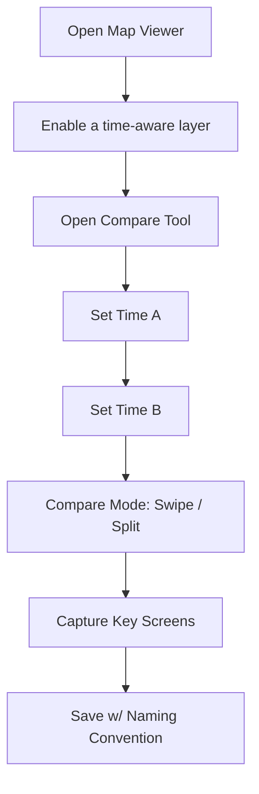

<a id="top"></a>

# ⏳ Compare Time Ranges — Workflow Screenshots 📸


> [!NOTE]
> This folder is the **canonical screenshot set** for the **Compare Time Ranges** workflow in the KFM Web UI (MapLibre/Cesium viewer + layer panel + timeline slider).  
> Use these images in docs, PRs, QA, and “what changed?” UI reviews.

---

## 🧭 Purpose

The **Compare Time Ranges** workflow shows how a user compares the same theme across two time periods (ex: **land cover** or **population density**), using a **Swipe / Split** style compare tool (and optionally a **Difference** view).

This aligns with KFM’s emphasis on:
- **Temporal navigation** (timeline slider controlling time-aware layers)  
- **Comparative analysis** (compare two time periods / layers via swipe & change views)  

---

## 🧱 Folder Layout

```text
📁 web/
  📁 assets/
    📁 media/
      📁 screenshots/
        📁 workflows/
          📁 compare-time-ranges/
            📝 README.md
            🖼️ 00-map-ready.png
            🖼️ 01-open-compare.png
            🖼️ 02-pick-layer.png
            🖼️ 03-set-time-a.png
            🖼️ 04-set-time-b.png
            🖼️ 05-swipe-midpoint.png
            🖼️ 06-swipe-edge.png
            🖼️ 07-difference-mode.png   (optional)
            🖼️ 08-provenance-popover.png (recommended)
            🎞️ compare-time-ranges.gif  (optional)
```

> [!TIP]
> Keep this folder **self-contained**: reference images with `./filename.png` so the README renders anywhere (GitHub, docs site, etc.).

---

## 🎯 Canonical Capture Scenario

To reduce “diff noise” and keep screenshots comparable over time:

### ✅ Recommended layer + time points
Pick a **time-aware layer** that clearly changes over time:
- **Raster example** (preferred): *Land cover* (ex: **1990 vs 2020**)  
- **Vector example** (also OK): *Population density* (ex: **1900 vs 2000**)  

### ✅ Recommended map viewpoint
- **Region:** Kansas (use an area with clear changes; ex: **Flint Hills** region works great)  
- **Camera:** North-up, no pitch (2D), stable zoom level  
- **UI state:** Timeline visible, compare tool visible, layer panel visible (when relevant)

> [!WARNING]
> Avoid screenshots containing: personal accounts, tokens, email addresses, or any private browsing UI (extensions, bookmarks, notifications). Keep it clean + reproducible.

---

## 🖥️ Capture Specs

### Desktop baseline (required)
- **Viewport:** 1440×900 (or 1536×960)  
- **Zoom:** 100%  
- **Theme:** Light mode (unless this workflow explicitly documents dark mode)  
- **Format:** `.png` (lossless)

### Optional sets
- **Mobile:** add `--mobile` suffix (ex: `05-swipe-midpoint--mobile.png`)  
- **HiDPI:** prefer OS scaling rather than naming `@2x` variants (unless your docs pipeline expects `@2x`)

---

## 📸 Required Screenshot Checklist

### Core flow (minimum set)
- [ ] `00-map-ready.png` — Map loads with timeline visible (baseline “ready” state)
- [ ] `01-open-compare.png` — Compare tool opened (panel/tool UI visible)
- [ ] `02-pick-layer.png` — Select the time-aware layer to compare (layer panel / picker visible)
- [ ] `03-set-time-a.png` — “Time A” selected (show the chosen year/date label)
- [ ] `04-set-time-b.png` — “Time B” selected (show the chosen year/date label)
- [ ] `05-swipe-midpoint.png` — Swipe handle centered (50/50 comparison)
- [ ] `06-swipe-edge.png` — Swipe handle near edge (emphasize before/after difference)

### Nice-to-have (strongly recommended)
- [ ] `08-provenance-popover.png` — Layer metadata / source info visible (“map behind the map”)
- [ ] `compare-time-ranges.gif` — 3–5s GIF dragging the swipe handle (optional)

### Optional if supported by UI
- [ ] `07-difference-mode.png` — Difference mode / change map view (if implemented)

---

## 🪜 Step-by-Step Capture Flow



### 0) Prep: make the UI deterministic 🧊
1. Hard refresh the page (avoid stale layer states).
2. Close unrelated panels.
3. Set map camera:
   - bearing = 0° (north-up)
   - pitch = 0°
4. Ensure the **timeline slider is visible** and readable.

📸 Save: `00-map-ready.png`

---

### 1) Open the compare UI 🧰
1. Click the **Compare** tool (toolbar button or menu item).
2. Confirm compare UI is visible (panel, modal, or side tray).

📸 Save: `01-open-compare.png`

---

### 2) Choose the layer to compare 🗺️
1. Open the **Layer Panel** (if it isn’t already open).
2. Select a **time-aware layer** (example: land cover).
3. Ensure the layer is visibly rendered.

📸 Save: `02-pick-layer.png`

> [!NOTE]
> If the compare tool supports comparing **two different layers**, keep the workflow focused on **same layer, two times** for this folder.  
> (Create a separate workflow folder if we want “compare-two-layers”.)

---

### 3) Set Time A and Time B ⌛
1. Set **Time A** (left side / A slot) to the earlier year/date.
2. Set **Time B** (right side / B slot) to the later year/date.
3. Confirm UI labels show both selections clearly.

📸 Save:
- `03-set-time-a.png`
- `04-set-time-b.png`

---

### 4) Capture swipe positions 🎚️
1. Ensure compare mode = **Swipe / Split** (whatever the UI calls it).
2. Drag handle to center.

📸 Save: `05-swipe-midpoint.png`

3. Drag handle close to one edge (to emphasize the “before” or “after” side).

📸 Save: `06-swipe-edge.png`

---

### 5) Optional: Difference mode 🧪
If the UI supports a computed difference/change map:
1. Toggle **Difference** / **Change** mode.
2. Ensure legend or labeling clarifies what values mean.

📸 Save: `07-difference-mode.png`

---

### 6) Recommended: Provenance / layer info 🧾
1. Open the **layer info / metadata** for the compared layer.
2. Ensure the screenshot shows:
   - dataset name
   - time coverage / timestamp
   - source attribution

📸 Save: `08-provenance-popover.png`

---

## 🗂️ Naming Conventions

### Pattern
`NN-short-action--optional-state.png`

Examples:
- `05-swipe-midpoint.png`
- `05-swipe-midpoint--mobile.png`
- `02-pick-layer--land-cover.png`

### Rules
- Use **kebab-case** only (`lowercase-with-dashes`)
- Use a **2-digit prefix** (`00`–`99`) to preserve ordering
- Avoid spaces, avoid parentheses, avoid long names

---

## ✅ QA Checklist

Before committing screenshots:
- [ ] No PII / tokens / browser chrome
- [ ] Timeline labels are readable
- [ ] Compare UI is visible + understandable without narration
- [ ] Map viewpoint is consistent across images
- [ ] File sizes are reasonable (optimize if needed)
- [ ] README checklist updated to match actual files

> [!TIP]
> If you change UI copy or iconography, update both:
> - the **screenshots**
> - the **step names** in this README (so they match what users click)

---

## 🧯 Troubleshooting

### “My screenshots don’t match older ones”
- Confirm the same map center/zoom/bearing/pitch
- Confirm the same layer + time points
- Disable any experimental feature flags
- Ensure basemap style didn’t change (if it did, note it in PR)

### “The layer looks different between runs”
- Time-aware layers must be linked to the timeline correctly
- If data is served dynamically, capture after tiles fully load
- Prefer layers with stable styling/legend for doc screenshots

---

## 🔗 Related Code Areas

> [!NOTE]
> Paths may differ depending on current repo layout, but these are the typical areas:
- `../../../../../viewers/` — map viewer implementation (MapLibre/Cesium)
- `../../../../../assets/` — static media assets (this folder lives here)
- `../../../../../` — web root (for UI components, toolbars, timeline widgets)

---

## 🧩 Future Enhancements (Optional)

- Add a `compare-time-ranges.webm` alongside the GIF for higher quality
- Add a tiny Playwright script to auto-capture the same flow for UI regression checks
- Add a second set for **Side-by-side** compare (synced maps) if/when implemented

---

[⬆️ Back to top](#top)
