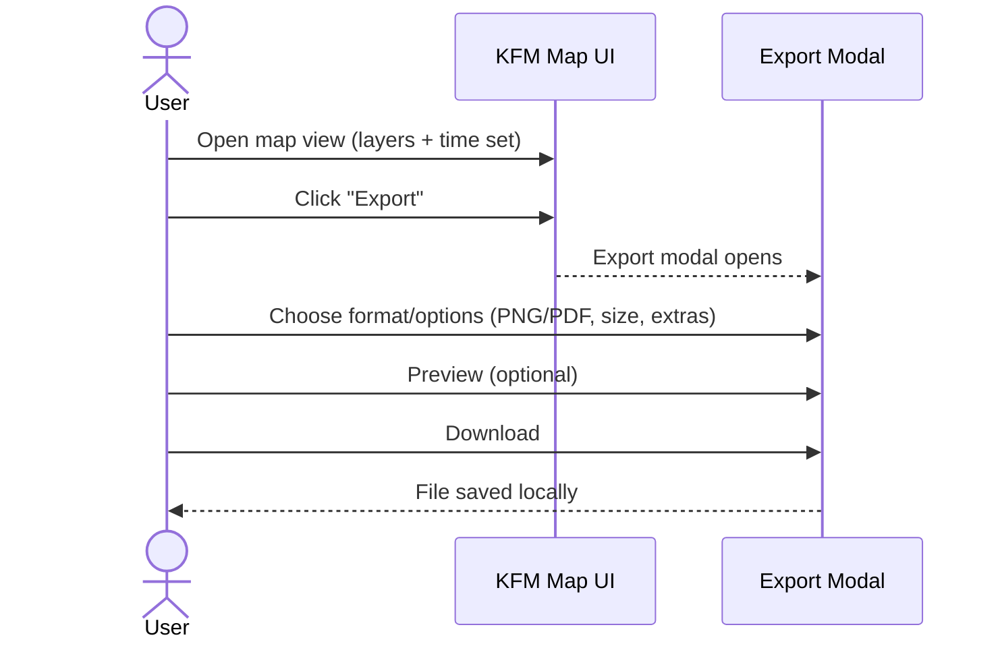

# Export Map — Workflow Screenshots 📤🗺️


> This folder contains **UI workflow screenshots** for the **“Export Map”** flow in the KFM web client.  
> These images are used in documentation, onboarding, and (optionally) UI regression/acceptance checks.

---

## 📌 Folder purpose

KFM’s UI is expected to be **transparent** and **export-friendly** — users should be able to export/share what they see *and* understand what it came from (provenance/attribution). This screenshot set documents the intended **Export Map** experience end-to-end.

### 📁 Location

```text
web/
└── 📁 assets/
    └── 🎞️ media/
        └── 📸 screenshots/
            └── 🔁 workflows/
                └── 📤🗺️ export-map/
                    ├── 📄 README.md                  # 📘 What this workflow demonstrates + capture rules + redaction notes
                    ├── 🧾🧭 manifest.json             # (recommended) Step metadata: captions, alt text, links, version, approvals
                    ├── 🗺️✅🖼️ 00__map-ready.png        # Starting state: map configured and ready to export
                    ├── 🧾🖼️ 01__open-export-menu.png   # Open export/share menu entrypoint
                    ├── 🪟🖼️ 02__export-modal.png       # Export modal opened (initial options)
                    ├── 📐🖼️ 03__format-and-size.png    # Choose format/size (PNG/PDF, dimensions, DPI)
                    ├── 🧷🖼️ 04__include-legend.png     # Toggle/confirm legend inclusion (if supported)
                    ├── 🏷️🖼️ 05__include-attribution.png # Toggle/confirm attribution/citations inclusion
                    ├── 👀🖼️ 06__preview.png            # Preview output before final export
                    └── 📥🖼️ 07__downloaded-file.png    # Result: downloaded file visible (avoid PII in filenames/paths)
```

---

## 🧭 Workflow overview



---

## 🖼️ Screenshot set

These filenames are the **canonical order** (keep the numeric prefix stable so docs can render them deterministically).

| # | File | What it shows | Notes |
|---:|---|---|---|
| 00 | `00__map-ready.png` | Map in a “shareable” state | Layers + timeline already configured |
| 01 | `01__open-export-menu.png` | Where the Export action lives | Toolbar/menu discovery shot |
| 02 | `02__export-modal.png` | Export modal opened | Default settings visible |
| 03 | `03__format-and-size.png` | Selecting format + dimensions | PNG/PDF + preset sizes |
| 04 | `04__include-legend.png` | Legend toggle / layout | Ensure legend is readable |
| 05 | `05__include-attribution.png` | Attribution/citations options | Key for provenance-first UX |
| 06 | `06__preview.png` | Export preview (if available) | Show margins/scale bar, etc. |
| 07 | `07__downloaded-file.png` | Result after download | File name pattern + where to find it |

> ✅ If the UI changes, **update both** the images **and** this table.

---

## 🧱 Screenshot standards

<details>
<summary><strong>📐 Visual consistency (required)</strong></summary>

- **Viewport:** capture at a consistent desktop viewport (recommend: `1440×900` or `1536×864`)
- **Theme:** keep consistent (prefer Light *or* Dark, but don’t mix within a set)
- **Zoom/extent:** use the same map extent across the sequence (unless the step requires moving)
- **Cursor:** avoid capturing the cursor unless it communicates a click target
- **Noise:** close devtools, hide bookmarks bar, mute OS notifications
- **Text clarity:** ensure UI text is readable at GitHub-rendered size (avoid overly “zoomed out” shots)

</details>

<details>
<summary><strong>🧼 Data + privacy hygiene (hard rule)</strong></summary>

- Do **not** screenshot:
  - API keys, tokens, cookies, internal URLs, local file paths
  - personal accounts, emails, names, or private datasets
- Prefer a **seed/demo dataset** and a known safe layer configuration.
- If you must show IDs, prefer synthetic/test IDs.

</details>

<details>
<summary><strong>⚖️ Provenance-first expectations (align with KFM values)</strong></summary>

When possible, the export UI should visibly support:
- **Attribution** (data provider credit)
- **Timestamp/time-slice context** (what year/time the map represents)
- **Layer list** or **legend** (what’s on the map)
- A path to **source metadata** / dataset references (even if via a “More info” link)

These screenshots should reinforce that exporting is not just “pretty pixels” — it’s **shareable evidence**.

</details>

---

## 🧩 Naming conventions

Use this pattern:

```text
NN__<step-slug>.png
```

Examples:
- `01__open-export-menu.png`
- `05__include-attribution.png`

Rules:
- ✅ `NN` is **two digits** (`00`–`99`) for stable ordering
- ✅ prefer **kebab-case** in the slug
- ✅ keep it short + action-oriented

---

## 🗂️ Optional: `manifest.json` (recommended)

If we want docs tooling to auto-render this workflow (captions, alt text, ordering), add a manifest:

```json
{
  "workflow": "export-map",
  "title": "Export Map",
  "screenshots": [
    {
      "file": "00__map-ready.png",
      "alt": "Map view configured with selected layers and timeline ready for export.",
      "caption": "Start state: map configured for a shareable export."
    }
  ]
}
```

Why this helps:
- accessibility-ready (**alt text** lives next to the asset)
- stable ordering without parsing filenames
- enables automated docs pages / galleries

---

## 🔗 Using these screenshots in docs

### Minimal example

```md

```

### With a caption (recommended)

```md
<figure>
  
  <figcaption>Export modal: choose format, size, and provenance options.</figcaption>
</figure>
```

---

## ✅ PR checklist (for updating this folder)

- [ ] All images follow the naming convention
- [ ] The set is complete (00 → 07) or the README explains what’s intentionally missing
- [ ] No secrets / private data captured
- [ ] UI text is readable in GitHub preview
- [ ] `README.md` table matches the actual files
- [ ] (If present) `manifest.json` updated with alt text + captions

---

## 🧠 Related areas

- `web/` — UI implementation home 🧩  
- `docs/` — governed documentation (if/when the Export Map workflow is documented as a guide) 📚  
- `tests/` — optional automation (Playwright/Cypress) for screenshot regeneration 🧪

---

## 🛠️ Troubleshooting

- **Map labels look blurry:** use `PNG` (lossless) or increase export scale (2×)
- **Legend overlaps content:** adjust layout to “below” or “right” and recapture steps 04–06
- **Export result differs between machines:** verify fonts/zoom/device scale and recapture with the standard viewport

---

**Last reviewed:** `YYYY-MM-DD` (update when screenshots are refreshed) ✅
