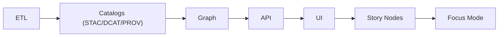

<!-- Path: web/assets/media/video/tutorials/README.md -->

# 🎬 KFM Tutorial Videos (Web Assets)

**Purpose:** This folder contains **local (repo-hosted) video tutorials** used by the KFM web UI for onboarding, in-app “how-to” guidance, and (optionally) Story Node / Focus Mode learning moments.

> 🧭 KFM is built around *trust + traceability*: “provenance-first,” “citations as first-class data,” and “nothing is a black box.”[^kfm-vision]  
> This tutorials directory follows the same spirit: **every tutorial must be attributable**, reproducible (where applicable), and safe to publish.

---

## ✅ What belongs here

- 📺 **Short tutorial videos** (screen recordings, guided walkthroughs, demos)
- 🖼️ **Posters/thumbnails** for UI preview
- 📝 **Captions** (`.vtt`) + **transcripts** (Markdown preferred)
- 🧾 **Tutorial metadata** (`meta.json`) so the UI can render a consistent tutorial library

**What does *not* belong here**
- ❌ Raw project datasets (those belong in `data/...` and must follow the pipeline)
- ❌ Un-attributed claims, screenshots, or media with unclear rights/licensing
- ❌ Sensitive coordinates or identifying info that violates governance rules (CARE/FAIR + sensitivity controls)[^kfm-governance]

---

## 🗂️ Canonical folder structure

Each tutorial gets its own folder (a stable slug). Keep filenames predictable.

```text
web/
└─ 📁 assets/
   └─ 🎞️ media/
      └─ 🎞️ video/
         └─ 🎓 tutorials/
            ├─ 📄 README.md                    # 👈 you are here 📌 Tutorial standards (format, captions, transcripts, licensing)
            ├─ 🧾🗂️ tutorials.manifest.json     # (optional but recommended) Index: tutorialId → folder + title + tags + duration
            └─ 🏷️ <tutorial-slug>/             # One tutorial package (self-contained, publishable)
               ├─ 🧾 meta.json                  # Contract: title, summary, chapters, provenance, license, checksums
               ├─ 🖼️ poster.webp                # Poster/cover image for listings and the player
               ├─ 🎞️ video.mp4                  # Primary web video (H.264/AAC; optimized)
               ├─ 🎞️ video.webm                 # (optional) WebM alternative (VP9/Opus) for better compression
               ├─ ♿📝 captions.en.vtt            # Captions (required): language-tagged WebVTT
               ├─ 📝 transcript.md               # Transcript (recommended): searchable, copyable text
               └─ 🧩 assets/                     # (optional) Supporting media (callouts, stills, overlays)
```

---

## 🧩 How tutorials map to KFM’s pipeline

KFM has a **non-negotiable** pipeline order:



Tutorial content should reinforce these boundaries (especially “no skipping stages” and “API boundary rule”).[^kfm-master-guide]

💡 **Rule of thumb:** If the tutorial demonstrates a feature, it should also show how to inspect provenance (source + metadata + citations) where relevant.[^kfm-vision]

---

## 🏷️ Naming conventions

### Tutorial folder slug
Use a **stable, kebab-case** identifier:

- ✅ `etl-publish-stac`
- ✅ `ui-layer-provenance-popup`
- ✅ `focus-mode-evidence-answers`

Avoid versioning in the folder name (versions live in metadata).

### Media file naming
Keep it consistent for automated loading:
- `video.mp4` (required)
- `video.webm` (optional fallback)
- `poster.webp` (preferred) or `poster.jpg`
- `captions.<lang>.vtt` (e.g. `captions.en.vtt`)
- `transcript.md`

---

## 🧾 `meta.json` spec (required)

Each tutorial folder must include a `meta.json` that the UI (or build step) can read.

**Minimum fields** (extend as needed):
```json
{
  "id": "ui-layer-provenance-popup",
  "title": "UI: Provenance Popups & Layer Attribution",
  "summary": "How to add a map layer with an attribution popup linked to STAC/DCAT.",
  "version": "1.0.0",
  "status": "draft",
  "audience": ["contributor", "developer"],
  "pipeline_stage": "UI",
  "runtime_seconds": 420,
  "files": {
    "poster": "poster.webp",
    "mp4": "video.mp4",
    "webm": "video.webm",
    "captions": {
      "en": "captions.en.vtt"
    },
    "transcript": "transcript.md"
  },
  "provenance": {
    "project_principles_refs": [
      "KFM: provenance-first; citations are first-class; AI is advisory-only"
    ],
    "source_notes": [
      "Show layer popup citing STAC/DCAT records"
    ]
  },
  "accessibility": {
    "captions_required": true,
    "transcript_required": true
  }
}
```

> 🧠 Why so strict? KFM treats “evidence artifacts” and governed content as first-class objects, and enforces provenance + contract discipline.[^kfm-contract-first]

---

## 📚 Transcript + companion notes (recommended)

Even though this directory is “media,” **tutorials are part of the knowledge system**.

### `transcript.md` expectations
- ✅ Use headings and short paragraphs (better for search + diff)
- ✅ Include a “Key takeaways” section
- ✅ Include citations / evidence references when making factual claims that matter

> The platform expects governed Markdown patterns (e.g., citations in brackets to populate evidence panels). Test rendering in the UI if it will be consumed there.[^md-governance]

---

## ♿ Accessibility requirements

- ✅ Captions (`.vtt`) are required for any tutorial shipped in the app
- ✅ Transcript is required (useful for search + screen readers)
- ✅ Avoid rapid flicker, tiny text, and low-contrast overlays
- ✅ Narrate important UI actions (don’t rely only on cursor movement)

---

## 🌐 Web integration notes (responsive + offline-friendly)

Tutorial videos should work across devices and degrade gracefully:
- Prefer the HTML5 `<video>` element with responsive layout considerations (poster images help UX).[^rwd-video]
- Consider caching strategy via Service Workers for offline-first experiences (especially for “field mode” / low-connectivity use).[^rwd-sw]

> ⚠️ Keep file sizes reasonable. If a tutorial becomes “course-sized,” consider hosting it externally and linking, rather than shipping it as a core asset.

---

## 🔗 Using tutorials inside Story Nodes / Focus Mode

KFM Story content is typically **Markdown + JSON config**, and the front-end renders Markdown while applying step config to the map/timeline.[^story-impl]

If a Story Node step needs a tutorial clip:
- Reference it by stable path
- Include captions + transcript
- Keep any interpretive claims cited

Example snippet:
```md
### Need help reading this layer? 🎥

<video controls preload="metadata" poster="/assets/media/video/tutorials/ui-layer-provenance-popup/poster.webp">
  <source src="/assets/media/video/tutorials/ui-layer-provenance-popup/video.mp4" type="video/mp4" />
  <track label="English" kind="captions" srclang="en"
         src="/assets/media/video/tutorials/ui-layer-provenance-popup/captions.en.vtt" default />
</video>

See transcript: /assets/media/video/tutorials/ui-layer-provenance-popup/transcript.md
```

---

## ✅ Definition of Done (DoD) checklist

Before merging a new tutorial ✅:

- 🎞️ **Media**
  - [ ] `video.mp4` present, plays, reasonable size
  - [ ] `poster.webp` present
  - [ ] audio levels acceptable (not clipping)

- ♿ **Accessibility**
  - [ ] `captions.<lang>.vtt` present and synced
  - [ ] `transcript.md` present

- 🧾 **Metadata**
  - [ ] `meta.json` present and valid
  - [ ] `pipeline_stage` is correct and consistent with KFM ordering[^kfm-master-guide]

- 🧠 **Trust / provenance**
  - [ ] Any “claims” are attributable (show where the UI exposes provenance)[^kfm-vision]
  - [ ] If AI narration/scripting is used, it is **clearly labeled** as AI-assisted and remains evidence-backed[^kfm-ai-rules]
  - [ ] No sensitive data leaked; CARE principles respected (e.g., generalized coords where required)[^kfm-governance]

---

## 🧭 Suggested tutorial roadmap (starter set)

A sensible first library aligns to the pipeline and the KFM “contracts-first” workflow:

1. 🧪 **ETL & Reproducibility**
   - Deterministic pipelines, logging, and reproducibility mindset[^scientific-method]

2. 🗃️ **Catalogs (STAC/DCAT/PROV)**
   - “Publish or it doesn’t exist”: metadata + lineage before graph/UI use[^kfm-master-guide]

3. 🧠 **Graph + Entities**
   - How entities (people/places/events) connect and why IDs matter in stories[^story-node-rules]

4. 🔌 **API boundary**
   - UI never hits graph directly; governed API enforces access + consistency[^kfm-master-guide]

5. 🗺️ **UI layers**
   - Adding a layer with provenance popup and citations[^kfm-governance]

6. 📖 **Story Nodes**
   - Writing machine-ingestible narrative with citations + entity refs[^story-node-rules]

7. 🤖 **Focus Mode**
   - Advisory-only, evidence-backed behavior and “no hallucinations” guardrails[^kfm-ai-rules]

---

## 📌 References (project grounding)

[^kfm-vision]: KFM mission + provenance-first principles; citations as first-class; clean modular architecture; Focus Mode as advisory and evidence-backed. [oai_citation:0‡Kansas Frontier Matrix (KFM) – Comprehensive Technical Documentation.pdf](file-service://file-AkqwUuYPp5zePf7pv5SMxi)

[^kfm-master-guide]: KFM v13 Master Guide invariants: pipeline ordering is absolute; API boundary rule; evidence-first narrative; deterministic ETL expectations. [oai_citation:1‡MARKDOWN_GUIDE_v13.md.gdoc](file-service://file-UYVruFXfueR8veHMUKeugU)

[^kfm-contract-first]: Contract-first / “no mystery layers” trust model via required metadata schemas and CI checks; provenance metadata used to supply citations. [oai_citation:2‡Kansas Frontier Matrix (KFM) – Comprehensive Technical Documentation.pdf](file-service://file-AkqwUuYPp5zePf7pv5SMxi)

[^kfm-ai-rules]: Focus Mode AI safeguards: advisory-only; citations required; avoid speculation beyond KFM data; AI outputs clearly labeled; handle sensitive info carefully. [oai_citation:3‡Kansas Frontier Matrix (KFM) – Comprehensive Technical Documentation.pdf](file-service://file-AkqwUuYPp5zePf7pv5SMxi)

[^kfm-governance]: UI contribution guidance: all layers tie back to provenance; comply with CARE principles (e.g., hide precise coordinates if sensitive). [oai_citation:4‡MARKDOWN_GUIDE_v13.md.gdoc](file-service://file-UYVruFXfueR8veHMUKeugU)

[^story-impl]: Story mode implementation: authored in Markdown + JSON config; front-end renders Markdown and loads assets; Focus Mode provides answers with references. [oai_citation:5‡Kansas Frontier Matrix (KFM) – Comprehensive Technical Documentation.pdf](file-service://file-AkqwUuYPp5zePf7pv5SMxi) [oai_citation:6‡Kansas Frontier Matrix (KFM) – Comprehensive Technical Documentation.pdf](file-service://file-AkqwUuYPp5zePf7pv5SMxi)

[^story-node-rules]: Story Node rules: provenance for every claim; reference graph entities via stable identifiers; distinguish fact vs interpretation; Focus Mode has strict trust rules. [oai_citation:7‡MARKDOWN_GUIDE_v13.md.gdoc](file-service://file-UYVruFXfueR8veHMUKeugU)

[^md-governance]: Governed Markdown guidance: YAML front-matter + reviewability; UI parsing expectations (e.g., bracketed citations for evidence panels). [oai_citation:8‡Comprehensive Markdown Guide_ Syntax, Extensions, and Best Practices.docx](file-service://file-J6rFRcp4ExCCeCdTevQjxz) [oai_citation:9‡Comprehensive Markdown Guide_ Syntax, Extensions, and Best Practices.docx](file-service://file-J6rFRcp4ExCCeCdTevQjxz)

[^scientific-method]: Scientific method documentation style: define problem, method, data collection, analysis, results, traceability + reproducibility mindset. [oai_citation:10‡Scientific Method _ Research _ Master Coder Protocol Documentation.pdf](file-service://file-HTpax4QbDgguDwxwwyiS32)

[^rwd-video]: Responsive web guidance: embedding rich media (video) and ensuring responsive behavior.  [oai_citation:11‡responsive-web-design-with-html5-and-css3.pdf](file-service://file-Heg28TVM2nReDYTQ7nPhAK)

[^rwd-sw]: Service Worker note for offline-first approach considerations in web apps.  [oai_citation:12‡responsive-web-design-with-html5-and-css3.pdf](file-service://file-Heg28TVM2nReDYTQ7nPhAK)
