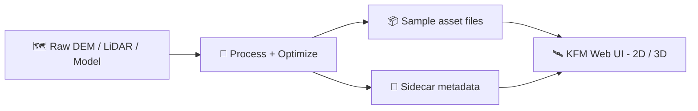

# 🧊 3D Sample Assets


> 🎯 **Purpose:** small, version-controlled **3D demo assets** for KFM’s web UI (terrain, models, tilesets, etc.).  
> 🧭 **Goal:** rapid prototyping + consistent visual QA **without** dragging giant production datasets into the repo.

---

<details>
  <summary><strong>🧭 Quick navigation</strong></summary>

- [📦 What belongs here](#-what-belongs-here)
- [🛰️ How this plugs into KFM](#️-how-this-plugs-into-kfm)
- [🗂️ Suggested folder structure](#️-suggested-folder-structure)
- [🧾 Sidecar metadata](#-sidecar-metadata)
- [⚡ Performance + LOD guidelines](#-performance--lod-guidelines)
- [✅ Adding a new sample](#-adding-a-new-sample)
- [🧯 Troubleshooting](#-troubleshooting)
- [🔐 Licensing + attribution](#-licensing--attribution)

</details>

---

## 📦 What belongs here

Put **small** assets that help us test/iterate on 3D features:

- 🗻 **Terrain clips** (mini DEMs / heightmaps) for validating hillshade + 3D terrain behavior
- 🧱 **3D models** for “drop a model on the map” experiments (GLB preferred)
- 🧊 **3D Tiles mini-tilesets** for streaming/LOD behavior tests
- 🛰️ **KML/KMZ samples** (especially “regionated” / progressive loading patterns)
- 🧾 **Metadata sidecars** that document provenance + transforms + intended usage (required)

### 🚫 What does *not* belong here
- 🐘 Large state-wide datasets (keep samples tiny; host real data elsewhere)
- 🔒 Anything with unclear licensing / restricted redistribution rights
- 🧑‍⚖️ Sensitive or culturally restricted materials unless explicitly governed and labeled
- 🧨 “Mystery assets” with no source / attribution / transform info

---

## 🛰️ How this plugs into KFM

KFM’s web front-end is designed as a **React (TypeScript) SPA** with a **2D/3D mapping stack**:
- 🗺️ **2D:** MapLibre GL JS (WebGL-rendered interactive maps)
- 🌍 **3D:** CesiumJS (globe / 3D terrain perspective), including support for **streaming 3D Tiles** for large 3D datasets

This folder exists so we can quickly validate things like:
- 🏔️ terrain exaggeration + imagery draping
- 🧭 correct georeferencing + transforms for models
- 🧊 tile streaming + LOD + “load only what you can see”
- 🧾 provenance surfaced in the UI (“map behind the map” philosophy)



---

## 🗂️ Suggested folder structure

> ✅ This is a *recommended* layout. Keep it tidy and predictable.

```text
web/assets/samples/3d/
├─ 🏞️ terrain/                 # Tiny DEMs/heightmaps/terrain fixtures (demo-scale only; not authoritative)
├─ 🧊 models/                  # Small 3D models (.glb preferred) + tiny textures if absolutely needed
├─ 🧱 tilesets/                # 3D Tiles samples (tileset.json + minimal tile payloads)
├─ 🧭 kml/                     # KML/KMZ samples (and regionated tiles if used) for compatibility demos
├─ 🎨 textures/                # Shared sample textures (keep minimal; reference in models/tilesets as needed)
├─ 📸 screenshots/             # Optional: tiny previews for docs/PRs (annotated/redacted if needed)
└─ 📄 README.md                # 👈 you are here 📌 How to run/view 3D samples + size limits + licensing notes
```

---

## 🧾 Sidecar metadata

KFM’s documentation and UI emphasize **traceability** and **provenance**. Every sample asset should ship with a **sidecar metadata file** that answers:

- **Where did this come from?** (source, author, license)
- **What did we do to it?** (processing steps)
- **How do we place it?** (CRS, units, transforms)
- **What is it for?** (intended demo, expected behavior)

### ✅ Sidecar naming convention
For an asset file:

- `my-asset.glb` → `my-asset.meta.json`
- `tileset.json` → `tileset.meta.json`
- `flint-hills-dem.tif` → `flint-hills-dem.meta.json`

### 📌 Minimal sidecar example

```json
{
  "id": "samples-3d-flint-hills-terrain-v1",
  "title": "Flint Hills terrain demo (tiny clip)",
  "kind": "terrain.dem",
  "intended_use": ["dev", "visual-qa", "story-prototype"],
  "source": {
    "name": "REPLACE_WITH_SOURCE",
    "url": "REPLACE_WITH_URL",
    "license": "REPLACE_WITH_LICENSE",
    "attribution": "REPLACE_WITH_ATTRIBUTION"
  },
  "spatial": {
    "crs": "EPSG:4326",
    "bbox_wgs84": [-96.9, 38.7, -96.6, 39.0],
    "units": "meters"
  },
  "render_hints": {
    "vertical_exaggeration": 1.0,
    "default_opacity": 1.0,
    "preferred_engine": ["cesium"]
  },
  "processing": [
    "cropped from larger dataset",
    "resampled to small size for repo inclusion",
    "validated for correct bounds + no-data handling"
  ],
  "notes": "Keep this file small; this is a dev fixture, not production terrain."
}
```

### 🧭 Georeferencing & transforms (important)

If a model/point cloud arrives in **local coordinates**, document the **shift/transform** needed to place it correctly in geospatial space. This prevents “looks fine on my machine” drift and makes the sample reproducible.

**Rule of thumb:** keep numeric stability in mind (don’t bake enormous offsets into vertex positions if a transform is more appropriate).

---

## ⚡ Performance + LOD guidelines

KFM’s stack aims to avoid overloading users, and that extends to 3D:
- 🪜 Prefer **LOD / progressive loading** (especially for terrain & 3D Tiles)
- 🗜️ Prefer **small samples** in-repo; keep big/real datasets external
- 🧊 For 3D terrain demos, start with **lower-resolution** terrain and only load higher detail when zoomed in

### 📏 Suggested size budgets (guidelines, not laws)

| Asset type | Target size | “Too big for samples” |
|---|---:|---:|
| GLB model | ≤ 10–25 MB | 100+ MB |
| Tileset sample | ≤ 50 MB total | 250+ MB |
| Terrain clip | ≤ 25–50 MB | 200+ MB |
| Texture | ≤ 2K (most cases) | 8K+ (avoid) |

### 🧰 Recommended optimizations
- 🧱 Mesh: reduce triangles, merge materials, avoid tiny separate meshes
- 🖼️ Textures: prefer compressed formats where possible; keep atlases small
- 🧊 Tiles: ensure bounding volumes make sense; validate LOD switching

---

## ✅ Adding a new sample

**PR checklist** (copy/paste into your PR description):

- [ ] 📦 Asset added under the correct subfolder (`terrain/`, `models/`, `tilesets/`, `kml/`)
- [ ] 🧾 Sidecar metadata added (`*.meta.json`) with **source + license + attribution**
- [ ] 🧭 CRS/units/transforms documented (and verified in viewer)
- [ ] ⚡ File sizes are reasonable for a sample (or documented why not)
- [ ] 🖼️ Optional: small screenshot added under `screenshots/` for quick review
- [ ] 🔎 Verified it loads in **2D/3D mode** without console errors

---

## 🧯 Troubleshooting

- **Model is rotated / lying on its side** 🌀  
  → check axis conventions (Y-up vs Z-up) and document the fix in the sidecar.

- **Model appears miles away** 🧭  
  → CRS mismatch (EPSG:4326 vs projected), or missing transform/offset.

- **Terrain looks “spiky”** 🪵  
  → wrong vertical units or incorrect height scaling; confirm meters vs feet.

- **Black model / weird lighting** 🌑  
  → missing normals or material issues; validate export settings and test with basic lighting.

- **Tileset loads everything at once** 🧊  
  → bounding volumes/LOD thresholds may be wrong; use a smaller tileset first and tune.

---

## 🔐 Licensing + attribution

KFM takes licensing seriously. Every asset here must be:
- ✅ legally redistributable in this repository, **or**
- ✅ a placeholder sample we authored ourselves, **or**
- ✅ explicitly approved and labeled with correct restrictions/governance metadata

**No license info = no merge.** 🛑

---

<!--
Project source references (internal):
- KFM – Comprehensive Technical Documentation (front-end stack: React/TS, MapLibre 2D, Cesium 3D, streaming 3D Tiles, provenance-first UI)  [oai_citation:0‡Kansas Frontier Matrix (KFM) – Comprehensive Technical Documentation.pdf](file-service://file-AkqwUuYPp5zePf7pv5SMxi)
- Kansas-Frontier-Matrix Design Doc (3D terrain in UI, COG/GeoJSON/KML/KMZ workflows, metadata traceability, Cesium for 3D expansion)  [oai_citation:1‡Kansas-Frontier-Matrix_ Open-Source Geospatial Historical Mapping Hub Design.pdf](file-service://file-ShqHKgjxCS9UT9vbcxDNzA)  [oai_citation:2‡Kansas-Frontier-Matrix_ Open-Source Geospatial Historical Mapping Hub Design.pdf](file-service://file-BJN3xmP44EHc9NRCccCn4H)
- KFM Markdown Governance Guide (YAML front-matter + provenance expectations for docs)  [oai_citation:3‡Comprehensive Markdown Guide_ Syntax, Extensions, and Best Practices.docx](file-service://file-J6rFRcp4ExCCeCdTevQjxz)
- Archaeological 3D GIS (georeferencing/shift concepts for 3D datasets in GIS contexts)  [oai_citation:4‡Archaeological 3D GIS_26_01_12_17_53_09.pdf](file-service://file-6DRx5ELzDPBso9Y5Qcbqm2)
- Python Geospatial Analysis Cookbook (DEM → 3D visualization patterns; useful mental model for terrain demos)  [oai_citation:5‡Kansas Frontier Matrix (KFM) – Comprehensive Technical Documentation.pdf](file-service://file-AkqwUuYPp5zePf7pv5SMxi)
-->
