# 🧬 PROV Schemas — Provenance & Lineage (KFM)


> **Purpose:** make every dataset, map layer, and evidence artifact *explainable* — **where it came from**, **how it was produced**, and **who/what produced it**. 🧾🔗  
> This folder contains the **PROV-focused JSON Schemas** used by the **web samples** (and any schema-driven UI tooling) to validate + document provenance bundles.

---

<details>
  <summary><strong>📌 Table of contents</strong></summary>

- [🗂️ What’s in this folder?](#️-whats-in-this-folder)
- [🚦 Where PROV sits in the KFM pipeline](#-where-prov-sits-in-the-kfm-pipeline)
- [🧠 What PROV is used for in KFM](#-what-prov-is-used-for-in-kfm)
- [🧩 Core model](#-core-model)
- [✅ KFM “minimum viable provenance”](#-kfm-minimum-viable-provenance)
- [🔗 Cross-layer linking rules of thumb](#-cross-layer-linking-rules-of-thumb)
- [🧱 Bundle shape conventions](#-bundle-shape-conventions)
- [🧪 Example: minimal PROV bundle](#-example-minimal-prov-bundle)
- [🧪 Example: evidence artifact or AI output](#-example-evidence-artifact-or-ai-output)
- [🛡️ Governance & safety notes](#️-governance--safety-notes)
- [🔁 Versioning & compatibility](#-versioning--compatibility)
- [🤝 Contributing](#-contributing)
- [📚 Related docs](#-related-docs)

</details>

---

## 🗂️ What’s in this folder?

Typical layout (exact filenames may differ):

```text
📁 web/assets/samples/_shared/schemas/prov/
├─ 📄 README.md
├─ 📄 *.schema.json        # top-level PROV bundle + type schemas
├─ 📁 _defs/               # reusable schema fragments (hashes, refs, ids, timestamps…)
└─ 📁 examples/            # demo bundles used by web samples/tests (optional)
```

> [!NOTE]
> This is under **web/assets** because it’s meant to be **loadable by the frontend** for demos, schema viewers, and schema-backed editors.  
> If your repo also has a canonical `/schemas/prov/` folder, treat that as the **source-of-truth** and mirror/export into this web asset folder as needed. 📦

---

## 🚦 Where PROV sits in the KFM pipeline

KFM treats provenance as a **first-class “boundary artifact”** alongside STAC & DCAT.


**Why this matters:** PROV is not “extra documentation” — it’s part of the contract that allows downstream stages (graph/API/UI/story/focus) to safely consume an artifact. ✅

---

## 🧠 What PROV is used for in KFM

PROV bundles power:

- **Trust & transparency** 🧾  
  “What is this layer? Where did it come from? What did we do to it?”
- **Reproducibility** 🔁 
  Stable run IDs, parameters/config references, and input/output hashes enable “same input ⇒ same output” expectations.
- **Debugging & auditability** 🕵️  
  Trace errors back to a specific source or pipeline step.
- **UI evidence panels / provenance popovers** 🗺️  
  The UI can display sources, methods, licenses, and caveats directly from provenance-linked metadata.
- **Story Nodes + Focus Mode integrity** 📚  
  Focus Mode content is only allowed when it’s provenance-linked to cataloged sources (no “mystery layers”).

---

## 🧩 Core model

We use the PROV mental model (PROV‑O concepts):

| Concept | Meaning | KFM examples 🧠 |
|---|---|---|
| **Entity** | A thing (usually data) | Raw CSV, scanned map TIFF, processed GeoParquet, generated raster COG, STAC Item JSON |
| **Activity** | A process that acts | “Download NOAA normals”, “Normalize county keys”, “Rasterize polygons”, “Run model vX” |
| **Agent** | Who/what is responsible | A contributor, an organization, a pipeline job, a container image, a service account |

Core relationships you’ll see (names vary by encoding):

- **Activity → uses → Entity** (`prov:used`)
- **Entity → wasGeneratedBy → Activity** (`prov:wasGeneratedBy`)
- **Activity → wasAssociatedWith → Agent** (`prov:wasAssociatedWith`)
- **Entity → wasDerivedFrom → Entity** (`prov:wasDerivedFrom`)
- **Entity → wasAttributedTo → Agent** (`prov:wasAttributedTo`)

```mermaid
flowchart TD
  E1[🟦 prov:Entity<br/>raw input] -->|prov:used| A1[🟧 prov:Activity<br/>transform]
  A1 -->|prov:wasGeneratedBy| E2[🟦 prov:Entity<br/>processed output]
  A1 -->|prov:wasAssociatedWith| AG1[🟩 prov:Agent<br/>pipeline / person]
  E2 -->|prov:wasDerivedFrom| E1
```



---

## ✅ KFM “minimum viable provenance”

> [!IMPORTANT]
> If a dataset / artifact is **published**, it must have **end-to-end lineage**: **raw inputs → intermediate → processed outputs**.  
> Provenance should identify the **specific run/config** that produced outputs (run ID, commit hash, container tag, etc.). 🧾

Minimum expectations for a *useful* bundle:

### 1) Identify the bundle
- A stable **bundle identifier** (dataset + run + version).
- A creation timestamp.

### 2) Capture the chain
- **At least one** output Entity.
- The Activity that generated it.
- The input Entities that Activity used.
- The Agent responsible (person and/or SoftwareAgent).

### 3) Determinism helpers (strongly recommended)
- Input + output **hashes** (or stable IDs) ✅
- A **config reference** (file path, commit hash, or config ID)
- Tooling identifiers: pipeline name, version, container image digest/tag

### 4) Evidence + uncertainty (optional but encouraged)
- Quality flags (uncertainty/confidence)
- Notes about limitations or transformations that affect interpretation

---

## 🔗 Cross-layer linking rules of thumb

KFM relies on **STAC + DCAT + PROV** moving together.

Use these patterns:

- **STAC Items → Data assets**  
  STAC points at the actual files/endpoints.
- **DCAT → Distributions**  
  DCAT provides discovery-level links (often to STAC, plus direct download endpoints).
- **PROV → End-to-end lineage**  
  PROV is the “how it was made” chain (including run/config identity).
- **Graph nodes → Catalog references**  
  The graph should reference identifiers (STAC Item IDs, DOIs, dataset IDs), not duplicate heavy payloads.

> [!TIP]
> If you can’t answer **“which exact inputs produced this output?”** from the PROV bundle alone, it’s not complete enough yet.

---

## 🧱 Bundle shape conventions

These schemas typically validate a **pragmatic subset** of provenance, optimized for:

- **machine validation** ✅
- **UI rendering** 🖥️
- **cross-reference linking** 🔗

You may see one of these common approaches:

1) **JSON-LD flavored** bundles (PROV‑O concepts, `@context`, often `@graph`)  
2) **“PROV-like JSON”** bundles with explicit `entities[]`, `activities[]`, `agents[]`, and `relations[]`

> [!NOTE]
> Don’t guess the exact format—open the top-level schema in this folder and follow the contract. The README is the *intent*, the schema is the *truth*. 🧠✅

---

## 🧪 Example: minimal PROV bundle

A compact example (illustrative; field names vary by schema):

```json
{
  "@context": {
    "prov": "http://www.w3.org/ns/prov#",
    "kfm": "https://kfm.example/ns#"
  },
  "@id": "kfm:prov/bundle/usgs_dem_30m/run-2026-01-18T120000Z",
  "@type": "prov:Bundle",
  "prov:generatedAtTime": "2026-01-18T12:05:00Z",
  "@graph": [
    {
      "@id": "kfm:entity/raw/usgs_dem_30m.zip",
      "@type": "prov:Entity",
      "prov:label": "USGS DEM 30m (raw download)",
      "kfm:hash": { "algo": "sha256", "value": "…" }
    },
    {
      "@id": "kfm:agent/pipeline/dem_ingest",
      "@type": "prov:SoftwareAgent",
      "prov:label": "Pipeline: dem_ingest",
      "kfm:version": "git:abcdef123",
      "kfm:container": "ghcr.io/kfm/pipelines:2026.01.18"
    },
    {
      "@id": "kfm:activity/etl/dem_ingest/run-2026-01-18T120000Z",
      "@type": "prov:Activity",
      "prov:label": "ETL: ingest + normalize DEM",
      "prov:startedAtTime": "2026-01-18T12:00:00Z",
      "prov:endedAtTime": "2026-01-18T12:05:00Z",
      "prov:used": [{ "@id": "kfm:entity/raw/usgs_dem_30m.zip" }],
      "prov:wasAssociatedWith": { "@id": "kfm:agent/pipeline/dem_ingest" },
      "kfm:parameters": { "targetCRS": "EPSG:4326", "tileSize": 512 }
    },
    {
      "@id": "kfm:entity/processed/usgs_dem_30m.cog.tif",
      "@type": "prov:Entity",
      "prov:label": "USGS DEM 30m (COG output)",
      "prov:wasGeneratedBy": { "@id": "kfm:activity/etl/dem_ingest/run-2026-01-18T120000Z" },
      "kfm:hash": { "algo": "sha256", "value": "…" },
      "kfm:artifact": { "path": "data/processed/elevation/usgs_dem_30m/usgs_dem_30m.cog.tif" }
    }
  ]
}
```

---

## 🧪 Example: evidence artifact or AI output

Evidence artifacts (analysis results / AI outputs) should be treated like any other dataset: **STAC + DCAT + PROV**, plus explicit computational origin and quality metadata.

```json
{
  "bundleId": "kfm:prov/bundle/ocr_letters_1870s/run-2026-01-18T141500Z",
  "createdAt": "2026-01-18T14:22:10Z",
  "entities": [
    {
      "id": "kfm:entity/raw/scan_box_12/page_0042.tif",
      "type": "prov:Entity",
      "role": "input",
      "hash": { "algo": "sha256", "value": "…" }
    },
    {
      "id": "kfm:entity/processed/letters_1870s/box_12_page_0042.txt",
      "type": "prov:Entity",
      "role": "output",
      "hash": { "algo": "sha256", "value": "…" },
      "quality": { "ocrConfidence": 0.93 }
    }
  ],
  "activities": [
    {
      "id": "kfm:activity/ocr/tesseract/run-2026-01-18T141500Z",
      "type": "prov:Activity",
      "startedAt": "2026-01-18T14:15:00Z",
      "endedAt": "2026-01-18T14:22:10Z",
      "used": ["kfm:entity/raw/scan_box_12/page_0042.tif"],
      "generated": ["kfm:entity/processed/letters_1870s/box_12_page_0042.txt"],
      "method": {
        "tool": "tesseract",
        "toolVersion": "5.3.0",
        "params": { "lang": "eng", "psm": 6 }
      }
    }
  ],
  "agents": [
    {
      "id": "kfm:agent/pipeline/ocr_batch",
      "type": "prov:SoftwareAgent",
      "name": "Pipeline: ocr_batch",
      "version": "git:abcdef123"
    }
  ]
}
```

> [!TIP]
> For evidence artifacts, include **confidence/uncertainty** and label them clearly as derived/AI-generated where appropriate. 🏷️

---

## 🛡️ Governance & safety notes

> [!IMPORTANT]
> Provenance is often *public-facing* via UI panels. Treat it like published documentation.

- 🚫 **Do not embed secrets** (API keys, tokens, private endpoints).
- 🧭 **Respect sovereignty & sensitivity**: avoid leaking precise sensitive locations or restricted inputs; use stable references and redaction-aware IDs.
- 🔒 **Classification should not weaken**: an output should not be less restricted than its inputs.
- 🧾 Prefer **references + hashes** over embedding raw sensitive payloads directly in PROV.

---

## 🔁 Versioning & compatibility

Recommended practices:

- Use **SemVer** for schema IDs / versions.
- Breaking changes ⇒ **new major** version.
- Keep old schemas around if the UI must render historical bundles.
- Make provenance bundles self-describing: include a `schemaVersion` / `$schema` / profile reference when possible.

---

## 🤝 Contributing

When you change or add a PROV schema:

1) ✅ Update or add at least one example bundle in `examples/` (if present)
2) ✅ Ensure schema references (`$id`, `$ref`) resolve correctly in the web build
3) ✅ Keep the “minimum viable provenance” requirements intact
4) ✅ Don’t break downstream rendering (think: “schema-driven UI editor / viewer”)

---

## 📚 Related docs

- 📘 `docs/standards/` — governed profiles (STAC/DCAT/PROV)
- 🗂️ `data/prov/` — canonical PROV lineage bundles produced at publish time
- 🧾 STAC / DCAT schema folders — discovery metadata that should cross-link with PROV
- 🧠 Story Node templates — evidence-first narratives that reference provenance-linked assets

---

**If you’re unsure what to record:** capture enough so a future maintainer can answer  
✅ *“Which inputs produced this output, using what method, at what version, and under what constraints?”* 🧠🔍
