# 🛰️ STAC JSON Schemas (Web Samples)


> **Purpose:** This folder contains **STAC JSON Schemas** bundled with the **frontend sample assets**, so the UI can validate demo **STAC Collections/Items** (and any KFM STAC extensions) **without relying on external network refs**. ✅

---

## 🧭 Quick links

- 📚 **KFM STAC profile (governed requirements):** `/docs/standards/KFM_STAC_PROFILE.md`
- 🧩 **Canonical schemas (single source of truth):** `/schemas/stac/`
- 🗃️ **Published STAC records (generated outputs):** `/data/stac/`
- 🔎 Related profiles:
  - `/docs/standards/KFM_DCAT_PROFILE.md`
  - `/docs/standards/KFM_PROV_PROFILE.md`

---

## 🌐 Why STAC exists in KFM

KFM treats metadata as a **first-class contract**. In the canonical pipeline:

- **ETL produces data** →  
- **STAC/DCAT/PROV describe it** →  
- **Graph indexes relationships** →  
- **APIs serve governed access** →  
- **UI visualizes** (maps + narratives)

That means **nothing “published” should be visible to the UI** unless it is **validated** and **traceable**.

```mermaid
flowchart LR
  A["🧪 ETL / Pipelines"] --> B["🛰️ STAC (Collections + Items)"]
  B --> C["📦 DCAT (Dataset Views)"]
  B --> D["🧬 PROV (Lineage Bundles)"]
  B --> E["🧠 Graph (Neo4j refs)"]
  E --> F["🔌 API (contracts + redaction)"]
  F --> G["🗺️ Web UI (Map + Narrative)"]
```



---

## 📦 What belongs in this folder

These schemas are here to support **web samples** and **frontend validation**. Keep them:

- ✅ **Self-contained** (all `$ref`s resolve locally)
- ✅ **Stable** (avoid breaking renames of `$id` / filenames without a version bump)
- ✅ **Aligned** with the **KFM STAC profile** (required fields, extension rules)
- ✅ **Build-friendly** (works with common JSON Schema tooling)

> 🧠 **Contract-first reminder:** schemas are not “documentation”; they’re **enforced interfaces**.

---

## 🗂️ Suggested layout

Actual filenames can vary by what the UI sample suite needs, but the intent is usually:

```text
📁 web/assets/samples/_shared/schemas/stac/
├── 📄 README.md
├── 📄 catalog.json
├── 📄 collection.json
├── 📄 item.json
├── 📄 item-collection.json
├── 📄 link.json
├── 📄 asset.json
└── 📁 extensions/
    ├── 📄 kfm.extension.json
    └── 📄 <other-extension>.json
```

> ✨ If you add a new schema file, also add a short note below in **“Schema index”**.

---

## 🧾 Schema index

| Schema | Used for | Notes |
|---|---|---|
| `collection.json` | STAC Collection validation | Should align w/ KFM Collection requirements |
| `item.json` | STAC Item validation | Most UI samples will validate against this |
| `extensions/kfm.extension.json` | KFM-required fields | Use `kfm:*` namespacing |

---

## 🧩 KFM extension rules

KFM may extend base STAC with **project-required fields** (examples: county tags, sensitivity classification, provenance pointers). To keep things sane:

- ✅ Use a clear namespace like **`kfm:*`** (e.g., `kfm:county`, `kfm:sensitivity`)
- ✅ Put the rule in **`/docs/standards/KFM_STAC_PROFILE.md`** first
- ✅ Then encode it in schema (and ensure UI + CI validators agree)
- ❌ Don’t add ad-hoc one-off properties directly into samples without updating the profile

### Example: KFM fields inside a STAC Item (illustrative)

```json
{
  "type": "Feature",
  "stac_version": "1.0.0",
  "id": "example_dataset_item_001",
  "properties": {
    "datetime": "1935-04-14T00:00:00Z",
    "kfm:county": "Seward",
    "kfm:sensitivity": "public",
    "kfm:provenance_ref": "prov:run/2026-01-18T00-00-00Z"
  },
  "geometry": null,
  "bbox": [-101.0, 37.0, -100.0, 38.0],
  "links": [],
  "assets": {}
}
```

> ⚠️ The example shows common STAC fields and possible KFM extensions. Your **actual required fields** live in the governed profile.

---

## ✅ Using these schemas in the web app

### Option A: Fetch + validate at runtime (simple + bundler-agnostic)

```ts
import Ajv from "ajv";
import addFormats from "ajv-formats";

export async function validateStacItem(item: unknown) {
  const schema = await fetch(
    "/assets/samples/_shared/schemas/stac/item.json"
  ).then((r) => r.json());

  const ajv = new Ajv({ allErrors: true, strict: false });
  addFormats(ajv);

  const validate = ajv.compile(schema);
  const ok = validate(item);

  return { ok, errors: validate.errors ?? [] };
}
```

### Option B: Import JSON at build time (fast, but bundler-config dependent)

If your toolchain supports JSON imports, you can import the schema directly.

---

## 🔄 Updating / syncing rules

This folder should mirror **canonical intent**, not become its own “second truth.”

**Recommended workflow:**
1. Update schemas in **`/schemas/stac/`** (canonical) or update the KFM profile docs first.
2. Copy/sync the subset needed for the web samples into this folder.
3. Ensure `$ref` paths remain **local** and **portable** (no remote URL refs).
4. Validate sample STAC JSON against the updated schemas.

<details>
  <summary>🧠 Why avoid remote <code>$ref</code> URLs?</summary>

Remote refs break offline demos, make builds flaky, and can silently change over time.  
For KFM, schema validation is part of the **contract**—contracts should be deterministic.

</details>

---

## 🧪 Definition of done checklist

- [ ] All JSON Schema files are valid JSON
- [ ] All `$ref` resolve locally (no network dependency)
- [ ] UI sample STAC JSON validates cleanly (or failing cases are intentional + documented)
- [ ] Any new required field is reflected in:
  - [ ] `/docs/standards/KFM_STAC_PROFILE.md`
  - [ ] this schema bundle (and canonical schemas if applicable)
- [ ] If breaking changes were introduced: version bump + changelog / migration note ✅

---

## 🔒 Governance & trust notes (KFM vibes)

- 📜 Metadata should include **license** and **attribution** expectations wherever required.
- 🧭 Sensitivity / sovereignty considerations belong in the **profile**, not scattered in random sample files.
- 🧬 Derived/AI outputs are still “datasets” and should be cataloged + traceable like everything else.

---

## 🧯 Troubleshooting

- **AJV complains about unknown formats:** add `ajv-formats` (or disable strict format checks).
- **`$ref` not found:** ensure the schema bundle keeps relative paths consistent after moving/renaming.
- **Validation is “too strict” for samples:** update sample JSON to be compliant—don’t weaken the schema unless the profile says so.

---

## 📎 Related folders

- 📁 `/schemas/stac/` — canonical STAC schema contracts
- 📁 `/schemas/dcat/` — DCAT schema contracts
- 📁 `/schemas/prov/` — PROV schema contracts
- 📁 `/data/stac/` — generated/published STAC items + collections
