# 🧩 StoryNodes Schemas


> ✨ **Story Nodes** are “machine‑ingestible” storytelling artifacts: narrative Markdown + structured metadata, designed to render safely in **Story Mode** and **Focus Mode** without breaking provenance, sovereignty, or governance.

---

## 📦 What’s in this folder?

This directory contains the **StoryNodes JSON Schema contracts** vendored into the web sample assets.

- ✅ Schema files: `*.schema.json` (and any shared `$defs`)
- 📄 This README: intent, shape, and how the contract is meant to be used

> 🧭 **Canonical home:** the project’s source-of-truth schema home is `schemas/storynodes/`. Keep this folder aligned with canonical contracts to prevent drift.

---

## 🧠 Where Story Nodes fit in KFM

KFM’s pipeline ordering is **non‑negotiable**:

```text
ETL → Catalogs (STAC/DCAT/PROV) → Graph → API → UI → Story Nodes → Focus Mode
```

Story Nodes sit *after* the UI layer and must reference already-cataloged evidence. 🧾  
That means **no Story Node should introduce “new facts” without traceable links back to catalog artifacts** (STAC/DCAT/PROV) and graph entities.

```mermaid
flowchart LR
  A["ETL + Normalization"] --> B["Catalogs<br/>STAC · DCAT · PROV"]
  B --> C["Graph<br/>(Neo4j)"]
  C --> D["API Layer<br/>(contracts + redaction)"]
  D --> E["UI<br/>(React · MapLibre · optional Cesium)"]
  E --> F["Story Nodes<br/>(governed narratives)"]
  F --> G["Focus Mode<br/>(provenance-linked context bundle)"]
```



---

## 🧱 Story Node “artifact shape” (practical)

A Story Node is commonly represented as **two coordinated artifacts**:

1) 📄 `story.md`  
   Markdown narrative + **YAML front matter** (governance + provenance metadata)

2) 🧭 `story.config.json` *(optional)*  
   A UI configuration file for Story Mode steps (camera, layers, timeline, highlights, etc.)

<details>
<summary><strong>📁 Typical Story Node folder layout (illustrative)</strong></summary>

```text
📁 docs/reports/story_nodes/
  ├─ 📁 draft/
  │   └─ 📁 <story_slug>/
  │      ├─ 📄 story.md
  │      ├─ 📄 story.config.json          # optional
  │      └─ 📁 assets/
  │         ├─ 🖼️ figure-01.png
  │         └─ 🗺️ sketch-map.svg
  └─ 📁 published/
      └─ 📁 <story_slug>/
         ├─ 📄 story.md
         ├─ 📄 story.config.json          # optional
         └─ 📁 assets/
            └─ 🖼️ ...
```
</details>

> 🧩 The **schemas in this folder** are used to validate the **structured parts** of a Story Node (front-matter metadata and/or serialized/published forms, plus any story config JSON).

---

## 🧾 YAML front-matter contract (governance + provenance header)

The front matter is the Story Node’s **machine-checkable identity + governance envelope**.

### Key fields (non‑exhaustive) 🧷

| Field | What it does 🧠 | Notes 🔎 |
|---|---|---|
| `title` | Human-readable title | Keep stable after publish if possible |
| `path` | Intended repo path | Useful for tooling + routing |
| `version` | Story version | Bump when meaningfully edited |
| `last_updated` | ISO date | Drives freshness + review flags |
| `status` | Draft → Review → Published | Values are project-defined |
| `doc_kind` | Declares this as a Story Node | Helps routing + validation |
| `license` | Reuse terms | Important for downstream publishing |
| `markdown_protocol_version` | Doc validation protocol | Must align with tooling expectations |
| `pipeline_contract_version` | Pipeline contract target | Prevents cross-version ambiguity |
| `governance_ref` / `ethics_ref` | Policy anchoring | Keep pointed at canonical governance docs |
| `fair_category` | FAIR/CARE framing | Governance signal |
| `care_label` | Special handling label | E.g., “Restricted · Tribal Sensitive” |
| `sensitivity` / `classification` | Access + disclosure constraints | Must not be downgraded downstream |
| `jurisdiction` | Legal scope | Useful for compliance |
| `doc_uuid` | Globally unique identifier | Prefer stable URN scheme |
| `commit_sha` / `doc_integrity_checksum` | Traceability + integrity | Enables reproducibility checks |

<details>
<summary><strong>🧪 Front matter example (illustrative)</strong></summary>

```yaml
---
title: "TEMPLATE — Story Node Title"
path: "docs/reports/story_nodes/draft/example/story.md"
version: "v0.1.0"
last_updated: "2026-01-18"
status: "draft"
doc_kind: "Story Node"
license: "CC-BY-4.0"

markdown_protocol_version: "1.0"
pipeline_contract_version: "v13"

governance_ref: "docs/governance/ROOT_GOVERNANCE.md"
ethics_ref: "docs/governance/ETHICS.md"
fair_category: "FAIR+CARE"
care_label: "Public"
sensitivity: "public"
classification: "open"
jurisdiction: "US"

doc_uuid: "urn:kfm:doc:story:example:v0.1.0"
commit_sha: "<commit-hash>"
doc_integrity_checksum: "sha256:<to-be-filled>"
---
```
</details>

> ⚠️ **Governance rule of thumb:** if the story references culturally sensitive or restricted material, the front matter must make that explicit (e.g., `care_label`) and the downstream UI must respect it (redaction/generalization, access controls).

---

## 🔎 Evidence-first narrative & citations

Story Nodes are **evidence-first**:

- ✅ Every factual claim should be backed by an evidence reference
- ✅ Evidence should resolve to a cataloged artifact (STAC/DCAT/PROV) *or* a verified document reference
- ✅ Interpretations must be **clearly distinguished** from sourced facts

> 🧠 UI note: Focus-mode renderers may expect predictable citation patterns (e.g., bracketed references) so an **evidence panel** can be auto-populated.

### Recommended citation patterns 🧷

- **Footnotes** for long-form citations
- **Inline bracket refs** when the UI needs to detect evidence tags:
  - Example: `...[evidence:stac:item:XYZ]`
  - Example: `...[1]` (with a matching reference list)

---

## 🗺️ Story Mode step config (optional JSON)

In Story Mode, the UI can drive map behavior step-by-step using a JSON config that can:

- toggle layers ✅  
- move camera ✅  
- scrub timeline ✅  
- highlight entities/features ✅

<details>
<summary><strong>🧭 Story config example (illustrative)</strong></summary>

```json
{
  "story_id": "example",
  "version": "1",
  "steps": [
    {
      "id": "intro",
      "title": "Opening",
      "narrative_ref": "#intro",
      "map": {
        "camera": { "center": [-96.0, 39.0], "zoom": 6, "bearing": 0, "pitch": 0 },
        "layers_on": ["base.boundaries", "historic.routes"],
        "timeline": { "mode": "year", "value": 1855 }
      },
      "evidence": [
        { "type": "stac", "ref": "data/stac/items/<item>.json" },
        { "type": "prov", "ref": "data/prov/<bundle>.jsonld" }
      ]
    }
  ]
}
```
</details>

> 🧩 If schemas exist for UI configuration, CI validates those configs too—treat `story.config.json` as a contract artifact, not “just UI glue.” ✋

---

## 🔒 Focus Mode “hard gates” (safety envelope)

Focus Mode is where users experience Story Nodes in context. The rules are strict:

- 🔗 **Only provenance-linked content** (no detached narrative)
- 🧠 **AI content is opt-in** (never shown by default), **clearly labeled**, and includes uncertainty/confidence metadata
- 🗺️ **No sensitive location leaks** — maps must generalize or omit restricted coordinates; narrative cannot be used as a side-channel

> ✅ Practical implication: the StoryNodes schema + validation + UI safeguards work together to prevent “policy bypass” via narrative.

---

## 🧪 Validation (CI + local) ✅

CI typically enforces:

- 🧾 **Markdown protocol & front-matter checks** (required sections + metadata)
- 🔗 **Link/reference validation** (no broken internal links, citations, or reference tags)
- 🧩 **JSON Schema validation** for structured outputs (including Story Node metadata when serialized/publishing)
- 🕵️ **Security & governance scans** (secrets, PII/sensitive data, sensitive location checks, classification consistency)

### Local validation tips 🛠️ (optional)

If you need to validate locally, any standards-compliant JSON Schema validator works. Example with AJV:

```bash
# (illustrative) validate a JSON payload against a schema
npx ajv-cli validate -s ./storynodes.schema.json -d ./example.storynode.json
```

---

## 🧩 Extending the StoryNodes contract

When changing StoryNodes schemas:

- ✅ Prefer **additive** changes (backwards-compatible)
- 🔁 If breaking: bump schema/version + update all parsers (pipeline + API + UI)
- ⚖️ Never weaken governance semantics (FAIR/CARE, classification propagation, sovereignty rules)

> 💡 A contract change isn’t “just JSON” — it’s a pipeline-wide guarantee. Treat it like an API change. 🔧

---

## 🔗 Related paths (quick jump)

- 📦 `schemas/storynodes/` — canonical contracts
- 🧰 `docs/templates/TEMPLATE__STORY_NODE_V3.md` — Story Node authoring template
- 📝 `docs/reports/story_nodes/` — draft/published Story Nodes
- ⚖️ `docs/governance/` — governance, ethics, sovereignty
- 🌐 `web/` — UI consuming Story Nodes (Story Mode & Focus Mode)

---

## ✅ Quick author checklist (print-me) 🖨️

- [ ] Front matter present + complete (no missing governance fields)
- [ ] Every claim has evidence (and evidence resolves)
- [ ] Facts vs interpretations clearly separated
- [ ] Graph entities referenced via stable IDs (not free-text only)
- [ ] `care_label` / `sensitivity` / `classification` correctly set (and not downgraded)
- [ ] No sensitive locations leak in narrative, media, or config
- [ ] Story steps (if present) don’t bypass API redaction / access controls

💬 *If CI fails, assume it’s protecting a contract invariant—fix the artifact, don’t bypass the gate.* ✅
