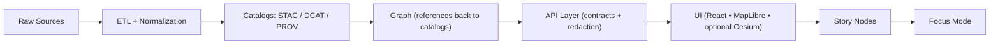

# 📊 Analytics Dashboards (Samples) — KFM Web UI


These are **sample analytics dashboards** for the KFM web application 🗺️📈 — meant to demonstrate **provenance-first**, **governed**, **map + chart** dashboard patterns that integrate cleanly with KFM’s pipeline and API boundary rules.

> [!NOTE]
> This folder is intentionally “samples-first” 🧪: keep things approachable, well-documented, and safe to copy/paste into real dashboards.

---

## 🧭 Contents

- [What lives here](#-what-lives-here)
- [How dashboards are meant to work in KFM](#-how-dashboards-are-meant-to-work-in-kfm)
- [Folder conventions](#-folder-conventions)
- [Dashboard manifest (recommended)](#-dashboard-manifest-recommended)
- [Governance rules (non-negotiable)](#-governance-rules-non-negotiable)
- [Performance checklist](#-performance-checklist)
- [Adding a new sample dashboard](#-adding-a-new-sample-dashboard)
- [Troubleshooting](#-troubleshooting)

---

## 📦 What lives here

This directory is intended for **dashboard sample packs**: small, reviewable examples that show how to combine:

- **KPIs** (counts, rates, deltas) 🔢
- **Time series + timelines** ⏱️
- **Maps (2D/3D)** via MapLibre / Cesium 🗺️🌍
- **Tables + drilldowns** 📋
- **Provenance panels** that link to cataloged sources 🔎🧾

### 🧩 Typical dashboard “themes” we support

- 🌾 **Ag + Remote Sensing**: NDVI / drought indicators / crop stress (often via `/api/analysis/*` endpoints)
- 💧 **Water + Flood Risk**: historical flood polygons + current warnings
- 🏙️ **Urban Change**: development patterns over time + land use overlays
- 🧠 **Graph Insights**: relationship summaries delivered through the API (not direct graph access)
- 🛡️ **Governance & Telemetry**: access/redaction signals, policy blocks, provenance completeness

> [!TIP]
> If a dashboard tells a story, it may eventually become (or feed) a **Story Node** — but dashboards should stay “analytics-first”, while Story Nodes are “narrative-first” 📚.

---

## 🧠 How dashboards are meant to work in KFM

KFM is designed around a strict, traceable pipeline:



Dashboards sit in the **UI** layer and must behave like good citizens:

- ✅ **Pull data via the governed API**
- ✅ **Show provenance + metadata alongside visuals**
- ✅ **Respect classification + redaction**
- ✅ **Stay performant** (tiles, bounding boxes, aggregation)

---

## 🗂️ Folder conventions

Even if different dashboard implementations exist, samples should follow a predictable layout:

```text
📁 web/assets/samples/analytics/dashboards/
├─ 📄 README.md  ← you are here
├─ 📁 _template/                 🧩 starter kit for new samples
│  ├─ 📄 dashboard.json           (manifest)
│  ├─ 📄 notes.md                 (what it proves / how it works)
│  └─ 🖼️ thumbnail.png            (optional)
├─ 📁 <dashboard-id>/            📦 one folder per sample dashboard
│  ├─ 📄 dashboard.json
│  ├─ 📄 notes.md
│  ├─ 🖼️ thumbnail.png
│  └─ 📁 mock/                   (optional offline fixtures)
└─ 📁 shared/                    (optional: shared sample helpers)
```

### ✅ Naming rules (keep it boring)

- Dashboard folder: **kebab-case** (`ndvi-county-trends`)
- Manifest id: **kebab-case** and stable (`ndvi-county-trends`)
- Prefer **small, composable** samples over mega-dashboards

---

## 🧾 Dashboard manifest (recommended)

To keep samples portable, we recommend each dashboard be described by a small **manifest** (`dashboard.json`) that the UI can load and render.

### ✨ Minimal example

```json
{
  "id": "ndvi-county-trends",
  "title": "🌱 NDVI Trends (County)",
  "version": "0.1.0",
  "tags": ["remote-sensing", "agriculture", "timeseries"],
  "classification": "public",
  "description": "County-level NDVI time series with a map overlay and provenance panel.",
  "data": {
    "mode": "live",
    "sources": [
      {
        "name": "NDVI Time Series",
        "type": "rest",
        "endpoint": "/api/analysis/ndvi",
        "params": { "county": "{{filters.county}}" }
      }
    ]
  },
  "layout": {
    "grid": { "columns": 12, "rowHeight": 24 }
  },
  "panels": [
    {
      "id": "kpi_summary",
      "type": "kpi",
      "title": "📌 Current NDVI Snapshot",
      "bind": { "source": "NDVI Time Series", "path": "$.summary" }
    },
    {
      "id": "ndvi_line",
      "type": "line",
      "title": "📈 NDVI Over Time",
      "bind": { "source": "NDVI Time Series", "path": "$.series" }
    },
    {
      "id": "map_overlay",
      "type": "map",
      "title": "🗺️ Map Overlay",
      "map": {
        "engine": "maplibre",
        "layerEndpoint": "/api/layers/ndvi/latest",
        "params": { "bbox": "{{viewport.bbox}}" }
      }
    },
    {
      "id": "provenance",
      "type": "provenance",
      "title": "🧾 Provenance",
      "provenance": {
        "stac_items": ["<stac-item-id>"],
        "dcat_datasets": ["<dcat-dataset-id>"],
        "prov_bundles": ["<prov-bundle-id>"]
      }
    }
  ]
}
```

### 🧩 Common panel types (suggested)

| Type | Use | Notes |
|---|---|---|
| `kpi` | quick stats | Always show units + time window |
| `line` / `bar` | trends & comparisons | Prefer server-side aggregation |
| `table` | audit trails, events | Provide paging + filters |
| `map` | spatial context | Use bbox/tiles; avoid giant GeoJSON |
| `provenance` | evidence & lineage | Must link to catalog outputs |
| `markdown` | helper text | Keep narrative short + sourced |

---

## 🚦 Governance rules (non-negotiable)

> [!IMPORTANT]
> These rules are **not style preferences** — they preserve KFM’s credibility and safety.

### 1) 🧱 Pipeline ordering is absolute
Dashboards must only visualize data that has progressed through:
**ETL → Catalogs (STAC/DCAT/PROV) → Graph → API → UI**.

### 2) 🔒 API boundary rule (no direct graph calls)
The UI must **never** query Neo4j directly.  
All data access must go through the **governed API layer** (contracts + redaction + validation).

### 3) 🧾 Provenance-first visualization
Every dashboard must expose **where the data came from**:
- dataset identity (STAC/DCAT)
- lineage (PROV)
- uncertainty / completeness (when available)

### 4) 🪶 Evidence-first narrative
If a panel includes explanatory text:
- keep it short
- cite evidence (links back to cataloged assets)
- label AI-generated text clearly if used

### 5) 🧷 Classification propagation
No output can be **less restricted** than its inputs.  
Dashboards must respect classification and UI safeguards (redaction/generalization/blurring where required).

### 6) ✅ CI validation gates
Samples must be schema-valid and link-clean:
- missing provenance references
- broken internal links
- secrets/sensitive leakage  
…should fail CI by design.

<details>
<summary>🔍 Why this matters (click)</summary>

Dashboards are *where users build trust* — the “pretty charts” layer can easily become a misinformation layer if it bypasses provenance or governance. KFM’s architecture is explicitly built to prevent that.
</details>

---

## ⚡ Performance checklist

Dashboards should feel fast even with geospatial + time-series workloads:

- 🧊 **Lazy load**: fetch only when a panel is visible / a layer is enabled
- 🧱 **Use bbox + tiles**: prefer vector tiles / tile endpoints for heavy layers
- 🧮 **Aggregate server-side**: do not ship million-point series to the browser
- 🧠 **Cache smartly**: memoize computed transforms; use request caching where safe
- 🎮 **Lean on WebGL**: MapLibre/Cesium already do; avoid DOM-heavy overlays
- 🧵 **Avoid blocking UI**: chunk processing; consider web workers for large transforms
- 📦 **Keep bundle size in check**: avoid pulling big viz libraries into every route

> [!TIP]
> If a dashboard needs “live mode” (auto-updating), prefer **streaming/subscription** patterns provided by the API (e.g., WebSockets / GraphQL subscriptions), rather than aggressive polling 🔁.

---

## ➕ Adding a new sample dashboard

1. 🧬 Copy the template:
   - `dashboards/_template/` → `dashboards/<your-dashboard-id>/`

2. ✍️ Update `dashboard.json`:
   - stable `id`
   - clear `title`, `description`, `tags`
   - `classification`
   - panels + API-backed data sources

3. 🧾 Add provenance:
   - reference **STAC/DCAT/PROV** identifiers in the manifest (or notes)

4. 📝 Write `notes.md` (required):
   - what question it answers
   - which API endpoints it uses
   - dataset lineage + assumptions
   - limitations + known caveats

5. 🖼️ Add a `thumbnail.png` (optional but nice)

6. ✅ Make sure CI can validate it:
   - JSON is valid
   - no broken links
   - no secret tokens
   - respects governance rules above

---

## 🧯 Troubleshooting

### “The dashboard loads but panels are empty”
- Check filters (county/year/bbox) and the endpoint params 🔧
- Confirm the API is reachable and returning expected JSON
- Verify the dataset is published (cataloged) and not blocked by policy

### “Map panel is slow or freezes”
- Replace large GeoJSON downloads with tiles or bbox queries 🧊
- Reduce feature density at low zoom (generalize / cluster)
- Ensure layer requests are viewport-scoped

### “CI fails: provenance / schema”
- Add missing STAC/DCAT/PROV references
- Ensure restricted inputs aren’t shown as public outputs 🔒
- Fix broken links in `notes.md`

---

## ✅ Sample dashboard definition checklist

- [ ] Uses **API endpoints** only (no direct DB/graph calls)
- [ ] Shows **provenance** for every dataset
- [ ] Respects **classification propagation**
- [ ] Performs well with **bbox/tiles + aggregation**
- [ ] `notes.md` explains assumptions and limitations
- [ ] Safe defaults (no sensitive coordinates shown by accident)

---

🧷 **Keep it small. Keep it sourced. Keep it fast.**  
That’s the KFM dashboards mantra 😄
