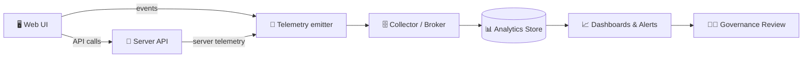

# 📡 Telemetry Analytics Sample (Web)


> [!IMPORTANT]
> This folder is a **reference sample** for **web telemetry** in KFM: how we name events, shape payloads, avoid leaking sensitive data, and emit **governance-ready signals** (e.g., Focus Mode redaction notices) without violating sovereignty rules.

---

## 🧭 What this is

This directory documents a **KFM-friendly telemetry contract** for the web app (UX + performance + governance signals):

- ✅ **Schema-first / contract-first** event design
- ✅ **Provenance-aware** identifiers (link to “what” without logging the sensitive “content”)
- ✅ **Governance telemetry** (redactions, policy blocks, sensitive-layer access indicators)
- ✅ **Trace correlation** (client → API) using OpenTelemetry-style IDs (or compatible equivalents)

> [!NOTE]
> The KFM architecture treats telemetry as a **first-class schema concern**. If it can be emitted, it can be validated. If it can be validated, it can be governed. 🧠

---

## 🎯 Goals

- **Observability:** know what the web app is doing (reliability + performance).
- **Product analytics:** understand how users interact with maps, layers, story nodes, Focus Mode.
- **Governance readiness:** capture **non-content** audit signals to support compliance and accountability.
- **Sovereignty safety:** prevent telemetry from becoming an accidental exfiltration channel.

---

## 🧩 Where this fits in KFM

KFM’s pipeline ordering matters. Web telemetry should respect the **API boundary** and **classification propagation**:



**Key rule of thumb:**  
Telemetry can log **what happened** (event + outcome + references), but must not log **the sensitive thing** itself.

---

## 📁 Suggested contents (this folder)

This folder can stay “docs-only,” but it’s designed to host sample artifacts as needed:

```text
web/assets/samples/analytics/telemetry/
├── README.md                         ✅ (this file)
├── sample-events.jsonl               🧪 optional (example event stream)
├── dashboards/                       📈 optional (exported dashboard configs)
│   └── telemetry-governance.json
└── schemas/                          🧾 optional (local copies for demos)
    └── telemetry.event.schema.json
```

> [!TIP]
> If you add `sample-events.jsonl`, keep it **synthetic** (no real user data).

---

## 🧾 Event contract (recommended)

### ✅ Required envelope

Every event should share a common “envelope” so analytics remains consistent:

```json
{
  "event_name": "focus_mode_redaction_notice_shown",
  "event_version": "1.0.0",
  "event_id": "01HV...ULID",
  "ts": "2026-01-18T12:34:56.789Z",

  "actor": {
    "anon_session_id": "sess_...",
    "anon_user_id": "usr_..." 
  },

  "context": {
    "app": "kfm-web",
    "route": "/focus",
    "component": "FocusModeRedactionNotice",
    "build_id": "git:abcdef0",
    "env": "dev"
  },

  "correlation": {
    "trace_id": "4bf92f3577b34da6a3ce929d0e0e4736",
    "span_id": "00f067aa0ba902b7",
    "request_id": "req_..."
  },

  "governance": {
    "classification": "RESTRICTED",
    "policy": {
      "decision": "ALLOW",
      "policy_id": "policy:focus_mode_sensitive_layer",
      "reason_code": "REDACTION_NOTICE_SHOWN"
    }
  },

  "refs": {
    "dataset_id": "dcat:dataset:...",
    "prov_activity_id": "prov:activity:...",
    "story_node_id": "story:..."
  },

  "payload": {
    "notice_variant": "blur+tooltip",
    "acknowledged": true
  }
}
```

### 🧠 Design notes

- **`refs` not raw data:** references point to already-governed entities (dataset IDs, story node IDs, provenance activity IDs).
- **`actor` is anonymous by default:** avoid direct identifiers unless explicitly required + approved.
- **`governance.classification` is mandatory:** telemetry is an “output,” so it must respect **classification propagation**.

---

## 🏷️ Event taxonomy (starter set)

| Category | Event name | When it fires | Why it matters | Sensitivity note |
|---|---|---:|---|---|
| 🧭 Navigation | `ui_route_viewed` | Route change | Usage funnels | Don’t log query params if sensitive |
| 🗺️ Map | `map_layer_toggled` | Layer on/off | Feature adoption | Don’t log exact coordinates for restricted layers |
| 🧪 Focus Mode | `focus_mode_opened` | Enter Focus Mode | Mode utilization | Record classification + policy context |
| 🫥 Redaction | `focus_mode_redaction_notice_shown` | User sees blur/notice | Audit signal | **Never** log redacted content |
| 🧱 API | `api_call_completed` | fetch/XHR completes | Reliability + latency | Don’t log raw response payload |
| 🚫 Policy | `publication_blocked_by_policy` | Publishing rejected | Governance + compliance | Include policy_id + reason_code only |
| ⚠️ Errors | `ui_error_boundary_triggered` | React error boundary | Stability | Sanitize stack traces if needed |

> [!IMPORTANT]
> Governance signals should always include **decision + reason code**, not sensitive underlying content.

---

## 🔒 Privacy, sovereignty & “don’t leak data” rules

### ✅ Do / ❌ Don’t

| ✅ Do | ❌ Don’t |
|---|---|
| Log **event outcomes** (ALLOW/BLOCK, success/failure) | Log PII (names, emails, phone numbers) |
| Log **IDs / references** (`dataset_id`, `prov_activity_id`) | Log raw dataset rows, text blobs, document excerpts |
| Use **coarse location** (tile id / bounding box bucket) | Log exact lat/lon for restricted layers |
| Hash/salt stable identifiers when needed | Re-identify users via fingerprinting |
| Capture **policy decision metadata** | Capture “why” as free-form text with sensitive detail |

> [!CAUTION]
> Telemetry is **not a data export mechanism**. If an event needs to include “content,” stop and redesign it.

---

## 🧵 Correlation & tracing (OpenTelemetry-style)

To connect UX issues to backend performance:

- Generate/propagate a **`trace_id`** per navigation or per “user action”
- Create spans around:
  - UI intent (e.g., “Toggle Layer”)
  - API request (fetch/XHR)
  - Render completion (optional)
- Emit `api_call_completed` events with `latency_ms`, `status`, and `trace_id`

> [!NOTE]
> OpenTelemetry is a common standard for generating/exporting telemetry (metrics, logs, traces). Even if you’re not using OTEL directly, matching the **shape** (trace/span IDs) keeps integrations easy.

---

## 🧑‍⚖️ Governance telemetry signals (Focus Mode + publication)

Governance-ready telemetry should be explicit and boring (that’s good):

### Examples
- ✅ `focus_mode_redaction_notice_shown`
- ✅ `sensitive_layer_access_attempted`
- ✅ `redaction_applied`
- ✅ `publication_blocked_by_policy`
- ✅ `story_node_publish_requested` / `story_node_publish_completed`

### Minimum governance fields
- `governance.classification`
- `governance.policy.decision` (`ALLOW` / `BLOCK` / `REDACT`)
- `governance.policy.policy_id`
- `governance.policy.reason_code`
- `refs.*` (IDs only)

---

## ✅ Adding a new telemetry event (checklist)

- [ ] **Name it** with a stable namespace (e.g., `focus_mode_*`, `map_*`, `publication_*`)
- [ ] Create/extend a **JSON Schema** under `schemas/telemetry/`
- [ ] Add a version bump (`event_version`) when the payload contract changes
- [ ] Instrument the UI with a single, reusable emitter (avoid ad-hoc `console.log`-style analytics)
- [ ] Add a test that validates sample payloads against schema
- [ ] Verify it contains **no PII** and respects **classification propagation**
- [ ] Add/update a dashboard panel proposal (optional but encouraged)

> [!TIP]
> If you can’t write a schema for it, it’s probably not well-defined enough to log.

---

## 📊 Dashboard ideas (starter panels)

### Governance (🧑‍⚖️)
- Redaction notices shown (count by `dataset_id`, by classification, by day)
- Publication blocks by policy (top `policy_id`, `reason_code`)
- Sensitive access attempts: allow vs block ratio

### Product (🧭)
- Layer toggle frequency (top layers; top sequences)
- Focus Mode adoption and session duration buckets
- Story node view → publish funnel

### Reliability (⚙️)
- API latency percentiles for core endpoints (client-measured)
- Error boundary events by route + build_id

---

## 🧪 Local testing (lightweight)

If you maintain sample events in this folder:

- Validate `sample-events.jsonl` against your telemetry schemas.
- Run replay against a local collector (or a stub) to validate dashboards.

> [!NOTE]
> Keep the sample dataset small and synthetic. The goal is **repeatable demos**, not realism.

---

## 🔗 Related docs (repo paths)

- `docs/MASTER_GUIDE_v13.md` 🧱 (KFM invariants, pipeline order, governance expectations)
- `schemas/telemetry/` 🧾 (canonical telemetry event schemas)
- `src/server/` 🧱 (API boundary)
- `web/` 🖥️ (UI implementation)

---

## 📎 Appendix: Reference emitter (example)

<details>
<summary>🧷 Example TypeScript emitter (schema-first friendly)</summary>

```ts
type TelemetryEvent<TPayload extends object> = {
  event_name: string;
  event_version: string;
  event_id: string;
  ts: string;
  actor: { anon_session_id: string; anon_user_id?: string };
  context: { app: string; route: string; component?: string; build_id?: string; env?: string };
  correlation?: { trace_id?: string; span_id?: string; request_id?: string };
  governance: { classification: "PUBLIC" | "INTERNAL" | "RESTRICTED"; policy?: { decision: string; policy_id?: string; reason_code?: string } };
  refs?: Record<string, string>;
  payload: TPayload;
};

export function emitTelemetry<T extends object>(evt: TelemetryEvent<T>) {
  // 1) Validate evt against JSON Schema (recommended)
  // 2) Strip unsafe keys / enforce allowlist
  // 3) Send to collector endpoint (or enqueue)
}
```

</details>
