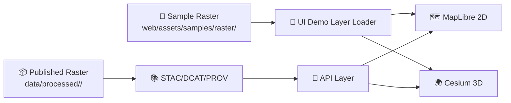

# 🧱 Raster Samples (Web Demo Assets)

    

> **TL;DR** ✅ Put **small, license-clear raster examples** here for UI demos/tests.  
> **Publishable rasters** belong in the governed pipeline (**data/raw → data/work → data/processed + STAC/DCAT/PROV**) and should be served through the API—not “hidden” inside the UI bundle.

---

## 📍 What lives here (and why)

This folder contains **lightweight raster assets** used by the web app for:

- 🧪 **UI development** (layer switchers, legends, opacity sliders)
- 🧰 **component demos** (map overlays, raster styling controls)
- ✅ **tests / fixtures** (repeatable, deterministic visuals)

Because KFM is **provenance-first**, every sample raster here must ship with **clear attribution + a sidecar metadata file** (see below) 🧾.

---

## 🧠 Raster 101 (quick refresher)

A raster is a **grid of pixels/cells**, where each cell stores a value (color, elevation, intensity, class ID, etc.). Common raster examples include:

- 🛰️ satellite / aerial imagery
- 🏔️ DEMs (elevation)
- 🌫️ hillshade / slope / aspect
- 🧪 classified layers (landcover, risk zones)

Web maps often display raster content as **tiles** (small images—commonly 256×256 px) for fast pan/zoom performance.

---

## 📦 Folder layout

Keep files together by **basename** so provenance is unmissable:

```text
🗂️ web/assets/samples/raster/
├─ 📄 README.md
├─ 🗺️ <name>.tif                 # (preferred) small GeoTIFF/COG sample
├─ 🧾 <name>.meta.json            # required provenance + usage metadata
├─ 🖼️ <name>.thumb.jpg            # optional thumbnail for layer picker
└─ 🗺️ <name>.png + <name>.pgw     # optional: image + worldfile (if not GeoTIFF)
```

---

## ✅ What belongs here

✅ **Do:**
- Small demo rasters (think *“fits comfortably in a git repo”*)
- Non-sensitive, **redistributable** data only
- Samples that help validate rendering paths (opacity, blending, legends, ramping)
- “Training wheels” layers for onboarding contributors 🧑‍🏫

---

## 🚫 What does NOT belong here

🚫 **Don’t:**
- Large rasters (historic scans, statewide mosaics, big DEMs)
- Anything with unclear or restrictive licensing
- Sensitive / restricted location data
- Anything that should be considered “published” evidence

If it’s real/publishable data, it should move through the canonical pipeline and land in `data/processed/...` with catalogs + lineage.

---

## 🧾 Required: Sidecar metadata (`*.meta.json`)

Every raster sample must have a sibling metadata file:  
`<name>.meta.json`

### Minimum required fields

| Field | Type | Why it matters |
|---|---:|---|
| `id` | string | Stable internal identifier |
| `title` | string | Human-friendly name shown in UI |
| `description` | string | What the layer is + intended use |
| `type` | string | e.g., `imagery`, `dem`, `hillshade`, `classified`, `scanned-map` |
| `format` | string | `cog-geotiff`, `geotiff`, `png+worldfile`, etc. |
| `crs` | string | EPSG code or CRS string |
| `bbox` | array | `[minLon, minLat, maxLon, maxLat]` in WGS84 (recommended) |
| `resolution` | object | pixel size + units (if known) |
| `license` | object | SPDX + attribution text |
| `sources` | array | Where it came from (URLs/archives/citations) |
| `processing` | array | What you did to it (reproject, resample, hillshade, etc.) |
| `checksum` | object | `sha256` for integrity |
| `ui` | object | default opacity, thumbnail path, etc. |

### Example metadata file (copy/paste)

<details>
<summary><strong>📄 example-demo-hillshade.meta.json</strong></summary>

```json
{
  "id": "example-demo-hillshade",
  "title": "Demo Hillshade (Example)",
  "description": "Small hillshade raster used for local UI testing (opacity, blending, legend UI).",
  "type": "hillshade",
  "format": "cog-geotiff",
  "crs": "EPSG:3857",
  "bbox": [-102.05, 36.99, -94.59, 40.00],
  "resolution": { "x": 30, "y": 30, "units": "meters" },
  "bands": [
    { "name": "shade", "dataType": "uint8", "nodata": 0 }
  ],
  "license": {
    "spdx": "CC-BY-4.0",
    "attribution": "Replace with the real attribution text required by the source."
  },
  "sources": [
    {
      "name": "Replace with the real source name",
      "type": "url",
      "value": "https://example.com/source",
      "retrievedAt": "2026-01-15"
    }
  ],
  "processing": [
    "Downloaded source raster",
    "Reprojected to EPSG:3857",
    "Generated hillshade",
    "Converted to Cloud Optimized GeoTIFF (COG) + overviews"
  ],
  "checksum": { "sha256": "REPLACE_WITH_REAL_SHA256" },
  "ui": {
    "thumbnail": "./example-demo-hillshade.thumb.jpg",
    "defaultOpacity": 0.75,
    "blendMode": "multiply",
    "initiallyVisible": false
  }
}
```
</details>

---

## 🧪 Recommended formats (pick the simplest that works)

### Option A: 🖼️ PNG/JPG overlay + world file (fastest for demos)
Use when you just need a tiny overlay and don’t need full GeoTIFF complexity.

- `layer.png`
- `layer.pgw` (or appropriate worldfile)

👍 Pros: trivial to ship + quick to load  
⚠️ Cons: limited metadata; not ideal for real data publishing

### Option B: 🗺️ GeoTIFF (prefer **COG**) for “real-ish” raster behavior
Use when you want a georeferenced raster that mirrors production practice.

- Prefer a **Cloud Optimized GeoTIFF (COG)** with internal tiling + overviews.
- Keep it small and purpose-built for UI checks.

---

## 🧩 How the web viewer should use these samples

The main rule: **samples are allowed for local demos/tests**—but production UI should rely on the API + governed catalogs.

### 🗺️ MapLibre (2D) – typical integration patterns

**Pattern 1: “Image overlay”** (PNG/JPG + corners)
```ts
map.addSource("sample-overlay", {
  type: "image",
  url: "/assets/samples/raster/example.png",
  coordinates: [
    /* [top-left], [top-right], [bottom-right], [bottom-left] */
  ]
});

map.addLayer({
  id: "sample-overlay",
  type: "raster",
  source: "sample-overlay",
  paint: { "raster-opacity": 0.75 }
});
```

**Pattern 2: “Raster tiles”** (COG served via a tiler/API in real deployments)
```ts
map.addSource("sample-tiles", {
  type: "raster",
  tiles: ["{TILE_ENDPOINT}/{z}/{x}/{y}.png"],
  tileSize: 256
});

map.addLayer({
  id: "sample-tiles",
  type: "raster",
  source: "sample-tiles",
  paint: { "raster-opacity": 0.75 }
});
```

### 🌍 Cesium (3D) – quick idea
For 3D, samples are usually useful as **imagery layers** (or as terrain if you have the plumbing). Keep samples tiny and metadata-rich either way.

---

## ✅ Contribution checklist (Definition of Done)

- [ ] 🧾 Added `<name>.meta.json` with **license + attribution + sources**
- [ ] 🔎 Verified georeferencing in a GIS tool (QGIS recommended)
- [ ] 🧪 Verified it renders in the web UI at expected location/scale
- [ ] 🧼 File size is reasonable for a sample (no giant rasters)
- [ ] 🔐 No sensitive/restricted locations or personal data
- [ ] 🧷 (Optional) Added `<name>.thumb.jpg` for layer picker/gallery

---

## 🆘 Troubleshooting

**Layer looks shifted / offset**
- CRS mismatch or wrong corner coordinates/worldfile.
- Verify the raster’s CRS and its bounding geometry.

**Layer renders as a black/white block**
- NoData / alpha handling issue.
- Confirm NoData value and whether an alpha band exists.

**Loads slowly**
- Too large for a sample. Downsample, crop, and/or convert to COG with overviews.

---

## 🔗 Related docs

- 📘 `docs/MASTER_GUIDE_v13.md` — canonical pipeline + governance
- 🧱 `docs/standards/KFM_STAC_PROFILE.md` — geospatial metadata profile
- 🧾 `docs/standards/KFM_DCAT_PROFILE.md` — dataset discovery profile
- 🧬 `docs/standards/KFM_PROV_PROFILE.md` — lineage profile
- ⚖️ `docs/governance/ETHICS.md` + `docs/governance/SOVEREIGNTY.md`

---

<details>
<summary><strong>🗺️ Mini-map of “sample vs published” (mental model)</strong></summary>


</details>
