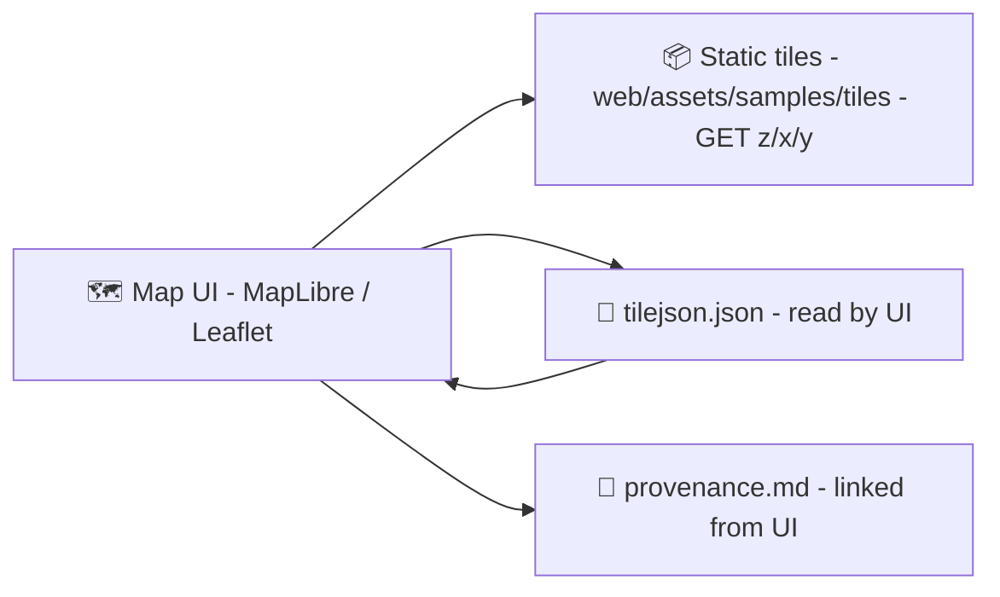

# 🧱 Sample Map Tiles (Web Demo Assets)


> [!NOTE]
> This folder is intentionally **small + self-contained**. It exists to help the web UI run demos, previews, and tests without depending on external tile services.

---

## 📌 What this folder is for

`web/assets/samples/tiles/` contains **sample tile sets** that are shipped with the web app as static assets.

Typical uses:
- 🧪 Local development / UI prototyping (no external tile server needed)
- ✅ Smoke tests / visual regression baselines
- 📴 Offline-ish demos (limited zooms + small AOI)

Non-goals:
- 🚫 Hosting production basemaps or large historical map layers
- 🚫 Storing sensitive or restricted data
- 🚫 “Mystery layers” (anything shown in the UI should stay explainable & attributable)

---

## 🗂️ Folder layout (one tileset per folder)

```text
📁 web/assets/samples/tiles/
├─ 📄 README.md                ← you are here
└─ 📁 <tileset-id>/            ← one tileset = one folder
   ├─ 📄 tilejson.json         ← required (TileJSON-ish manifest)
   ├─ 📄 provenance.md         ← required (sources + processing)
   ├─ 🖼️ preview.png           ← optional but recommended
   ├─ 🧩 style.json            ← optional (MapLibre style snippet)
   └─ 📁 {z}/
      └─ 📁 {x}/
         └─ 🧱 {y}.(png|jpg|webp|pbf)
```

✅ Keep names **lowercase** and **URL-safe**:
- `kansas-outline-demo`
- `topeka-historic-topo-1900s-demo`
- `landcover-mini-v1`

---

## 🧭 Tile conventions (XYZ / “slippy tiles”)

Tiles should follow the standard URL pattern:

```text
/<tileset-id>/{z}/{x}/{y}.png
```

Common expectations:
- 🧱 `tileSize` is typically **256×256**
- 🧭 Origin tile at zoom `0` is at the **upper-left** (0,0)
- 🔎 Keep zoom ranges limited (samples should not explode repo size)

> [!TIP]
> If your tiles render “upside down” (or appear mirrored), you may have exported **TMS** instead of **XYZ**. Re-export as XYZ or flip the Y scheme.

---

## 🧾 Required manifest: `tilejson.json`

Every tileset folder must include a `tilejson.json` so the UI can discover:
- attribution ✅
- bounds/center ✅
- min/max zoom ✅
- format/type ✅
- (optional) legend, style, tags ✅

### Minimal recommended `tilejson.json`

```json
{
  "tilejson": "3.0.0",
  "name": "Example Sample Tileset",
  "description": "Small demo tileset packaged with the web app.",
  "version": "1.0.0",
  "scheme": "xyz",
  "tiles": [
    "/assets/samples/tiles/<tileset-id>/{z}/{x}/{y}.png"
  ],
  "minzoom": 0,
  "maxzoom": 10,
  "bounds": [-102.05, 36.99, -94.59, 40.00],
  "center": [-98.0, 38.5, 5],
  "attribution": "© Source / Provider — see provenance.md",
  "kfm": {
    "license": "CC-BY-4.0",
    "source_ref": "See provenance.md",
    "notes": "Sample-only. Not authoritative."
  }
}
```

> [!IMPORTANT]
> Keep attribution short here (UI-friendly) and put the full detail in `provenance.md`.

---

## 🧾 Required provenance: `provenance.md`

This project follows a **contract-first + provenance-first** mindset: if a layer appears in the UI, it must be explainable, attributable, and reproducible.

Your `provenance.md` should answer (briefly!):
- 📍 **What is this layer?** (what it represents)
- 🧾 **Where did it come from?** (source links + citation)
- 🧪 **How was it produced?** (tools + commands + repro steps)
- ⚖️ **License + attribution** (and any usage constraints)
- 🧷 **Spatial/temporal scope** (bounds, year(s), etc.)

### Template (copy/paste)

```md
# Provenance — <tileset-id>

## 📍 What
- Description:
- Geometry/data type: Raster / Vector (MVT)
- Intended use: demo / test / UI preview

## 🧾 Sources
- Source name:
- Source link:
- Retrieved on:
- License:

## 🧪 Processing
- Tools:
- Steps (high level):
- Commands / parameters:

## ⚖️ Attribution
- Short attribution (for UI):
- Full attribution text:

## 🧷 Notes
- Known issues / limitations:
- Contact / maintainer:
```

---

## 🗺️ Using these tiles in the web UI

### MapLibre (raster example)

```js
map.addSource("sample_raster", {
  type: "raster",
  tiles: ["/assets/samples/tiles/<tileset-id>/{z}/{x}/{y}.png"],
  tileSize: 256,
  attribution: "© Source — see provenance.md"
});

map.addLayer({
  id: "sample_raster_layer",
  type: "raster",
  source: "sample_raster"
});
```

### MapLibre (vector MVT example)

```js
map.addSource("sample_vector", {
  type: "vector",
  tiles: ["/assets/samples/tiles/<tileset-id>/{z}/{x}/{y}.pbf"],
  minzoom: 0,
  maxzoom: 14,
  attribution: "© Source — see provenance.md"
});
```

---

## ➕ Adding a new tileset (quick checklist)

- [ ] 📁 Create `web/assets/samples/tiles/<tileset-id>/`
- [ ] 🧱 Add tiles under `/{z}/{x}/{y}.*`
- [ ] 🧾 Add `tilejson.json` (min/max zoom, bounds, attribution)
- [ ] 🧾 Add `provenance.md` (sources + processing + license)
- [ ] 🖼️ (Optional) Add `preview.png` for quick browsing
- [ ] ✅ Verify it renders in the map UI (and doesn’t bloat the repo)

> [!TIP]
> If you need a **big** tileset for a real layer, route it through the data pipeline and serve it via a tile endpoint/CDN instead of committing it here.

---

## 🧠 How it fits the system (high level)



---

## 🧯 Troubleshooting

<details>
<summary><strong>Tiles load, but look blurry</strong> 🔍</summary>

- Confirm `tileSize` matches how tiles were produced (commonly 256).
- Avoid mixing retina/512 tiles unless the UI is configured for it.
- Ensure PNG/JPEG encoding quality isn’t overly compressed (for raster).
</details>

<details>
<summary><strong>Nothing loads (404s)</strong> 🚧</summary>

- Confirm the URL in `tilejson.json -> tiles[]` matches the build output path.
- Confirm the folder naming matches `<tileset-id>` exactly (case-sensitive on most hosts).
- Try opening a single tile directly in the browser:
  - `/assets/samples/tiles/<tileset-id>/0/0/0.png`
</details>

---

## 🔒 Licensing rules (non-negotiable)

- ✅ Every tileset must include explicit license & attribution (manifest + provenance)
- ✅ Prefer permissive/open sources for samples
- 🚫 Do not include restricted, private, or copyrighted tiles without permission
