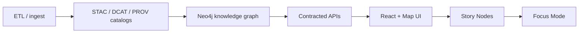
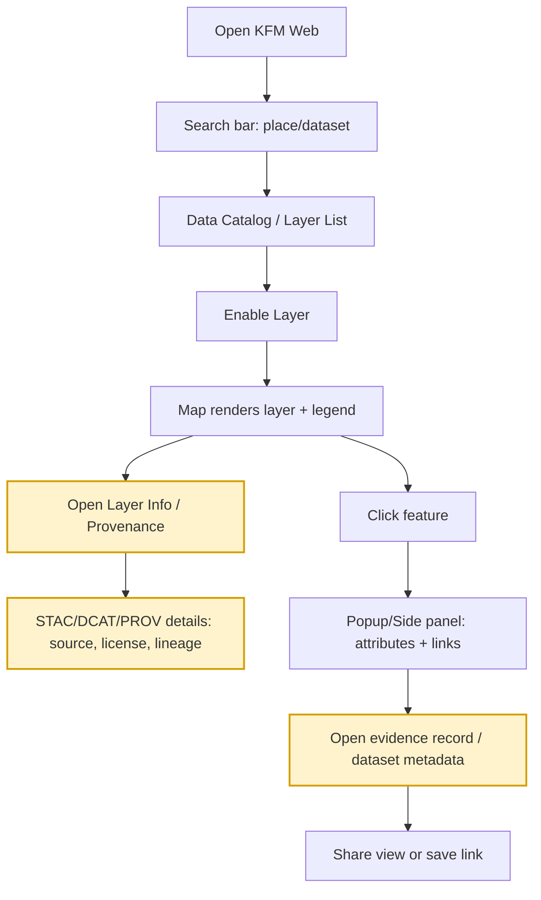
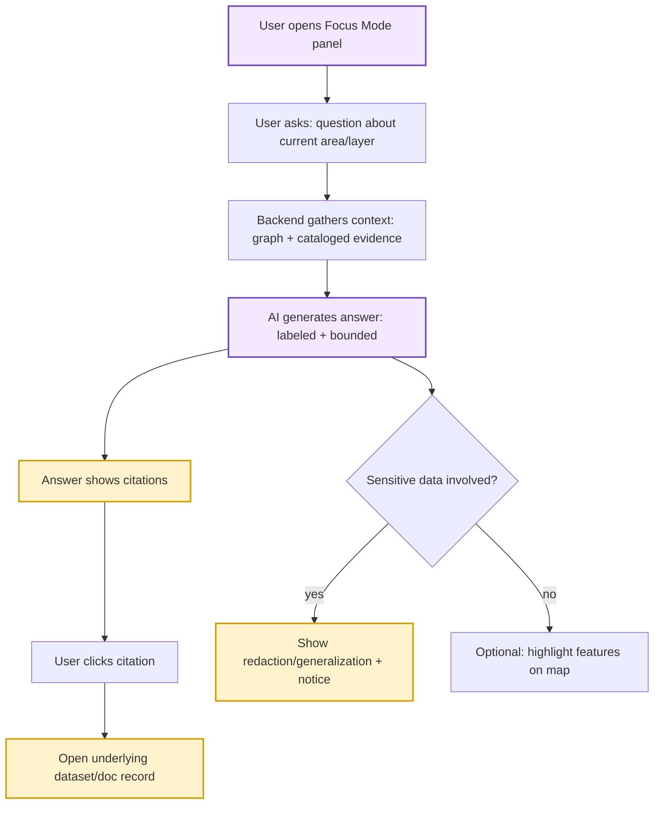

# 🧭 UI Flow Samples (KFM Web)


> [!NOTE]
> This folder contains **UX + QA flow artifacts** (diagrams, notes, and optional fixtures) used to plan, review, and test the KFM web experience.  
> They are **not** a runtime “flow engine”.

---

## 🔎 Quick links (from this folder)

> Paths assume the v13 repo layout. If your repo differs, adjust links here.

- 📜 **Canonical pipeline & repo rules (v13):** `../../../../../docs/MASTER_GUIDE_v13.md`
- 🧠 **Story Node authoring template:** `../../../../../docs/templates/TEMPLATE__STORY_NODE_V3.md`
- 🛡️ **Governance & sovereignty:** `../../../../../docs/governance/`
- 🗂️ **Schemas (UI + catalogs):** `../../../../../schemas/ui/` · `../../../../../schemas/stac/` · `../../../../../schemas/dcat/` · `../../../../../schemas/prov/`
- 🗺️ **Web app surfaces:** `../../../../views/` · `../../../../components/` · `../../../../viewers/`

---

## 🎯 What belongs in `web/assets/samples/ui/flows/`

**Use this folder when you need a shared, version-controlled UX artifact** that:
- clarifies a user journey 🧑‍🚀
- captures trust/provenance gates 🧾
- becomes an acceptance checklist ✅
- maps cleanly to a page/component + (optionally) an E2E test 🧪

Typical artifacts:
- ✅ `flow.mmd` or `flow.md` containing a Mermaid diagram
- ✅ exported diagram assets (`flow.svg`, `flow.png`) for slide decks/docs
- ✅ short narrative notes (`notes.md`) with edge cases, a11y, and guardrails
- ✅ (optional) `flow.meta.json` for indexing & review gates

---

## 🗂️ Suggested structure

```text
📁 web/
  📁 assets/
    📁 samples/
      📁 ui/
        📁 flows/
          📄 README.md
          📁 _templates/
          │  ├─ 📄 flow.mmd
          │  ├─ 📄 notes.md
          │  └─ 📄 flow.meta.json
          📁 map-explore_provenance/
          │  ├─ 📄 flow.mmd
          │  ├─ 🖼️ flow.svg
          │  └─ 📄 notes.md
          📁 story-mode_guided-tour/
          │  ├─ 📄 flow.mmd
          │  ├─ 🖼️ flow.svg
          │  └─ 📄 notes.md
          📁 focus-mode_qna_with-citations/
             ├─ 📄 flow.mmd
             ├─ 🖼️ flow.svg
             └─ 📄 notes.md
```

> [!TIP]
> Prefer **Mermaid-first** for diffable reviews. Export to SVG/PNG only when needed (presentations, docs, etc.).

---

## 🧠 Non‑negotiables these flows must respect

### 1) 🧾 Provenance-first UI (no “mystery layers”)
Any flow that surfaces data must include a **user-visible provenance affordance**:
- a layer info panel / legend “ⓘ” that points to source + license + lineage
- a feature popup that links back to catalog records (STAC/DCAT/PROV)
- citations where narrative/AI appears

> [!IMPORTANT]
> If it can’t be traced, it shouldn’t ship to the UI.

### 2) 🎬 Story Mode is **Markdown + JSON-driven**
When documenting Story Mode flows, assume:
- narrative content is authored in **Markdown**
- step-wise map changes (layers/camera/time) are driven by a **JSON config**
- controls exist for next/prev (or scroll), and users can exit to free explore

### 3) 🧠 Focus Mode is **opt‑in** and **labeled**
Focus Mode flows must show:
- explicit user action to enter Focus Mode (toggle/button)
- AI output clearly labeled as AI-generated (and ideally confidence/uncertainty)
- citations users can click to drill into evidence
- sensitivity & redaction behavior where applicable (no side-channel leaks)

### 4) 🧑‍🦽 Responsive + accessible by default
Every flow should include at least one note about:
- keyboard navigation (focus order, shortcuts)
- screen-reader labeling for icons (layer info, citations, etc.)
- mobile behavior (panel stacking, map interactions, reduced clutter)

---

## 🧬 Canonical pipeline context (why “trust gates” appear in flows)



> [!NOTE]
> UI flows live at the **UI/Story/Focus** end of the pipeline, but must reference upstream evidence artifacts (catalog + graph) rather than introducing new unsourced content.

---

## ✅ Flow quality checklist (copy into each `notes.md`)

**Entry & exit**
- [ ] Clear entry point (URL/screen + state)
- [ ] Clear exit (back, close panel, “exit story”, etc.)
- [ ] Deep-linking story (what happens on refresh / share link)

**Provenance & trust**
- [ ] Every surfaced dataset has an **Info/Provenance** interaction
- [ ] Citations are **clickable** and lead to the underlying record
- [ ] “No mystery layers” respected (no unlabeled overlays)

**Sensitivity & governance**
- [ ] Sensitive locations handled (generalize/omit/redaction notice)
- [ ] “No downstream loosening” is reflected (restricted data stays restricted)

**AI (if involved)**
- [ ] AI is opt-in (never auto-inserted)
- [ ] AI output is labeled, bounded, and cited
- [ ] If uncertain: shows uncertainty/confidence rather than inventing detail

**UX basics**
- [ ] Responsive behavior documented (desktop/tablet/mobile)
- [ ] A11y notes included (keyboard + SR)
- [ ] Error states included (empty results, missing tiles, offline, etc.)

---

## 🧾 Flow metadata template (optional)

Create `flow.meta.json` next to `flow.mmd` if you want indexing + review gates.

```json
{
  "id": "ui.flow.focus-mode.qna-with-citations",
  "title": "Focus Mode Q&A with citations",
  "personas": ["researcher", "educator", "student"],
  "primary_surfaces": ["MapPage", "FocusModePanel", "FeaturePopup", "DatasetDetails"],
  "trust_gates": ["catalog_provenance", "ai_opt_in", "sensitivity_redaction"],
  "related_paths": [
    "web/views/",
    "web/viewers/",
    "docs/reports/story_nodes/"
  ],
  "status": "draft",
  "last_reviewed": "YYYY-MM-DD"
}
```

---

## 🧪 Example flows (starter set)

### 1) 🗺️ Explore → Enable Layer → Verify Provenance → Drill into Feature



**Notes to capture**
- what happens if the layer is time-aware (timeline slider present?)
- how legends & classifications are shown (especially for choropleths)
- empty/slow tiles behavior + loading states

---

### 2) 🎬 Story Mode → Guided Tour → Exit to Free Explore

```mermaid
flowchart TD
  A[Open Story Library] --> B[Select Story]
  B --> C[Story Panel opens (Markdown narrative)]
  C --> D[Step 1 applied: layers/camera/time from JSON]
  D --> E[User: Next]
  E --> F[Step N applied: new map state + narrative]
  F --> G[User clicks a citation]
  G --> H[Evidence opens (dataset/doc metadata)]
  F --> I[Exit Story Mode]
  I --> J[Free explore continues with current map state]
  
  classDef story fill:#e6fffa,stroke:#0f766e,stroke-width:2px;
  class C,D,F story;
```

**Notes to capture**
- citation rendering (footnotes vs inline) and link destinations  
- how the map highlights features during a story (flash/outline/arrow)  
- accessibility: next/prev focus order + “exit story” always available  

---

### 3) 🧠 Focus Mode → Ask Question → AI Answer (labeled) → Click Citations



**Notes to capture**
- how “context selection” works (selected feature? active layer? map bbox?)
- copy/share of answers (and how citations travel with it)
- error states: “no evidence found”, “restricted”, “offline”, “timeout”

---

## 🧩 Mapping flows to implementation surfaces

Use this section as a shared vocabulary when reviewing flows:

- 🗺️ **Map viewer:** `web/viewers/` (MapLibre/Cesium integration)
- 🧱 **Reusable UI pieces:** `web/components/` (layer toggles, popups, legends, charts)
- 🧩 **Pages / screens:** `web/views/` (e.g., MapPage, DataCatalogPage, StoryPage)
- 🎬 **Story content (governed):** `docs/reports/story_nodes/` (draft vs published)
- 🧾 **Catalog records (evidence):** `data/stac/` · `data/catalog/dcat/` · `data/prov/`

---

## 🧪 E2E test alignment (recommended)

> [!TIP]
> Every “critical” flow should either become (a) an E2E test, or (b) a manual QA script with stable steps.

Suggested E2E candidates:
- ✅ load app → search → enable layer → verify map render
- ✅ click feature → see details → open provenance
- ✅ open story → step through without errors → exit story
- ✅ open Focus Mode → ask → receive labeled answer + citations → open citation

---

## 🧷 Contributing a new flow

1) 📁 Create a folder: `web/assets/samples/ui/flows/<slug>/`  
2) 🧠 Start from the template in `_templates/`  
3) 🧾 Add at least one explicit **provenance gate** in the flow  
4) 🧑‍🦽 Add at least one **a11y note** in `notes.md`  
5) ✅ Update the “Example flows” list (or add a “Flow index” section below)

---

## 🧾 Flow index (optional, recommended as this folder grows)

Add rows as new flows land:

| ID | Flow folder | Primary surfaces | Trust gates | Status |
|---|---|---|---|---|
| ui.flow.map.explore-provenance | `map-explore_provenance/` | Map + Catalog + Popup | provenance | draft |
| ui.flow.story.guided-tour | `story-mode_guided-tour/` | Story panel + Map | provenance + citations | draft |
| ui.flow.focus-mode.qna-with-citations | `focus-mode_qna_with-citations/` | Focus Mode + Evidence | opt-in AI + citations + redaction | draft |

---

<details>
<summary>📚 Design reminders (keep these in mind when drawing flows)</summary>

- Every time the UI shows data, the user must be able to discover **source, license, and lineage** (STAC/DCAT/PROV).
- Story steps should be deterministic (Markdown narrative + JSON map instructions).
- Focus Mode must never “invent” unsourced content; it should be bounded by catalog/graph evidence, and clearly labeled when AI is involved.
- Sensitive geographies require explicit redaction/generalization behavior in the UI.

</details>
