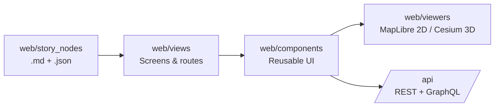

# 🧩 `web/components` — Reusable UI Building Blocks


Reusable components for the KFM Web UI: **maps + layers**, **timeline navigation**, **story playback**, and **Focus Mode** interfaces.

> [!IMPORTANT]
> **Provenance-first UI:** if users can *see* it, they should be able to discover **what it is** and **where it came from**. 🧾🗺️  
> Components in this folder are expected to make “the map behind the map” visible (sources, metadata, sensitivity, citations) instead of treating the UI as a black box.

---

## 🎯 What belongs in `web/components`

✅ Put it here if it’s a **reusable** UI building block (used in multiple screens), such as:

- Buttons, menus, dialogs, form controls
- Layer controls (toggle, opacity, legend blocks)
- Search widgets (input + results list + filters)
- Timeline widgets (slider, event markers, playback controls)
- Data preview cards, metadata panels, citation blocks
- Story controls (stepper, progress, narrative panel UI)
- Focus Mode UI shells (prompt, answer view, citations list, disclaimers)

🚫 Don’t put these here:

- **Page/screen** components → `web/views/`
- **Map engine integration** (MapLibre/Cesium state + rendering logic) → `web/viewers/`
- **Story content** (Markdown/JSON story data) → `web/story_nodes/`

---

## 🧭 Quick “where does this go?” decision tree

- Is it a **route/page**? → `web/views/` 🧭
- Is it **MapLibre/Cesium rendering + engine orchestration**? → `web/viewers/` 🌍
- Is it **story content** (markdown/json)? → `web/story_nodes/` 🎬
- Is it a **reusable UI block**? → `web/components/` 🧩

---

## 🗺️ How components fit into the Web UI



---

## 🗂️ Recommended folder layout

> This is a *recommended* organization. If the repo already has a different structure, follow the existing convention and document it here.

```text
web/
└─ 🧩 components/
   ├─ 🎛️ ui/            # 🎛️ Atoms: Button, Select, Dialog, Tooltip, Tabs (low-level, reusable primitives)
   ├─ 🧱 layout/         # 🧱 Layout primitives: panels, split views, drawers, headers (page scaffolding)
   ├─ 🗺️ map/            # 🗺️ Map UI: layer list, legend blocks, feature popups, basemap toggle
   ├─ ⏳ time/           # ⏳ Time controls: timeline slider, event markers, play/pause, scrub interactions
   ├─ 🎬 story/          # 🎬 Story UI: stepper, narrative panel, rich media/story blocks
   ├─ 🔎 focus/          # 🔎 Focus Mode UI: evidence-first chat, citations list, confidence/limits banners
   ├─ 🧾 provenance/     # 🧾 Provenance UI: attribution badges, source cards, citation renderer
   ├─ 🗂️ data/           # 🗂️ Data catalog UI: dataset cards, metadata views, filters/search facets
   ├─ 📈 charts/         # 📈 Chart UI: timeseries, histograms, small multiples, sparklines
   └─ 💬 feedback/       # 💬 Feedback UX: toasts, status banners, loading/error boundaries
```

**Naming conventions**
- Components: `PascalCase.tsx` ✅
- Hooks: `useSomething.ts` ✅
- Tests: colocated `Component.test.tsx` or `__tests__/` ✅
- Avoid “junk drawers” like `components/misc/` unless there’s a clear lifecycle plan 🧹

---

## 🧾 Provenance UX contract (non-negotiables)

When a component **renders data** (map layer, chart, table, story claim, AI answer), it should be able to surface:

- **Source / owner** (who produced it)
- **Dataset identifier** (stable id used by the API)
- **License / usage constraints** (when applicable)
- **Sensitivity / redaction** status (when applicable)
- **Citations** (especially for chart captions + narrative claims)

Suggested building blocks (names are examples):
- `ProvenanceBadge` 🧾
- `SourceCard` 🗂️
- `CitationList` 🔗
- `SensitivityWarning` ⚠️
- `AttributionLine` 🧩

> [!TIP]
> A good default: if a layer is visible, users should be one click away from a panel that answers:
> **“What dataset is this?”** + **“Who published it?”** + **“What time range does it represent?”** + **“Any restrictions?”**

---

## 🧷 Sensitive data & redaction

Some datasets may be intentionally **generalized** (e.g., coarse geometry instead of exact points) or access-controlled.

**Components must:**
- Respect sensitivity flags coming from the API (hide, blur, generalize, warn) 🛡️
- Avoid UI flows that “accidentally reveal” exact coordinates (tooltips, copy-to-clipboard, deep zoom, debug overlays) 🔒
- Provide clear user-facing messaging when redaction is active (so it doesn’t look like a bug) ✅

---

## ⏳ Time-aware UI components

KFM treats time as a first-class navigation axis.

**Time-aware layers/components should:**
- Accept a `timeContext` (e.g., selected year/date range) and re-render deterministically
- Make the time state visible in the UI (label, tick marks, event markers)
- Support “temporal storytelling” patterns:
  - scrub → compare → step through → annotate

Suggested components (names are examples):
- `TimelineSlider` ⏳
- `TimelineEventMarkers` 📌
- `TimeRangePill` 🗓️
- `PlaybackControls` ▶️⏸️

---

## 🎬 Story Node UI components

Story Nodes are **narrative + configuration** that drive the map state over a sequence of steps.

Component responsibilities:
- Render narrative safely (markdown, media, captions)
- Provide step navigation (next/prev, progress, deep-linking)
- Sync with the map viewer state (zoom, layer visibility, time position)
- Keep provenance visible inside stories (citations in-line or in a “sources” drawer)

Suggested components (names are examples):
- `StoryPanel` 🎬
- `StoryStepper` 🪜
- `StoryMediaBlock` 🖼️
- `StorySourcesDrawer` 🧾

---

## 🔎 Focus Mode UI components

Focus Mode outputs must be:
- Clearly labeled as AI-generated (not curated fact) 🏷️
- Citation-backed where possible 🧾
- Explicit about uncertainty / missing info (no bluffing) 🚫🎭

Suggested components (names are examples):
- `FocusPromptBox` 💬
- `FocusAnswerCard` 🧠
- `FocusCitations` 🔗
- `FocusSafetyBanner` 🛡️

---

## 🔌 Data access rules (contract-first)

Components should not be “data free-for-alls”.

**Do:**
- Fetch via the **API** using typed clients (REST/GraphQL)
- Treat API responses as contracts (validate + handle errors)
- Keep data fetching in container components/hooks when possible (presentation components stay pure)

**Don’t:**
- Reach into database/graph layers directly from the UI
- Embed “mystery data” without provenance identifiers

---

## ♿ Accessibility & responsiveness

All components should be usable:
- on desktop + tablet/phone layouts 📱💻
- with keyboard navigation ⌨️
- with screen readers (labels, roles, aria where needed) 🗣️

Baseline expectations:
- Focus management for dialogs/menus
- Visible focus rings (don’t remove them)
- Color is never the only channel for meaning

---

## 🧪 Testing expectations

Minimum viable:
- Unit tests for deterministic UI logic ✅
- Interaction tests for components that manage state (layer toggles, timeline scrub, story stepper) 🧪
- Snapshot tests only when they provide signal (avoid “brittle snapshot spam”) 🧊

High-value integration tests:
- Story step changes → viewer state updates 🎬➡️🗺️
- Timeline change → time-aware layer updates ⏳➡️🗺️
- Sensitivity flag → redaction UI behavior ⚠️➡️🛡️

---

## ✅ PR checklist for new components

- [ ] Reusable across views (or intentionally local, documented) 🧩
- [ ] Provenance surfaced for data visualizations 🧾
- [ ] Respects sensitivity/redaction rules 🛡️
- [ ] Keyboard accessible & responsive ♿📱
- [ ] Error/loading states included 💬
- [ ] Tests added (or justified) 🧪
- [ ] Exported cleanly (no circular deps) 🔁

---

## 🔗 Related folders

- `../views/` 🧭 — screens/pages
- `../viewers/` 🌍 — MapLibre/Cesium engines
- `../story_nodes/` 🎬 — story content (`.md` + `.json`)
- `../styles/` 🎨 — global styling and tokens
- `../assets/` 🖼️ — icons/images

---

## 🧠 Glossary (tiny but useful)

- **Provenance**: “Where did this come from?” (source + metadata + license + constraints) 🧾  
- **Layer**: A map overlay (vector/raster/tiles) with styling and interaction 🗺️  
- **Story Node**: A guided narrative step sequence controlling map + text 🎬  
- **Focus Mode**: AI-assisted Q&A constrained by KFM data + citations 🔎  

---
