# 📊 Charts (`web/components/charts`)


Reusable chart components for the **Kansas Frontier Matrix (KFM)** web app. Charts are a core UI primitive in KFM: users can interact with a timeline slider and open pop-ups/side panels to see detailed information (including charts) when clicking map features.[^ui_charts]

> [!IMPORTANT]
> **Charts are not “just visuals.”** In KFM, anything shown in the UI must be **traceable to cataloged sources** with **provable processing** (no “mystery” data).[^contracts][^invariants]

---

## 🧭 What this folder is for

KFM’s `web/` frontend (a React SPA) contains reusable UI components, including **charts**.[^components_charts]  
These chart components should be:

- ✅ **Provenance-first** (built-in citations + metadata panels)  
- ✅ **Contract-first** (render from validated dataset/analysis contracts)  
- ✅ **Map-aware** (optionally sync with map interactions + timeline filtering)  
- ✅ **Accessible + responsive** (works across desktop/tablet/phone layouts)[^responsive_a11y]

---

## 📚 Why charts matter in KFM

KFM’s mission is to make Kansas’s spatial truth **searchable, mappable, auditable, and modelable**. The platform emphasizes **provenance-first principles** where citations and metadata are first-class data and the UI lets users inspect sources.[^provenance]

Charts are one of the clearest places to *earn trust*:
- A chart should never be a “black box screenshot.”
- A chart should always be accompanied by:
  - **What dataset is this?**
  - **Where did it come from?**
  - **What transformations produced it?**
  - **What timeframe / spatial scope / “as-of” timestamp applies?**

---

## 📦 Folder map

```text
web/
└─ 📁 components/
   └─ 📊 charts/
      ├─ 📄 README.md   👈 you are here 📌 Chart component conventions, props, a11y, and theming rules
      └─ 📊🧩 …          # Chart components live here (e.g., TimeseriesChart.tsx, HistogramChart.tsx, Sparkline.tsx)
```

> [!NOTE]
> KFM documentation explicitly calls out `web/components/` as the home for reusable UI parts, including charts.[^components_charts]

---

## ✅ KFM invariants (non‑negotiable)

These aren’t preferences — they’re **guardrails**.

### 1) Pipeline ordering is absolute 🧱
KFM’s canonical pipeline is **ETL → Catalogs (STAC/DCAT/PROV) → Graph → API → UI → Story Nodes → Focus Mode** and cannot be bypassed.[^invariants]

**Implication for charts:**  
A chart must not render data that didn’t come through the governed pipeline (or at minimum, the governed API outputs).

### 2) API boundary rule 🔌
The frontend UI **must not query Neo4j directly**; it must go through the governed API layer.[^invariants]

**Implication for charts:**  
Charts should receive data via:
- API responses (preferred), or
- a typed client/service that calls the API (still acceptable),
- never direct graph DB calls.

### 3) Provenance first 🧾
All published data must be registered with provenance before graph/UI use.[^invariants]

**Implication for charts:**  
Every chart render should be able to point to at least one of:
- STAC Collection/Item IDs,
- DCAT dataset entry,
- PROV lineage bundle/activity,
- the dataset contract ID.

### 4) Evidence-first narrative 🧠
No unsourced narrative content is allowed in Story Nodes or Focus Mode; claims must cite evidence.[^invariants]

**Implication for charts:**  
If a chart includes interpretation (trend labels, anomaly flags, “this is unusual”), those labels must be either:
- purely descriptive of the data,
- or backed by an evidence artifact (see below).

---

## 🧩 Recommended architecture: “Chart = View + Contract + Provenance”

A healthy chart component set usually has:

- **Primitives** (axes, tick formatting, tooltips, legends, brush/zoom UI)
- **Composed charts** (line, bar, scatter, histogram, heatmap, timeline)
- **Domain charts** (weather station timeseries, drought index trend, event counts)
- **Evidence panels** (sources, licenses, methods, PROV/STAC/DCAT links)

This matches KFM’s rule that anything visible in UI must be traceable and contract-driven.[^contracts][^provenance]

---

## 🧾 Data inputs: use contract-first “ChartSpec”

KFM treats datasets as contract-described entities (source, license, spatial/temporal extent, processing steps, etc.).[^contracts][^contract_example]  
Charts should follow the same spirit: **typed chart inputs + provenance refs**.

<details>
<summary><strong>📌 Suggested TypeScript contract: <code>ChartSpec</code></strong></summary>

```ts
/** Minimal citation target (prefer stable IDs that map to STAC/DCAT/PROV). */
export type CitationRef = {
  id: string;           // e.g. "dcat:dataset:air_quality_epa_pm25_v1"
  label?: string;       // human label
  url?: string;         // optional external URL (if allowed/needed)
};

/** “Where did this chart come from?” */
export type ProvenanceRef = {
  datasetId: string;    // KFM dataset/contract id
  stac?: { collection?: string; items?: string[] };
  dcat?: { dataset?: string };
  prov?: { bundle?: string; activity?: string };

  /** Snapshot context (important for “living” datasets that evolve). */
  asOf?: string;        // ISO timestamp
  timeRange?: { start: string; end: string };

  license?: string;
  attribution?: string; // creator/org
  citations: CitationRef[];
};

/** One plotted series. */
export type SeriesPoint = { x: number | string | Date; y: number | null };
export type Series = {
  id: string;
  label: string;
  unit?: string;
  data: SeriesPoint[];
  /** Optional uncertainty (e.g., CI bands, std dev). */
  uncertainty?: {
    kind: "ci95" | "stddev" | "stderr" | "range";
    lower: SeriesPoint[];
    upper: SeriesPoint[];
  };
};

export type ChartSpec = {
  title: string;
  description?: string;

  kind:
    | "line"
    | "bar"
    | "scatter"
    | "histogram"
    | "area"
    | "heatmap"
    | "timeline";

  x: { label: string; type: "time" | "linear" | "ordinal"; unit?: string };
  y: { label: string; type: "linear" | "log"; unit?: string };

  series: Series[];
  provenance: ProvenanceRef;

  interactions?: {
    brush?: boolean;        // select range
    crosshair?: boolean;    // hover inspection
    clickToMap?: boolean;   // click point => map highlight
  };

  accessibility?: {
    ariaLabel?: string;
    tableFallback?: boolean; // show data table under chart or via toggle
  };
};
```

</details>

### 🕰️ “As-of” matters (datasets evolve)
Some datasets can change over time (even their counts), so always treat the UI as presenting a **snapshot**.[^datasets_change]  
If a chart’s data is generated from a changing source, set `provenance.asOf`.

---

## 🔁 Data flow (recommended)

```mermaid
flowchart LR
  A["🌐 API response<br/>(data + contract refs)"] --> B["📊 ChartSpec"]
  B --> C["🧩 Chart Component"]
  C --> D["👤 User Interaction<br/>hover / brush / click"]
  D --> E["🗺️ Map + Timeline Sync<br/>(optional)"]
  C --> F["🧾 Sources & Methods Panel<br/>(STAC/DCAT/PROV)"]
```



KFM’s architecture is designed so the UI consumes governed outputs and remains auditable.[^invariants][^contracts]

---

## 🗺️ Map & timeline integration patterns

KFM’s UI includes a **timeline slider** for temporal navigation, and map feature pop-ups/side panels can show charts (e.g., weather station charts).[^ui_charts]

Recommended integration patterns:

### Pattern A: Brush-to-timeline
- User brushes a time window in a chart
- App updates global timeline state
- Map filters layers to that temporal window

### Pattern B: Click-to-feature highlight
- User clicks a point/bar
- App highlights corresponding event/location on the map
- Optional: open a feature panel with metadata + citations

> [!TIP]
> If your chart triggers map changes, log that interaction as UI state — but don’t “compute new truth” client-side. Analysis outputs belong in pipeline artifacts (next section).[^evidence_artifacts]

---

## 🧠 Analysis outputs & “evidence artifacts”

KFM treats analysis/AI outputs as first-class datasets that must be stored, cataloged (STAC/DCAT), traced (PROV), and served through the API — not improvised in the UI.[^evidence_artifacts]

**Rule of thumb:**  
If a chart needs *derived data* (trend lines, anomaly detection, model simulations), those results should be:
- produced in a pipeline job,
- written to `data/processed/...`,
- cataloged and traced,
- then rendered by the UI as a governed artifact.

This keeps charts **auditable** and aligns with KFM’s contract/provenance requirements.[^contracts][^evidence_artifacts]

---

## ♿ Accessibility & responsiveness

KFM’s web app is designed to be **responsive and accessible**.[^responsive_a11y]

Chart components should aim for:

- ⌨️ Keyboard navigation (focusable points, brush handles, legend toggles)
- 🗣️ Screen-reader support (meaningful `aria-label`, summarized insights)
- 🎨 Don’t rely solely on color (patterns, markers, labels, legend clarity)
- 🧾 Table fallback (exportable/copyable data for verification)
- 🧭 Clear units, scales, and missing-data handling

> [!NOTE]
> Any “insight text” rendered alongside charts should follow the same evidence-first discipline used in Story Nodes/Focus Mode.[^invariants]

---

## ⚡ Performance expectations

KFM’s backend delegates heavy processing to pipelines/workers, keeping the UI focused on rendering and interaction.[^backend_stateless]

Chart guidance:
- Prefer pre-aggregated series (monthly summaries vs raw per-second data) for general UI use.
- Downsample safely (and disclose it in “Methods”).
- Avoid expensive transforms in render loops.
- Treat charts as *views* over governed data, not an analytics engine.

---

## 🧪 Testing & quality checklist

When adding/updating a chart component, verify:

- [ ] **Contract-first**: chart input is typed + validated at boundaries  
- [ ] **Provenance-first**: chart can render sources/metadata panel  
- [ ] **API boundary**: no direct graph access from chart code  
- [ ] **A11y**: keyboard + aria labels + table fallback  
- [ ] **Missing data**: nulls, gaps, uneven intervals handled gracefully  
- [ ] **Deterministic rendering**: same input → same visual output

---

## 🛠️ Adding a new chart (workflow)

1) **Define the need**
- Is this a general chart type (line/bar/scatter), or domain-specific?

2) **Define the contract**
- Create/extend a `ChartSpec`-like input type.
- Ensure it includes provenance references (dataset contract + citations).

3) **Ensure governed data exists**
- If it’s derived/AI output, publish it as an evidence artifact (STAC/DCAT/PROV + API).[^evidence_artifacts]

4) **Implement component**
- Keep domain logic out; focus on rendering and interaction.

5) **Hook into UI**
- Integrate with map panels / popups / Focus Mode as needed.[^ui_charts]

---

## 🔗 Related docs & sources

- KFM UI and web folder structure, including `components/` housing charts.[^components_charts]  
- KFM’s provenance-first mission and “no black box” UI expectations.[^provenance]  
- KFM v13 pipeline invariants (ordering, API boundary, provenance-first, evidence-first narrative).[^invariants]  
- Dataset contracts and metadata richness (example contract JSON).[^contract_example]

---

## 📝 Footnotes (project grounding)

[^components_charts]: KFM documentation describes `web/` as the React frontend and `components/` as reusable UI elements including charts.:contentReference[oaicite:0]{index=0}

[^ui_charts]: KFM documentation describes a timeline slider for temporal navigation and pop-ups/side panels that can show charts when clicking map features (e.g., weather station).:contentReference[oaicite:1]{index=1}

[^responsive_a11y]: KFM documentation states the web app is designed to be responsive and accessible.:contentReference[oaicite:2]{index=2}

[^provenance]: KFM mission emphasizes provenance-first principles: map layers/datasets/AI answers traceable to sources; citations/metadata are first-class; UI allows inspecting references.:contentReference[oaicite:3]{index=3}

[^invariants]: KFM v13 guide lists key invariants: pipeline ordering is absolute; API boundary rule; provenance-first; evidence-first narrative (no unsourced claims).:contentReference[oaicite:4]{index=4}

[^contracts]: KFM documentation: anything shown in UI/Focus Mode must be traceable to cataloged sources; data uses STAC/DCAT/PROV; each dataset has a metadata JSON “data contract”; no “mystery layers.”:contentReference[oaicite:5]{index=5}

[^contract_example]: KFM documentation provides a simplified example of a dataset contract JSON with id/title/temporal/spatial/provenance fields (actual contracts are JSON).:contentReference[oaicite:6]{index=6}

[^backend_stateless]: KFM documentation notes the backend is designed to be stateless/replicable and heavy processing is delegated to background workers or pipeline jobs.:contentReference[oaicite:7]{index=7}

[^evidence_artifacts]: KFM v13 guide defines “evidence artifacts” (analysis/AI outputs) as first-class datasets requiring storage in processed data, cataloging in STAC/DCAT, tracing in PROV, and exposure via governed APIs (no hard-coding into UI).:contentReference[oaicite:8]{index=8}

[^datasets_change]: Example from remote sensing workflows: dataset contents/counts can change over time (“your total number of images may be different, as the dataset changes over time”), motivating “as-of” timestamping in UI displays.:contentReference[oaicite:9]{index=9}
