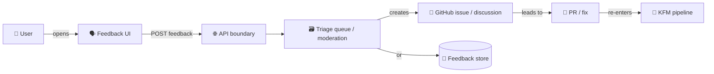

# 🗣️ Feedback Component (web/components/feedback)


> **Purpose:** Provide a safe, context-rich way for users to report issues, suggest improvements, and leave notes about **datasets, map layers, Story Nodes, and Focus Mode**—without bypassing KFM’s evidence-first / provenance-first gates.

---

## 🧭 Why this exists

Kansas Frontier Matrix (KFM) is built around trust: **everything in the UI should be traceable to governed evidence**, and sensitive information must not leak through “side-channels” like UI telemetry or free-form text input.

This `feedback/` component is the **single reusable UI building block** for:
- ✅ “Report an issue” on a dataset, layer, or story
- ✅ “Suggest an improvement” / feature request
- ✅ “This looks wrong” (data quality / metadata mismatch / timeline confusion)
- ✅ “Focus Mode feedback” (citations missing, confusion, incorrect link, etc.)
- ✅ Community signals (lightweight *upvote* / *interest* if enabled)

…and for ensuring we **don’t** accidentally:
- ❌ accept user input as “new evidence”
- ❌ reveal sensitive coordinates or restricted locations
- ❌ create public security-vulnerability tickets

---

## ✨ Key behaviors

### ✅ Context-first, friction-light
When a user submits feedback, it should automatically include the minimum useful context:
- current route/page
- selected dataset/story/layer identifiers (when applicable)
- map state (zoom, viewport bounds) **in redacted form**
- timeline state (current range)
- client metadata (app version, browser info)
- optional screenshot / attachment (**opt-in**)

### ✅ Pipeline-safe
User feedback is **not evidence**. It is *input* that must be triaged and (if adopted) routed back through:
- data pipeline → catalogs → graph → API → UI → Story Nodes → Focus Mode

### ✅ Governance-aware
For any user-entered locations or entity references:
- apply redaction + classification rules
- avoid storing precise coordinates by default
- enforce “no output less restricted than inputs” mindset

---

## 🧱 Component anatomy

Recommended structure (keep this folder self-contained):

```text
web/
  components/
    feedback/
      📄 README.md
      🧩 FeedbackButton.tsx
      🧩 FeedbackModal.tsx
      🧩 FeedbackForm.tsx
      🪝 useFeedbackContext.ts
      🧾 feedback.types.ts
      🔧 feedback.redaction.ts
      ✅ feedback.test.tsx
```

> If your implementation differs, that’s fine—**but keep the public API stable** and update this README.

---

## 🧩 Public API (recommended)

### `FeedbackButton`
A small button/trigger that opens the feedback UI with pre-filled context.

```tsx
import { FeedbackButton } from "@/web/components/feedback/FeedbackButton";

<FeedbackButton
  subject={{
    kind: "dataset",
    id: datasetId,
    label: datasetTitle,
  }}
/>
```

### `FeedbackModal` / `FeedbackForm`
For embedding directly in custom flows (e.g., inside a dataset sidebar panel).

```tsx
import { FeedbackModal } from "@/web/components/feedback/FeedbackModal";

<FeedbackModal
  open={open}
  onOpenChange={setOpen}
  subject={{ kind: "story", id: storyNodeId, label: storyTitle }}
/>
```

---

## 🧾 Data model

Use a single payload shape across the app (so the backend and governance logic stays consistent).

```ts
// feedback.types.ts
export type FeedbackKind =
  | "bug"
  | "data_quality"
  | "ux"
  | "feature_request"
  | "focus_mode"
  | "other";

export type FeedbackSubject =
  | { kind: "global" }
  | { kind: "dataset"; id: string; label?: string }
  | { kind: "layer"; id: string; label?: string }
  | { kind: "story"; id: string; label?: string }
  | { kind: "entity"; id: string; label?: string };

export type FeedbackPayload = {
  kind: FeedbackKind;
  subject: FeedbackSubject;

  // Free-form user text (treated as untrusted input)
  message: string;

  // Optional, structured fields (better than pure text)
  severity?: "low" | "medium" | "high";
  expected?: string;
  actual?: string;
  reproductionSteps?: string[];

  // App context (automatically captured)
  context: {
    route: string;
    appVersion?: string;
    buildSha?: string;

    // Map/timeline context (redacted/sanitized!)
    timeline?: { startISO?: string; endISO?: string };
    map?: {
      // Prefer coarse bbox or tiling index over raw coords.
      bboxApprox?: [number, number, number, number];
      zoom?: number;
      viewportHash?: string; // optional stable hash of a redacted view
    };

    // Optional Focus Mode context
    focusMode?: {
      storyNodeId?: string;
      questionId?: string; // if Q&A is modeled
      citedRecordIds?: string[]; // catalog/graph IDs (not raw URLs)
    };
  };

  // Governance/safety
  sensitivity: {
    userDeclared?: "public" | "possibly_sensitive";
    autoFlags?: string[]; // e.g. ["mentions_indigenous_site", "contains_coordinates"]
  };

  // If authenticated
  user?: {
    id?: string;
    role?: "public" | "contributor" | "admin";
  };
};
```

---

## 🔁 Data flow & integration points

### Minimal flow


### Contract-first rule (important)
If you add or change feedback submission:
- define the API contract first (OpenAPI/GraphQL under `src/server/contracts/`)
- include tests + redaction rules when sensitive
- only then wire the UI to the endpoint

> The UI **must not** directly query internal graph stores; it must go through governed APIs.

---

## 🧼 Redaction & sensitivity safeguards

### 🚫 “No sensitive location leaks” (UI is a potential side-channel)
Feedback often captures map/timeline context. That context must be **safe by default**.

**Do:**
- ✅ store approximate bounding boxes (coarse precision)
- ✅ store generalized region descriptors (county, quad, grid cell) if available
- ✅ allow a “strip location context” toggle (on by default for Focus Mode)
- ✅ detect coordinate-like strings and prompt users to remove them

**Don’t:**
- ❌ store precise cursor coordinates
- ❌ store raw clicked point unless explicitly permitted and policy allows
- ❌ auto-attach screenshots without opt-in (screenshots can reveal sensitive info)

### Suggested UI guardrails
- “**Please do not include sensitive locations** (e.g., protected cultural sites) or private information.”
- “If you’re reporting a map issue, we’ll attach a **generalized** view (not exact coordinates).”
- Checkbox: “Attach screenshot (optional)” ✅

---

## 🔒 Security reporting is not “feedback”

If a user is reporting a **security vulnerability**:
- do **not** create a public GitHub issue automatically
- direct them to the responsible disclosure process (private reporting channel / GitHub private reporting)

**Recommendation:** Add a “Security issue” choice that shows a warning and routes them to the correct channel.

---

## ♿ Accessibility checklist

Minimum requirements:
- keyboard navigation (open/close modal, submit, escape)
- visible focus states
- form labels bound to inputs
- `aria-describedby` for helper/error text
- respect `prefers-reduced-motion` (no aggressive animations)
- screen-reader friendly confirmation after submit

---

## ✅ Testing

Suggested coverage:
- **unit:** redaction utilities (bbox rounding, coordinate detection)
- **component:** open/close modal, validation, submit disabled states
- **integration:** payload includes required context fields and respects “strip location context”

Example test cases:
- “does not include raw coordinates when user types `38.123,-97.456`”
- “focus_mode feedback defaults to *not attaching* AI transcript”
- “security issue selection blocks GitHub issue creation path”

---

## 🧩 UX patterns (recommended)

<details>
  <summary><strong>“Feedback” vs “Report a problem” vs “Suggest”</strong></summary>

- Use **“Report a problem”** for bug/data-quality contexts
- Use **“Suggest an improvement”** for feature requests
- Use **“Feedback”** as the umbrella entry point in global nav

</details>

<details>
  <summary><strong>What users should see before submitting</strong></summary>

Show a short preview panel:
- Subject (dataset/story/layer)
- What’s being attached (route, timeline, generalized map view)
- Toggle switches for screenshot / include map context

</details>

---

## 🔗 Related docs (repo paths)

These are the canonical places to align behavior with KFM standards:

- `docs/MASTER_GUIDE_v13.md` (pipeline ordering, invariants, contract-first rules)
- `docs/governance/ROOT_GOVERNANCE.md`
- `docs/governance/ETHICS.md`
- `docs/governance/SOVEREIGNTY.md`
- `docs/templates/TEMPLATE__API_CONTRACT_EXTENSION.md`

---

## 🧰 Maintainer notes

### When to use this component
Use `feedback/` whenever a UI surface needs user input that could:
- signal a quality issue (data/story)
- propose an improvement
- report a UI bug
- comment on Focus Mode behavior

### When **not** to use it
Don’t use `feedback/` for:
- authentication / account recovery
- emergency reporting
- security vulnerabilities (route to private disclosure)

---

## 🗺️ TODOs / next hardening steps

- [ ] Add a redaction utility that converts bbox → “safe area token”
- [ ] Add “strip map context” toggle (default ON in Focus Mode)
- [ ] Add a moderation/triage path before publishing any community-visible comments
- [ ] Add rate limiting + spam controls server-side
- [ ] Add optional GitHub discussion/issue integration (per subject type)

---

🧡 **Design intent:** Encourage community participation while preserving KFM’s core promise: *no new narrative without sources, no data without provenance.*
