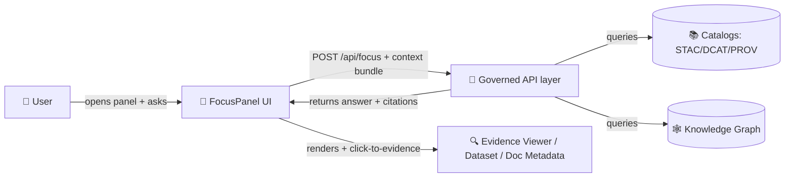

# 🧠 Focus Mode UI (`web/components/focus/`)

<p align="center">
  
  
  
  
  
</p>

> 🗺️ **Focus Mode** is the optional “AI Assistant” + evidence-first reading panel that sits beside the map/timeline (and Story Nodes).  
> It exists to help users ask questions *in context* and get answers that remain **clickable, traceable, and governed**.

---

## 📌 Quick map

```text
📁 web/
  📁 components/
    📁 focus/
      📄 README.md   👈 you are here
      📄 (Focus Mode UI components live here)
      📄 (Types + helpers that implement “hard gates” live here)
```

---

## ✨ What this folder is responsible for

### ✅ Core responsibilities
- 🧭 **Capture user context** (what’s on-screen / selected) and package it into a **Focus Context Bundle**.
- 💬 **Provide the Focus panel UI** (open/close, input, history, loading, errors).
- 🧾 **Render answers with citations** (sources must be visible + actionable).
- 🔍 **Enforce “hard gates” in UI** (no unsourced content reaches the user).
- 🛡️ **Respect redaction & sensitivity rules** (never leak restricted locations/attributes).

### 🚫 Non-goals
- 🤖 No autonomous actions (Focus never “does things” on the user’s behalf).
- 🧠 No freeform speculation outside governed data.
- 🕳️ No direct graph/database access from the browser (all reads go through the governed API).

---

## 🧱 Hard gates (non-negotiable) ✅

> [!IMPORTANT]
> If a feature in Focus Mode can’t **point to provenance**, it must **not render**.  
> The “no source, no show” rule is a *product requirement*, not a suggestion.

- [ ] **Provenance-only display**: nothing appears without a source/ID.
- [ ] **AI is opt-in + labeled**: AI help is user-triggered and clearly tagged.
- [ ] **Citations required**: every claim must link to evidence.
- [ ] **No sensitive location leaks**: generalize/blur/omit as required.
- [ ] **Refuse safely**: if evidence is missing or restricted, say so and offer next best steps.

---

## 🔁 Data flow (mental model)



---

## 🧩 Suggested component pieces

> [!NOTE]
> File names may differ in-code — this is the *intended* decomposition to keep behavior testable and guardrails enforceable.

| Piece | Purpose | “Must not break” rule |
|------|---------|------------------------|
| `FocusPanel` 🧠 | Shell: open/close, layout, focus trap | Never shows unsourced output |
| `FocusComposer` ✍️ | Input + context chips + submit | Submits only governed context |
| `FocusThread` 💬 | Message history (user + assistant) | Clearly labels AI vs. sourced text |
| `FocusAnswer` 🧾 | Renders answer blocks | Requires citations or displays “no sources” |
| `FocusCitations` 🔗 | Citation list + preview | Every citation must be actionable |
| `FocusContextBar` 🧭 | Shows current map/story context | Must match what was sent to API |
| `focusTypes.ts` 🧬 | Shared types + validation | Validates “hard gate” constraints |
| `focusGuards.ts` 🛡️ | UI-side policy checks | Centralized gating + test coverage |

---

## 🧭 Focus Context Bundle (recommended shape)

> The back-end needs enough context to stay grounded (selected feature, active layers, time cursor, etc.).  
> Keep this bundle **small**, **explicit**, and **serializable**.

```ts
// ✅ Recommended (adjust to the API contract / OpenAPI schema)
export type FocusContextBundle = {
  // Map context
  bbox?: [number, number, number, number]; // [minLon, minLat, maxLon, maxLat]
  zoom?: number;
  center?: [number, number]; // [lon, lat]

  // Timeline context
  time?: {
    fromYear?: number;
    toYear?: number;
    cursorYear?: number;
  };

  // Selection context
  selected?: {
    // Prefer stable IDs when possible
    featureId?: string;
    datasetId?: string;
    label?: string; // user-friendly display label
  };

  // Layer context (what’s “on”)
  activeLayerIds?: string[];

  // Story context (if in Story Mode / Story Node)
  story?: {
    storyId?: string;
    stepId?: string;
  };

  // Governance / sensitivity hints (UI may set these, API enforces them)
  sensitivity?: {
    redactionLevel?: "none" | "generalize" | "omit";
  };
};
```

---

## 🌐 API integration

### Endpoint
- `POST /api/focus` (Focus question + context → answer + citations)

### UI contract principles
- 📜 **Contract-first**: treat the OpenAPI schema as the source of truth.
- 🔒 **Governance-first**: the API enforces redaction; the UI **must not** attempt to bypass it.
- 🧾 **Citations are first-class**: the UI should not accept an “answer” without citations.

### Example request (UI-side)
```json
{
  "question": "How has agriculture changed here over time?",
  "feature": "Scott County",
  "context": "agriculture"
}
```

### Example response (UI-side, recommended)
```json
{
  "answer": "…",
  "citations": [
    {
      "id": "prov:…",
      "title": "KFM Events Database — Great Flood of 1951",
      "kind": "event|dataset|document",
      "href": "/…",
      "excerpt": "…",
      "confidence": 0.72
    }
  ],
  "confidence": 0.68,
  "aiGenerated": true
}
```

> [!TIP]
> **Render citations as UI objects**, not footnotes only. Clicking a citation should open its dataset/doc/event metadata view 🔍.

---

## 🧾 Rendering rules (answers + citations)

### ✅ Required UI behaviors
- 🏷️ **Label AI output** (“AI-generated summary”) whenever applicable.
- 🧷 **Show citations inline** *and* in a dedicated citation list.
- 🧭 **Preserve context**: show which selection/layers/time were used to answer.
- 🧑‍⚖️ **Refusal state**: if the system can’t answer from governed data, display:
  - “I don’t have evidence for that in KFM yet.”  
  - Suggest related queries *or* show what sources *do* exist.

### 🧯 Safe fallback states
- `NO_SOURCES` → explain why + offer “browse related datasets/events”.
- `REDACTED` → explain that precision is restricted + show generalized view.
- `API_ERROR` → show retry + “copy request ID” (if available).

---

## 🛡️ Security & governance notes

- 🧼 **Sanitize** any rendered Markdown/HTML in responses (defense-in-depth).
- 🕵️ **Never log sensitive context** in client telemetry (if present).
- 🧱 **No side channels**: Focus Mode must not reveal coordinates/attributes that are intentionally generalized elsewhere.
- 🔐 **Do not query internal stores directly from the client** — always go through the API boundary.

---

## 🧪 Testing checklist

### Unit tests (fast)
- [ ] “Hard gate” rejects responses without citations
- [ ] Redaction/generalization UI states render correctly
- [ ] Context bundle serialization is stable + minimal
- [ ] Citation click opens correct metadata route

### Integration tests (API mocked)
- [ ] “Selected feature + active layers” round-trips to request payload
- [ ] Error handling: timeout / 4xx / 5xx
- [ ] Accessibility: focus trap, keyboard nav, screen reader labels ♿

---

## ♿ Accessibility (a11y) requirements

- ⌨️ Full keyboard support (tab order, ESC closes panel, enter submits).
- 🔊 ARIA labels for panel, thread region, citations list, loading state.
- 🪟 Focus trap in modal/sidebar mode + restore focus on close.
- 📝 Avoid color-only meaning for AI labels / warning states.

---

## 🤝 Contributing notes

> [!IMPORTANT]
> Focus Mode is where users experience trust. Treat changes here like **governance changes**.

- Prefer **small PRs** with tests.
- Update **contracts first** (OpenAPI/schema) when changing request/response.
- Add/adjust **guard tests** any time output rendering rules change.

---

## 📚 References (project docs)
- 📘 **KFM Technical Documentation** (Focus Mode, API, front-end/back-end overview)
- 🧭 **Master Guide v13 / Markdown Guide** (pipeline ordering, provenance rules, Focus hard gates)
- 🗺️ **KFM Design / UX docs** (panel behaviors, map UI patterns)

> Add direct links to repo-local docs here once canonical paths are finalized 🧷
