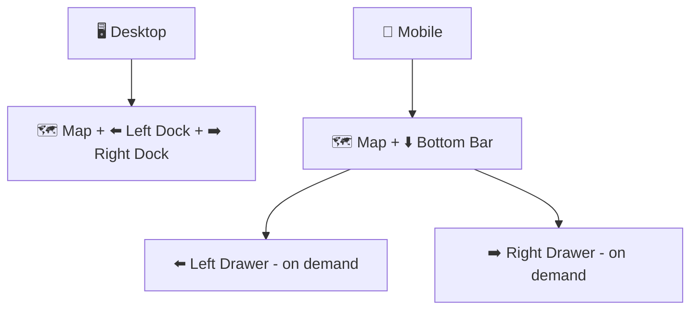

# 🧩 Layout Components (`web/components/layout`)


> Structural UI primitives + “app chrome” for the Kansas Frontier Matrix (KFM) web client: **map viewport**, **docked panels**, **drawers/overlays**, and **responsive scaffolding** for Story Nodes + Focus Mode. 🗺️📚

---

## 🧭 Where this fits (KFM pipeline order)

KFM is intentionally **pipeline‑ordered**. The web UI sits downstream of the API, and layout components are the “bones” that keep the UI predictable as features evolve.



---

## ✅ What belongs here

Layout components should be **domain‑agnostic**, composable, and boring (in the best way) 😌

- 🧱 **Shells**: app/page shells that define high‑level regions (`header / main / panels / footer`)
- 🧲 **Docking + splitting**: left/right panel docking, split panes, resizable regions
- 🧺 **Panels**: standardized panel containers (header/body/footer), scroll regions, empty states
- 🪟 **Overlays**: modals, drawers, popovers, toast regions, portals
- ♿ **A11y scaffolding**: skip links, landmark wrappers, focus management helpers
- 🧰 **Structural utilities**: error boundaries for layout regions, loading shells, view guards

---

## 🚫 What does *not* belong here

Keep layout separate from “feature brains” 🧠

- ❌ Feature logic (search, layers, timelines, graph exploration, “focus mode” reasoning)
- ❌ Data fetching or hidden data files
- ❌ Direct database/graph connections (no “side channels”)
- ❌ Domain‑specific components tightly coupled to a single page

> [!TIP]
> If the component answers **“where does it go?”** → layout ✅  
> If it answers **“what does it do?”** → feature/logic ❌

---

## 🧷 KFM invariants that matter in layout

These rules should shape how layout components are designed and reviewed:

1. 🔌 **API boundary**: UI consumes the API—layout should never create a backdoor to the graph/DB.
2. 🧾 **Provenance-first UI**: layouts must leave room for **citations, evidence links, and metadata** surfaces.
3. 🧭 **Story Nodes are reproducible**: any layout‑driven state (panel open/close, timeline visible, selected feature) should be representable in route/state so Story Nodes can rehydrate it.
4. 🫥 **Sensitivity-aware**: layout should support “precision guards” (e.g., banners, masked coordinate rendering, restricted mode UI).

---

## 🧠 Layout anatomy (recommended mental model)

Think in *regions* + *lanes* (z‑index) rather than one-off pages.

### Regions 🏗️

- **Header**: global navigation, search entry points, environment banners
- **Main**: map viewport + story overlay regions
- **Side panels**: layers/details/story/focus mode as docked or drawer UIs
- **Footer**: timeline/time slider, status bar, attribution

### Overlay lanes 🧅

1. 🗺️ Base: map canvas
2. 🧩 UI overlays: tooltips/popovers/context menus
3. 🪟 Modal overlays: dialogs/drawers
4. 🚨 Critical overlays: alerts, blocking errors, consent flows

---

## 🧩 Composition patterns

### 1) “Shell + slots” (preferred) 🧱➡️🧩

Design layout components as *slot receivers*:

- `header?: ReactNode`
- `left?: ReactNode`
- `right?: ReactNode`
- `bottom?: ReactNode`
- `children` (main content)

**Conceptual example**:

```tsx
<AppShell
  header={<TopNav />}
  left={<LayerPanel />}
  right={<DetailsPanel />}
  bottom={<TimelineBar />}
>
  <MapViewport />
</AppShell>
```

### 2) “Dock → Drawer on mobile” 📱

Docked panels should degrade to drawers on narrow viewports.


> [!NOTE]
> The map container should remain stable when panels open/close to avoid costly WebGL reinitialization.

### 3) “Portals for overlays” 🪟

Anything that must escape stacking contexts (modals, menus) should render through a portal mounted at a predictable root.

- ✅ Prevents map canvas from swallowing pointer/focus events
- ✅ Keeps z‑index strategy consistent
- ✅ Simplifies accessibility focus trapping

---

## ♿ Accessibility rules (non‑negotiable)

Layout components set the tone for a11y across the app.

### Landmarks 🧭
Use semantic regions whenever possible:

- `<header>` (site header)
- `<nav aria-label="Primary">`
- `<main id="main">`
- `<aside aria-label="Layers">`, `<aside aria-label="Details">`
- `<footer>`

### Keyboard behavior ⌨️
- ✅ `Tab` order follows reading order (including drawers)
- ✅ Drawers/modals trap focus and restore it on close
- ✅ Provide `Esc` to close overlays (when safe)
- ✅ Add a **Skip to content** link

### Screen reader expectations 🔊
- ✅ Panels have accessible names (`aria-label` / labelled headings)
- ✅ Live regions only where necessary (toasts/status)
- ✅ Don’t rely on map-only interactions—provide textual equivalents where feasible

---

## 📱 Responsive behavior guidelines

**Goal**: the UI should remain usable on mobile without hiding critical controls.

- 🧷 Prefer **CSS grid/flex** over hard-coded pixel layouts
- 🧩 Panels:
  - Desktop: docked/resizable
  - Tablet: docked or collapsible
  - Mobile: drawers + bottom sheet patterns
- 🧼 Keep scroll areas isolated:
  - `panel body` scrolls
  - map remains fixed unless intentionally panning

> [!TIP]
> Treat “responsive” as a first-class feature: layout components should encode responsive behavior so feature components don’t reinvent it.

---

## ⚡ Performance considerations (MapLibre/WebGL-friendly)

Layout decisions can make or break map performance.

- ✅ Avoid remounting the map container (keep a stable DOM node)
- ✅ Prefer CSS transforms + opacity changes over DOM churn
- ✅ Throttle resize observers (panels + splitters) and debounce expensive recomputes
- ✅ Virtualize long lists **inside panels** (layers/results) where needed

---

## 🧪 Testing expectations

Even “just layout” can regress UX.

- ✅ Unit test: panel toggle state, focus restore, ESC close
- ✅ Integration test: viewport breakpoints (dock → drawer), skip link, modal trapping
- ✅ Visual checks: story overlay + map remain aligned on resize

> [!NOTE]
> If changing layout impacts Story Node reproducibility (camera/panels/timeline), add an integration test that rehydrates state.

---

## ✅ Adding a new layout component (checklist)

- [ ] Uses semantic HTML landmarks where applicable 🧭
- [ ] Accepts `children`/slots instead of hardcoding features 🧩
- [ ] No data fetching / no domain logic 🔌
- [ ] Keyboard + focus behavior defined (open/close) ⌨️
- [ ] Responsive behavior documented (dock/drawer) 📱
- [ ] Exported from the folder’s barrel (if used) 📦
- [ ] Includes tests for the critical interaction path 🧪

---

## 📚 Related docs & standards

- 📌 Project overview: `../../../README.md`
- 🧾 Master invariants & templates: `../../../docs/specs/MARKDOWN_GUIDE_v13.md.gdoc`
- 🗺️ System blueprint (architecture/UI expectations): `../../../docs/specs/Kansas Frontier Matrix (KFM) – Comprehensive Technical Documentation.docx`
- 📱 Responsive patterns reference: `../../../docs/library/responsive-web-design-with-html5-and-css3.pdf`
- 🎛️ WebGL mental model: `../../../docs/library/webgl-programming-guide-interactive-3d-graphics-programming-with-webgl.pdf`

---

<details>
<summary><strong>🗂️ Suggested folder shape (optional)</strong></summary>

```text
web/
└─ 🧩 components/
   └─ 🧱 layout/
      ├─ 📄 README.md              # 📘 Layout system overview: composition patterns + responsive rules + a11y notes
      ├─ 🧱 shells/                # 🧱 AppShell / PageShell / MapShell (top-level layout scaffolding)
      ├─ 🧺 panels/                # 🧺 Panel primitives, splitters, resizers, and docking behaviors
      ├─ 🪟 overlays/              # 🪟 Modal / Drawer / Portal / ToastRegion (layered UI surfaces)
      ├─ ♿ a11y/                   # ♿ SkipLink / FocusTrap / aria helpers for accessible navigation
      └─ 📦🧩 index.ts              # Barrel exports (if used; keep tight to avoid circular deps)
```

</details>
