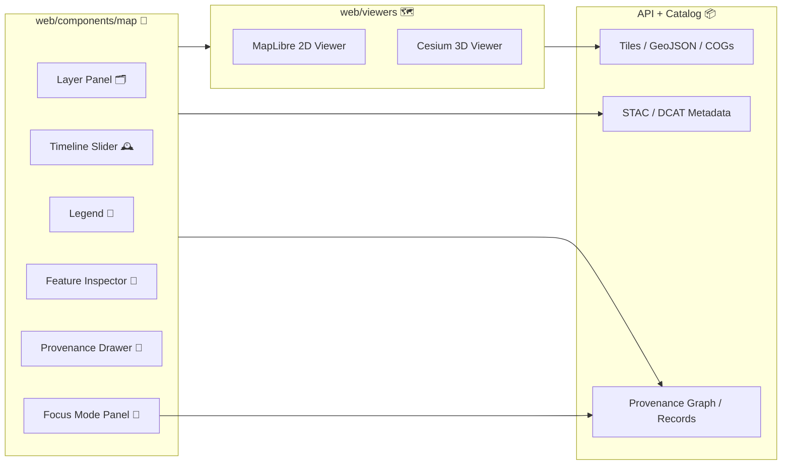

# 🗺️ Map UI Components (`web/components/map`)


> [!IMPORTANT]
> KFM is **provenance-first**: if a user can *see* it on the map, they should be able to *inspect* where it came from (“the map behind the map”). 🧾✨

---

## 🧭 What this folder is

This directory contains **React UI/UX components** that sit *on top of* the interactive map viewer to provide:

- 🧱 **Layer controls** (toggle, groups, opacity, ordering)
- 🧾 **Provenance + metadata surfaces** (layer “ⓘ”, citations, licenses)
- 🕰️ **Timeline controls** (time slider + event markers)
- 🔎 **Feature inspection** (popups/side panels, charts, related records)
- 📚 **Story Mode hooks** (sync map state to story steps)
- 🤖 **Focus Mode hooks** (send map context to AI + render cited results)

> [!NOTE]
> The low-level rendering + map engine integration (2D MapLibre / optional 3D Cesium) typically lives under `web/viewers/`.  
> This folder is where we keep **declarative UI** and **map-adjacent interaction patterns** (controls, overlays, panels).

---

## 🧩 Where this fits in the KFM web app

KFM’s web front-end is designed as a modern React SPA with pages like `MapPage`, `DataCatalogPage`, and `StoryPage`. The map experience centers around:

- ✅ **2D interactive maps** (MapLibre GL JS)
- ✅ **3D globe/terrain + 3D Tiles** (CesiumJS) when needed
- ✅ **Layer list/catalog + legends**
- ✅ **Search**
- ✅ **Timeline slider** for temporal navigation
- ✅ **Popups/side panels** for click-to-inspect details, charts, and citations

### High-level flow (mental model)



---

## 🎯 Responsibilities vs Non-responsibilities

### ✅ This folder *should* own
- 🧩 **UI state** (panel open/close, selected feature, hovered layer)
- 🧱 **Map control surfaces** (layer toggles, slider, legends, toolbars)
- 🧾 **Provenance rendering** (citations, licenses, “source: …” panels)
- 🕰️ **Time navigation UI** (slider, stepper, event markers)
- 🔌 **Adapters** that translate UI intent → viewer actions (via a controller/context)

### ❌ This folder should *not* own
- 🧠 Core map rendering engine setup (MapLibre/Cesium initialization)
- 🧱 Heavy, imperative map mutation logic scattered across components  
  *(keep that inside a map controller / viewer wrapper so UI stays declarative)*
- 🔐 Authorization rules / redaction logic  
  *(server enforces; UI can add safety rails + warnings, but must not be the only gate)*

---

## 🧠 Key concepts (KFM-specific)

### 1) 🧾 “The map behind the map” (Provenance-first UI)
Every visible layer/feature needs an obvious path to:
- 📌 Source name (human readable)
- 🔗 Source URL / dataset page
- 📄 License + allowed uses (download warnings if needed)
- 🧬 Provenance/lineage summary (“derived from…”, processing notes)
- ⚖️ FAIR+CARE notes when applicable (especially for Indigenous/sensitive data)

**UX rule of thumb:**  
If a user asks “what am I looking at?” the answer should be **one click away**.

---

### 2) 🕰️ Time is a first-class control (Timeline)
KFM treats time as navigable, not hidden metadata.

**Timeline UI should support:**
- ⏩ Scrub through years (or dates) and see linked layers update
- 🧷 Clickable event markers (e.g., “Dust Bowl 1931–1939”, “Great Flood of 1951”)
- 🎞️ Optional animation/stepping for storytelling or comparisons
- 🧭 Clear indication of the current time selection and how it affects layers

---

### 3) 🔒 Sensitive data safety (FAIR+CARE + governance)
Some datasets may include sensitive locations or restricted use.

**Patterns we support (and should reflect in UI):**
- 🧊 **Location generalization** (e.g., render as hex area instead of exact point)
- 🚫 **Access control** (hide from public users; require login)
- 🏷️ **Sensitivity tags** in metadata that drive warnings and visibility rules
- 🧾 Transparent disclosure that coordinates/attributes are redacted or generalized
- 🧑‍🤝‍🧑 CARE principles: *Collective Benefit, Authority to Control, Responsibility, Ethics*

> [!CAUTION]
> If you are introducing a new sensitive layer or changing sensitivity classification, expect a **governance review**.  
> This includes culturally sensitive or Indigenous data sovereignty cases, and anything that could enable inference of protected locations.

---

## 🧱 Map UI state model

To keep things composable, map UI usually revolves around a small state “spine”:

- 📍 `viewState` — center, zoom, bearing, pitch, mode (2D/3D)
- 🕰️ `timeState` — year/date range (plus animation state if enabled)
- 🗂️ `layersState` — visible layers, ordering, opacity, per-layer params
- 🔎 `selectionState` — selected/hovered feature(s) + inspection panel state
- 🧾 `provenanceState` — which layer/feature provenance drawer is showing

### Example types (design contract)

```ts
export type MapMode = "2d" | "3d";

export type ViewState = {
  lon: number;
  lat: number;
  zoom: number;
  bearing?: number;
  pitch?: number;
  mode: MapMode;
};

export type TimeState =
  | { kind: "year"; year: number }
  | { kind: "range"; start: string; end: string }; // ISO dates

export type LayerRuntimeState = {
  id: string;
  visible: boolean;
  opacity?: number; // 0..1
  zIndex?: number;
  params?: Record<string, unknown>; // e.g., classification scheme, thresholds
};

export type MapUIState = {
  view: ViewState;
  time?: TimeState;
  layers: LayerRuntimeState[];
  selected?: { layerId: string; featureId?: string; properties?: Record<string, unknown> };
};
```

> [!TIP]
> Keep the **viewer** as a “render target” driven by this state. Components should update state; a controller applies state to MapLibre/Cesium.

---

## 🗂️ Layer definitions + registry

Layers should be **registered** in a consistent way so the UI can render:
- display name 🏷️
- legend 🧾
- time coverage 🕰️
- provenance/citations 🧬
- sensitivity flags 🔒
- render type (vector tiles / raster / GeoJSON / COG / 3D Tiles) 🧱

### Example layer definition (minimal, extend as needed)

```ts
export type Sensitivity = "public" | "generalized" | "restricted";

export type LayerDef = {
  id: string;                 // stable, machine-readable
  title: string;              // human-readable
  description?: string;

  kind: "vector" | "raster" | "geojson" | "cog" | "3d-tiles";

  // Provenance + catalog pointers (prefer IDs → resolve via API)
  catalog?: {
    stacId?: string;          // collection/item ID
    dcatId?: string;          // dataset ID
  };

  // Where/how to fetch the layer payload (tiles, COGs, GeoJSON, etc.)
  source?: {
    url?: string;
    tileJsonUrl?: string;
  };

  temporal?: {
    start?: string;           // ISO
    end?: string;             // ISO
    resolution?: "year" | "month" | "day";
  };

  sensitivity?: Sensitivity;

  ui?: {
    group?: string;           // group in layer panel
    legend?: "auto" | "static" | "none";
    defaultOpacity?: number;
  };
};
```

---

## 🧾 Provenance UI contract (must-have behaviors)

When a layer is visible **or** a feature is clicked, the UI must be able to show:

- 🏷️ Layer name + description
- 🧬 Source attribution (e.g., “1885 Railroad Map (Kansas Historical Society)”)
- 📄 License + usage constraints (warn before download if restricted)
- 🧾 Citation snippets for story/chart contexts (when applicable)
- 🏷️ Sensitivity label + explanation (public/generalized/restricted)
- 🧩 Links: dataset page, STAC/DCAT metadata, related records

### Suggested UX pattern
- Layer list row includes:
  - 👁️ toggle
  - 🎚️ opacity
  - 🧾 “ⓘ” info button → opens **Provenance Drawer**
- Feature click opens:
  - 🔎 Feature Inspector panel with:
    - key attributes
    - associated records (photos, docs)
    - citations + “open source” actions

---

## 🕰️ Timeline UI contract

### Timeline slider should:
- control the active `TimeState`
- visually indicate **available temporal coverage**
- show markers for curated historical events (click → tooltip/story jump)

### Event marker shape (example)
```ts
export type TimelineEvent = {
  id: string;
  label: string;            // "Dust Bowl 1931–1939"
  start: string;            // ISO
  end?: string;             // ISO
  kind?: "event" | "era";
  relatedStoryId?: string;  // optional deep link into Story Nodes
};
```

---

## 📚 Story Mode integration

Story Nodes are authored as:
- 📝 **Markdown narrative** (text + images + citations)
- ⚙️ **JSON config** describing steps that change map state

A Story step typically needs to drive:
- 📍 camera (lon/lat/zoom/bearing/pitch)
- 🗂️ visible layers + opacity tweaks
- 🕰️ timeline state (year/date)
- 🧷 optional annotations/highlights

### Example story step (shape only)
```json
{
  "id": "step-2",
  "title": "Dust Bowl peak years",
  "camera": { "lon": -99.5, "lat": 37.8, "zoom": 6.2, "bearing": 0, "pitch": 0 },
  "time": { "kind": "year", "year": 1935 },
  "layers": [
    { "id": "drought_index", "visible": true, "opacity": 0.85 },
    { "id": "county_boundaries_1930s", "visible": true, "opacity": 0.5 }
  ],
  "annotations": [
    { "type": "highlight", "target": "county:ford" }
  ]
}
```

> [!TIP]
> Keep story application logic centralized (e.g., `applyStoryStep(step)`) so UI components remain simple.

---

## 🤖 Focus Mode AI integration

Focus Mode is a “research assistant” workflow that should be able to leverage:
- current viewport bbox
- current time selection
- active layers
- selected feature attributes (when user clicked something)

### Minimal map context payload (example)
```ts
export type MapContextForAI = {
  bbox: [number, number, number, number];
  center: [number, number];
  zoom: number;
  time?: TimeState;
  activeLayerIds: string[];
  selected?: { layerId: string; featureId?: string; properties?: Record<string, unknown> };
};
```

**UI responsibilities:**
- 🧾 Render AI answers with **citations**
- 🎯 On citation click, offer actions:
  - highlight corresponding feature/layer
  - open dataset provenance drawer
  - navigate to story node / record page

---

## 📁 Suggested folder layout (flexible, but keep intent clear)

> This is a recommended organization for map UI. Adapt to your current codebase, but keep the separation: **viewer ≠ UI controls**.

```text
📦 web/
 ├─ 📁 components/
 │   ├─ 📁 map/
 │   │   ├─ 📄 README.md          👈 you are here
 │   │   ├─ 📁 controls/          🎛️ layer panel, timeline, toolbars
 │   │   ├─ 📁 overlays/          🧾 legends, popups, inspectors
 │   │   ├─ 📁 panels/            📌 side drawers, provenance panels
 │   │   ├─ 📁 hooks/             🪝 useMapUIState, useTimeline, etc.
 │   │   ├─ 📁 types/             🧩 LayerDef, TimeState, contracts
 │   │   └─ 📁 utils/             🔧 formatting, debounce, helpers
 │   └─ ...
 ├─ 📁 viewers/                   🗺️ MapLibre/Cesium integration lives here
 └─ 📁 views/                     🧭 MapPage / StoryPage composition roots
```

---

## ➕ Adding a new map layer (checklist)

### ✅ Required (ship it safely)
- [ ] Register the layer with a **stable `id`** + human `title`
- [ ] Ensure the layer has **provenance metadata** (STAC/DCAT pointers preferred)
- [ ] Provide a **legend strategy** (auto/static/none) and confirm it updates correctly
- [ ] Tag **temporal coverage** if time-filtered
- [ ] Set **sensitivity** (`public` / `generalized` / `restricted`)
- [ ] Confirm UI surfaces:
  - [ ] “ⓘ” provenance
  - [ ] license/usage notes
  - [ ] citation/attribution string
- [ ] Verify the layer behaves in both:
  - [ ] Map browsing (normal mode)
  - [ ] Story steps (if referenced)
- [ ] Add at least one test: unit (types/registry) or e2e (toggle/inspect)

### ⚖️ Governance triggers (expect review)
- [ ] Sensitive/culturally protected data (CARE principles apply)
- [ ] New external data sources (license/provenance validation)
- [ ] New public download/output surfaces that could expose restricted info

---

## 🧪 Testing ideas (practical + high-signal)

- 🧩 Unit tests
  - registry validation (required fields)
  - legend formatting
  - story step application logic (state → viewer commands)
- 🧭 E2E tests (Playwright/Cypress style)
  - toggling layers changes visibility
  - slider scrubbing changes time-filtered layer outputs
  - clicking a feature opens inspector with provenance
  - event marker click opens tooltip/story deep link

---

## ⚡ Performance guardrails

KFM wants smooth pan/zoom and fast toggles:

- 🧱 Prefer tiles (vector/raster) over huge GeoJSON blobs
- 🧊 Use COGs / range requests where appropriate
- 🧠 Debounce `onMove` / viewport updates (don’t thrash React state)
- 🧵 Keep expensive parsing off the main thread if possible
- 🧩 Avoid rerendering the entire UI tree on every frame

---

## 🧯 Troubleshooting (common map pain)

<details>
<summary><strong>Tiles not loading / blank map</strong> 🧱</summary>

- Check CORS headers for tile/COG endpoints  
- Validate TileJSON URLs and `minzoom/maxzoom` ranges  
- Confirm basemap style references valid sprite/glyph URLs
</details>

<details>
<summary><strong>WebGL context lost</strong> 🎮</summary>

- Reduce simultaneously visible heavy layers  
- Ensure we dispose map instances on unmount  
- Avoid creating new viewer instances on every render
</details>

<details>
<summary><strong>Timeline scrub feels laggy</strong> 🕰️</summary>

- Debounce slider updates or apply “preview vs commit” (drag updates UI, release applies fetch)  
- Preload adjacent time steps when feasible  
- Avoid synchronous data transforms in the slider handler
</details>

---

## 🗺️ “Definition of done” for map UI work ✅

A map feature is “done” when:

- [ ] It has clear UI affordances (discoverable, keyboard accessible where applicable)
- [ ] Provenance is visible (layer/feature attribution is one click away)
- [ ] It respects time (if temporal data is involved)
- [ ] It respects sensitivity (generalization/warnings/role rules)
- [ ] It is test-covered at the right level (unit or e2e)
- [ ] It doesn’t regress performance (no frame-by-frame React thrash)

---

## 🔗 Related reading (repo-relative)

> Adjust these links to match your repo structure.

- 📄 `web/` overview: `../../README.md`
- 🗺️ Viewer internals: `../../viewers/README.md`
- 📚 Story Nodes: `../../story_nodes/README.md`
- ⚖️ Governance & review gates: `../../../docs/governance/REVIEW_GATES.md`
- 🧾 Standards: `../../../docs/standards/`
