According to a document from **2026-01-17**, KFM follows a **contract-first + provenance-first** rule: anything that appears in the UI or Focus Mode must be traceable to cataloged sources and provable processing. :contentReference[oaicite:0]{index=0}

# 🧾 Provenance UI Components (`web/components/provenance`)


## 🎯 Purpose

This folder contains **UI components** for rendering **provenance** (sources, lineage, license, and processing steps) for anything the user can see or interact with: map layers, catalog datasets, Story Nodes, and (opt-in) AI-assisted outputs. The platform’s trust model explicitly forbids “mystery layers” (unsourced/ad‑hoc data), and uses provenance metadata to automatically generate attributions and citations. :contentReference[oaicite:1]{index=1}

KFM uses open standards to capture provenance and discovery metadata—**STAC** (spatial assets), **DCAT** (dataset discovery), and **PROV‑O** (lineage). :contentReference[oaicite:2]{index=2}

---

## ✅ Non‑negotiables (read before shipping)

> [!IMPORTANT]
> These rules are not “style”—they’re **governance constraints** built into the KFM architecture.

### 1) No provenance → no UI surface
If it’s not in the catalogs/graph **with provenance**, it must not be displayed in Focus Mode (hard gate). :contentReference[oaicite:3]{index=3}

### 2) Every map layer must cite its source
If you add a new overlay/layer, it must include an info popup/legend that cites the underlying catalog record (DCAT/STAC). :contentReference[oaicite:4]{index=4}

### 3) The frontend never queries the graph directly
All data access goes through the governed API boundary (contracts + redaction). :contentReference[oaicite:5]{index=5}

### 4) AI is opt‑in + labeled + bounded
AI assistance is never shown by default; it must be user-triggered and clearly labeled, with uncertainty/confidence, and it must respect sensitivity rules. :contentReference[oaicite:6]{index=6}

### 5) No sensitive location leaks
If sovereignty/sensitivity rules require generalization/redaction, the map must not become a side‑channel to reveal protected coordinates. :contentReference[oaicite:7]{index=7}

---

## 🧠 Key terms (KFM vocabulary)

- **Catalogs** = STAC (assets) + DCAT (datasets) + PROV (lineage). :contentReference[oaicite:8]{index=8}
- **Contract artifact** = machine-validated schema/spec (JSON Schema, OpenAPI, GraphQL SDL, UI config). :contentReference[oaicite:9]{index=9}
- **Evidence artifact** = derived data product registered in catalogs (STAC/DCAT + PROV) *before* it appears in UI/narrative. :contentReference[oaicite:10]{index=10}
- **Focus Mode** = interactive story+map experience showing only provenance-linked content (no unsourced narrative). :contentReference[oaicite:11]{index=11}

---

## 🧩 What lives here

Typical building blocks (names may vary; keep responsibilities consistent):

- **`ProvenanceBadge`** 🏷️  
  Compact status indicator next to a layer/title (e.g., “Cataloged”, “Derived”, “AI‑generated”, “Redacted”). Click opens details.

- **`ProvenancePanel` / `ProvenanceDrawer`** 📎 
  Full provenance view: source, license, spatial/temporal extent, processing steps, derived-from chain, and links to STAC/DCAT/PROV records.

- **`CitationList`** 🧷  
  Renders citations/attribution in a consistent format (Story Node footnotes, dataset credits, AI answer references).

- **`LineageSteps`** 🧬  
  Human-readable step list from PROV records (pipeline scripts, transforms, timestamps, responsible agent/tool).

- **`SafeExternalLink`** 🔒  
  Normalizes + safely renders outbound links (license URLs, source URLs) without trusting raw HTML.

> [!TIP]
> Keep “display” concerns here; keep fetching/normalization in hooks/services (still behind the API boundary). :contentReference[oaicite:12]{index=12}

---

## 🗂️ Suggested folder layout

```text
web/ 🌐
└─ components/ 🧩
   └─ provenance/ 🧾
      ├─ README.md
      ├─ ProvenanceBadge.tsx
      ├─ ProvenancePanel.tsx
      ├─ CitationList.tsx
      ├─ LineageSteps.tsx
      ├─ SafeExternalLink.tsx
      ├─ types.ts
      └─ utils.ts
```

---

## 🔄 Where provenance data comes from

KFM’s pipeline publishes *curated outputs* plus catalog/provenance metadata:

- `data/processed/` → standardized outputs (GeoJSON/GeoParquet/COGs, etc.)
- `data/catalog/` → STAC/DCAT JSON describing datasets (extent, license, source, links)
- `data/provenance/` (or similar) → PROV JSON‑LD lineage (source files + pipeline steps → outputs) :contentReference[oaicite:13]{index=13}

> [!NOTE]
> The catalog entry is treated as the “source of truth” for what the UI/API can list and serve. :contentReference[oaicite:14]{index=14}

---

## 🧠 Frontend data contract (recommended)

KFM emphasizes **metadata JSON “data contracts”** with source, license, spatial/temporal extent, and processing steps (validators + CI gates). :contentReference[oaicite:15]{index=15}

A practical UI shape to target:

```ts
// types.ts (suggested)

export type CatalogKind = 'stac' | 'dcat' | 'prov' | 'external';

export type ProvenanceStatus =
  | 'cataloged'         // has DCAT/STAC + PROV lineage
  | 'derived'           // derived product with lineage
  | 'ai_generated'      // opt-in, labeled
  | 'redacted'          // sensitive details withheld/generalized
  | 'missing';          // should generally block UI exposure

export interface ProvenanceRef {
  kind: CatalogKind;
  id: string;           // stable identifier used across graph/API/UI
  version?: string;     // optional semantic or timestamped version
}

export interface Citation {
  label: string;        // short label shown to users
  href?: string;        // link to source (if allowed)
  catalogRef?: ProvenanceRef; // preferred: points to cataloged source
  accessedAt?: string;  // ISO date (optional)
}

export interface LineageStep {
  at?: string;          // ISO timestamp
  tool?: string;        // pipeline script, notebook, service name
  agent?: string;       // responsible person/system
  description: string;  // human-readable step summary
  inputs?: ProvenanceRef[];
  outputs?: ProvenanceRef[];
}

export interface ProvenanceRecord {
  ref: ProvenanceRef;
  title: string;

  status: ProvenanceStatus;

  // Minimum governance fields
  sourceName?: string;
  sourceUrl?: string;
  license?: string;
  licenseUrl?: string;

  // Discovery fields
  spatial?: { bbox?: number[]; region?: string };
  temporal?: { start?: string | number; end?: string | number };

  // Evidence & trace
  citations?: Citation[];
  derivedFrom?: ProvenanceRef[];
  steps?: LineageStep[];

  // Sensitivity & redaction
  sensitivity?: { level: 'public' | 'restricted' | 'sensitive'; notes?: string };
  redactions?: string[]; // e.g., ["coordinates_generalized", "exact_site_hidden"]
}
```

> [!IMPORTANT]
> Treat `ProvenanceStatus = "missing"` as a **publishing bug**: the UI should refuse to surface it in Focus Mode and should prompt for catalog fixes. :contentReference[oaicite:16]{index=16}

---

## 🔌 Integration patterns

### A) Map layer registry / legend ✅
When adding a new layer/overlay, add a provenance reference and wire it into the legend/info UI so users can click through to sources. :contentReference[oaicite:17]{index=17}

```tsx
// Example: layer legend row
<LayerRow title={layer.title}>
  <ProvenanceBadge ref={{ kind: 'dcat', id: layer.datasetId }} />
</LayerRow>
```

### B) Feature info popup 🗺️
For selected map features, show the dataset-level provenance plus any feature-level evidence if available.

```tsx
<MapPopup>
  <h3>{featureTitle}</h3>
  <ProvenancePanel ref={{ kind: 'dcat', id: layer.datasetId }} />
</MapPopup>
```

### C) Story Nodes + citations 📖
Story Nodes must include provenance for every claim (citations/footnotes). The UI should render them consistently and keep links resolvable (CI checks should catch broken ones). :contentReference[oaicite:18]{index=18}:contentReference[oaicite:19]{index=19}

```tsx
<CitationList citations={storyNode.citations} />
```

### D) Focus Mode “hard gate” 🧠
Only provenance-linked content is allowed in Focus Mode; AI hints must be opt‑in and labeled. :contentReference[oaicite:20]{index=20}

```tsx
{provenance.status !== 'missing' ? (
  <ProvenancePanel ref={provenance.ref} />
) : (
  <BlockedContent message="This content is not published (missing provenance)." />
)}
```

---

## 🧬 Data flow (mental model)

```mermaid
flowchart LR
  UI[🧾 Provenance UI<br/>Badge / Panel / Citations] --> API[🛡️ Governed API<br/>Contracts + Redaction]
  API --> DCAT[🗂️ DCAT Dataset]
  API --> STAC[🛰️ STAC Item/Collection]
  API --> PROV[🧬 PROV Lineage]
  DCAT --> UI
  STAC --> UI
  PROV --> UI
```



This aligns with the canonical pipeline boundary ordering (data → catalogs → graph → API → UI → narrative), with provenance produced at the catalog boundaries. :contentReference[oaicite:21]{index=21}

---

## 🧯 Empty states & UX rules

- **Missing provenance** → show a blocked/hidden state (do not “guess”).
- **Redacted provenance** → show what is safe to show + explain what was withheld (don’t leak via tooltips, URLs, or deep links). :contentReference[oaicite:22]{index=22}
- **External source (not ingested yet)** → allow display only if it is itself cataloged as an external reference (still traceable).
- **AI content** → never default-visible; always labeled and includes confidence/uncertainty. :contentReference[oaicite:23]{index=23}

---

## ♿ Accessibility & clarity

KFM explicitly calls for semantic HTML + ARIA and accessible cartographic UI patterns; provenance UI must match that bar (e.g., keyboard-friendly disclosure, readable typography, high-contrast support). :contentReference[oaicite:24]{index=24}

Practical checklist:
- Use `<button>` for disclosure toggles (not clickable `<div>`).
- `aria-expanded` + `aria-controls` for collapsibles.
- Provide “Copy citation” buttons with clear focus states.
- Avoid long unwrapped URLs in small panels (wrap + clamp).

---

## 🧪 Testing & CI expectations

At minimum:
- **Unit tests**: formatting of citations, license display, redaction messaging.
- **Component tests**: missing provenance blocks, AI opt-in behavior.
- **Contract tests**: if API response changes, update `ProvenanceRecord` (contract-first discipline). :contentReference[oaicite:25]{index=25}
- **CI link validation**: citations/refs must resolve (no broken internal links or unresolved tags). :contentReference[oaicite:26]{index=26}
- **Schema validation**: STAC/DCAT/PROV must validate; metadata failures block publishing. :contentReference[oaicite:27]{index=27}

---

## 🧰 Contributing checklist (fast path)

When you add a new dataset/layer/evidence artifact:
1. ✅ Add/confirm **STAC/DCAT** records and **PROV** lineage (publishable boundary artifacts). :contentReference[oaicite:28]{index=28}
2. ✅ Ensure the governed API can return a `ProvenanceRecord` for the stable ID (no direct graph calls). :contentReference[oaicite:29]{index=29}
3. ✅ Wire `ProvenanceBadge`/`ProvenancePanel` into the layer legend or relevant UI surface (no orphan layers). :contentReference[oaicite:30]{index=30}
4. ✅ Confirm Focus Mode behavior: provenance-linked only; AI opt-in; no sensitive location leaks. :contentReference[oaicite:31]{index=31}

---

## 📚 References & project files

Primary design anchors:
- **KFM – Comprehensive Technical Documentation** :contentReference[oaicite:32]{index=32} :contentReference[oaicite:33]{index=33}
- **Kansas Frontier Matrix — Master Guide v13 (Draft)** :contentReference[oaicite:34]{index=34} :contentReference[oaicite:35]{index=35}

Support library (provenance & reproducibility mindset):
- **Scientific Modeling and Simulation: A Comprehensive NASA‑Grade Guide** :contentReference[oaicite:36]{index=36} :contentReference[oaicite:37]{index=37} :contentReference[oaicite:38]{index=38}

> [!NOTE]
> If you update provenance rules, pipeline boundaries, or catalog standards, update this README to match (docs are part of the governed system).
