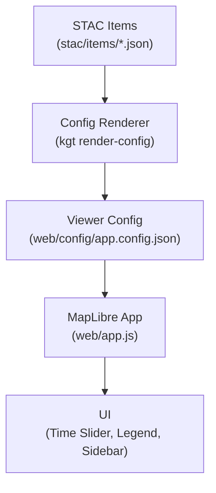

# `web/config/` — Kansas-Frontier-Matrix Viewer Configuration (2025-09)

This folder holds **declarative JSON** that drives the MapLibre viewer (`web/app.js`).
Configs define **what** to load (layers), **how** to render (legend/categories/styles), and **when** to show it (time).

**Design goal:** *zero hand-tuning in code* — the viewer is driven by STAC + these configs.

---

## What lives here (and why)

| File                     | Required? | Purpose                                                   | Edited by           | Source of truth        |
| ------------------------ | --------: | --------------------------------------------------------- | ------------------- | ---------------------- |
| `app.config.json`        |         ✅ | Final merged viewer config (defaults + layers + time)     | Generated from STAC | **Yes**                |
| `viewer.json`            |         ➖ | Hand-edited local/dev override                            | Devs                | No (fallback only)     |
| `layers.json`            |         ➖ | Layers-only catalog for quick tests/dev                   | Devs                | No (fallback only)     |
| `time_config.json`       |         ➖ | Overrides active config’s `time`, `defaultYear`, `timeUI` | Devs                | Merges over active     |
| `legend.json`            |         ➖ | Global symbology tokens; optional layer id bindings       | Devs/Cartography    | Referenced by UI       |
| `categories.json`        |         ➖ | Sidebar grouping (labels + order + optional layer lists)  | Devs/Cartography    | Referenced by UI       |
| `sources.json`           |         ➖ | Provenance/audit registry for layers → data sources       | Devs/Data           | Helpful for provenance |
| `story_layers.json`      |         ➖ | Curated themes (layersOn/off, opacity, flyTo)             | Editors/Outreach    | Used by story UI       |
| `schema.json`            |         ➖ | Pack of JSON Schemas (legend / categories / sources)      | Devs                | Used by CI/local       |
| `app.config.schema.json` |         ➖ | Schema for `app.config.json`                              | Devs                | Used by CI/local       |
| `layers.schema.json`     |         ➖ | Schema for `layers.json`                                  | Devs                | Used by CI/local       |

> **Rule of thumb:** Keep **`app.config.json` generated**. Use `viewer.json` / `layers.json` only for experiments.

---

## Load order (runtime)

`web/app.js` loads the first file found:

1. `./config/app.config.json`  
2. `./config/viewer.json`  
3. `./config/layers.json`  
4. `./layers.json` *(legacy root)*

If `time_config.json` exists, its `time`, `defaultYear`, and `timeUI` **override** the active config.
If `legend.json` / `categories.json` exist, the UI uses them for **legend chips** and **sidebar grouping**.

---

## Generate the viewer config from STAC

```bash
# 1) Build/refresh STAC items
make stac

# 2) Render viewer config (STAC → app.config.json)
kgt render-config \
  --stac stac/items \
  --output web/config/app.config.json \
  --pretty
````

Re-run after adding/removing/changing any STAC items.

---

## Contract: top-level shape (authoritative)

### Top-level (`app.config.json` / `viewer.json`)

```json
{
  "version": "1.4.0",
  "generated": "2025-09-27T10:00:00Z",
  "title": "Kansas-Frontier-Matrix",
  "subtitle": "Time-aware historical GIS for Kansas",
  "style": "https://demotiles.maplibre.org/style.json",
  "center": [-98.3, 38.5],
  "zoom": 6,
  "bounds": [-102.051, 36.993, -94.588, 40.003],

  "time": { "min": "1850-01-01", "max": "2025-12-31" },
  "defaultYear": 1930,
  "timeUI": { "step": 1, "loop": false, "fps": 12 },

  "defaults": {
    "minzoom": 0,
    "maxzoom": 15,
    "opacity": 1.0,
    "visible": true,
    "bounds": [-102.051, 36.993, -94.588, 40.003],
    "time": { "start": null, "end": null }
  },

  "layers": [ /* see layer schema below */ ]
}
```

### Layer schema (common keys)

```json
{
  "id": "unique_id",
  "title": "Display Title",
  "type": "raster | raster-dem | vector | geojson | image",
  "url": "https://tiles/{z}/{x}/{y}.png",
  "data": "data/processed/small.geojson",
  "visible": false,
  "opacity": 0.8,
  "minzoom": 0,
  "maxzoom": 19,
  "category": "reference | terrain | historical | documents | infrastructure | environment | culture | hazards",
  "legendKey": "symbol_id_in_legend",
  "attribution": "Source / license",
  "time": { "start": "YYYY-MM-DD|null", "end": "YYYY-MM-DD|null" },

  "style": {
    "fillColor": "#A0C4FF",
    "fillOpacity": 0.6,
    "lineColor": "#3A86FF",
    "lineWidth": 1.0,
    "lineOpacity": 0.9,
    "lineDasharray": [2, 2],
    "circleColor": "#FF595E",
    "circleRadius": 4,
    "circleOpacity": 0.95,
    "circleStrokeColor": "#FFFFFF",
    "circleStrokeWidth": 1
  },

  "popup": ["name", "type", "year", "year_end"],
  "timeProperty": "year",
  "endTimeProperty": "year_end",

  "coordinates": [[lonW,latN],[lonE,latN],[lonE,latS],[lonW,latS]]  // for image overlays
}
```

**Type specifics**

* `raster` → **tile servers only** (e.g., `/tiles/…/{z}/{x}/{y}.png`). *Do not point at raw `.tif`.*
* `raster-dem` → terrain sources (use tiles or platform DEM style; same rule: not raw `.tif`).
* `vector` → vector tiles (TileJSON).
* `geojson` → inline/URL GeoJSON (tile or simplify when large).
* `image` → single image overlay; must include `coordinates`.

---

## Time overrides & presets (`time_config.json`)

```json
{
  "version": "1.2.0",
  "generated": "2025-09-27T15:00:00Z",
  "time": { "min": "1850-01-01", "max": "2025-12-31" },
  "defaultYear": 1930,
  "timeUI": { "step": 1, "loop": false, "fps": 12 },
  "presets": [
    { "label": "Bleeding Kansas",   "start": "1854-01-01", "end": "1861-12-31" },
    { "label": "Railroad Era",      "start": "1865-01-01", "end": "1900-12-31" },
    { "label": "Dust Bowl",         "start": "1930-01-01", "end": "1940-12-31" },
    { "label": "Modern Kansas",     "start": "1990-01-01", "end": "2025-12-31" }
  ]
}
```

> Filtering uses **layer `time`** (uniform spans) or **feature `timeProperty`** / `endTimeProperty` (heterogeneous features).

---

## Legend & categories (UI contracts)

### `legend.json`

* Defines **symbols** (style tokens).
* Optional `layerBindings` map `layer.id → symbolId`.

```json
{
  "version": "1.2.0",
  "generated": "2025-09-27T00:00:00Z",
  "symbols": {
    "basemap":       { "raster": true, "preview": "#BFC7CF" },
    "counties":      { "lineColor": "#555555", "lineWidth": 1, "fillOpacity": 0.0 },
    "dem":           { "rasterDem": true, "preview": "#9E9E9E" },
    "hillshade":     { "raster": true, "preview": "#7F7F7F" },
    "historic_topo": { "raster": true, "preview": "#C6B79E", "opacity": 0.85 },
    "treaties":      { "fillColor": "rgba(200, 60, 60, 0.35)", "lineColor": "#AA3333", "lineWidth": 1 },
    "trails":        { "lineColor": "#4361EE", "lineWidth": 1.25, "lineDasharray": [2, 2] },
    "railroads":     { "lineColor": "#6B4E16", "lineWidth": 1.5 },
    "hydrology":     { "lineColor": "#3A86FF", "fillColor": "#A0C4FF", "fillOpacity": 0.6 },
    "towns":         { "circleColor": "#FF595E", "circleRadius": 4, "circleStrokeColor": "#FFFFFF", "circleStrokeWidth": 1 },
    "landcover":     { "fillOpacity": 0.6 },
    "tornado":       { "lineColor": "#D00000", "lineWidth": 1.4 },
    "wildfire":      { "fillColor": "#E76F51", "fillOpacity": 0.35, "lineColor": "#B3543F", "lineWidth": 1 }
  },
  "layerBindings": {
    "basemap_osm": "basemap",
    "kansas_counties": "counties",
    "ks_dem_2018_2020": "dem",
    "ks_hillshade_2018": "hillshade",
    "usgs_topo_1894_larned": "historic_topo",
    "ks_treaties": "treaties",
    "ks_trails": "trails",
    "ks_railroads": "railroads",
    "ks_hydro": "hydrology",
    "ks_settlements": "towns",
    "ks_landcover": "landcover",
    "tornado_tracks_ks": "tornado",
    "ks_wildfire": "wildfire"
  }
}
```

### `categories.json` (sidebar)

```json
{
  "version": "1.1.0",
  "generated": "2025-09-27T00:00:00Z",
  "categories": {
    "reference":      { "label": "Reference",               "order": 0 },
    "terrain":        { "label": "Terrain & Elevation",     "order": 1 },
    "environment":    { "label": "Land & Water",            "order": 2 },
    "historical":     { "label": "Historical Maps",         "order": 3 },
    "documents":      { "label": "Documents & Treaties",    "order": 4 },
    "infrastructure": { "label": "Trails & Railroads",      "order": 5 },
    "culture":        { "label": "Settlements & Sites",     "order": 6 },
    "hazards":        { "label": "Hazards",                 "order": 7 }
  }
}
```

---

## Examples (correct patterns)

### Historical raster (tiled)

```json
{
  "id": "usgs_topo_1894_larned",
  "title": "USGS Historic Topo — Larned (1894)",
  "type": "raster",
  "url": "./tiles/historic/usgs_1894_larned/{z}/{x}/{y}.png",
  "opacity": 0.7,
  "visible": true,
  "category": "historical",
  "legendKey": "historic_topo",
  "attribution": "USGS Historical Topographic Map Collection",
  "time": { "start": "1894-01-01", "end": "1894-12-31" },
  "minzoom": 0,
  "maxzoom": 16
}
```

### Time-aware GeoJSON points

```json
{
  "id": "ks_settlements",
  "title": "Settlements, Forts, Trading Posts",
  "type": "geojson",
  "data": "data/processed/towns_points.json",
  "category": "culture",
  "legendKey": "towns",
  "time": { "start": "1800-01-01", "end": null },
  "timeProperty": "year",
  "popup": ["name", "type", "year", "year_end"],
  "style": {
    "circleColor": "#FF595E",
    "circleRadius": 4,
    "circleOpacity": 0.95,
    "circleStrokeColor": "#FFFFFF",
    "circleStrokeWidth": 1
  },
  "visible": true,
  "attribution": "Compiled / KFM"
}
```

---

## Validation & CI

**Local quick checks**

```bash
# Lint JSON
jq . web/config/app.config.json > /dev/null

# Schema validation (viewer/app/layers)
ajv validate -s web/config/app.config.schema.json -d web/config/app.config.json
ajv validate -s web/config/layers.schema.json      -d web/config/layers.json

# Schema pack (legend/categories/sources)
ajv validate -s web/config/schema.json -d web/config/legend.json     -r web/config/schema.json
ajv validate -s web/config/schema.json -d web/config/categories.json -r web/config/schema.json
ajv validate -s web/config/schema.json -d web/config/sources.json    -r web/config/schema.json
```

**CI guarantees**

* STAC → `app.config.json` generation is checked; broken STAC = failed build.
* Tests assert: structure, categories, legend bindings, time ranges (`time` vs `timeProperty`), and file existence.

---

## Troubleshooting

* **Layer not visible** → Check `type`, tiles `url` vs GeoJSON `data`, `minzoom/maxzoom`, and file paths.
* **Timeline inert** → Provide `time` (layer) or `timeProperty`/`endTimeProperty` (features); use ISO dates.
* **Legend chip missing** → `legendKey` must match `legend.json.symbols` (or add `layerBindings[id]`).
* **Wrong sidebar group** → Ensure `category` key exists in `categories.json`.
* **Slow vectors** → Tile or simplify statewide/dense GeoJSON; reserve raw GeoJSON for small sets.
* **Raster DEM** → Treat as tiles; don’t point at raw `.tif`. Use `/tiles/terrain/dem/{z}/{x}/{y}.png`.

---

## Story themes (`story_layers.json`)

Curated presets for demos/tours:

```json
{
  "schema": "kfm-story/1.1",
  "version": "1.2.0",
  "title": "Curated Story Themes",
  "themes": [
    {
      "id": "bleeding_kansas",
      "title": "Bleeding Kansas & Treaties",
      "year": 1856,
      "layersOn": ["ks_treaties", "ks_railroads", "kansas_counties"],
      "opacity": { "ks_treaties": 0.9, "ks_railroads": 0.9, "kansas_counties": 0.5 },
      "flyTo": { "center": [-96.9, 39.1], "zoom": 6.5 }
    }
  ]
}
```

---

## Minimal data-flow



---

## Conventions

* **IDs**: `snake_case`, stable, include vintage when helpful (`usgs_topo_1894_larned`).
* **Categories**: pick exactly one per layer; keep in sync with `categories.json`.
* **Legend**: keep `legendKey` (or `layerBindings`) aligned with `legend.json.symbols`.
* **Time**: layer-level spans in `time`; heterogeneous features via `timeProperty`/`endTimeProperty`.
* **CRS & rasters**: store/serve COGs in pipelines, **tile to PNG** for web rendering (EPSG:4326/3857).
* **Schemas**: bump `*.schema.json` when adding keys; CI will enforce.

**TL;DR**
Generate **`app.config.json`** from STAC → tweak UX with **`time_config.json`**, **`legend.json`**, **`categories.json`**, and **`story_layers.json`** → validate → ship.

```
```
