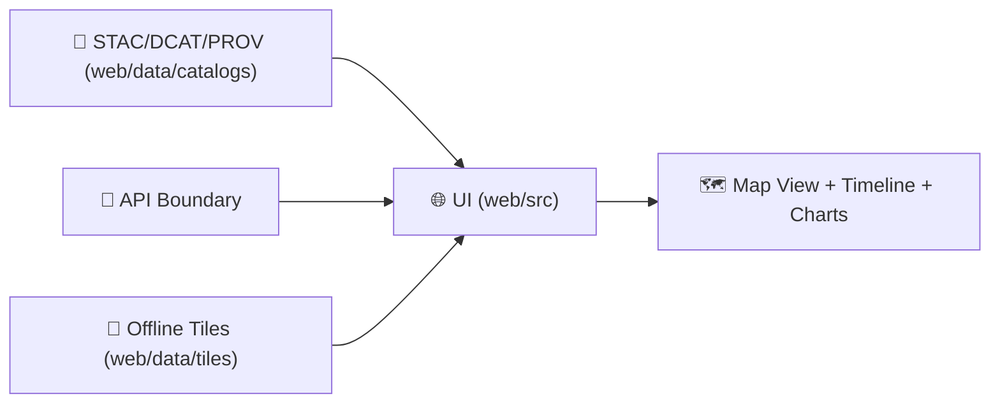

# 🗺️ KFM Web Data — `web/data/` (Frontend Data Assets)


> [!IMPORTANT]
> **`web/data/` is not the production data lake.**  
> This folder exists to hold **small, governed UI-facing assets** (demos, fixtures, basemap styles, small GeoJSON overlays, tile bundles for offline dev) — while real datasets remain served via the **API boundary**.

---

## 🎯 What belongs here (and what doesn’t)

### ✅ Good fits for `web/data/`
- 🧪 **Dev/test fixtures** (mock API responses, small sample GeoJSON, Storybook/MSW payloads)
- 🗺️ **Map UI configuration** (MapLibre style JSON, sprites, fonts, legends, layer catalogs)
- 🧊 **Small “preview” datasets** for demos (simplified boundaries, sample time-series)
- 📦 **Offline-friendly tile bundles** for local demos (MBTiles/PMTiles)
- 🛰️ **Thumbnails / low-res previews** (NOT full remote sensing source archives)
- 🧾 **Metadata + manifests** that let the UI discover assets (STAC/DCAT/PROV pointers)

### 🚫 Not allowed in `web/data/`
- 🔐 **Secrets** (API keys, service creds, tokens)  
- 🧍‍♂️ **PII / sensitive locations / restricted layers** (unless explicitly approved and access-controlled elsewhere)
- 🏋️ **Huge datasets** (raw imagery, multi-GB rasters, full sensor archives)
- 🧬 **Authoritative domain data** that must be governed by the backend (belongs in catalogs/DB/object store)

> [!TIP]
> Treat `web/data/` as **“UI assets + demos + fixtures”**, not “the source of truth.”  
> Production data should be **served** (and redacted) by the API boundary — not committed into frontend folders.

---

## 🧾 Policy metadata

| Field | Value |
|---|---|
| Folder | `web/data/` |
| Purpose | UI data assets, fixtures, offline demo bundles |
| Default classification | `public` *(override explicitly per dataset)* |
| Last updated | **2026-01-06** |

---

## 📦 Recommended layout

```text
🌐 web/
└── 📁 data/
    ├── 📁 catalogs/              # 🧾 STAC/DCAT/PROV manifests + pointers (preferred)
    │   ├── 📄 stac.collection.json
    │   └── 📄 dcat.dataset.json
    ├── 📁 layers/                # 🗺️ small vector overlays (GeoJSON/TopoJSON)
    │   ├── 📁 boundaries/
    │   └── 📁 samples/
    ├── 📁 tiles/                 # 🧊 offline bundles (MBTiles/PMTiles) + metadata
    ├── 📁 rasters/               # 🛰️ thumbnails / low-res previews / tiny COGs (demo-only)
    ├── 📁 styles/                # 🎨 MapLibre styles, sprites, fonts, legends
    ├── 📁 fixtures/              # 🧪 mock API responses + test payloads
    ├── 📁 licenses/              # 📜 third-party data licenses + attribution text
    ├── 📄 manifest.json          # 🧭 UI index (optional convenience index)
    └── 📄 README.md              # 📘 you are here
```

> [!NOTE]
> If your repo layout differs, keep the **intent**:
> - metadata & provenance near the data  
> - demo assets small  
> - production datasets stay in backend stores

---

## 🧭 How the UI should discover data

The UI should primarily consume data from:
1) ✅ **API endpoints** (preferred, governed boundary)  
2) ✅ **Catalog manifests** (`STAC/DCAT/PROV`) that point to hosted assets  
3) ⚠️ **Local demo bundles** (only for offline dev / smoke tests)



> [!IMPORTANT]
> When a layer expresses a claim (e.g., “NDVI anomaly”), it should have a **provenance pointer** (STAC item, dataset ID, or PROV link) so the UI can surface *evidence*.

---

## 🧬 Governance rules for anything committed here

### 1) Classification is mandatory 🏷️
Every dataset (even a tiny demo GeoJSON) must declare a classification.

**Allowed** (recommended):
- `public`
- `internal`
- `restricted` *(should not live here unless specifically approved)*

### 2) Provenance is not optional 🧾
If the UI displays it, we should be able to answer:
- where did this come from?
- what transform produced it?
- what time window + bounding box does it represent?
- what license governs it?

### 3) “No privacy downgrade” rule 🔒
If you aggregate data derived from restricted inputs, the output cannot become public “by accident.”

### 4) Licenses & attribution 📜
If you include third‑party data (even a clip), you must include:
- license text or link in `web/data/licenses/`
- attribution string (for map UI display if required)
- source citation in metadata

> [!CAUTION]
> If licensing is unclear, **don’t commit the dataset**. Commit a **pointer** (STAC item) to a compliant storage location instead.

---

## 🗂️ Dataset metadata conventions

### ✅ Minimal metadata file (per dataset)
Place a `dataset.meta.json` (or STAC item/collection) next to the asset.

```json
{
  "id": "kfm-demo-boundaries-ks-counties",
  "title": "Kansas Counties (Demo Simplified)",
  "description": "Small, simplified polygons for UI dev and demos.",
  "classification": "public",
  "license": "CC-BY-4.0",
  "crs": "EPSG:4326",
  "bbox": [-102.05, 36.99, -94.59, 40.00],
  "time": null,
  "source": {
    "name": "Example Source",
    "url": "REPLACE_ME"
  },
  "checksums": {
    "sha256": "REPLACE_ME"
  },
  "provenance": {
    "stac": "catalogs/stac.collection.json",
    "prov": "catalogs/prov.bundle.json"
  }
}
```

> [!TIP]
> Prefer **STAC** for geospatial assets whenever feasible, because it scales cleanly from “demo file” to “real catalog.”  

---

## 🧱 File format guidance (pick the right tool)

### 🗺️ Vector overlays
| Use case | Recommended format | Why |
|---|---|---|
| Small interactive layers | GeoJSON | Simple, inspectable, works everywhere |
| Medium/large boundaries | TopoJSON | Smaller over-the-wire |
| Big vectors | Vector tiles (PMTiles/MBTiles) | Map performance + smooth pan/zoom |

**Do’s ✅**
- simplify geometry for UI needs (keep topology sane)
- include stable feature IDs (`id`, `fid`, or `properties.kfm_id`)
- validate GeoJSON before committing

### 🛰️ Raster previews
| Use case | Recommended format | Notes |
|---|---|---|
| Thumbnail / preview | PNG/JPEG | keep small |
| “Tiny demo raster” | COG GeoTIFF | for “real-ish” workflows |
| Production raster | **not here** | host + reference via STAC |

**Do’s ✅**
- prefer **Cloud Optimized GeoTIFF (COG)** for any raster meant to be read progressively
- keep demo rasters small (think MBs, not GBs)

### 🌍 3D & time-dynamic assets
| Use case | Recommended format |
|---|---|
| Time-dynamic tracks | CZML |
| Lightweight overlays | KML/KMZ |
| 3D tiles | 3D Tiles (store externally; reference here) |

> [!CAUTION]
> Treat 3D assets as **untrusted input**. Keep parsers isolated, and avoid loading arbitrary third-party models without validation.

---

## 🧭 CRS + tiling sanity (don’t fight the map)

- 🌐 **WGS84 (EPSG:4326)** is the safe interchange CRS for cataloging and many vector datasets.
- 🗺️ **Web Mercator (EPSG:3857)** is standard for web tiles.
- 🔁 Do transformations at boundaries (ingest/build steps), not ad-hoc inside components.

> [!TIP]
> If a layer looks “shifted,” it’s almost always a CRS mismatch or an axis-order issue. Fix the data, not the UI.

---

## ⚡ Performance guardrails (so maps don’t melt laptops 🔥)

**Keep payloads small:**
- split big files into tiles, not megabyte GeoJSON blobs
- prefer vector tiles for dense features
- compress where appropriate (gzip/brotli on server; PMTiles/MBTiles offline)

**Keep rendering stable:**
- avoid redrawing entire style on every state change
- cache decoded GeoJSON (and memoize derived data)
- avoid huge textures and high-poly meshes in browser

---

## ➕ Adding a new dataset (golden path ✅)

1) **Decide: local file vs pointer**
   - If it’s big or sensitive → add a **STAC pointer**, don’t commit it.
   - If it’s small and purely for UI dev → proceed.

2) **Choose the right format**
   - vectors: GeoJSON → TopoJSON → tiles as size grows  
   - rasters: PNG preview or tiny COG demo only

3) **Add metadata**
   - classification, license, source, bbox, checksum
   - STAC/DCAT/PROV pointers if applicable

4) **Validate + sanity check**
   - open it in the map locally
   - verify CRS is correct
   - verify feature IDs are stable

5) **Add attribution**
   - ensure the UI can display required attribution strings

6) **Keep it testable**
   - if used as fixture, add a small test (or snapshot) so it can’t silently drift

---

## 🧪 Fixtures (mock payloads) — how we use them

Use `web/data/fixtures/` for:
- mocked API responses for local dev
- deterministic test payloads for UI components
- Storybook/MSW handlers

**Rules**
- fixtures must be **small** and **representative**
- fixtures must not contain secrets, tokens, or PII
- include a short `README.md` per fixture set if non-obvious

---

## 🔐 Security & privacy checklist (quick)

- [ ] No secrets (keys/tokens/passwords)  
- [ ] No PII / restricted layers committed  
- [ ] Dataset classification declared  
- [ ] Source + license recorded  
- [ ] Provenance pointer included (when applicable)  
- [ ] Large data stored externally (and referenced)  

---

## 📚 Sources (project reference library)

These project references inform how KFM treats **geospatial data**, **cloud remote sensing**, **provenance**, **web performance**, and **governed systems**:

- **Cloud-Based Remote Sensing with Google Earth Engine (Fundamentals & Applications)**.  [oai_citation:0‡Cloud-Based Remote Sensing with Google Earth Engine-Fundamentals and Applications.pdf](file-service://file-CXGLTw8wpR4uKWWqjrGkyk)  
- **Google Earth Engine Applications** (Remote Sensing special issue compilation).  [oai_citation:1‡Google Earth Engine Applications.pdf](file-service://file-SmoZrQ3nZSAdHHNqcVzYCq)  
- **Geographic Information System Basics** (core GIS concepts, data models, CRS).  [oai_citation:2‡Geographic Information System Basics - geographic-information-system-basics.pdf](file-service://file-Kjn2enYFqXQtK3J4zN2DWz)  
- **Responsive Web Design with HTML5 and CSS3** (frontend performance + responsive constraints).  [oai_citation:3‡responsive-web-design-with-html5-and-css3.pdf](file-service://file-4pQLNMB3Rk5n5vUPTqxpNa)  
- **WebGL Programming Guide** (WebGL fundamentals; browser rendering considerations).  [oai_citation:4‡webgl-programming-guide-interactive-3d-graphics-programming-with-webgl.pdf](file-service://file-7Nd7iS68ES97NmWhPiRWTP)  
- **Python Geospatial Analysis Cookbook** (formats, projections, PostGIS workflows).  [oai_citation:5‡python-geospatial-analysis-cookbook.pdf](file-service://file-HT14njz1MhrTZCE7Pwm5Cu)  
- **Clean Architectures in Python** (separation of concerns; keeping UI assets from domain logic).  [oai_citation:6‡clean-architectures-in-python.pdf](file-service://file-6YHot4AqfpdbcrdfiYfpHM)  
- **Implementing Programming Languages** (interfaces/contracts mindset; validation gates).  [oai_citation:7‡implementing-programming-languages-an-introduction-to-compilers-and-interpreters.pdf](file-service://file-JaNsY7yoyJTAzMJSwt9LDA)  
- **Node.js Notes for Professionals** (tooling patterns for scripts/builds in JS ecosystems).  [oai_citation:8‡Node.js Notes for Professionals - NodeJSNotesForProfessionals.pdf](file-service://file-9qS1yEFvCBXbDdtTfpt3Ye)  
- **PostgreSQL Notes for Professionals** (data types, roles, export/import patterns).  [oai_citation:9‡PostgreSQL Notes for Professionals - PostgreSQLNotesForProfessionals.pdf](file-service://file-742sw3gADJniEdmC19JeAC)  
- **MySQL Notes for Professionals** (general relational patterns; export/import basics).  [oai_citation:10‡MySQL Notes for Professionals - MySQLNotesForProfessionals.pdf](file-service://file-GQ5jWwmLZCFb6enxwykaRh)  
- **Principles of Biological Autonomy** (systems thinking; feedback/closure metaphors for pipelines).  [oai_citation:11‡Principles of Biological Autonomy - book_9780262381833.pdf](file-service://file-PwPXcX5554FpuRsF3iXTCf)  
- **Introduction to Digital Humanism** (human-centered governance: privacy, sovereignty, accountability).  [oai_citation:12‡Introduction to Digital Humanism.pdf](file-service://file-HC311tLjkcn1yRbyTBLJQQ)  
- **MATLAB Programming for Engineers** (engineering workflow discipline; reproducibility mindset).  [oai_citation:13‡MATLAB Programming for Engineers Stephen J. Chapman.pdf](file-service://file-GVz6J2tWsQSJL4sFY1Niqe)  
- **Applied Data Science with Python and Jupyter** (data handling, reproducible analysis conventions).  [oai_citation:14‡applied-data-science-with-python-and-jupyter.pdf](file-service://file-2PdBHtR24Wq7MYWfG8agQo)  
- **Introduction to Docker** (packaging, consistent environments for tile servers & local stacks).  [oai_citation:15‡Introduction-to-Docker.pdf](file-service://file-5SALje8G4GDUXHUM3P3LuU)  
- **Kansas Frontier Matrix (KFM) – Master Technical Specification** (clean architecture + governance boundary rules).  [oai_citation:16‡Kansas Frontier Matrix (KFM) – Master Technical Specification.pdf](file-service://file-MLtTh4CX1AqH6dNnKyYYEp)  

---

## 📌 Quick start pointers

- Need map styles? ➜ `web/data/styles/`
- Need demo layers? ➜ `web/data/layers/`
- Need offline tiles? ➜ `web/data/tiles/`
- Need deterministic UI mocks? ➜ `web/data/fixtures/`
- Need “real data”? ➜ **use the API** (or reference via STAC in `web/data/catalogs/`)

🧭 Keep it small. Keep it governed. Keep it provenance-linked.
