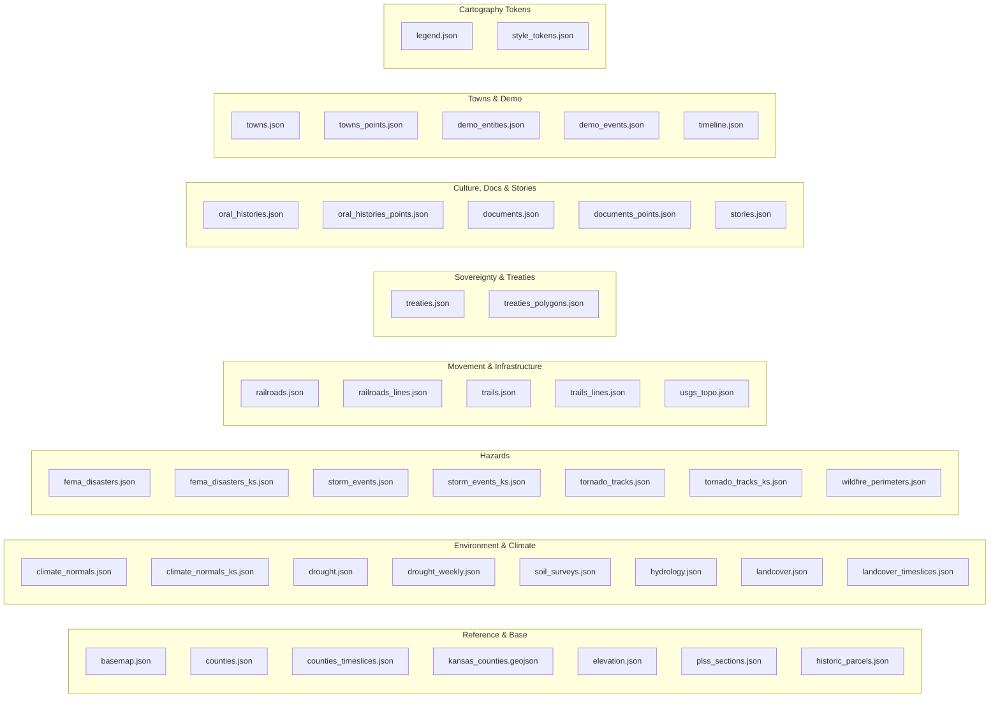

# Kansas-Frontier-Matrix — Web Data

This folder contains **layer configs** and **map data references** used by the web viewer (`web/`).  
Each `*.json` here is either:
- a **layer spec** (id, title, type, style, time, attribution) the viewer reads, or
- a **data file** (GeoJSON/JSON/COG references) used by that layer.

This directory is the **bridge** between archival data (STAC, raw GeoTIFFs, shapefiles) and the **interactive map UI**.

---

## How Layers Work (Schema)

```json
{
  "id": "unique_layer_id",
  "title": "Layer Title",
  "type": "vector | raster | image | raster-dem",
  "data": "data/processed/<file>.json | .geojson | .tif",
  "category": "reference | environment | hazards | movement | sovereignty | culture",
  "time": { "start": "YYYY-MM-DD", "end": "YYYY-MM-DD or null" },
  "timeProperty": "feature field (e.g., 'year', 'active')",
  "popup": ["field1", "field2", "..."],
  "style": { "fillColor": "#hex", "lineColor": "#hex", "lineWidth": 1.0 },
  "visible": true,
  "attribution": "Provenance / source"
}
````

* **Time** → global window or per-feature fields (`year` / `year_end`, `active` / `active_end`).
* **Vector layers** → stored as GeoJSON with typed properties.
* **Raster overlays** → referenced as Cloud-Optimized GeoTIFFs (COGs).
* **UI** → `app.js` reads configs, applies time slider, attaches popups, and controls visibility.

---

## Complete File Index

### Reference & Base

* `basemap.json` — Basemap configuration (OSM or style JSON).
* `counties.json` — Kansas county boundaries (static).
* `counties_timeslices.json` — Historical county slices (time-aware).
* `kansas_counties.geojson` — Raw county geometries.
* `elevation.json` — DEM/terrain layers and derivatives.
* `plss_sections.json` — PLSS township/section index.
* `historic_parcels.json` — Historic parcels / deeds.

### Environment & Climate

* `climate_normals.json` — Climate normals (global/CONUS).
* `climate_normals_ks.json` — Climate normals (Kansas subset).
* `drought.json` — Drought indices.
* `drought_weekly.json` — Weekly drought snapshots.
* `soil_surveys.json` — Soil survey data.
* `hydrology.json` — Rivers, streams, and waterbodies.
* `landcover.json` — Land cover (static).
* `landcover_timeslices.json` — NLCD time slices (1992–2021).

### Hazards

* `fema_disasters.json` — FEMA disaster declarations (national).
* `fema_disasters_ks.json` — FEMA disaster declarations (Kansas).
* `storm_events.json` — NOAA/NWS storm events (national).
* `storm_events_ks.json` — NOAA/NWS storm events (Kansas).
* `tornado_tracks.json` — Tornado tracks (national/global).
* `tornado_tracks_ks.json` — Tornado tracks (Kansas).
* `wildfire_perimeters.json` — Wildfire perimeters (2000–present).

### Movement & Infrastructure

* `railroads.json` — Railroad layer spec.
* `railroads_lines.json` — Railroad linework.
* `trails.json` — Historic trails (layer spec).
* `trails_lines.json` — Trail segments (GeoJSON).
* `usgs_topo.json` — USGS historic topo map COG overlays.

### Sovereignty & Treaties

* `treaties.json` — Treaty & reservation boundaries (layer spec).
* `treaties_polygons.json` — Treaty/reservation polygons (GeoJSON).

### Culture, Documents & Stories

* `oral_histories.json` — Oral history layer spec.
* `oral_histories_points.json` — Oral history points.
* `documents.json` — Archival documents (layer spec).
* `documents_points.json` — Document locations.
* `stories.json` — Narrative/story entries.

### Towns & Demo

* `towns.json` — Settlements, forts, trading posts (layer spec).
* `towns_points.json` — Towns/forts/trading posts (points).
* `demo_entities.json` — Small mixed demo entities (testing).
* `demo_events.json` — Demo timeline events (testing).
* `timeline.json` — Timeline events (global feed).

### Cartography tokens

* `legend.json` — Central symbol/color definitions.
* `style_tokens.json` — Shared UI/cartography tokens.

---

## Data Flow Overview

```mermaid
flowchart TD
  A["STAC Items<br/>(stac/items/*.json)"] --> B["Processed Data<br/>(data/processed/*.json, .geojson, .tif)"]
  B --> C["Layer Configs<br/>(web/data/*.json)"]
  C --> D["Web Viewer Logic<br/>(web/app.js)"]
  D --> E["MapLibre UI<br/>(Time Slider, Sidebar, Popups)"]

  classDef stac fill:#FFD166,stroke:#333,stroke-width:1px;
  classDef processed fill:#06D6A0,stroke:#333,stroke-width:1px;
  classDef webdata fill:#118AB2,stroke:#ffffff,stroke-width:1px;
  classDef viewer fill:#073B4C,stroke:#ffffff,stroke-width:1px;
  classDef ui fill:#EF476F,stroke:#ffffff,stroke-width:1px;

  class A stac;
  class B processed;
  class C webdata;
  class D viewer;
  class E ui;
```



---

## Thematic Organization of Files



---

## Contribution & QA

* Keep configs **lean and validated**; large data belongs in `data/processed/` + STAC.
* Align colors with `legend.json` and reuse `style_tokens.json`.
* Include **attribution** in each layer; add provenance to feature `properties.source`.
* Validate JSON/GeoJSON before commit (`jq . file.json`, `pytest -k web_configs`).

---

📌 **Key Concept:** `web/data/` is the **UI wiring layer** — it translates structured archives (STAC, processed GeoJSON/COGs) into an interactive timeline + map experience.

```
