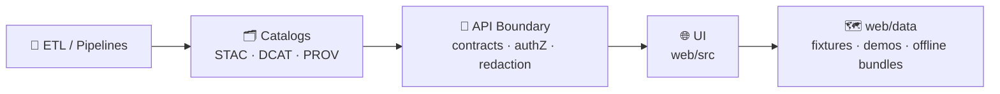
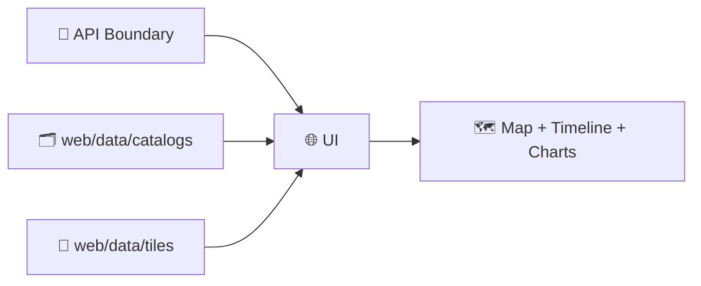

# 🗺️ KFM Web Data — `web/data/` (Frontend Data Assets)

<p align="left">
  
  
  
  
  
  
  
</p>

> [!IMPORTANT]
> **`web/data/` is not the production data lake.**  
> This folder is for **small, governed, UI-facing data assets**: demos, fixtures, tiny overlays, and **offline bundles** for local development.  
> Authoritative datasets live behind the **API boundary**, are **discoverable via catalogs** (STAC/DCAT), and carry **lineage** (PROV). 🧾🛡️

> [!TIP]
> 🚦 *Rule of thumb:* if a file in here can change a conclusion (risk, trend, anomaly, “where something is”), it must ship with **classification + provenance pointers + license + checksum**. ✅

---

## 📌 Table of contents

- [🎯 What belongs here (and what doesn’t)](#-what-belongs-here-and-what-doesnt)
- [🧭 Canonical pipeline alignment](#-canonical-pipeline-alignment-ui-assets-cannot-leapfrog)
- [🧠 Decision tree: commit vs pointer](#-decision-tree-commit-vs-pointer)
- [🧾 Policy metadata](#-policy-metadata)
- [📦 Recommended layout](#-recommended-layout)
- [🔍 How the UI discovers data](#-how-the-ui-discovers-data)
- [🧬 Governance rules](#-governance-rules-for-anything-committed-here)
- [🧾 Metadata conventions](#-metadata-conventions)
- [🧱 File format guidance](#-file-format-guidance-pick-the-right-tool)
- [🧭 CRS + tiling sanity](#-crs--tiling-sanity-dont-fight-the-map)
- [🧯 Security posture](#-security-posture-for-ui-assets)
- [⚡ Performance + storage budgets](#-performance--storage-budgets)
- [🧪 Fixtures discipline](#-fixtures-mock-payloads--test-payload-discipline)
- [➕ Golden path: add a dataset](#-adding-a-new-dataset-golden-path-)
- [✅ PR checklist](#-pr-checklist)
- [📚 Sources & influence map](#-sources--influence-map-uses-every-project-file)
- [📌 Quick start pointers](#-quick-start-pointers)

---

## 🎯 What belongs here (and what doesn’t)

### ✅ Good fits for `web/data/`

- 🧪 **Dev/test fixtures** (mock API responses, deterministic payloads, Storybook/MSW fixtures)
- 🗺️ **Tiny overlays** for UI demos (simplified boundaries, sample tracks, small time-series)
- 🧊 **Offline demo bundles** (PMTiles/MBTiles + metadata + checksums)
- 🛰️ **Preview artifacts** (thumbnails, low-res samples, *tiny* demo COGs)
- 🧾 **Catalog pointers** (STAC/DCAT/PROV JSON that references authoritative hosted assets)

### 🚫 Not allowed in `web/data/`

- 🔐 Secrets (tokens, API keys, credentials, signed URLs)
- 🧍‍♀️ PII or sensitive locations (unless explicitly approved and still access-controlled elsewhere)
- 🏋️ Huge datasets (multi‑GB rasters, full sensor archives, raw dumps)
- 🧬 “Source of truth” datasets that should be served by the backend (DB/object store + catalogs)

> [!NOTE]
> If you’re unsure: commit **pointers** (STAC/DCAT/PROV) first. Payloads are the exception. 🧾➡️📦

---

## 🧭 Canonical pipeline alignment (UI assets cannot leapfrog)

KFM has one governed order:

**ETL → Catalogs (STAC/DCAT/PROV) → Graph → API → UI → Story Nodes → Focus Mode**

`web/data/` sits at the **UI end**. That means:

- ✅ **Prefer pointers over payloads** (catalog records that reference hosted assets)
- ✅ If you must commit payloads: keep them **demo-sized** and **fully described**
- ✅ Never “promote” restricted inputs by accident: **no privacy downgrade**



> [!IMPORTANT]
> If the UI can display a layer that expresses a claim (anomaly, trend, risk, “this boundary is true”), that layer must carry a **provenance pointer** (`datasetId` + STAC/DCAT + PROV link). ✅🧾

---

## 🧠 Decision tree: commit vs pointer

**Default answer:** pointer.  
Only commit payloads when they are genuinely “UI demo” sized and safe.

```text
Do you need the UI to work offline / in CI with no backend?
 ├─ No  → ✅ Add STAC/DCAT/PROV pointer only
 └─ Yes →
      Is it sensitive / licensed-restricted / unclear source?
       ├─ Yes → 🚫 Do not commit payload → pointer only
       └─ No  →
            Is it > ~5 MB (GeoJSON) or > ~50 MB (tiles)?
             ├─ Yes → ✅ Host elsewhere + pointer (or tile it)
             └─ No  → ✅ Commit payload + metadata + sha256
```

---

## 🧾 Policy metadata

| Field | Value |
|---|---|
| Folder | `web/data/` |
| Purpose | UI fixtures, demo layers, offline demo bundles, catalog pointers |
| Default classification | `public` *(override per asset)* |
| Allowed classifications | `public` · `internal` · `confidential` · `restricted` |
| Integrity | **sha256 required** for offline bundles + fixtures used by CI |
| “No privacy downgrade” | **Required** (derived output cannot be less restricted than inputs) |
| Last updated | **2026-01-10** |

> [!TIP]
> If you don’t need `confidential`, don’t use it. But if you do use it, treat it as “restricted-lite”: same rigor, fewer constraints. 🧭

---

## 📦 Recommended layout

> [!NOTE]
> Keep `web/data/` **data-ish**.  
> Pure presentation assets (icons, sprites, glyphs, shaders, map style JSON) should live in `web/assets/`. 🎨

```text
🌐 web/
└── 📁 data/
    ├── 📁 catalogs/                 # 🧾 Pointers (preferred): STAC/DCAT/PROV manifests
    │   ├── 📁 stac/
    │   ├── 📁 dcat/
    │   └── 📁 prov/
    ├── 📁 layers/                   # 🗺️ Tiny overlays (GeoJSON/TopoJSON)
    │   ├── 📁 boundaries/
    │   ├── 📁 samples/
    │   └── 📁 graphs/               # 🕸️ Tiny graph JSON for demos (optional)
    ├── 📁 tiles/                    # 🧊 Offline bundles (PMTiles/MBTiles) + meta + sha256
    ├── 📁 rasters/                  # 🛰️ Thumbnails / tiny demo COGs (demo-only)
    ├── 📁 fixtures/                 # 🧪 Mock API responses + deterministic UI payloads
    ├── 📁 licenses/                 # 📜 Third-party license texts + attribution snippets
    ├── 📄 manifest.web_data.json    # 🧭 Optional UI index (catalog-shaped)
    └── 📘 README.md                 # 👋 you are here
```

> [!IMPORTANT]
> If an asset lives in `web/data/`, it should either:
> 1) be a **pointer** (STAC/DCAT/PROV), or  
> 2) be small enough to clone and safe enough to ship to a browser. ✅

---

## 🔍 How the UI discovers data

Discovery order (recommended):

1) ✅ **API endpoints** *(preferred; governed boundary)*  
2) ✅ **Catalog pointers** (`web/data/catalogs/**`) referencing hosted assets  
3) ⚠️ **Local demo bundles** (`web/data/tiles/**`, `web/data/layers/**`) *(offline/dev only)*



### 🎛️ Minimal “provenance pointer” requirement

Every UI-visible dataset (even demos) should expose at least one of:

- `datasetId` (stable ID in KFM namespace)
- STAC item/collection path
- DCAT dataset/distribution path
- PROV run reference (for derived outputs)

> [!TIP]
> Prefer STAC for spatial assets, DCAT for “dataset registry,” and PROV for “how it was made.” 🧬

---

## 🧬 Governance rules for anything committed here

### 1) Classification is mandatory 🏷️

Every asset needs a classification label:

- `public` — safe for public web demos  
- `internal` — intended for contributors only *(still treat as world-readable if repo is public)*  
- `confidential` — do not commit payload unless explicitly approved  
- `restricted` — do **not** commit payloads; pointer + policy + redaction path only

> [!CAUTION]
> If the repository is public, “internal” still leaks. Use “internal” as a review gate, not a secrecy guarantee. 🔒

### 2) Provenance is not optional 🧾

If the UI can display it, we must be able to answer:

- where did it come from?
- what transform produced it?
- what bbox/time window does it represent?
- what license governs it?
- what checksum verifies the exact bytes?

### 3) No privacy downgrade 🔒

Derived outputs **cannot** become public by accident.  
Aggregation and simplification are not a free pass.

### 4) Licensing & attribution 📜

If third‑party data is included (even clipped/simplified), include:

- license text/link in `web/data/licenses/`
- attribution string suitable for UI display (if required)
- source citation in metadata

---

## 🧾 Metadata conventions

### ✅ Preferred: STAC/DCAT/PROV pointers

If the asset is “real,” store only catalog pointers here:

- `web/data/catalogs/stac/**`
- `web/data/catalogs/dcat/**`
- `web/data/catalogs/prov/**`

### ✅ Minimal per-asset metadata file (when committing payloads)

Place a `*.meta.json` next to the file.

Example: `layers/boundaries/ks_counties_simplified.geojson.meta.json`

```json
{
  "datasetId": "kfm.ks.boundaries.counties.simplified.v1",
  "title": "Kansas Counties (Demo — Simplified)",
  "description": "Small simplified polygons for local dev and UI demos.",
  "classification": "public",
  "license": "CC-BY-4.0",
  "attribution": "REPLACE_ME (source + required attribution)",
  "crs": "EPSG:4326",
  "bbox": [-102.05, 36.99, -94.59, 40.00],
  "time": null,
  "rolesAllowed": ["public_viewer", "contributor", "admin"],
  "hashes": { "sha256": "REPLACE_ME" },
  "provenance": {
    "stac": "catalogs/stac/REPLACE_ME.json",
    "dcat": "catalogs/dcat/REPLACE_ME.json",
    "prov": "catalogs/prov/REPLACE_ME.json"
  },
  "quality": {
    "status": "demo",
    "notes": "Simplified for UI; not authoritative."
  },
  "aiAssisted": {
    "used": false,
    "notes": null
  }
}
```

> [!TIP]
> If uncertainty matters, add it explicitly (don’t imply certainty with point estimates):
> - `uncertainty.type` (interval/band/qualitative)  
> - `uncertainty.refs` (links to evidence artifacts / PROV run) 🎲📉

### 🧩 Recommended ID style

Keep IDs boring and stable:

`kfm.<scope>.<topic>.<variant?>.<time?>.v<major>`

Examples:
- `kfm.ks.ndvi.monthly.v1`
- `kfm.ks.boundaries.counties.simplified.v1`
- `kfm.ks.sim.flood_scenario_01.timestep_001.v1`

> [!NOTE]
> IDs should survive file moves. Rename paths if needed, but don’t churn IDs without a migration note. 🧱

---

## 🧱 File format guidance (pick the right tool)

### 🗺️ Vector overlays (UI)

| Use case | Recommended | Why |
|---|---|---|
| Tiny interactive overlays | GeoJSON | Inspectable + universal |
| Medium boundaries | TopoJSON | Smaller payloads; topology preserved |
| Dense datasets | Vector tiles (PMTiles/MBTiles) | Fast pan/zoom; scalable |

**Do’s ✅**
- simplify geometry for UI needs (keep topology sane)
- include stable feature IDs (`id` or `properties.kfm_id`)
- validate geometry validity before commit
- keep properties lean (no large blobs)

---

### 🛰️ Raster previews

| Use case | Recommended | Notes |
|---|---|---|
| Thumbnail | PNG/JPEG/WebP | Keep tiny + cacheable |
| Tiny demo raster | COG GeoTIFF | Progressive reads + overviews |
| Production raster | ❌ Not here | Host + reference via STAC |

**Do’s ✅**
- if you ship a demo COG: include overviews + explicit `nodata`
- don’t ship raw imagery archives here

---

### 🧊 Offline tiles (demo bundles)

| Use case | Format | Notes |
|---|---|---|
| Offline demo | **PMTiles** | Single-file; HTTP range friendly |
| Tooling-friendly pack | MBTiles | SQLite-based; broad ecosystem |

**Offline bundle requirements**
- `tiles.meta.json` (min/max zoom, bbox, attribution, version)
- `tiles.sha256` (or include in `manifest.web_data.json`)
- classification + license + provenance pointer

Example `tiles/ks_demo.pmtiles.meta.json`:

```json
{
  "datasetId": "kfm.ks.demo.tiles.basemap.v1",
  "classification": "public",
  "format": "pmtiles",
  "minZoom": 4,
  "maxZoom": 10,
  "bounds": [-102.05, 36.99, -94.59, 40.00],
  "attribution": "REPLACE_ME",
  "hashes": { "sha256": "REPLACE_ME" },
  "provenance": { "stac": "catalogs/stac/REPLACE_ME.json" }
}
```

> [!IMPORTANT]
> Offline bundles must be **small enough to clone**. If it’s big, it’s not a repo asset — it’s a hosted dataset with a pointer. 📦➡️🧾

---

### 🌍 Time-aware UI assets

If an asset is time-filterable in the UI (timeline slider, animations), it must declare:

- `time.start` / `time.end` *(or `datetime` for single instants)*
- time zone assumption if relevant
- aggregation window if derived (monthly, seasonal, etc.)

---

## 🧭 CRS + tiling sanity (don’t fight the map)

- 🌐 **EPSG:4326** is a safe interchange CRS for catalogs and many vectors.
- 🗺️ **EPSG:3857** is standard for web tiles.
- 🔁 Do reprojection at build time (ETL / packaging), not ad hoc in UI components.

> [!TIP]
> If a layer looks “shifted,” it’s usually CRS/axis-order. Fix the data, not the map widget. 🧭

---

## 🧯 Security posture for UI assets

`web/data/` is a **supply-chain surface**. Treat it like code.

### Threats to assume
- GeoJSON properties with XSS strings
- oversized geometries that freeze the browser
- poisoned binary bundles (MBTiles/PMTiles)
- “helpful” third‑party dumps with unclear licensing
- sneaky internal URLs embedded in manifests

### Defensive rules ✅
- escape strings by default (never render untrusted HTML)
- cap geometry complexity and simplify aggressively for UI demos
- validate JSON against schema; reject unknown fields when feasible
- checksum everything that’s binary or used by CI
- forbid secrets and signed URLs (scan in CI)

> [!WARNING]
> If an asset can’t be explained, verified, and licensed — it doesn’t go in `web/data/`. 🧱

---

## ⚡ Performance + storage budgets

**Keep payloads small**
- tile dense datasets
- use TopoJSON for boundaries when GeoJSON gets heavy
- keep raster previews tiny

**Budget heuristics (practical defaults)**
- GeoJSON demo layer: aim for **< 2–5 MB** *(uncompressed)*
- thumbnail: **< 200 KB**
- offline tile pack: **tens of MB**, not hundreds

**Cache friendliness**
- prefer versioned manifests and checksums
- avoid silent mutation of fixtures (version them when contracts change)

---

## 🧪 Fixtures (mock payloads) + test payload discipline

Use `web/data/fixtures/` for:

- mocked API responses
- deterministic payloads for UI tests
- Storybook/MSW handlers

**Rules**
- fixtures must be small + representative (no cherry-picked “perfect” data)
- fixtures must not include PII, secrets, or restricted content
- pin contract versions: `fixture.contractVersion`
- add a short README if the fixture shape is non-obvious

Example `fixtures/layers.search.v1.json` snippet:

```json
{
  "fixtureId": "kfm.fixture.layers.search.v1",
  "contractVersion": "api.layers.search.v1",
  "generatedAt": "2026-01-10",
  "data": {
    "items": []
  }
}
```

---

## ➕ Adding a new dataset (golden path ✅)

1) **Decide: payload vs pointer**
   - large/sensitive/unclear license → **pointer only**
   - tiny + safe demo → payload allowed

2) **Choose the right format**
   - vectors: GeoJSON → TopoJSON → tiles
   - rasters: thumbnail or tiny COG demo only
   - tiles: PMTiles for offline demos

3) **Add metadata + checksum**
   - `classification`, `license`, `attribution`, `bbox`, `sha256`
   - add provenance pointers (STAC/DCAT/PROV) when applicable

4) **Validate + sanity check**
   - open locally in the map
   - verify CRS/axis order
   - verify stable feature IDs

5) **Add attribution**
   - ensure UI can display required attribution strings

6) **Make it testable**
   - if it’s a fixture, add at least one UI test/snapshot so it can’t silently drift

---

## ✅ PR checklist

- [ ] No secrets, internal URLs, tokens, or signed URLs
- [ ] Classification label present (`public/internal/confidential/restricted`)
- [ ] License + attribution present (or pointer-only)
- [ ] sha256 present for binaries + fixtures used by CI
- [ ] Geometry complexity sane (no browser-melters)
- [ ] Time metadata present when time-filterable
- [ ] CRS declared; visual sanity check performed
- [ ] If new folder/category: README updated and rules clarified

---

## 📚 Sources & influence map (uses every project file)

> [!NOTE]
> This section is intentionally explicit: it maps **every project file** in the KFM library pack to a concrete `web/data/` expectation.  
> The goal is *boring consistency* with research-grade discipline. ✅🧾

<details>
<summary><strong>🧠 Expand: Influence map (all project files)</strong></summary>

| Project file | How it influences `web/data/` rules |
|---|---|
| `Kansas Frontier Matrix (KFM) – Comprehensive Technical Documentation.docx` | Canonical pipeline order, catalog-first posture, governed boundaries (UI ≠ authority), and data standards (GeoJSON/COG/Parquet + CRS hygiene) |
| `🌟 Kansas Frontier Matrix – Latest Ideas & Future Proposals.docx` | “Demo-first but governed” direction, offline packs, dual-format packaging patterns (analysis + visualization), and role-aware access expectations |
| `Data Spaces.pdf` | Pointer-over-payload mindset, classification/usage-control framing, and policy-as-code direction for data access rules |
| `Scalable Data Management for Future Hardware.pdf` | Interactive analytics requires cache-friendly payloads; favor tiling, summaries, and predictable manifests for performance |
| `PostgreSQL Notes for Professionals - PostgreSQLNotesForProfessionals.pdf` | Stable IDs + schema discipline; don’t ship DB-sized payloads to browsers; export/import rigor |
| `python-geospatial-analysis-cookbook.pdf` | Practical CRS pitfalls and GeoJSON conventions; encourages producing UI-friendly formats from governed stores (e.g., PostGIS → GeoJSON) |
| `making-maps-a-visual-guide-to-map-design-for-gis.pdf` | Map-as-argument discipline; demo layers must avoid misleading legends/symbolization and should remain interpretable |
| `Mobile Mapping_ Space, Cartography and the Digital - 9789048535217.pdf` | Offline/mobile constraints → small offline bundles, careful sensitivity handling, and performance budgets |
| `compressed-image-file-formats-jpeg-png-gif-xbm-bmp.pdf` | Correct preview formats and compression choices; thumbnails should be optimized and intentional |
| `Cloud-Based Remote Sensing with Google Earth Engine-Fundamentals and Applications.pdf` | Remote-sensing outputs should be referenced via STAC pointers; derived products need explicit methods/time windows |
| `responsive-web-design-with-html5-and-css3.pdf` | Mobile-first payload discipline: progressive loading, smaller assets, and responsive UX assumptions |
| `webgl-programming-guide-interactive-3d-graphics-programming-with-webgl.pdf` | 3D data is expensive and fragile; prefer pointers and tiny demos; treat loaders as hostile-input surfaces |
| `Understanding Statistics & Experimental Design.pdf` | Demo datasets must not be “too perfect”; include coverage/sample-size signals and avoid misleading comparisons |
| `graphical-data-analysis-with-r.pdf` | EDA-first fixtures: represent distributions/outliers honestly and keep exploratory realism |
| `regression-analysis-with-python.pdf` | If regression outputs appear in fixtures, include diagnostics fields and avoid “trendline = truth” UI defaults |
| `Regression analysis using Python - slides-linear-regression.pdf` | Lightweight guidance for regression UI fixture shapes (coeff tables, fit stats) without bloating payloads |
| `think-bayes-bayesian-statistics-in-python.pdf` | If uncertainty matters, include intervals/credible bands and avoid presenting point estimates as certainty |
| `Scientific Modeling and Simulation_ A Comprehensive NASA-Grade Guide.pdf` | Simulation artifacts must include assumptions + V&V posture; avoid shipping untraceable scenario results |
| `Generalized Topology Optimization for Structural Design.pdf` | Optimization outputs are parameter-sensitive; if demo assets show opt results, include objective/constraints metadata |
| `Spectral Geometry of Graphs.pdf` | If graph demos exist, keep tiny graph samples and avoid black-box “network claims” without evidence links |
| `ethical-hacking-and-countermeasures-secure-network-infrastructures.pdf` | Threat modeling posture: treat assets/manifests as attack surface; enforce scanning and allowlists |
| `Gray Hat Python - Python Programming for Hackers and Reverse Engineers (2009).pdf` | Defensive paranoia: never trust parsers/loaders; checksum binaries; constrain SVG/GeoJSON-like inputs |
| `concurrent-real-time-and-distributed-programming-in-java-threads-rtsj-and-rmi.pdf` | “Bounded work” discipline: avoid unbounded parsing/processing in the browser; enforce limits/timeouts |
| `Introduction to Digital Humanism.pdf` | Human-centered governance: privacy, dignity, transparency; don’t leak sensitive geography “for convenience” |
| `Principles of Biological Autonomy - book_9780262381833.pdf` | Systems thinking: feedback loops and constraints → governance is part of the system, not an add-on |
| `On the path to AI Law’s prophecies and the conceptual foundations of the machine learning age.pdf` | AI-derived assets must be labeled; include model cards/limits; accountability must be explicit |
| `Deep Learning for Coders with fastai and PyTorch - Deep.Learning.for.Coders.with.fastai.and.PyTorchpdf` | ML practicality: don’t commit weights; commit tiny demo predictions + model cards + provenance pointers |
| `A programming Books.pdf` | Contributor shelf: broad tooling/language reference pack for maintainers |
| `B-C programming Books.pdf` | Contributor shelf: reference pack (B–C) |
| `D-E programming Books.pdf` | Contributor shelf: reference pack (D–E) |
| `F-H programming Books.pdf` | Contributor shelf: reference pack (F–H) |
| `I-L programming Books.pdf` | Contributor shelf: reference pack (I–L) |
| `M-N programming Books.pdf` | Contributor shelf: reference pack (M–N) |
| `O-R programming Books.pdf` | Contributor shelf: reference pack (O–R) |
| `S-T programming Books.pdf` | Contributor shelf: reference pack (S–T); security posture reminders and safe defaults |
| `U-X programming Books.pdf` | Contributor shelf: reference pack (U–X) |

</details>

---

## 📌 Quick start pointers

- Need **catalog pointers**? ➜ `web/data/catalogs/` 🧾  
- Need **demo overlays**? ➜ `web/data/layers/` 🗺️  
- Need **offline tiles**? ➜ `web/data/tiles/` 🧊  
- Need **deterministic fixtures**? ➜ `web/data/fixtures/` 🧪  
- Need **presentation assets**? ➜ `web/assets/` 🎨  
- Need **real data**? ➜ **use the API boundary** (or reference via STAC/DCAT/PROV pointers) 🚪🛡️  

🧭 **Keep it small. Keep it governed. Keep it provenance-linked.** ✅🧾
