# 🗺️ KFM Web Data — `web/data/` (Frontend Data Assets)

<p align="left">
  
  
  
  
  
  
  
  
</p>

> [!IMPORTANT]
> **`web/data/` is not the production data lake.**  
> This folder holds **small, governed UI-facing assets** (demos, fixtures, styles, tiny overlays, offline tile bundles for local dev) — while real datasets remain served via the **API boundary** and referenced through **catalogs** (STAC/DCAT/PROV). 🧾🛡️

---

## 🔗 Quick links
- [🎯 What belongs here (and what doesn’t)](#-what-belongs-here-and-what-doesnt)
- [🧭 Canonical pipeline alignment](#-canonical-pipeline-alignment-ui-assets-cannot-leapfrog)
- [🧾 Policy metadata](#-policy-metadata)
- [📦 Recommended layout](#-recommended-layout)
- [🧭 How the UI discovers data](#-how-the-ui-should-discover-data)
- [🧬 Governance rules for committed assets](#-governance-rules-for-anything-committed-here)
- [🧾 Dataset metadata conventions](#-dataset-metadata-conventions)
- [🧱 File format guidance](#-file-format-guidance-pick-the-right-tool)
- [🧭 CRS + tiling sanity](#-crs--tiling-sanity-dont-fight-the-map)
- [🧯 Security posture for UI assets](#-security-posture-for-ui-assets)
- [⚡ Performance + storage budgets](#-performance--storage-budgets)
- [🧪 Fixtures + test payload discipline](#-fixtures-mock-payloads--test-payload-discipline)
- [➕ Adding a new dataset (golden path)](#-adding-a-new-dataset-golden-path-)
- [📚 Sources & influence map](#-sources--influence-map)
- [📌 Quick start pointers](#-quick-start-pointers)

---

## 🎯 What belongs here (and what doesn’t)

### ✅ Good fits for `web/data/`
- 🧪 **Dev/test fixtures** (mock API responses, small sample GeoJSON, Storybook/MSW payloads)
- 🗺️ **Map UI configuration** (MapLibre style JSON, sprites, fonts, legends, layer catalogs)
- 🧊 **Small “preview” datasets** for demos (simplified boundaries, tiny time-series, sample results)
- 📦 **Offline-friendly tile bundles** for local demos (MBTiles/PMTiles + metadata + checksums)
- 🛰️ **Thumbnails / low-res previews** (NOT full remote-sensing archives)
- 🧾 **Catalog pointers**: STAC/DCAT/PROV manifests that let the UI discover authoritative assets elsewhere

### 🚫 Not allowed in `web/data/`
- 🔐 **Secrets** (API keys, service creds, tokens)  
- 🧍‍♂️ **PII / sensitive locations / restricted layers** *(unless explicitly approved and access-controlled elsewhere)*
- 🏋️ **Huge datasets** (raw imagery, multi‑GB rasters, full sensor archives)
- 🧬 **Authoritative domain data** that must be governed by backend catalogs/DB/object storage

> [!TIP]
> Think of `web/data/` as **“UI assets + demos + fixtures”**, not “the source of truth.” 
> Production data should be **served** (and redacted) by the API boundary — and referenced here via **catalog pointers**.

---

## 🧭 Canonical pipeline alignment (UI assets cannot leapfrog)

KFM has one governed order:

**ETL → Catalogs (STAC/DCAT/PROV) → Graph → API → UI**

`web/data/` sits at the UI end, so it must obey:

- ✅ **Prefer pointers over payloads:** store STAC/DCAT/PROV *references* to real assets
- ✅ **If you must commit a payload:** keep it demo-sized + provenance-tagged + checksummed
- ✅ **Never “promote” restricted inputs:** aggregation doesn’t automatically make something public

> [!IMPORTANT]
> If a dataset supports a UI claim (e.g., “anomaly”, “trend”, “risk”), it must have a **provenance pointer** (datasetId + STAC/DCAT + PROV link).

---

## 🧾 Policy metadata

| Field | Value |
|---|---|
| Folder | `web/data/` |
| Purpose | UI data assets, fixtures, offline demo bundles |
| Default classification | `public` *(override explicitly per dataset)* |
| Allowed classifications | `public` · `internal` · `restricted` *(restricted should not live here without explicit approval)* |
| Integrity | checksums required for offline bundles + published fixtures |
| Last updated | **2026-01-06** |

---

## 📦 Recommended layout

```text
🌐 web/
└── 📁 data/
    ├── 📁 catalogs/                 # 🧾 Pointers (preferred): STAC/DCAT/PROV manifests
    │   ├── 📁 stac/                 # 🗂️ STAC catalogs/collections/items
    │   ├── 📁 dcat/                 # 🧾 DCAT datasets/distributions
    │   └── 📁 prov/                 # 🔗 PROV run lineage (per demo asset/run)
    ├── 📁 layers/                   # 🗺️ Small vector overlays (GeoJSON/TopoJSON)
    │   ├── 📁 boundaries/
    │   ├── 📁 samples/
    │   └── 📁 graphs/               # 🕸️ Tiny graph JSON for demos (optional)
    ├── 📁 tiles/                    # 🧊 Offline bundles (MBTiles/PMTiles) + manifests + checksums
    ├── 📁 rasters/                  # 🛰️ Thumbnails / low-res previews / tiny COGs (demo-only)
    ├── 📁 styles/                   # 🎨 MapLibre styles, sprites, fonts, legends, palettes
    ├── 📁 fixtures/                 # 🧪 Mock API responses + deterministic test payloads
    ├── 📁 licenses/                 # 📜 Third-party license text + attribution snippets
    ├── 📄 manifest.json             # 🧭 Optional UI convenience index (catalog-shaped)
    └── 📄 README.md                 # 📘 you are here
```

> [!NOTE]
> If your repo layout differs, keep the **intent**:
> - metadata & provenance near the asset  
> - demo payloads tiny  
> - production datasets stay in backend stores

---

## 🧭 How the UI should discover data

Discovery order (recommended):

1) ✅ **API endpoints** (preferred; governed boundary)  
2) ✅ **Catalog pointers** (`STAC/DCAT/PROV`) that reference hosted assets  
3) ⚠️ **Local demo bundles** (offline dev / smoke tests only)

```mermaid
flowchart LR
  A["🧾 Catalog pointers<br/>(web/data/catalogs)"] --> B["🌐 UI (web/src)"]
  C["🔐 API Boundary<br/>(contracts + authZ + redaction)"] --> B
  D["🧊 Offline tiles<br/>(web/data/tiles)"] --> B
  B --> E["🗺️ Map + Timeline + Charts"]
```



> [!IMPORTANT]
> When a layer expresses a claim (e.g., “NDVI anomaly”), it must expose a **provenance pointer** (datasetId, STAC item, or PROV link) so the UI can surface evidence.

---

## 🧬 Governance rules for anything committed here

### 1) Classification is mandatory 🏷️
Every asset (even a tiny demo GeoJSON) must declare classification:
- `public`
- `internal`
- `restricted` *(avoid; approval required)*

### 2) Provenance is not optional 🧾
If the UI can display it, we must be able to answer:
- where did this come from?
- what transform produced it?
- what time window + bbox does it represent?
- what license governs it?

### 3) “No privacy downgrade” rule 🔒
Derived outputs cannot become public by accident if inputs were restricted.

### 4) Licenses & attribution 📜
If you include third-party data (even a clip), include:
- license text or link in `web/data/licenses/`
- attribution string (for map UI display if required)
- source citation in metadata

> [!CAUTION]
> If licensing is unclear, **don’t commit the dataset**. Commit a **pointer** (STAC/DCAT record) to a compliant storage location instead.

---

## 🧾 Dataset metadata conventions

### ✅ Minimal metadata file (per committed dataset)
Place `dataset.meta.json` (or a STAC item/collection) next to the asset.

```json
{
  "id": "kfm.demo.boundaries.ks_counties.v1",
  "title": "Kansas Counties (Demo Simplified)",
  "description": "Small, simplified polygons for UI dev and demos.",
  "classification": "public",
  "license": "CC-BY-4.0",
  "crs": "EPSG:4326",
  "bbox": [-102.05, 36.99, -94.59, 40.00],
  "time": null,
  "source": {
    "name": "Example Source",
    "ref": "REPLACE_ME"
  },
  "checksums": {
    "sha256": "REPLACE_ME"
  },
  "provenance": {
    "stac": "catalogs/stac/collection.json",
    "dcat": "catalogs/dcat/dataset.json",
    "prov": "catalogs/prov/run.json"
  }
}
```

> [!TIP]
> Prefer **STAC** for geospatial assets whenever feasible, because it scales cleanly from “demo file” to “real catalog.”

### 🗂️ Recommended ID style
Keep IDs boring and stable:

`kfm.<scope>.<topic>.<time?>.<variant?>.v<major>`

Examples:
- `kfm.ks.ndvi.monthly.v1`
- `kfm.ks.boundaries.counties.simplified.v1`
- `kfm.ks.sim.flood_scenario_01.timestep_001.v1`

---

## 🧱 File format guidance (pick the right tool)

### 🗺️ Vector overlays
| Use case | Recommended format | Why |
|---|---|---|
| Small interactive layers | GeoJSON | Simple, inspectable, universal |
| Medium/large boundaries | TopoJSON | Smaller payloads, preserves topology |
| Big vectors | PMTiles/MBTiles vector tiles | Fast pan/zoom, scalable |

**Do’s ✅**
- simplify geometry for UI needs (keep topology sane)
- include stable feature IDs (`id`, `fid`, or `properties.kfm_id`)
- validate GeoJSON before committing (schema + geometry validity)
- keep properties lean (no giant blobs in `properties`)

---

### 🛰️ Raster previews
| Use case | Recommended format | Notes |
|---|---|---|
| Thumbnails / preview | PNG/JPEG | keep tiny, optimized |
| “Tiny demo raster” | COG GeoTIFF | supports progressive reads |
| Production raster | **not here** | host + reference via STAC |

**Do’s ✅**
- prefer **Cloud Optimized GeoTIFF (COG)** for anything meant to stream progressively
- keep demo rasters small (MBs, not GBs)
- include overview pyramids if the demo is meant to “feel real”

---

### 🧊 Offline tiles
| Use case | Format | Notes |
|---|---|---|
| Local dev demo | PMTiles | single-file, range-request friendly |
| Offline pack | MBTiles | SQLite; common tooling support |

**Offline rules**
- include a `tiles.meta.json` and checksum file
- include min/max zoom, bbox, layer attribution, and version
- keep offline packs *small enough to clone*

---

### 🌍 3D & time-dynamic assets
| Use case | Recommended format |
|---|---|
| Time-dynamic tracks | CZML |
| Lightweight overlays | KML/KMZ *(prefer pointer unless tiny)* |
| 3D Tiles | 3D Tiles *(store externally; reference via STAC/links)* |

> [!CAUTION]
> Treat 3D assets as **untrusted input**. Keep loaders isolated and avoid loading arbitrary third-party models without validation.

---

### 🖼️ Images (legends, thumbnails, UI assets)
| Use case | Format | Why |
|---|---|---|
| Icons, symbols | SVG | scales perfectly |
| UI sprites, crisp overlays | PNG | lossless, sharp |
| Photos & heavy imagery | JPEG | smaller |
| Legacy/simple animation | GIF *(avoid if possible)* | heavy; prefer modern alternatives |
| Rare legacy | XBM/BMP *(avoid)* | huge/legacy |

**Rules**
- keep thumbnails small and cacheable
- don’t store large image sets in `web/data/` if they can be generated on demand or referenced

---

## 🧭 CRS + tiling sanity (don’t fight the map)

- 🌐 **WGS84 (EPSG:4326)** is the safe interchange CRS for cataloging and many vector assets.
- 🗺️ **Web Mercator (EPSG:3857)** is standard for web tiles.
- 🔁 Do transformations at boundaries (ingest/build steps), not ad-hoc inside UI components.

> [!TIP]
> If a layer looks “shifted,” it’s almost always CRS mismatch or axis-order issues. Fix the data, not the UI.

---

## 🧯 Security posture for UI assets

`web/data/` is a supply-chain surface area. Treat it like code.

### Threats to assume
- malicious GeoJSON properties (XSS strings)
- oversized geometries causing OOM/slowdown
- tricked URLs in manifests
- poisoned binary bundles (MBTiles/PMTiles)
- “helpful” third-party assets with unclear license

### Defensive rules ✅
- escape strings by default (never render untrusted HTML)
- limit geometry complexity (vertex caps; simplification)
- validate JSON against schemas; reject unexpected fields when practical
- keep binary assets minimal and sourced; checksum everything
- prefer pointers to externally hosted assets with governance controls

> [!IMPORTANT]
> If an asset can’t be explained, verified, and licensed — it doesn’t go in `web/data/`.

---

## ⚡ Performance + storage budgets

**Keep payloads small:**
- split big files into tiles (avoid megabyte GeoJSON blobs)
- prefer vector tiles for dense features
- compress and cache (gzip/brotli when served; PMTiles/MBTiles for offline)

**Keep rendering stable:**
- don’t reload styles for minor state changes
- cache decoded GeoJSON and memoize derived data
- avoid huge textures and high-poly meshes

**Budget heuristics (practical defaults)**
- GeoJSON demo layer: aim for **< 2–5 MB** uncompressed
- thumbnail: **< 200 KB**
- offline tile pack: **small enough to clone** (prefer tens of MB, not hundreds)

---

## 🧪 Fixtures (mock payloads) + test payload discipline

Use `web/data/fixtures/` for:
- mocked API responses for local dev
- deterministic test payloads for UI components
- Storybook/MSW handlers

**Rules**
- fixtures must be **small** and **representative**
- fixtures must not contain secrets, tokens, or PII
- include a short `README.md` per fixture set if non-obvious
- version fixtures when contracts change (don’t silently mutate)

---

## ➕ Adding a new dataset (golden path ✅)

1) **Decide: local file vs pointer**
   - big or sensitive → add a **catalog pointer**, don’t commit the payload
   - small and purely for UI dev → proceed with commit

2) **Choose the right format**
   - vectors: GeoJSON → TopoJSON → tiles as size grows  
   - rasters: PNG/JPEG preview or tiny COG demo only  
   - 3D: pointer unless tiny demo-only

3) **Add metadata**
   - classification, license, source, bbox, checksum
   - STAC/DCAT/PROV pointers when applicable

4) **Validate + sanity check**
   - open in map locally
   - verify CRS/axis order
   - verify feature IDs are stable

5) **Add attribution**
   - ensure UI can display required attribution strings (legend/footer)

6) **Keep it testable**
   - if used as fixture, add a small test/snapshot so it can’t silently drift

---

## 📚 Sources & influence map

> 🧠 Requirement: this section intentionally maps **every project file** to a concrete rule or expectation for `web/data/`.

| Project file | How it influences `web/data/` rules |
|---|---|
| `Kansas Frontier Matrix (KFM) – Comprehensive Engineering Design.docx` | Canonical pipeline order; API-boundary governance; “evidence over vibes”; classification and redaction posture |
| `Latest Ideas.docx` | Catalog QA mindset; stable extensions posture; operational gates (checksums, link checks) and “demo-first but governed” approach |
| `Cloud-Based Remote Sensing with Google Earth Engine-Fundamentals and Applications.pdf` | Remote-sensing outputs: composites, time-series pointers, tile-first previews, sensor provenance expectations |
| `Mobile Mapping_ Space, Cartography and the Digital - 9789048535217.pdf` | Offline bundles + mobile constraints; treat location/context as sensitive; keep payloads small and interaction-friendly |
| `making-maps-a-visual-guide-to-map-design-for-gis.pdf` | Symbolization/legend assets; map-as-argument discipline; readability for demo layers and basemap styling |
| `python-geospatial-analysis-cookbook.pdf` | CRS sanity; vector/raster conventions; practical geospatial pitfalls; PostGIS-friendly patterns for IDs/bboxes |
| `PostgreSQL Notes for Professionals - PostgreSQLNotesForProfessionals.pdf` | Stable IDs, paging/filter mindset; avoid shipping DB-sized payloads; export/import discipline |
| `Scalable Data Management for Future Hardware.pdf` | Streaming and locality mindset; avoid huge frontend payloads; caching/budget discipline |
| `Data Spaces.pdf` | “Pointer over payload” philosophy; interoperability, trust signals, provenance and sharing constraints |
| `compressed-image-file-formats-jpeg-png-gif-xbm-bmp.pdf` | Explicit image format choices and why; avoid huge/legacy formats; keep previews optimized |
| `responsive-web-design-with-html5-and-css3.pdf` | Mobile-first constraints → smaller assets, progressive enhancement, careful bundling of offline packs |
| `webgl-programming-guide-interactive-3d-graphics-programming-with-webgl.pdf` | 3D assets are expensive and fragile; keep models small; treat WebGL content as untrusted input; degrade gracefully |
| `ethical-hacking-and-countermeasures-secure-network-infrastructures.pdf` | Threat modeling posture for assets and manifests; XSS/injection awareness; safe handling practices |
| `Gray Hat Python - Python Programming for Hackers and Reverse Engineers (2009).pdf` | Defensive mindset: hostile inputs, avoid trusting metadata, reduce attack surface; checksum and provenance discipline |
| `concurrent-real-time-and-distributed-programming-in-java-threads-rtsj-and-rmi.pdf` | “Bounded work” discipline: avoid unbounded parsing/processing in browser; enforce limits and timeouts |
| `Scientific Modeling and Simulation_ A Comprehensive NASA-Grade Guide.pdf` | Simulation outputs need V&V posture; store scenario/run metadata + assumptions; don’t ship untraceable results |
| `Understanding Statistics & Experimental Design.pdf` | Avoid misleading demo datasets; include sample size/coverage; treat fixtures as “experimental artifacts” with metadata |
| `graphical-data-analysis-with-r.pdf` | EDA-first fixtures: distributions/outliers; make demo payloads representative and not cherry-picked |
| `regression-analysis-with-python.pdf` | Regression outputs need diagnostics/residuals; fixtures should include enough fields to validate model claims |
| `Regression analysis using Python - slides-linear-regression.pdf` | Quick-reference fixture shapes for regression UI (coeff tables, fit summaries) without bloating payloads |
| `think-bayes-bayesian-statistics-in-python.pdf` | If uncertainty is in scope, fixtures should include credible intervals/priors and avoid presenting point estimates as truth |
| `On the path to AI Law’s prophecies and the conceptual foundations of the machine learning age.pdf` | AI-derived assets must be labeled; keep model cards/limits; don’t bury accountability in data blobs |
| `Deep Learning for Coders with fastai and PyTorch - Deep.Learning.for.Coders.with.fastai.and.PyTorchpdf` | Model artifacts don’t belong here (weights); only tiny demo predictions + model cards, with versioning and provenance |
| `Introduction to Digital Humanism.pdf` | Human-centered governance: privacy, sovereignty, transparency; don’t leak sensitive geography by convenience |
| `Principles of Biological Autonomy - book_9780262381833.pdf` | Systems thinking: feedback loops and constraints; treat governance as part of the system, not an afterthought |
| `Generalized Topology Optimization for Structural Design.pdf` | Optimization outputs are parameter-sensitive; if demo assets show opt results, include objective/constraints metadata and versioning |
| `Spectral Geometry of Graphs.pdf` | If graph demos exist, keep tiny graph JSON samples; include evidence links; avoid black-box “network claims” |
| `A programming Books.pdf` | Contributor shelf: general references for tooling/languages; helps maintainers navigate ecosystem choices |
| `B-C programming Books.pdf` | Contributor shelf (B–C): reference pack coverage |
| `D-E programming Books.pdf` | Contributor shelf (D–E): reference pack coverage |
| `F-H programming Books.pdf` | Contributor shelf (F–H): reference pack coverage |
| `I-L programming Books.pdf` | Contributor shelf (I–L): reference pack coverage |
| `M-N programming Books.pdf` | Contributor shelf (M–N): reference pack coverage |
| `O-R programming Books.pdf` | Contributor shelf (O–R): reference pack coverage |
| `S-T programming Books.pdf` | Contributor shelf (S–T): reference pack coverage |
| `U-X programming Books.pdf` | Contributor shelf (U–X): reference pack coverage |

---

## 📌 Quick start pointers

- Need map styles? ➜ `web/data/styles/` 🎨 
- Need demo layers? ➜ `web/data/layers/` 🗺️  
- Need offline tiles? ➜ `web/data/tiles/` 🧊  
- Need deterministic UI mocks? ➜ `web/data/fixtures/` 🧪  
- Need “real data”? ➜ **use the API** (or reference via STAC/DCAT in `web/data/catalogs/`) 🛡️🧾  

🧭 **Keep it small. Keep it governed. Keep it provenance-linked.**