<!--
📌 `web/data/` is the **frontend’s governed “small data” surface** — fixtures, demos, offline bundles, and catalog pointers.
🗓️ Last updated: 2026-01-13
🔐 Reminder: Public repo = public bytes. “Internal” is a review gate, not secrecy.
🧾 KFM invariant: **ETL → Catalogs (STAC/DCAT/PROV) → Graph → API → UI → Story Nodes → Focus Mode**
-->

<div align="center">

# 🗺️ KFM Web Data — `web/data/` (Frontend Data Assets)

**Small, governed, UI-facing assets for demos, fixtures, and offline bundles — with provenance pointers and integrity signals.**  
Pointer-over-payload 🧾 • Catalog-first 🗂️ • Deterministic ♻️ • Hostile-input aware 🛡️ • No privacy downgrade 🔒


</div>

> [!IMPORTANT]
> **`web/data/` is not the production data lake.**  
> This folder is for **small, governed, browser-safe assets**: fixtures, tiny overlays, and **offline demo bundles**.  
> Authoritative datasets live behind the **API boundary**, are discoverable via **catalogs** (STAC/DCAT), and carry **lineage** (PROV). 🧾🛡️

> [!IMPORTANT]
> **UI must not leapfrog the pipeline.**  
> The frontend **must never** query the graph directly and must not “publish-looking” data without STAC/DCAT/PROV and governance checks. (See v13 invariants.)  [oai_citation:0‡MARKDOWN_GUIDE_v13.md.gdoc](file-service://file-UYVruFXfueR8veHMUKeugU)

---

## 🔗 Quick links
- 🧭 Repo overview: **[`../../README.md`](../../README.md)**
- 🌐 Web boundary: **[`../README.md`](../README.md)** *(if present)*
- 📦 Data + metadata boundary: **[`../../data/README.md`](../../data/README.md)** *(if present)*
- 🛠️ Tooling/validators: **[`../../tools/README.md`](../../tools/README.md)** *(if present)*
- 🧰 Automation helpers: **[`../../scripts/README.md`](../../scripts/README.md)** *(if present)*

---

<details>
<summary><b>🧭 Table of contents</b></summary>

- [🧾 Doc metadata](#-doc-metadata)
- [🚦 Non-negotiables](#-non-negotiables)
- [🎯 What belongs here (and what doesn’t)](#-what-belongs-here-and-what-doesnt)
- [🧭 Canonical pipeline alignment](#-canonical-pipeline-alignment-ui-assets-cannot-leapfrog)
- [🧠 Decision tree: commit vs pointer](#-decision-tree-commit-vs-pointer)
- [📦 Recommended layout](#-recommended-layout)
- [🔍 How the UI discovers data](#-how-the-ui-discovers-data)
- [🧾 Asset contracts](#-asset-contracts-pointers-payloads-and-manifests)
- [🧬 Governance rules](#-governance-rules-for-anything-committed-here)
- [🧾 Metadata conventions](#-metadata-conventions)
- [🧱 File format guidance](#-file-format-guidance-pick-the-right-tool)
- [🧭 CRS + tiling sanity](#-crs--tiling-sanity-dont-fight-the-map)
- [🕰️ Time-aware UI assets](#️-time-aware-ui-assets)
- [🧯 Security posture](#-security-posture-for-ui-assets)
- [⚡ Performance + storage budgets](#-performance--storage-budgets)
- [🧪 Fixtures discipline](#-fixtures-mock-payloads--test-payload-discipline)
- [➕ Golden path: add an asset](#-adding-a-new-asset-golden-path-)
- [✅ PR checklist](#-pr-checklist)
- [📚 Sources & influence map](#-sources--influence-map-uses-every-project-file)
- [🕰️ Version history](#️-version-history)
- [📌 Quick start pointers](#-quick-start-pointers)

</details>

---

## 🧾 Doc metadata

| Field | Value |
|---|---|
| Doc | `web/data/README.md` |
| Status | Active ✅ |
| Last updated | **2026-01-13** |
| Audience | UI engineers · GIS/data contributors · QA reviewers · story authors (fixtures) |
| Prime directive | **Prefer pointers. If you must ship payloads, ship them governed.** |
| Default posture | deny-by-default 🛡️ · no privacy downgrade 🔒 · provenance-first 🧾 |

---

## 🚦 Non-negotiables

- 🧾 **Pointer-over-payload is the default.** If you can reference via STAC/DCAT/PROV, do that.
- 🚪 **API boundary is law.** UI consumes governed APIs; it **never** reads the graph directly.  [oai_citation:1‡MARKDOWN_GUIDE_v13.md.gdoc](file-service://file-UYVruFXfueR8veHMUKeugU)
- 🏷️ **Classification is mandatory.** Every committed asset must declare a classification label.
- 🔒 **No privacy downgrade.** Derived/public demos cannot be “less restricted” than any upstream source without a documented redaction/generalization step.  [oai_citation:2‡MARKDOWN_GUIDE_v13.md.gdoc](file-service://file-UYVruFXfueR8veHMUKeugU)
- 🔐 **No secrets, no signed URLs, no internal endpoints** in fixtures or manifests.
- 🧪 **Hostile input assumption.** Treat GeoJSON, JSON, MBTiles/PMTiles, images, and 3D as adversarial payloads.
- 🧊 **Keep the repo cloneable.** If it’s big, it’s not a `web/data/` payload — host it and point to it.

---

## 🎯 What belongs here (and what doesn’t)

### ✅ Good fits for `web/data/`
- 🧪 **Dev/test fixtures** (mock API responses, deterministic payloads, Storybook/MSW fixtures)
- 🗺️ **Tiny overlays** for UI demos (simplified boundaries, sample tracks, small time-series)
- 🧊 **Offline demo bundles** (PMTiles/MBTiles) **+ metadata + sha256**
- 🛰️ **Preview artifacts** (thumbnails, low-res samples, *tiny* demo COGs)
- 🧾 **Catalog pointers** (STAC/DCAT/PROV JSON referencing authoritative hosted assets)

### 🚫 Not allowed in `web/data/`
- 🔐 Secrets (tokens, API keys, credentials, signed URLs)
- 🧍‍♀️ PII or sensitive locations (unless explicitly approved *and* still access-controlled elsewhere)
- 🏋️ Huge datasets (multi‑GB rasters, full sensor archives, raw dumps)
- 🧬 “Source of truth” datasets that belong behind backend governance (DB/object store + catalogs)

> [!NOTE]
> If you’re unsure: commit **pointers** first. Payloads are the exception. 🧾➡️📦

---

## 🧭 Canonical pipeline alignment (UI assets cannot leapfrog)

KFM has one governed order:

**ETL → Catalogs (STAC/DCAT/PROV) → Graph → API → UI → Story Nodes → Focus Mode**

`web/data/` lives at the **UI end**, meaning:

- ✅ Prefer **catalog pointers** over shipped bytes
- ✅ If payloads are necessary: keep them **small**, **safe**, and **fully described**
- ✅ Demo ≠ authority: everything “claim-shaped” must point back to evidence

```mermaid
flowchart LR
  ETL["🧰 ETL / Pipelines"] --> CAT["🗂️ Catalogs<br/>STAC · DCAT · PROV"]
  CAT --> G["🕸️ Graph<br/>(references catalogs)"]
  G --> API["🚪 API Boundary<br/>contracts · authZ · redaction"]
  API --> UI["🌐 UI<br/>web/src"]
  UI --> WD["🗺️ web/data<br/>fixtures · demos · offline bundles"]
```



> [!IMPORTANT]
> If the UI can display a layer that expresses a claim (anomaly, trend, risk, “this boundary is true”), that layer must carry a **provenance pointer** (`datasetId` + STAC/DCAT + PROV link). ✅🧾

---

## 🧠 Decision tree: commit vs pointer

**Default answer:** pointer.  
Only commit payloads when they are genuinely “UI demo” sized and safe.

```text
Do you need the UI to work offline / in CI with no backend?
 ├─ No  → ✅ Add STAC/DCAT/PROV pointer only
 └─ Yes →
      Is it sensitive / licensed-restricted / unclear source?
       ├─ Yes → 🚫 Do not commit payload → pointer only
       └─ No  →
            Is it > ~5 MB (GeoJSON) or > ~50 MB (tiles)?
             ├─ Yes → ✅ Host elsewhere + pointer (or tile it)
             └─ No  → ✅ Commit payload + metadata + sha256 + attribution
```

---

## 📦 Recommended layout

> [!NOTE]
> Keep `web/data/` **data-ish**.  
> Pure presentation assets (icons, sprites, glyphs, shaders, map styles) belong in `web/assets/`. 🎨

```text
🌐 web/
└── 📁 data/
    ├── 📁 catalogs/                 # 🧾 Pointers (preferred): STAC/DCAT/PROV snapshots
    │   ├── 📁 stac/
    │   ├── 📁 dcat/
    │   └── 📁 prov/
    ├── 📁 layers/                   # 🗺️ Tiny overlays (GeoJSON/TopoJSON)
    │   ├── 📁 boundaries/
    │   ├── 📁 samples/
    │   └── 📁 graphs/               # 🕸️ Tiny graph JSON for demos (optional)
    ├── 📁 tiles/                    # 🧊 Offline bundles (PMTiles/MBTiles) + meta + sha256
    ├── 📁 rasters/                  # 🛰️ Thumbnails / tiny demo COGs (demo-only)
    ├── 📁 models_3d/                # 🧱 Tiny demo 3D assets (glTF/GLB) + meta + checksums
    ├── 📁 fixtures/                 # 🧪 Mock API responses + deterministic UI payloads
    ├── 📁 licenses/                 # 📜 Third-party license texts + attribution snippets
    ├── 📄 manifest.web_data.json    # 🧭 Optional UI index (catalog-shaped)
    └── 📘 README.md                 # 👋 you are here
```

> [!IMPORTANT]
> If an asset lives in `web/data/`, it must either:
> 1) be a **pointer** (STAC/DCAT/PROV), or  
> 2) be small enough to clone and safe enough to ship to a browser. ✅

---

## 🔍 How the UI discovers data

Discovery order (recommended):

1) ✅ **API endpoints** *(preferred; governed boundary)*  
2) ✅ **Catalog pointers** (`web/data/catalogs/**`) referencing hosted assets  
3) ⚠️ **Local demo bundles** (`web/data/tiles/**`, `web/data/layers/**`) *(offline/dev only)*

```mermaid
flowchart LR
  API["🚪 API Boundary"] --> UI["🌐 UI"]
  CAT["🗂️ web/data/catalogs"] --> UI
  OFF["🧊 web/data/tiles + layers"] --> UI
  UI --> MAP["🗺️ Map + Timeline + Charts + Story/Focus Panels"]
```



### 🎛️ Minimal “provenance pointer” requirement (UI-visible == traceable)

Every UI-visible dataset (even demos) must expose at least one of:

- `datasetId` (stable ID in KFM namespace)
- STAC item/collection reference
- DCAT dataset/distribution reference
- PROV run reference (for derived outputs)

> [!TIP]
> Prefer **STAC** for spatial assets, **DCAT** for dataset registry/discovery, and **PROV** for “how it was made.” 🧬

### 🧠 Story Nodes & Focus Mode note (UI hygiene)

KFM stories are authored as **Markdown + JSON config**, rendered to HTML in the UI, and may include citations/links — which must be sanitized and treated as untrusted input.  [oai_citation:3‡Kansas Frontier Matrix (KFM) – Comprehensive Technical Documentation.pdf](file-service://file-AkqwUuYPp5zePf7pv5SMxi)  
Focus Mode AI is optional and evidence-backed; it should present citations and avoid speculation.  [oai_citation:4‡Kansas Frontier Matrix (KFM) – Comprehensive Technical Documentation.pdf](file-service://file-AkqwUuYPp5zePf7pv5SMxi)

---

## 🧾 Asset contracts: pointers, payloads, and manifests

This repo uses **boring, repeatable contracts** so the UI can load assets safely and reviewers can approve changes quickly.

### 1) ✅ Pointers (preferred)

If an asset is “real,” store only catalog snapshots/pointers here:

- `web/data/catalogs/stac/**`
- `web/data/catalogs/dcat/**`
- `web/data/catalogs/prov/**`

**Pointer requirements**
- stable `datasetId`
- classification + license
- link to authoritative distribution (API or hosted asset URL)
- (recommended) checksum for any referenced immutable binary

### 2) ✅ Payloads (exception)

If you commit bytes (GeoJSON/TopoJSON/PMTiles/MBTiles/PNG/GLB), you must also commit:

- `*.meta.json` (classification, license, provenance pointers, bounds/time)
- `*.sha256` **or** embed sha256 inside the metadata

### 3) 🧭 `manifest.web_data.json` (optional, recommended)

A single index file can make offline demos and fixtures discoverable without hardcoding paths in UI components.

Example shape:

```json
{
  "manifestId": "kfm.web_data.manifest.v1",
  "generatedAt": "2026-01-13",
  "defaults": {
    "classification": "public",
    "crs": "EPSG:4326"
  },
  "datasets": [
    {
      "datasetId": "kfm.ks.boundaries.counties.simplified.v1",
      "kind": "vector",
      "path": "layers/boundaries/ks_counties_simplified.topojson",
      "meta": "layers/boundaries/ks_counties_simplified.topojson.meta.json"
    },
    {
      "datasetId": "kfm.ks.demo.tiles.basemap.v1",
      "kind": "tiles",
      "path": "tiles/ks_demo.pmtiles",
      "meta": "tiles/ks_demo.pmtiles.meta.json"
    }
  ]
}
```

> [!TIP]
> Treat `manifest.web_data.json` like an API contract: version it, review it, and never silently mutate fixture meaning.

---

## 🧬 Governance rules for anything committed here

### 1) Classification is mandatory 🏷️
Every asset needs a classification label:

- `public` — safe for public web demos  
- `internal` — intended for contributors only *(still treat as world-readable if repo is public)*  
- `confidential` — **do not commit payload** unless explicitly approved  
- `restricted` — **never commit payload**; pointer + policy + redaction path only

> [!CAUTION]
> If the repository is public, “internal” still leaks. Use “internal” as a **review gate**, not a secrecy guarantee. 🔒

### 2) Provenance is not optional 🧾
If the UI can display it, we must be able to answer:
- where did it come from?
- what transform produced it?
- what bbox/time window does it represent?
- what license governs it?
- what checksum verifies the exact bytes?

### 3) No privacy downgrade 🔒
Derived outputs **cannot** become public “by accident.” 
Aggregation/simplification is not a free pass — you must document redaction/generalization.  [oai_citation:5‡MARKDOWN_GUIDE_v13.md.gdoc](file-service://file-UYVruFXfueR8veHMUKeugU)

### 4) Licensing & attribution 📜
If third‑party data is included (even clipped/simplified), include:
- license text/snippet in `web/data/licenses/`
- attribution string suitable for UI display
- source citation in metadata

---

## 🧾 Metadata conventions

### ✅ Minimal per-asset metadata file (payloads)

Place a `*.meta.json` next to the committed file.

Example: `layers/boundaries/ks_counties_simplified.geojson.meta.json`

```json
{
  "datasetId": "kfm.ks.boundaries.counties.simplified.v1",
  "title": "Kansas Counties (Demo — Simplified)",
  "description": "Small simplified polygons for local dev and UI demos.",
  "classification": "public",
  "license": "CC-BY-4.0",
  "attribution": "REPLACE_ME (source + required attribution)",
  "crs": "EPSG:4326",
  "bbox": [-102.05, 36.99, -94.59, 40.00],
  "time": null,
  "rolesAllowed": ["public_viewer", "contributor", "admin"],
  "hashes": { "sha256": "REPLACE_ME" },
  "provenance": {
    "stac": "catalogs/stac/REPLACE_ME.json",
    "dcat": "catalogs/dcat/REPLACE_ME.json",
    "prov": "catalogs/prov/REPLACE_ME.json"
  },
  "quality": {
    "status": "demo",
    "notes": "Simplified for UI; not authoritative."
  },
  "uncertainty": {
    "type": "qualitative",
    "notes": "Demo-only; not for decision-making."
  },
  "aiAssisted": {
    "used": false,
    "notes": null
  }
}
```

> [!TIP]
> If uncertainty matters, encode it explicitly — don’t imply certainty with a crisp layer.
> - `uncertainty.type` (interval/band/qualitative)  
> - `uncertainty.refs` (links to PROV run / evidence artifacts) 🎲📉

### 🧩 Recommended ID style

Keep IDs boring and stable:

`kfm.<scope>.<topic>.<variant?>.<time?>.v<major>`

Examples:
- `kfm.ks.ndvi.monthly.v1`
- `kfm.ks.boundaries.counties.simplified.v1`
- `kfm.ks.sim.flood_scenario_01.timestep_001.v1`

> [!NOTE]
> IDs should survive file moves. Rename paths if needed, but don’t churn IDs without a migration note. 🧱

---

## 🧱 File format guidance (pick the right tool)

### 🗺️ Vector overlays (UI)

| Use case | Recommended | Why |
|---|---|---|
| Tiny interactive overlays | GeoJSON | Inspectable + universal |
| Medium boundaries | TopoJSON | Smaller payload; topology friendly |
| Dense datasets | Vector tiles (PMTiles/MBTiles) | Fast pan/zoom; scalable |

**Do’s ✅**
- simplify geometry for UI needs (keep topology sane)
- include stable feature IDs (`id` or `properties.kfm_id`)
- validate geometry validity before commit
- keep properties lean (avoid large blobs)

### 🛰️ Raster previews

| Use case | Recommended | Notes |
|---|---|---|
| Thumbnail | PNG/JPEG/WebP | Keep tiny + cacheable |
| Tiny demo raster | COG GeoTIFF | Progressive reads + overviews |
| Production raster | ❌ Not here | Host + reference via STAC |

**Do’s ✅**
- if shipping a demo COG: include overviews + explicit `nodata`
- avoid raw imagery archives in the repo (host + pointer instead)

### 🧊 Offline tiles (demo bundles)

| Use case | Format | Notes |
|---|---|---|
| Offline demo | **PMTiles** | Single-file; HTTP range friendly |
| Tooling-friendly pack | MBTiles | SQLite-based; broad ecosystem |

**Offline bundle requirements**
- `*.meta.json` (min/max zoom, bbox, attribution, version)
- `*.sha256` (or embed in metadata)
- classification + license + provenance pointer

Example `tiles/ks_demo.pmtiles.meta.json`:

```json
{
  "datasetId": "kfm.ks.demo.tiles.basemap.v1",
  "classification": "public",
  "format": "pmtiles",
  "minZoom": 4,
  "maxZoom": 10,
  "bounds": [-102.05, 36.99, -94.59, 40.00],
  "attribution": "REPLACE_ME",
  "hashes": { "sha256": "REPLACE_ME" },
  "provenance": { "stac": "catalogs/stac/REPLACE_ME.json" }
}
```

> [!IMPORTANT]
> Offline bundles must be **small enough to clone**. If it’s big, it’s not a repo asset — it’s a hosted dataset with a pointer. 📦➡️🧾

### 🧱 3D assets (demo-only)

If you include 3D assets for demos (archaeology-style “3D GIS,” terrain meshes, point clouds previews):

**Allowed (demo-scale only)**
- `*.glb` / `*.gltf` (prefer GLB)
- small textures (KTX2/WebP when feasible)
- a minimal `*.meta.json` with CRS/anchor + bounds + attribution

**Rules**
- declare coordinate frame & anchor (e.g., “ECEF” / “local ENU” / “EPSG:4978”)
- keep polygon counts and textures small (budgeted)
- treat 3D as hostile input (parsers + GPU paths can be exploited)

---

## 🧭 CRS + tiling sanity (don’t fight the map)

- 🌐 **EPSG:4326** is safe interchange for catalogs and many vectors.
- 🗺️ **EPSG:3857** is standard for web tiles.
- 🔁 Reproject at build time (ETL / packaging), not ad hoc in UI components.

> [!TIP]
> If a layer looks “shifted,” it’s usually CRS/axis-order. Fix the data, not the map widget. 🧭

---

## 🕰️ Time-aware UI assets

If an asset is time-filterable in the UI (timeline slider, animations), it must declare:

- `time.start` / `time.end` *(or `datetime` for single instants)*
- time zone assumption if relevant
- aggregation window if derived (monthly, seasonal, etc.)
- (recommended) uncertainty/coverage notes (sample size, missingness)

---

## 🧯 Security posture for UI assets

`web/data/` is a **supply-chain surface**. Treat it like code.

### Threats to assume
- GeoJSON properties with XSS strings
- oversized geometries that freeze the browser
- poisoned binary bundles (MBTiles/PMTiles)
- “helpful” third‑party dumps with unclear licensing
- sneaky internal URLs embedded in manifests

### Defensive rules ✅
- escape strings by default (never render untrusted HTML)
- sanitize Markdown-to-HTML output (stories, docs)  [oai_citation:6‡Kansas Frontier Matrix (KFM) – Comprehensive Technical Documentation.pdf](file-service://file-AkqwUuYPp5zePf7pv5SMxi)
- cap geometry complexity; simplify aggressively for UI demos
- validate JSON against schema; reject unknown fields when feasible
- checksum any binary or CI-critical fixture
- forbid secrets and signed URLs (scan in CI)

> [!WARNING]
> If an asset can’t be explained, verified, and licensed — it doesn’t go in `web/data/`. 🧱

---

## ⚡ Performance + storage budgets

**Keep payloads small**
- tile dense datasets
- use TopoJSON for boundaries when GeoJSON gets heavy
- keep raster previews tiny

**Budget heuristics (practical defaults)**
- GeoJSON demo layer: aim for **< 2–5 MB** *(uncompressed)*
- thumbnail: **< 200 KB**
- offline tile pack: **tens of MB**, not hundreds

**Cache friendliness**
- prefer versioned manifests and checksums
- avoid silent mutation of fixtures (version them when meaning changes)

---

## 🧪 Fixtures (mock payloads) + test payload discipline

Use `web/data/fixtures/` for:
- mocked API responses
- deterministic payloads for UI tests
- Storybook/MSW handlers

**Rules**
- fixtures must be small + representative (no cherry-picked “perfect” data)
- fixtures must not include PII, secrets, restricted content, or internal URLs
- pin contract versions: `fixture.contractVersion`
- add a short README if the fixture shape is non-obvious
- (recommended) include diagnostics/uncertainty fields for analytical outputs

Example `fixtures/layers.search.v1.json` snippet:

```json
{
  "fixtureId": "kfm.fixture.layers.search.v1",
  "contractVersion": "api.layers.search.v1",
  "generatedAt": "2026-01-13",
  "data": {
    "items": []
  }
}
```

---

## ➕ Adding a new asset (golden path ✅)

1) **Decide: payload vs pointer**
   - large/sensitive/unclear license → **pointer only**
   - tiny + safe demo → payload allowed

2) **Choose the right format**
   - vectors: GeoJSON → TopoJSON → tiles
   - rasters: thumbnail or tiny COG demo only
   - tiles: PMTiles for offline demos
   - 3D: GLB demo-only + explicit anchor/CRS

3) **Add metadata + checksum**
   - `classification`, `license`, `attribution`, `bbox/time`, `sha256`
   - add provenance pointers (STAC/DCAT/PROV) when applicable

4) **Validate + sanity check**
   - open locally in the map
   - verify CRS/axis order
   - verify stable feature IDs
   - check geometry complexity doesn’t melt the browser

5) **Add attribution**
   - ensure UI can display required attribution strings

6) **Make it testable**
   - if it’s a fixture, add at least one UI test/snapshot so it can’t silently drift

---

## ✅ PR checklist

- [ ] No secrets, internal URLs, tokens, or signed URLs
- [ ] Classification label present (`public/internal/confidential/restricted`)
- [ ] License + attribution present (or pointer-only)
- [ ] sha256 present for binaries + fixtures used by CI
- [ ] Geometry complexity sane (no browser-melters)
- [ ] Time metadata present when time-filterable
- [ ] CRS declared; visual sanity check performed
- [ ] If new folder/category: README updated and rules clarified

---

## 📚 Sources & influence map (uses every project file)

> [!NOTE]
> This section is intentionally explicit: it maps **every project file** in the KFM library pack to a concrete `web/data/` expectation.  
> Goal: *boring consistency* with research-grade discipline. ✅🧾

<details>
<summary><strong>🧠 Expand: Influence map (all project files)</strong></summary>

| Project file | How it influences `web/data/` rules |
|---|---|
| `MARKDOWN_GUIDE_v13.md.gdoc`  [oai_citation:7‡MARKDOWN_GUIDE_v13.md.gdoc](file-service://file-UYVruFXfueR8veHMUKeugU) | Pipeline invariants (no leapfrogging), API boundary rule (no graph direct), evidence-first governance, required catalogs/provenance before UI use. |
| `Kansas Frontier Matrix (KFM) – Comprehensive Technical Documentation.pdf`  [oai_citation:8‡Kansas Frontier Matrix (KFM) – Comprehensive Technical Documentation.pdf](file-service://file-AkqwUuYPp5zePf7pv5SMxi) | UI architecture expectations: story nodes as Markdown+JSON rendered safely; Focus Mode evidence-backed and citation-forward; map-first + narrative integration boundaries. |
| `Data Spaces.pdf` | Pointer-over-payload mindset; stable identifiers; policy/metadata as the interface. |
| `Scalable Data Management for Future Hardware.pdf` | Performance posture: avoid browser doing “DB work”; favor chunking/tiling, cache-friendly payloads, predictable manifests. |
| `Database Performance at Scale.pdf`  [oai_citation:9‡Database Performance at Scale.pdf](file-service://file-36z8qyiVJRtrSs6QG7Epen) | Reinforces “don’t ship DB-sized payloads to the browser”; prefer API/query boundaries and carefully scoped responses. |
| `PostgreSQL Notes for Professionals - PostgreSQLNotesForProfessionals.pdf` | Stable IDs + schema discipline; prefer governed exports from PostGIS rather than ad-hoc browser-side transforms. |
| `python-geospatial-analysis-cookbook.pdf` | CRS hygiene, geometry validity, safe boundary conversions for UI-friendly overlays. |
| `making-maps-a-visual-guide-to-map-design-for-gis.pdf` | “Map honesty”: UI demo layers should disclose aggregation/simplification; avoid misleading symbology/claims. |
| `Mobile Mapping_ Space, Cartography and the Digital - 9789048535217.pdf` | Offline/mobile constraints: small offline bundles, careful sensitivity handling, performance budgets. |
| `compressed-image-file-formats-jpeg-png-gif-xbm-bmp.pdf` | Preview/thumbnail choices: optimize formats and size; keep repo light while supporting QA. |
| `Cloud-Based Remote Sensing with Google Earth Engine-Fundamentals and Applications.pdf` | Remote-sensing outputs should be referenced via STAC pointers; derived products require explicit time windows + method notes. |
| `responsive-web-design-with-html5-and-css3.pdf` | Mobile-first payload discipline: progressive loading, smaller assets, latency-aware UX assumptions. |
| `webgl-programming-guide-interactive-3d-graphics-programming-with-webgl.pdf` | 3D is expensive: keep 3D demo assets tiny; treat loaders/parsers as hostile surfaces; avoid GPU-melters. |
| `Archaeological 3D GIS_26_01_12_17_53_09.pdf`  [oai_citation:10‡Archaeological 3D GIS_26_01_12_17_53_09.pdf](file-service://file-6DRx5ELzDPBso9Y5Qcbqm2) | 3D GIS caution: coordinate frames/metadata matter; demo 3D requires explicit anchoring, provenance, and interpretability. |
| `Understanding Statistics & Experimental Design.pdf` | Demo datasets shouldn’t be “too perfect”; communicate coverage/uncertainty; avoid misleading comparisons. |
| `graphical-data-analysis-with-r.pdf` | EDA-first realism: fixtures should represent distributions/outliers honestly. |
| `regression-analysis-with-python.pdf` | If regression outputs appear in fixtures: include diagnostics fields; avoid “trendline = truth.” |
| `Regression analysis using Python - slides-linear-regression.pdf` | Lightweight regression fixture shapes (coeffs/fit stats) without bloating payloads. |
| `think-bayes-bayesian-statistics-in-python.pdf` | Uncertainty-forward outputs: credible intervals/bands; avoid point-estimate certainty. |
| `Scientific Modeling and Simulation_ A Comprehensive NASA-Grade Guide.pdf` | Simulation artifacts must include assumptions + V&V posture; don’t ship untraceable scenario results. |
| `Generalized Topology Optimization for Structural Design.pdf` | Optimization outputs are parameter-sensitive: include objective/constraints metadata when demoing results. |
| `Spectral Geometry of Graphs.pdf` | Graph metrics are signals, not truth: avoid black-box “network claims” without evidence links. |
| `Introduction to Digital Humanism.pdf` | Human-centered governance: privacy, dignity, transparency; don’t leak sensitive geography for convenience. |
| `Principles of Biological Autonomy - book_9780262381833.pdf` | Systems thinking: governance is part of the system; feedback loops and constraints should be explicit. |
| `On the path to AI Law’s prophecies and the conceptual foundations of the machine learning age.pdf` | AI-derived assets must be labeled; accountability and limits must be explicit in metadata. |
| `Deep Learning for Coders with fastai and PyTorch - Deep.Learning.for.Coders.with.fastai.and.PyTorchpdf` | ML practicality: don’t commit weights; commit tiny demo predictions + model cards + provenance pointers. |
| `ethical-hacking-and-countermeasures-secure-network-infrastructures.pdf` | Threat modeling posture: assets/manifests are an attack surface; enforce scanning and allowlists. |
| `Gray Hat Python - Python Programming for Hackers and Reverse Engineers (2009).pdf` | Defensive awareness: don’t trust parsers; checksum binaries; constrain untrusted inputs. |
| `concurrent-real-time-and-distributed-programming-in-java-threads-rtsj-and-rmi.pdf` | “Bounded work” discipline: avoid unbounded parsing/processing in the browser; enforce limits/timeouts. |
| `A programming Books.pdf` | Contributor shelf: broad engineering references (reliability, tooling, testing) that inform validators and packaging scripts. |
| `B-C programming Books.pdf` | Contributor shelf: reference pack (B–C) for maintainers. |
| `D-E programming Books.pdf` | Contributor shelf: reference pack (D–E) for maintainers. |
| `F-H programming Books.pdf` | Contributor shelf: reference pack (F–H); includes GIS/query patterns that inform safe data access and payload shaping. |
| `I-L programming Books.pdf` | Contributor shelf: reference pack (I–L) for maintainers. |
| `M-N programming Books.pdf` | Contributor shelf: reference pack (M–N) for maintainers. |
| `O-R programming Books.pdf` | Contributor shelf: reference pack (O–R) for maintainers. |
| `S-T programming Books.pdf` | Contributor shelf: reference pack (S–T); reinforces query discipline and avoiding wasteful payloads. |
| `U-X programming Books.pdf` | Contributor shelf: reference pack (U–X); security posture reminders and safe defaults. |
| *(Library sub-volumes surfaced via bundles)* `MATLAB Notes for Professionals`  [oai_citation:11‡M-N programming Books.pdf](file-service://file-EYCp5md89QY2cy5PCYS18e) | Reminds contributors to keep computational artifacts reproducible and clearly separated from UI demo assets. |
| *(Library sub-volumes surfaced via bundles)* `Bash Notes for Professionals`  [oai_citation:12‡B-C programming Books.pdf](file-service://file-7V9zHZSJakZZrJAw9ASCMJ) | Supports building small, deterministic build/packaging scripts (e.g., checksum generation) without embedding secrets. |
| *(Library sub-volumes surfaced via bundles)* `Understanding Machine Learning: From Theory to Algorithms`  [oai_citation:13‡U-X programming Books.pdf](file-service://file-3hYtSGHtHmb6wyTtavym6M) | Reinforces leakage avoidance and honest claims; demo ML artifacts should carry limits and provenance. |
| *(Library sub-volumes surfaced via bundles)* `Flexible Software Design_ Systems Development for Computational Science in Fortran`  [oai_citation:14‡F-H programming Books.pdf](file-service://file-QofzooQDG9grJwh9nFN9SY) | Encourages deterministic workflows and stable interfaces between data artifacts and the UI. |

</details>

---

## 🕰️ Version history

| Version | Date | Summary | Author |
|---:|---|---|---|
| v1.1.0 | 2026-01-13 | Tightened v13 invariants (API boundary + no leapfrogging), added explicit asset contracts (meta + sha256 + optional manifest), added 3D demo asset rules, clarified Story/Focus sanitization and governance posture, refreshed influence map with evidence anchors. | KFM Engineering |
| v1.0.0 | 2026-01-10 | Initial `web/data/` governance: pointer-over-payload, catalog-first posture, offline bundles + fixtures discipline, budgets and PR checklist. | KFM Engineering |

---

## 📌 Quick start pointers

- Need **catalog pointers**? ➜ `web/data/catalogs/` 🧾  
- Need **demo overlays**? ➜ `web/data/layers/` 🗺️  
- Need **offline tiles**? ➜ `web/data/tiles/` 🧊  
- Need **deterministic fixtures**? ➜ `web/data/fixtures/` 🧪  
- Need **3D demo assets**? ➜ `web/data/models_3d/` 🧱  
- Need **presentation assets**? ➜ `web/assets/` 🎨 
- Need **real data**? ➜ **use the API boundary** (or reference via STAC/DCAT/PROV pointers) 🚪🛡️  

🧭 **Keep it small. Keep it governed. Keep it provenance-linked.** ✅🧾