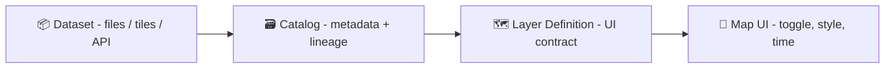

# 🗺️ `web/data/layers/` — Layer Registry & UI Contracts


> [!IMPORTANT]
> This folder is the **single source of truth for map layer *configuration*** used by the web UI.
> It is **not** the canonical home for raw/processed datasets themselves.

---

## 📘 Overview

### Purpose 🎯
This directory defines **what layers exist in the web map**, **how they’re styled**, **how they’re grouped**, and **how they connect back to governed data** (catalogs + provenance).

Think of `web/data/layers` as the **UI-facing “layer registry”**:
- 🧭 *Discoverability* (what is available)
- 🎛️ *Controls* (toggle, opacity, ordering, time slider defaults)
- 🎨 *Styling & legends* (cartography + UX)
- 🔗 *Traceability* (pointers to catalog/provenance records)

### Scope ✅ / ❌
| ✅ In scope (put it here) | ❌ Out of scope (put it elsewhere) |
|---|---|
| Layer descriptors (`*.layer.json`) | Raw datasets |
| UI style files (e.g., `*.style.json`) | ETL scripts & processing code |
| Legends (`*.legend.md`) | STAC/DCAT/PROV records (canonical metadata) |
| Thumbnails/icons (`*.thumb.*`) | Large imagery files / big vector dumps |
| Layer groups & ordering | Secrets, tokens, API keys |

### Audience 👥
- Web/UI engineers 🧑‍💻
- Data engineers & pipeline authors 🏗️
- Cartography / GIS contributors 🗺️
- Reviewers/stewards doing governance checks 🧾

### Definitions 🧩
- **Dataset** = the “data product” (files/APIs) with canonical metadata + provenance.
- **Layer** = how the UI *presents* a dataset (style, defaults, grouping, UX behaviors).
- **Catalog reference** = a stable pointer (IDs/paths/URLs) back to metadata records.
- **Evidence/derived artifact** = model output / analysis output treated like a dataset (with extra provenance + uncertainty).

---

## 🗂️ Directory Layout

Recommended pattern (adjust if your app uses a different registry loader):

```text
web/
└─ 📦 data/
   └─ 🗺️ layers/
      ├─ 📄 README.md  👈 you are here 📌
      ├─ 🧾⚡ layers.index.json            # 🧾 (optional) fast registry for startup
      ├─ 🗂️ groups.json                   # 🗂️ (optional) layer group definitions
      ├─ 📐 schemas/                      # 📐 (optional) JSON Schemas for validation
      ├─ 🧱 base/                         # 🧱 basemaps & references
      │  └─ 🗺️ osm-basemap/
      │     ├─ 🗺️🧾 osm-basemap.layer.json
      │     ├─ 🎨🧾 osm-basemap.style.json
      │     ├─ 📄 osm-basemap.legend.md
      │     └─ 🖼️ osm-basemap.thumb.webp
      ├─ 🧩 overlays/                     # 🧩 overlays & thematic layers
      ├─ 🕰️ historical/                   # 🕰️ time-heavy historical sources
      ├─ 🧪 analysis/                     # 🧪 derived/model layers (predictions, indices)
      └─ 🧫 experimental/                 # 🧫 WIP layers (not default-visible)
```

> [!TIP]
> Prefer **one folder per layer** once a layer grows beyond a single JSON file (style, legend, thumb, notes, etc.).

---

## 🧠 Mental Model: Dataset → Catalog → Layer

A good “KFM-ish” pattern is:

1. **Data pipeline produces a dataset** (files, tiles, API endpoint).
2. Dataset is **cataloged** (metadata + provenance).
3. UI consumes a **layer definition** that references the catalog + assets.



---

## 📄 Layer Definition Contract

### File naming 🏷️
- Use **kebab-case** for folders/files.
- Use **stable IDs** in configs (don’t rename casually).
- Suggested file suffix: `*.layer.json`

Examples:
- `ks-counties.layer.json`
- `usgs-landsat-ndvi.layer.json`
- `historic-atlas-tiles.layer.json`

### Minimal required fields (recommended) ✅
Every `*.layer.json` should include:

- `id` — stable, unique (e.g., `ks.counties.boundaries`)
- `title` — human readable
- `description` — 1–3 sentences
- `kind` — `vector | raster | raster-tiles | vector-tiles | 3d | chart | mixed`
- `source` — where the map pulls data from (assets or API)
- `style` — where styling comes from
- `attribution` — who/what must be credited
- `license` — display-friendly + reference
- `visibility` — default on/off + group
- `extent` — bbox/region hints (helps UX)
- `time` — if time-enabled (even if `enabled: false`, be explicit)

> [!NOTE]
> Keep **canonical metadata** in catalogs. Keep **UI choices** (style/visibility/order) in layer configs.

---

## 🧾 Suggested `layer.json` shape

This is a **template**, not a final schema (yet):

```json
{
  "$schema": "../schemas/kfm.layer.schema.json",
  "id": "ks.counties.boundaries",
  "title": "Kansas Counties",
  "description": "County boundaries for Kansas used as an administrative reference layer.",
  "kind": "vector",

  "source": {
    "mode": "asset",
    "assets": [
      {
        "href": "/data/processed/boundaries/ks_counties.geojson",
        "format": "geojson"
      }
    ],
    "catalog": {
      "stac": "/data/catalog/stac/ks_counties/item.json",
      "dcat": "/data/catalog/dcat/ks_counties.json",
      "prov": "/data/prov/ks_counties.prov.jsonld"
    }
  },

  "style": {
    "engine": "maplibre",
    "href": "./ks-counties.style.json"
  },

  "legend": {
    "href": "./ks-counties.legend.md"
  },

  "thumbnail": {
    "href": "./ks-counties.thumb.webp"
  },

  "visibility": {
    "default": false,
    "group": "Boundaries",
    "order": 20
  },

  "map": {
    "minZoom": 0,
    "maxZoom": 22,
    "opacity": 1.0,
    "interactive": true
  },

  "extent": {
    "bbox": [-102.05, 36.99, -94.59, 40.00],
    "crs": "EPSG:4326"
  },

  "time": {
    "enabled": false
  },

  "governance": {
    "license": "TBD",
    "sensitivity": "public",
    "care_label": "Public"
  }
}
```

---

## 🚦 Layer Types & Best Practices

### 🧩 Vector layers
Best for:
- boundaries, points of interest, lines (roads/rail), polygons

Delivery options:
- Small/medium: GeoJSON (simple)
- Large: vector tiles (recommended), GeoParquet for processing → tile for UI

Tips:
- Always include a **legend**
- Include a **simplified geometry** option for low zooms
- Validate geometry (self-intersections, invalid rings) before shipping

---

### 🛰️ Raster layers
Best for:
- imagery, elevation, indices (NDVI), heatmaps, model outputs

Delivery options:
- Cloud-optimized raster files (e.g., COG) behind a tile/reader layer
- Pre-rendered raster tiles for fast UI

Tips:
- Store raster-heavy layers in formats optimized for web access
- Include `nodata`, palette, and value ranges in metadata and legend

---

### 🕰️ Time-enabled layers
Time support is a *UI behavior* plus a *data reality*. If it’s time-enabled:

Include:
- `time.enabled: true`
- `time.extent` (start/end or discrete timestamps)
- `time.step` (e.g., monthly, yearly) if applicable
- `time.default` (what the UI should start on)

Example snippet:

```json
"time": {
  "enabled": true,
  "mode": "discrete",
  "timestamps": ["1930-01-01", "1940-01-01", "1950-01-01"],
  "default": "1950-01-01"
}
```

> [!TIP]
> If your UI has a timeline slider, keep the layer config “timeline-ready” even if the first MVP doesn’t expose it yet.

---

### 🧊 3D / WebGL layers
Use when the data truly benefits from 3D (terrain, buildings, subsurface volumes, archaeological reconstructions).

Recommendations:
- Keep a 2D fallback layer when possible
- Be explicit about GPU-heavy layers: `performance.tier: "high"`

---

## 🎨 Cartography & UX Rules of Thumb

- 🧠 **Reduce cognitive load**: clear legends, consistent symbology, readable labels
- 🧩 **Layer ordering matters**: basemap → boundaries → thematic overlays → labels
- 📱 **Mobile-first**: choose defaults that look good on small screens
- ♿ **Accessibility**: don’t rely on color alone; provide patterns/labels/tooltips

Include at least:
- `legend.md` (what the colors/lines mean)
- `thumb.*` (small preview)
- `attribution` (visible + correct)

---

## 🖼️ Thumbnails, Icons, and Legends

Suggested conventions:
- Thumbnails: `*.thumb.webp` (small, fast) or `*.thumb.png` (crisp)
- Icons: `*.icon.svg` (scalable)
- Legend text: `*.legend.md`

> [!NOTE]
> Avoid GIF for map thumbs unless you **need** animation; many map palettes exceed 256-color limits and GIF is often a poor fit.

---

## ⚡ Performance & Delivery Checklist

- [ ] Does the layer avoid shipping huge raw files directly to the browser?
- [ ] If vector: do we have tiling or simplification for zoomed-out views?
- [ ] If raster: are we using web-friendly access patterns (tiles/optimized rasters)?
- [ ] Are CORS headers configured if assets are on a separate domain?
- [ ] Are we caching aggressively (CDN/static hosting) for immutable layer assets?

---

## 🧪 Analytics / Model Layers (Regression, Bayes, Simulation, ML)

Model-derived layers are welcome — but they must behave like **first-class evidence**:

What to include (in layer config or linked docs):
- 📌 Inputs: training/validation datasets (catalog refs)
- 🧾 Method: model type + key parameters
- 📈 Evaluation: metrics + diagnostics plots (where applicable)
- 🌫️ Uncertainty: confidence/credible intervals, sensitivity notes, limits
- ⚖️ Governance: bias risks, coverage gaps, safe-use notes

Suggested extra block:

```json
"analysis": {
  "type": "regression",
  "method": "ols",
  "metrics": { "r2": 0.71, "rmse": 1.9 },
  "uncertainty": { "kind": "confidence_interval", "level": 0.95 },
  "notes": [
    "Do not interpret beyond training domain.",
    "See linked PROV for parameters and run config."
  ]
}
```

> [!CAUTION]
> If a layer is generated by ML, you must be able to tell “the story of the training dataset” (coverage, bias, known blind spots). A map that looks confident can still be wrong.

---

## 🔐 Governance, Ethics & Safety

- ✅ No secrets in this folder (ever).
- ✅ Every public layer must have attribution + license info.
- ✅ Sensitivity labels matter (FAIR+CARE mindset).
- ✅ Anything sensitive must be served through governed APIs (not hard-coded static assets).

---

## ✅ Definition of Done: Adding/Updating a Layer

- [ ] `*.layer.json` created/updated with stable `id`
- [ ] Has `title`, `description`, `kind`, `visibility`, `attribution`, `license`
- [ ] Points to canonical catalog references (or clearly marked `TBD`)
- [ ] Style file exists (or style inline is documented)
- [ ] Legend exists (`*.legend.md`)
- [ ] Thumbnail exists (`*.thumb.*`)
- [ ] Works on desktop + mobile viewport
- [ ] If time-enabled: timeline behavior verified
- [ ] If derived/model layer: includes uncertainty + evaluation notes
- [ ] No broken relative paths
- [ ] No sensitive data / keys / tokens included

---

## 📚 Project Knowledge Pack (what informed these conventions)

<details>
<summary>📖 Expand reading shelf</summary>

### 🗺️ GIS / Cartography
- Making Maps: A Visual Guide to Map Design for GIS
- Mobile Mapping: Space, Cartography and the Digital
- Archaeological 3D GIS

### 🌐 Web / UI / Rendering
- Responsive Web Design with HTML5 and CSS3
- WebGL Programming Guide (Interactive 3D Graphics)

### 🧰 Geospatial Data Engineering
- Python Geospatial Analysis Cookbook
- PostgreSQL Notes for Professionals

### 🛰️ Remote Sensing / Time Series
- Cloud-Based Remote Sensing with Google Earth Engine (Fundamentals & Applications)

### 🧪 Statistics / Modeling / ML
- Understanding Statistics & Experimental Design
- Regression Analysis with Python (+ regression slides)
- Think Bayes (Bayesian Statistics in Python)
- Scientific Modeling and Simulation (NASA-grade guide)
- Understanding Machine Learning (theory → algorithms)

### 🧱 Systems / Architecture / Performance / Security
- Clean Architecture & Layered Architecture references
- Database Performance at Scale
- Data Spaces (governance, provenance, trustworthy data sharing)
- Ethical Hacking & Countermeasures (secure infrastructures)
- AI Law foundations (explainability, accountability, training-data “story”)

</details>

---

> [!TIP]
> If you’re unsure where something belongs, default to:
> **Catalog & provenance in `data/…`** → **UI behavior in `web/data/layers/…`** ✅
