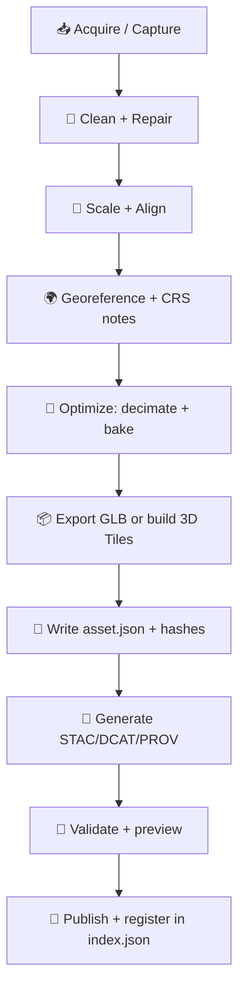

<!--
📁 Path: web/data/models_3d/README.md
🧠 Purpose: Governed, web-ready 3D assets for Kansas Frontier Matrix (KFM)
-->

# 🧱 `web/data/models_3d/` — Web‑ready 3D models for KFM


-22c55e)

> [!IMPORTANT]
> This folder is **for streaming + storytelling**, not long‑term archival.  
> **Only commit assets that are:** web‑optimized ✅, provenance‑linked ✅, and safe-to-publish ✅.

---

## 🧭 At a glance

KFM’s frontend supports **2D** (MapLibre) and an **optional 3D mode** (Cesium). Because 3D is heavier, we treat it as **opt‑in** and **performance‑budgeted**.

This directory contains **web-ready** 3D artifacts that the UI can load quickly:
- **glTF / GLB** for direct model rendering (Cesium or Three.js/WebGL previews)
- **3D Tiles** for geospatial streaming at scale (point clouds, terrain meshes, buildings, etc.)
- **Preview media + metadata** so models can be discovered and validated without opening them manually

---

## ✅ What goes in here (and what doesn’t)

| ✅ Goes in `web/data/models_3d/` | ❌ Doesn’t go here |
|---|---|
| Web‑optimized `*.glb` / `*.gltf` assets | Raw photogrammetry projects / scan dumps |
| 3D Tiles sets (`tileset.json` + tile payloads) | Gigantic point clouds with no tiling |
| Versioned assets with `asset.json` metadata | “Mystery” files with unknown source/license |
| Small, safe demo models for Story Nodes | Sensitive locations / restricted cultural data |
| Thumbnails, preview images, lightweight annotations | Intermediate processing outputs |

> [!TIP]
> Raw → work → processed is handled in the **data pipeline** (see KFM Master Guide).  
> Think of this folder as the **UI-friendly mirror/cache** for public 3D deliverables.

---

## 🗂️ Recommended folder layout

```
web/data/models_3d/
├─ 📄 README.md
├─ 🧾🗂️ index.json                      # (optional) UI-friendly registry of published assets
├─ 🧰 assets/
│  └─ 🆔 <asset_id>/
│     ├─ 🏷️ v0001/
│     │  ├─ 🧊 model.glb                # primary web model (preferred)
│     │  ├─ 🖼️ preview.jpg              # thumbnail / cover image
│     │  ├─ 📜🧾 asset.json             # REQUIRED metadata contract
│     │  └─ 🧵 textures/                # if not embedded in GLB
│     └─ 🏷️ v0002/
│        └─ …
└─ 🧱 tilesets/
   └─ 🆔 <asset_id>/
      ├─ 🏷️ v0001/
      │  ├─ 🧱🧾 tileset.json            # REQUIRED for 3D Tiles
      │  ├─ 🧊📦 *.b3dm / *.pnts / …     # tile payloads
      │  └─ 📜🧾 asset.json              # REQUIRED metadata contract (same schema)
      └─ 🏷️ v0002/
         └─ …
```

> [!NOTE]
> If we’re only shipping **one** format for an asset, keep it simple:
> - `assets/<asset_id>/<version>/...` for GLB
> - `tilesets/<asset_id>/<version>/...` for 3D Tiles

---

## 🧱 Core rules of the road

### 1) 🧾 Contract‑first (no exceptions)
Every published 3D artifact must have a **machine-checkable metadata file** (`asset.json`) in the same folder.

### 2) 🧬 Provenance‑first (evidence before narrative)
No 3D model should appear in the UI or Story Nodes unless it is:
- attributable to a source dataset or capture event,
- reproducible (or explicitly marked non‑reproducible),
- and connected to KFM’s catalog+lineage records (STAC/DCAT/PROV where applicable).

### 3) 🌍 WGS84‑first
If the model is georeferenced, the web standard is **WGS84 (EPSG:4326)** for display and interoperability.  
If upstream work uses a different CRS (State Plane, Lambert Conformal, local engineering), record that in metadata and document the transform.

### 4) 🚚 Stream‑first
If it’s “big”, it’s “tiles”.  
Use **3D Tiles** for anything that needs LOD, paging, or point cloud streaming.

### 5) 🔐 Safe‑to‑publish
`web/` is effectively “public by default.” If in doubt, **do not** place it here.

---

## 🧩 Supported asset types

| Type | Typical use | Recommended format | Notes |
|---|---|---|---|
| 🗿 Landmark / structure | Story highlights, POIs | GLB (PBR) | Keep texture sizes reasonable |
| 🏔️ Terrain mesh | Hills, cliffs, relief | 3D Tiles (terrain mesh) | Consider “Kansas From Above” style sequences |
| 🏙️ Buildings / city blocks | Urban evolution, infra | 3D Tiles | Works best with LOD + batching |
| 🌫️ LiDAR / point clouds | DEM/DSM, vegetation | 3D Tiles (`*.pnts`) | Avoid committing raw LAS/LAZ here |
| 🧊 Solid / boundary models | Volumes, stratigraphy-like layers | GLB or 3D Tiles | Ensure watertight geometry if volumetric meaning matters |

---

## 🌍 Georeferencing & coordinate systems

### Required metadata fields for spatial alignment
For any geospatial 3D content, `asset.json` must include:
- `crs.display`: `"EPSG:4326"` (or explicit WKT/PROJ string if needed)
- `crs.source`: original CRS used at capture/authoring time
- `units`: specify at least `"meters"` for vertical units when elevation is involved
- `extent`: geographic bounding box + optional altitude range
- `transform`: how to place the model (translation/rotation/scale or anchor point)

> [!WARNING]
> **Never “eyeball align”** a model into position without recording the transform.  
> If the transform is manual, that must be stated clearly in provenance.

---

## 🧾 `asset.json` — the minimum contract

### Required files per published asset version
- `asset.json` ✅ (**required**)
- `preview.jpg` ✅ (strongly recommended)
- One of:
  - `model.glb` ✅ (preferred single-file runtime asset), or
  - `tileset.json` ✅ (+ tile payloads) for 3D Tiles

### Minimal example
```json
{
  "id": "monument_rocks",
  "version": "v0001",
  "title": "Monument Rocks (Demo)",
  "description": "Web-ready landmark model for 2D→3D story transitions.",
  "type": "landmark",

  "license": {
    "spdx": "CC-BY-4.0",
    "attribution": "Source + processing credits go here."
  },

  "source": {
    "summary": "How the asset was captured or obtained (photogrammetry, lidar, archive, etc.).",
    "inputs": [
      { "name": "input_dataset_id_or_filename", "role": "primary", "hash": "sha256:..." }
    ]
  },

  "crs": {
    "display": "EPSG:4326",
    "source": "EPSG:XXXX",
    "notes": "Record any reprojection and vertical datum assumptions here."
  },

  "units": {
    "horizontal": "degrees",
    "vertical": "meters"
  },

  "extent": {
    "bbox_wgs84": [-101.0, 38.8, -100.9, 38.9],
    "alt_m_range": [0, 2000]
  },

  "files": [
    {
      "path": "model.glb",
      "format": "glb",
      "lod": "lod1",
      "bytes": 12345678,
      "hash": "sha256:..."
    },
    {
      "path": "preview.jpg",
      "format": "jpg",
      "role": "preview",
      "bytes": 345678,
      "hash": "sha256:..."
    }
  ],

  "catalog": {
    "stac_item": "stac/items/monument_rocks/v0001.json",
    "dcat_dataset": "catalog/dcat/monument_rocks.jsonld",
    "prov_bundle": "prov/monument_rocks/v0001.json"
  },

  "governance": {
    "classification": "public",
    "sensitivity_notes": "No sensitive location content."
  }
}
```

> [!TIP]
> If you’re unsure what belongs in `catalog` or `prov_bundle`, follow the **KFM Master Guide v13**:
> **ETL → STAC/DCAT/PROV → Graph → API → UI → Story Nodes → Focus Mode**.

---

## 🧰 Formats & optimization guidelines

### ✅ Prefer GLB for web
- Single file
- Fast to fetch
- Good for story-driven models and POIs

### ✅ Use 3D Tiles for streaming / scale
Use 3D Tiles when you need:
- multiple LODs
- selective loading
- point cloud streaming
- city/terrain-scale coverage

### 🖼️ Texture sanity checklist
- Keep textures power-of-two when possible
- Avoid shipping 8K textures unless *absolutely* justified
- Prefer modern GPU-friendly compression where available (team decision)

### 🔻 Geometry sanity checklist
- Remove hidden faces / internal geometry
- Merge redundant materials
- Keep vertex attributes minimal (only what you use)

> [!NOTE]
> Some 3D GIS workflows rely on **topologically consistent** surfaces for meaningful volume analysis.
> If the model is a “solid/boundary model,” treat watertightness and normals as **data quality**, not aesthetics.

---

## 🔄 Suggested processing pipeline



---

## 🧪 Validation checklist (PR-ready)

### Asset integrity
- [ ] `asset.json` exists and is complete
- [ ] License is explicit (SPDX where possible) + attribution included
- [ ] Source inputs are listed (even if internal) + checksums recorded
- [ ] `preview.jpg` exists and is representative
- [ ] File paths in metadata match actual files

### Spatial integrity (if georeferenced)
- [ ] CRS display is EPSG:4326 (or clearly justified otherwise)
- [ ] Original CRS recorded + transform documented
- [ ] Extent bbox is correct (sanity-checked on a map/globe)

### Performance integrity
- [ ] Model loads on a mid-tier laptop without stutter
- [ ] 3D Tiles tileset streams progressively (no “load everything”)
- [ ] Texture/triangle budgets are reasonable for web

### Governance integrity
- [ ] Asset is safe-to-publish (no restricted cultural/sensitive location content)
- [ ] No secrets, tokens, or private paths embedded in metadata

---

## 🚀 Preview locally (fast loop)

Run a simple local server from `web/` so paths behave like production:

```bash
cd web
python -m http.server 8080
```

Then visit:
- `http://localhost:8080/`
- Use your 3D viewer route/tooling to load:
  - `data/models_3d/assets/<asset_id>/<version>/model.glb`, or
  - `data/models_3d/tilesets/<asset_id>/<version>/tileset.json`

> [!TIP]
> If the UI doesn’t yet have a model browser, you can still validate file fetches by opening the asset URL directly in the browser and checking network + MIME type.

---

## 🧩 How the UI should consume these assets

KFM’s long-term invariant is: **UI accesses evidence via the API boundary**, not by directly querying internal stores.  
For the static prototype, `web/data/**` can act as a lightweight public distribution, but the model must still be **cataloged** and **traceable**.

Recommended pattern:
1. UI reads a registry (`index.json`) or API endpoint
2. UI loads the referenced GLB/tileset URL
3. UI displays provenance + license alongside the asset (never “just a pretty model”)

---

## 🕰️ Versioning rules

- Versions are immutable once published (`v0001`, `v0002`, …).
- If you change geometry/textures/positioning → **new version**.
- If you only change metadata text (typo fixes) → patch allowed **only if hashes + source are unchanged**.

> [!WARNING]
> Never overwrite `v0001/model.glb` in-place.  
> Reproducibility and provenance tracking depend on immutability.

---

## 🔐 Licensing, attribution, and sensitivity

### Licensing
Every asset must declare:
- a license (SPDX identifier if possible)
- attribution text
- any usage constraints (commercial, derivative limits, etc.)

### Sensitivity (CARE/sovereignty aware)
If an asset involves:
- culturally sensitive locations,
- archaeological site precision,
- restricted datasets,
- or Indigenous data sovereignty considerations,

…it must be classified appropriately and **must not** be published into `web/` without governance review.

---

## 🧯 Common pitfalls (and quick fixes)

- **Model appears in the wrong place** → CRS mismatch or missing transform; record the original CRS and the exact transform.
- **Model is huge / slow** → you shipped raw detail; decimate + bake textures; move to 3D Tiles for streaming.
- **Textures look washed out** → color space mismatch; confirm texture encoding and PBR workflow.
- **Flickering / z-fighting** → overlapping surfaces; simplify or separate layers.
- **“It works on my machine” only** → missing provenance, missing hashes, or non-deterministic processing steps.

---

## 📚 References & project library (for contributors)

The conventions above align with KFM’s broader principles:
- **Contract-first** schemas and interfaces
- **Evidence + provenance before narrative**
- **2D + optional 3D** storytelling with performance budgets

<details>
<summary>📚 Project reference library used to inform these conventions (click to expand)</summary>

### Core KFM docs
- Kansas Frontier Matrix (KFM) – Comprehensive Technical Documentation
- Kansas-Frontier-Matrix — Open-Source Geospatial Historical Mapping Hub Design
- KFM Master Guide v13 (Draft) — contract-first + evidence-first pipeline

### 3D GIS / mapping / visualization
- Archaeological 3D GIS — workflows for georeferenced 3D models, boundary/solid models, and 3D database linkage
- WebGL Programming Guide — interactive 3D graphics programming patterns
- Making Maps — map design and visualization guidance
- Mobile Mapping — cartography + digital mapping context
- Python Geospatial Analysis Cookbook — web geospatial + 3D visualization recipes

### Data / systems / performance
- PostgreSQL Notes for Professionals — relational + spatial metadata foundations
- Database Performance at Scale — performance-minded data access and indexing
- Scalable Data Management for Future Hardware — scaling data engines and pipelines
- Data Spaces — organizing interoperable data products

### Modeling / ML / statistics (for “evidence artifacts”)
- Scientific Modeling and Simulation — reproducible modeling mindset
- Regression analysis with Python (+ slides)
- Think Bayes — Bayesian evidence framing
- Understanding Statistics & Experimental Design
- Graphical Data Analysis with R
- Spectral Geometry of Graphs
- Generalized Topology Optimization for Structural Design

### Web UX & safety context
- Responsive Web Design with HTML5 and CSS3 — mobile-first UI constraints for 3D viewers
- Compressed Image File Formats — texture/image tradeoffs
- Introduction to Digital Humanism — ethics & human-centered framing
- AI Law’s prophecies & ML age — governance mindset for AI outputs
- Ethical Hacking / Gray Hat Python — defensive security awareness for public web artifacts

</details>

---

## ✅ Adding a new 3D asset (copy/paste checklist)

1. Create folder: `assets/<asset_id>/v0001/` (or `tilesets/...`)
2. Add files:
   - `model.glb` **or** `tileset.json + tiles`
   - `preview.jpg`
   - `asset.json`
3. Compute and record `sha256` hashes in `asset.json`
4. Confirm CRS/extent + placement
5. Register in `index.json` (if used)
6. Ensure catalogs + PROV exist (or open an issue to add them)
7. Verify load in UI (or local preview server)
8. Submit PR ✅

🧠 If any step feels vague, it’s a signal to update this README or add a small validator script.
