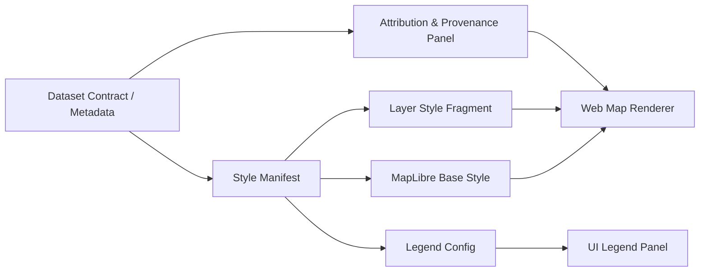

# 🎨 `web/data/styles/` — Style Library (Maps • Data Viz • UI)


This folder is the **single source of truth** for how KFM’s web experience *looks* when rendering:
- 🗺️ **Map layers** (vector/raster/terrain/3D)
- 📊 **Charts & analytical overlays**
- 🧩 **UI design tokens** (colors, typography, spacing)
- 🧷 **Legends, sprites, icons**, and other visual primitives

> [!IMPORTANT]
> **No “mystery styling.”** Every visual choice should be *intentional, explainable,* and connected to a dataset + its metadata/provenance.

---

## ✅ What belongs here?

### Map styling (geo)
- **Base map styles** (light/dark, minimal, print-friendly)
- **Layer style fragments** (a single dataset/layer “skin”)
- **Legend definitions** for layers (categories, breaks, symbols)
- **Time-aware styling** conventions (timeline/slider)

### Data visualization styling (non-geo)
- Chart themes (fonts, color ramps, axis defaults)
- Statistical classification presets (quantiles, equal-interval, std-dev, Bayesian bins)

### UI tokens (system-wide)
- Color tokens (brand, semantic, surface, data ramps)
- Typography tokens (font stacks, sizes, weights, line-height)
- Spacing + radii + elevation tokens

---

## 🧭 Directory layout (recommended)

```text
web/data/styles/
├─ README.md                     👈 you are here
├─ index.json                    🧩 style registry (optional but recommended)
│
├─ tokens/                       🎛️ design tokens (shared)
│  ├─ colors.json
│  ├─ typography.json
│  ├─ spacing.json
│  └─ ramps/                      🌈 data color ramps
│
├─ map/                          🗺️ map styling
│  ├─ base/                       🧱 full MapLibre/Mapbox styles
│  │  ├─ kfm.base.light.json
│  │  └─ kfm.base.dark.json
│  ├─ layers/                     🧵 style fragments per dataset/layer
│  │  ├─ <dataset_id>.layer.json
│  │  └─ <dataset_id>.legend.json
│  └─ sprites/                    🧃 sprite sheets
│     ├─ kfm.sprite.png
│     └─ kfm.sprite.json
│
├─ icons/                        🧷 svg icons (UI + map markers)
│  └─ svg/
│
├─ charts/                       📊 chart themes (vega/echarts/etc)
│  ├─ theme.light.json
│  └─ theme.dark.json
│
└─ schemas/                      🧪 JSONSchema validation
   ├─ style.index.schema.json
   ├─ layer.style.schema.json
   └─ legend.schema.json
```

> [!TIP]
> If you don’t want an `index.json` registry, the app can “discover” styles by convention — but **a registry makes provenance, validation, and tooling easier**.

---

## 🧬 Style pipeline (mental model)



**Key idea:** styles are **not** just aesthetics — they’re part of the platform’s *traceability* and *interpretability*.

---

## 🧾 The “Style Manifest” contract

Each layer style should be represented by a small JSON manifest that answers:

- **What dataset is this styling for?**
- **What visual encoding is used, and why?**
- **How should the legend be rendered?**
- **What attribution is required?**
- **What are the safe defaults for zoom/time/filters?**

### Suggested manifest fields

```json
{
  "style_id": "usgs_historic_topo_1894",
  "version": "1.0.0",
  "title": "USGS Historic Topo (1894)",
  "description": "Raster topo map overlay with print-friendly labeling and subtle blending.",
  "dataset_ref": "usgs_historic_topo_1894",
  "style_type": "maplibre-layer-fragment",
  "render": {
    "minzoom": 6,
    "maxzoom": 16,
    "blend_mode": "multiply",
    "opacity_by_zoom": [[6, 0.35], [10, 0.55], [14, 0.80]]
  },
  "legend_ref": "usgs_historic_topo_1894.legend.json",
  "attribution": {
    "required": true,
    "text": "USGS (Public Domain)",
    "license": "Public Domain",
    "source": "Dataset contract → provenance.source_url"
  },
  "accessibility": {
    "color_blind_safe": true,
    "min_contrast_ratio": 4.5,
    "pattern_fallback": false
  },
  "qa": {
    "validated_against_schema": true,
    "visual_snapshots": ["z6", "z10", "z14"]
  }
}
```

> [!NOTE]
> Keep the **manifest** human-readable. The actual MapLibre layer definitions can live alongside it as a “fragment” file.

---

## 🎛️ Design tokens rules

### ✅ Do
- Use **tokens** everywhere: UI components, legend keys, layer colors.
- Keep tokens **semantic** (e.g., `surface.canvas`, `data.ramp.sequential.1`) rather than “random hex”.

### ❌ Don’t
- Hardcode “one-off” hex values in a layer style unless it’s a *documented* exception.
- Create near-duplicate colors (`#2D5CFF` vs `#2D5DFF`) without a reason.

### Token naming convention
- `surface.*` → UI backgrounds
- `text.*` → text colors
- `border.*` → strokes
- `data.ramp.*` → ramps intended for data encoding
- `map.*` → cartographic defaults (water, admin, roads)

---

## 🗺️ Cartography conventions (KFM defaults)

### Visual hierarchy (always)
1. **Context** (base map)
2. **Primary layer of interest**
3. **Supporting layers**
4. **Labels**
5. **Interactive states** (hover/selected/highlight)

### Lines & polygons
- Use zoom-scaled widths:
  - `line-width`: interpolate by zoom
  - polygon outlines: thinner than primary lines at same zoom
- Don’t let outlines overpower fill.

### Points
- Prefer **icons** for categorical points (with legend entries).
- Prefer **circles** for quantitative points (size or color; never both unless explicitly justified).

### Labels
- Add halos for readability.
- Avoid “label spam”:
  - Use `text-allow-overlap: false` by default
  - Use zoom thresholds aggressively

---

## ⏳ Time-aware layer styling

When a dataset is time-enabled, styles should include:
- A **filter contract** (`year`, `date_start/date_end`, or `timestamp`)
- A **default time window**
- A **“no data”** representation that doesn’t look like “zero”

### Example: MapLibre filter pattern
```json
["all",
  [">=", ["get", "year"], ["var", "year_min"]],
  ["<=", ["get", "year"], ["var", "year_max"]]
]
```

> [!WARNING]
> Don’t encode time solely by color unless there is a legend + slider UI tie-in. Time should be *queryable*, not a guessing game.

---

## 🛰️ Raster & remote sensing styling

If you’re styling raster/RS layers:
- Declare the **stretch** (min/max, percent clip, gamma)
- Document the **band mapping** (RGB, false color, NDVI, etc.)
- Provide a **legend** when the raster is quantitative

> [!TIP]
> Prefer consistent, documented stretches so two users don’t see two different “truths” from the same layer.

---

## 🧊 3D / WebGL considerations

For 3D terrain, extrusions, or 3D overlays:
- Keep geometry lightweight (tile-friendly)
- Use LOD strategies (simplify as zoomed out)
- Avoid “flicker” by stabilizing opacity + z-order rules
- Provide an accessibility fallback (2D mode or simplified symbols)

---

## ⚡ Performance budget

**Style JSON is part of your payload.** Treat it like code.
- Keep sprites optimized and consolidated
- Reuse sources across layers (don’t duplicate sources)
- Avoid large inline GeoJSON inside style files (use proper sources)
- Prefer vector tiles / PMTiles / optimized GeoJSON for heavy layers

---

## 🔒 Security & governance hygiene

- No secrets. No API keys. No internal URLs.
- Avoid loading third-party assets directly from random CDNs.
- Ensure attributions & licenses are present for anything not created by KFM.

---

## ✅ Adding a new layer style (checklist)

1. 🧾 Confirm dataset has a **valid contract** + provenance
2. 🧵 Create:
   - `map/layers/<dataset_id>.layer.json`
   - `map/layers/<dataset_id>.legend.json`
   - (optional) `map/layers/<dataset_id>.manifest.json`
3. 🎛️ Use tokens (don’t hardcode)
4. 🧪 Validate against `schemas/`
5. 🖼️ Produce quick “sanity screenshots” at key zooms
6. 🧠 Add a short **encoding rationale**:
   - what does color mean?
   - what does size mean?
   - what does absence mean?
7. 🔍 Run accessibility check (contrast + legend clarity)

---

## ❓FAQ

### “Why are styles in `web/data/` instead of `web/css/`?”
Because many styles are **data-driven** and **runtime-loaded** (map styles, legends, ramps). Keeping them with data assets makes them:
- easier to validate,
- easier to version,
- easier to attribute.

### “Can we keep multiple themes?”
Yes — but prefer:
- **one token system**, multiple outputs (light/dark)
- minimal divergence across themes

---

## 📚 Project reference shelf (used to shape this style system)

<details>
<summary><b>Open the full reference list 📖</b></summary>

- Kansas Frontier Matrix (KFM) – Comprehensive Technical Documentation.pdf  
- Kansas-Frontier-Matrix_ Open-Source Geospatial Historical Mapping Hub Design.pdf  
- Scientific Modeling and Simulation_ A Comprehensive NASA-Grade Guide.pdf  
- regression-analysis-with-python.pdf  
- Regression analysis using Python - slides-linear-regression.pdf  
- Understanding Statistics & Experimental Design.pdf  
- think-bayes-bayesian-statistics-in-python.pdf  
- graphical-data-analysis-with-r.pdf  
- responsive-web-design-with-html5-and-css3.pdf  
- webgl-programming-guide-interactive-3d-graphics-programming-with-webgl.pdf  
- making-maps-a-visual-guide-to-map-design-for-gis.pdf  
- python-geospatial-analysis-cookbook.pdf  
- PostgreSQL Notes for Professionals - PostgreSQLNotesForProfessionals.pdf  
- Database Performance at Scale.pdf  
- Scalable Data Management for Future Hardware.pdf  
- Data Spaces.pdf  
- Cloud-Based Remote Sensing with Google Earth Engine-Fundamentals and Applications.pdf  
- Archaeological 3D GIS_26_01_12_17_53_09.pdf  
- Mobile Mapping_ Space, Cartography and the Digital - 9789048535217.pdf  
- Generalized Topology Optimization for Structural Design.pdf  
- Spectral Geometry of Graphs.pdf  
- Principles of Biological Autonomy - book_9780262381833.pdf  
- Introduction to Digital Humanism.pdf  
- On the path to AI Law’s prophecies and the conceptual foundations of the machine learning age.pdf  
- ethical-hacking-and-countermeasures-secure-network-infrastructures.pdf  
- Gray Hat Python - Python Programming for Hackers and Reverse Engineers (2009).pdf  
- concurrent-real-time-and-distributed-programming-in-java-threads-rtsj-and-rmi.pdf  
- compressed-image-file-formats-jpeg-png-gif-xbm-bmp.pdf  
- Deep Learning for Coders with fastai and PyTorch - Deep.Learning.for.Coders.with.fastai.and.PyTorchpdf  
- A programming Books.pdf  
- B-C programming Books.pdf  
- D-E programming Books.pdf  
- F-H programming Books.pdf  
- I-L programming Books.pdf  
- M-N programming Books.pdf  
- O-R programming Books.pdf  
- S-T programming Books.pdf  
- U-X programming Books.pdf  

</details>

---

## 🧭 Next enhancements (nice-to-have)
- 🧪 Add a `style-lint` script + CI check for schemas
- 🧾 Auto-generate **attribution panels** from style manifests + dataset contracts
- 🖼️ Visual regression tests (per zoom level snapshots)
- 🎨 Palette tooling (export ramps to map + chart formats consistently)

---
