# Kansas-Frontier-Matrix — Web Developer Guide

This guide is for **contributors and maintainers** working on the `web/` viewer.  
It explains how configs, code, and UI connect, and how to extend or debug them.

---

## Config Loading

Order of preference (first hit wins):

1. `./app.config.json` (primary, generated from STAC)  
2. `./config/app.config.json` (override/fallback)  
3. `./config/viewer.json` or `./config/layers.json` (dev-only)  
4. `./layers.json` (legacy)  

Configs define:

- **Basemap/terrain rasters** (`url` or `tiles`)  
- **GeoJSON overlays** (`data`)  
- **Temporal windows** (`time.start`, `time.end` or feature `timeProperty`)  
- **Legend info** (`legendKey` → `legend.json`)  
- **Categories** for sidebar grouping (`category`)  

👉 See [`STYLE_GUIDE.md`](STYLE_GUIDE.md) for the schema-lite and JSON key conventions.  
👉 See [`ARCHITECTURE.md`](ARCHITECTURE.md) for the big-picture flow.

---

## How `index.html` / `app.js` Works

1. **Load config** → fetch JSON, merge defaults, normalize `layers[]`.  
2. **Init MapLibre** → apply style, center, zoom, and optional bounds.  
3. **Register sources** → raster tiles, DEMs, or GeoJSON.  
4. **Build UI** → sidebar groups, layer toggles, opacity sliders, legend.  
5. **Bind events** →  
   - Timeline slider updates `year` and filters layers  
   - Sidebar toggles show/hide overlays  
   - Opacity sliders adjust alpha of raster/GeoJSON  
6. **Update map** → MapLibre updates sources/layers in real time (no reload).  

```mermaid
flowchart TD
  A["Config:\napp.config.json"] --> B["Viewer Logic:\nindex.html / app.js"]
  B --> C["MapLibre:\nmap + sources/layers"]
  B --> D["UI:\nsidebar + legend + time slider"]
  D -- "toggles · opacity" --> C
  D -- "year filter" --> C
```

<!-- END OF MERMAID -->

⸻

Adding a New Layer
	1.	Place assets in the repo:
	•	Raster tiles → web/tiles/...
	•	GeoJSON → web/vectors/... or web/data/processed/...
	2.	Add an entry to app.config.json (or upstream STAC → config generator). Example:

{
  "id": "railroads_1900",
  "title": "Railroads (c. 1900)",
  "category": "infrastructure",
  "type": "geojson",
  "data": "./vectors/infrastructure/railroads_1900.geojson",
  "opacity": 1.0,
  "visible": true,
  "time": { "start": "1900-01-01", "end": "1900-12-31" },
  "style": {
    "lineColor": "#d97706",
    "lineWidth": 1.6,
    "lineOpacity": 0.95
  },
  "popup": ["name", "year_built", "operator"],
  "legendKey": "railroads"
}

	3.	Add legend mapping (config/legend.json):

{
  "symbols": {
    "railroads": { "line": true, "preview": "#d97706" }
  },
  "layerBindings": {
    "railroads_1900": "railroads"
  }
}

	4.	Rebuild config (if using STAC → config generator):

make site-config

⸻

Debugging & Testing

Validate JSON

jq . web/config/app.config.json > /dev/null
ajv validate -s web/config/app.config.schema.json -d web/config/app.config.json

Serve locally

# Python
cd web && python -m http.server 8080

# Node.js alternative
npx http-server web -p 8080

→ Open http://localhost:8080/

Common pitfalls
	•	❌ ../ in paths → will 404 on GitHub Pages.
	•	❌ Missing id or wrong type → UI silently skips the layer.
	•	❌ Large (>10 MB) GeoJSON → sluggish → convert to tiles (PMTiles, Tippecanoe).
	•	❌ Legend not showing → ensure legendKey matches a symbol in legend.json.

⸻

Extending the Viewer
	•	New categories: add to config/categories.json for sidebar grouping.
	•	Timeline behavior: time.start/time.end (ISO dates) → layer spans; timeProperty/endTimeProperty → feature spans.
	•	Paint styles: support line, fill, circle (converted to MapLibre paint).
	•	Legend system: centralized in legend.json → stable chips, theme-aware.
	•	Plugins: add UI helpers via window.* (e.g., window.attachPopup, window.LegendControl).

⸻

Contribution Notes
	•	Use commit prefixes from STYLE_GUIDE.md §7.
	•	Keep configs web-relative (./vectors/..., ./tiles/...).
	•	Run local make prebuild before pushing (validates configs & STAC).
	•	Test across browsers (Chrome, Firefox, Safari).
	•	Check light/dark mode, reduced motion, and keyboard focus.
	•	Update docs (DEVELOPER_GUIDE.md, STYLE_GUIDE.md) if adding new keys or categories.

⸻

✅ Workflow summary: add → validate → preview → commit → PR.
The viewer is fully config-driven — no hardcoding required.

