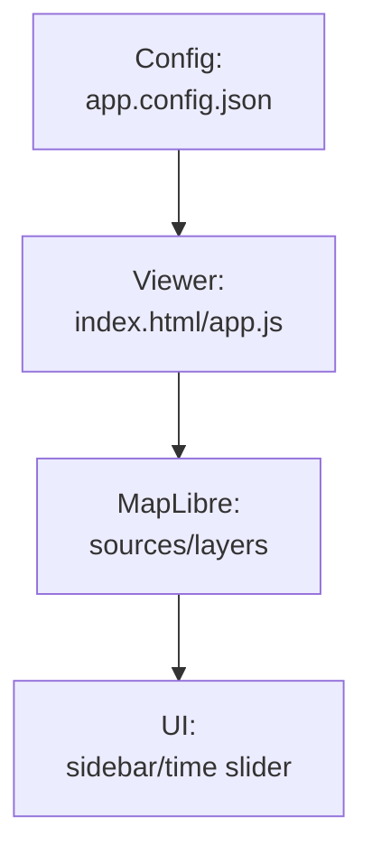

# Kansas-Frontier-Matrix — Web Style Guide

This guide defines conventions for CSS, JavaScript, JSON configs, and docs in `web/`.  
Follow it to keep the viewer consistent, accessible, and easy to maintain.

---

## 0) Directory expectations

```

web/
├─ index.html           # viewer (loads MapLibre + builds sidebar UI)
├─ app.css              # tokens, layout, components, a11y (single source of truth)
├─ app.config.json      # primary config (fallbacks allowed; see §3)
├─ tiles/               # raster tiles (/{z}/{x}/{y}.png)
├─ vectors/             # GeoJSON overlays (relative ./vectors/... .geojson)
├─ data/processed/...   # Alt. GeoJSON roots allowed (use ./ relative paths)
└─ docs/
└─ STYLE_GUIDE.md

````

**Rule:** All URLs/paths in configs are web-relative (e.g., `./tiles/...`, `./vectors/...`).  
Avoid `../` — it will 404 on GitHub Pages.

---

## 1) CSS (in `app.css`)

### 1.1 Tokens & theming
- Define design tokens in `:root`:
  - Colors: `--bg`, `--bg-soft`, `--panel`, `--border`, `--text`, `--muted`, `--accent`, `--accent-2`, `--danger`
  - Radii/Shadows: `--radius{,-sm,-xs}`, `--shadow{,-1,-2}`
  - Layout: `--sidebar-w`, z-stack tokens (`--z-sidebar`, `--z-map-controls`, `--z-popups`)
  - Typography: `--font`, `--fs-12/13/15/16`
  - Effects/Safe areas: `--focus-ring`, `--safe-*`
- Provide dark mode overrides under `@media (prefers-color-scheme: dark)`.

### 1.2 Naming & structure
- Prefer component classes over IDs except for roots: `#map`, `#sidebar`, `#timebox`, `#layerbox`.
- Use light BEM-like with `kfm-` prefix:
  - `.kfm-legend`, `.kfm-legend__row`, modifiers like `.is-active`, `.is-open`.

### 1.3 Responsiveness & layout
- Breakpoint: `@media (max-width: 900px)` switches to a bottom drawer sidebar; map becomes top panel.
- Use CSS Grid/Flex; never floats.

### 1.4 Accessibility
- Always style `:focus-visible`.
- Support:
  - `@media (prefers-reduced-motion: reduce)`
  - `@media (forced-colors: active)`
  - High-contrast tweaks (e.g., `--border` override).
- Include RTL safety where relevant (`[dir="rtl"]` adjustments).

### 1.5 Controls
- Range inputs:
  - Use class `.range--fill` and set `--value` (0%..100%) via JS for the filled track.
  - Increase touch targets under `@media (pointer: coarse)`.

---

## 2) JavaScript (inlined in `index.html` or `app.js`)

### 2.1 Structure & helpers
- Wrap logic in an IIFE to avoid globals:
  ```js
  (async () => { /* ... */ })();
````

* Helpers:

  ```js
  const $  = (sel, root = document) => root.querySelector(sel);
  const el = (tag, attrs = {}, children = []) => { /* minimal h() */ };
  ```
* Use `const`/`let`, never `var`.

### 2.2 Config-driven viewer

* Load config with this priority:

  1. `./app.config.json`
  2. `./config/app.config.json`
  3. `./layers.json` (legacy)
* Do not hardcode layer IDs beyond root UI wiring.

### 2.3 Map & layers

* MapLibre source/layer creation derives from each layer object:

  * Raster uses `url` (string template or tile endpoint).
  * GeoJSON uses `path` (URL to `.geojson`).
  * `paint` drives line/fill/circle styling (see §3.3).
* Time filtering:

  * Use `layer.time.{start,end}` (ISO) → year-based visibility.
* Opacity:

  * Raster: set `raster-opacity`.
  * GeoJSON: multiply base fill/line/circle opacity by the UI slider value.

### 2.4 Sidebar & legend

* Sidebar list is generated from `config.layers`, grouped by `layer.group`.
* Optional `config.groups` defines group display order.
* Legend is auto-built from `layer.legend` (see §3.4).

---

## 3) JSON Configs

### 3.1 Formatting & metadata

* Indent with 2 spaces.
* IDs: lowercase, hyphen-separated (e.g., `"id": "usgs-1894-larned"`).
  *(Keep existing IDs stable; new ones follow this unless a breaking change is planned.)*

Minimal top-level keys:

```json
{
  "version": "1.2.0",
  "title": "Kansas-Frontier-Matrix",
  "subtitle": "Time-aware historical GIS for Kansas",
  "style": "https://demotiles.maplibre.org/style.json",
  "center": [-98.3, 38.5],
  "zoom": 6,
  "time": { "min": "1850-01-01", "max": "2025-12-31" },
  "defaultYear": 1930,
  "defaults": { "tileSize": 256, "visible": true, "opacity": 1.0 },
  "groups": ["Basemaps & Terrain", "Historic Topographic Maps", "Hydrology", "Vectors"],
  "layers": [ /* … */ ]
}
```

### 3.2 Layer contract (schema-lite)

| Key           | Type    | Req | Notes                                                             |
| ------------- | ------- | --- | ----------------------------------------------------------------- |
| `id`          | string  | ✅   | Unique. Lowercase with hyphens preferred.                         |
| `title`       | string  | ✅   | Human label.                                                      |
| `group`       | string  | ✅   | Must match/fit into `groups` (else “Ungrouped”).                  |
| `type`        | string  | ✅   | `"raster"` or `"geojson"` (`"image"` allowed; treated as raster). |
| `url`         | string  | ⛔/✅ | Required for raster/image.                                        |
| `path`        | string  | ⛔/✅ | Required for geojson.                                             |
| `opacity`     | number  | opt | 0..1 (default `defaults.opacity`).                                |
| `visible`     | boolean | opt | Default `defaults.visible`.                                       |
| `time`        | object  | opt | `{ "start": "YYYY-MM-DD" \| null, "end": "YYYY-MM-DD" \| null }`. |
| `paint`       | object  | opt | See §3.3 (GeoJSON styling only).                                  |
| `legend`      | array   | opt | See §3.4.                                                         |
| `attribution` | string  | opt | Passed to MapLibre source if set.                                 |

**Paths/URLs:** Always `./…` relative to `web/`.

### 3.3 GeoJSON paint keys

```json
"paint": {
  "line":   { "line-color": "#d97706", "line-width": 1.6, "line-opacity": 0.95 },
  "fill":   { "fill-color": "#2563eb", "fill-opacity": 0.25, "fill-outline-color": "#1d4ed8" },
  "circle": { "circle-color": "#0d47a1", "circle-radius": 4, "circle-opacity": 1.0 }
}
```

* If multiple sub-styles are present, the app creates separate `-line`, `-fill`, `-circle` layers using the same GeoJSON source.

### 3.4 Legend items

Optional `legend` array per layer:

```json
"legend": [
  { "type": "line",   "label": "Rail line (c.1900)", "color": "#d97706", "width": 1.6 },
  { "type": "fill",   "label": "Floodplain extent",  "color": "#42a5f5", "outline": "#1976d2" },
  { "type": "circle", "label": "Gauge station",      "color": "#0d47a1", "radius": 4 }
]
```

* Keep labels concise; colors should match `paint`.

### 3.5 Time windows

Use ISO-8601 dates:

```json
"time": { "start": "1894-01-01", "end": "1894-12-31" }
```

* `null` means open-ended.
* Visibility is computed by year (UTC).

---

## 4) Documentation (Markdown)

* Wrap lines around 80–100 chars when comfortable.
* Headings: `#`, `##`, `###`. Use `---` for section dividers when helpful.
* Mermaid diagrams: quote labels and use `\n` for line breaks.

**Example:**



---

## 5) Accessibility & UX checklist

* **Keyboard**

  * All interactive controls are focusable (`:focus-visible` visible).
  * Space/Enter toggles checkboxes and custom switches.
* **ARIA**

  * Regions labeled: `role="region"` + `aria-label`.
  * Live regions for status updates (`role="status"` / `aria-live="polite"`).
* **Visual**

  * Tabular numerals for year readouts (`font-variant-numeric: tabular-nums`).
  * Test light/dark, mobile/desktop, print.
* **Motion/contrast**

  * Respect `prefers-reduced-motion` and `forced-colors`.

---

## 6) Adding a new layer (quick recipe)

1. Put assets in repo (e.g., GeoJSON → `web/vectors/.../file.geojson`, tiles → `web/tiles/...`).
2. Add an entry to `app.config.json`:

   ```json
   {
     "id": "usgs-1902-topeka",
     "title": "USGS Historic Topo — Topeka (1902)",
     "group": "Historic Topographic Maps",
     "type": "raster",
     "url": "./tiles/historic/usgs_1902_topeka/{z}/{x}/{y}.png",
     "opacity": 0.75,
     "visible": false,
     "time": { "start": "1902-01-01", "end": "1902-12-31" },
     "attribution": "USGS Historical Topographic Maps (Public Domain)"
   }
   ```
3. (Optional) Add legend items if it aids interpretation.
4. Validate & preview (see §8).

---

## 7) Commit guidelines

* Conventional, scoped prefixes:
  `css:`, `js:`, `config:`, `docs:`, `tiles:`, `vectors:`, `a11y:`, `build:`
* Examples:

  * `css: polish range slider fill + focus-visible ring`
  * `js: add legend builder and grouped layer list`
  * `config: switch hydrology paths to ./data/processed/`
  * `docs: expand STYLE_GUIDE with schema-lite and CI checks`

---

## 8) Validation & CI tips

### 8.1 JSON syntax & structure

* Quick syntax check:

  ```sh
  jq . web/app.config.json > /dev/null
  ```
* Minimal contract check:

  ```sh
  jq -e '
    .version and .layers and (.layers | type=="array") and
    ([.layers[] | has("id") and has("type") and (
        (.type=="raster" and has("url")) or
        (.type=="geojson" and has("path"))
    )] | all)
  ' web/app.config.json > /dev/null
  ```

### 8.2 Link/path checks (local dev)

* Serve `web/` with any static server:

  ```sh
  npx http-server web -p 8080
  # open http://localhost:8080/
  ```

### 8.3 Cross-browser smoke

* Test in latest Chrome/Firefox/Safari. Verify:

  * Slider fill responds (JS sets `--value`).
  * Toggling visibility works for raster and geojson (line/fill/circle).
  * Dark mode renders legible controls.
  * Safe-area insets don’t clip MapLibre controls.

*(Optional) add `tests/test_web_configs.py` to CI to load/validate config shape and fetch GeoJSON to ensure non-404.*

---

## 9) Performance notes

* Prefer **COG tiles** or prerendered raster tiles for heavy rasters.
* GeoJSON ideally < 5–10 MB per layer in production; consider tiling (MVT) if larger.
* Avoid unbounded reflows: batch DOM updates when re-rendering lists.

---

## 10) Security & provenance

* Include attribution for each source/layer.
* Only reference relative or HTTPS URLs.
* If using third-party tiles, confirm license compatibility and rate limits.

---

✅ Adhering to this guide keeps the Kansas-Frontier-Matrix web UI clean, accessible, and contributor-friendly — and ensures configs remain portable for GitHub Pages and local preview.

```
