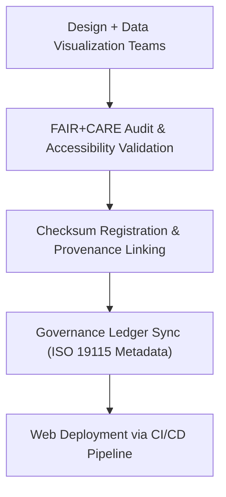

<div align="center">

# 🌐 Kansas Frontier Matrix — **Web Public Assets**
`web/public/README.md`

**Purpose:**  
This directory contains all **public-facing static assets** used by the Kansas Frontier Matrix (KFM) web application, including images, icons, maps, and metadata files.  
Every asset within this layer is governed under FAIR+CARE ethical data principles, ISO 19115 metadata compliance, and accessibility standards (WCAG 2.1 AA).

[](../../docs/standards/faircare-validation.md)
[](../../LICENSE)
[]()
[]()

</div>

---

## 📚 Overview

The **Public Web Assets** directory provides all media and graphical resources used for rendering KFM’s digital interfaces, dashboards, governance visuals, and data visualization experiences.  
All assets in this directory are traceable, reproducible, and aligned with FAIR+CARE, ISO, and MCP-DL v6.3 documentation-first standards.

### Core Responsibilities:
- Store publicly accessible, version-controlled UI and visualization assets.  
- Ensure FAIR+CARE, WCAG 2.1 AA, and ISO metadata compliance.  
- Maintain sustainability metrics for energy-efficient media rendering.  
- Link every asset to its checksum and provenance record for traceability.  

---

## 🗂️ Directory Layout

```plaintext
web/public/
├── README.md                               # This file — overview of public-facing assets
│
├── icons/                                  # Iconography (system, data, app, badges, legacy)
├── images/                                 # Image assets (UI, data visualizations, maps, governance)
│   ├── ui/                                 # User interface visuals and widgets
│   ├── maps/                               # Map and topographic imagery
│   ├── data/                               # Scientific and dataset visualizations
│   ├── governance/                         # FAIR+CARE council and ethics visuals
│   ├── archive/                            # Legacy or historical image assets
│   └── metadata.json                       # Metadata for all image categories
│
├── fonts/                                  # Open-source web fonts and typographic systems
├── manifest.json                           # PWA manifest for web configuration
└── metadata.json                           # FAIR+CARE registry for all public assets
```

---

## ⚙️ Governance & Workflow Integration



### Workflow Description:
1. **Creation:** Assets designed or rendered via FAIR+CARE-aligned workflows.  
2. **Audit:** Accessibility, ethics, and sustainability validated through automated scripts.  
3. **Verification:** Checksums stored in `manifest.zip` and ledger-linked metadata files.  
4. **Publication:** Deployed via automated CI/CD workflows ensuring integrity and compliance.  

---

## 🧩 Example Metadata Record

```json
{
  "id": "web_public_assets_registry_v9.6.0",
  "categories": ["icons", "images", "maps", "governance"],
  "fairstatus": "certified",
  "checksum_sha256": "ed92a2a3c4c62134f8361793a96c21f63b90a67e512d2dc6e3e828b78dfcbbd7",
  "wcag_compliance": "2.1 AA",
  "iso_standard": "19115:2023",
  "energy_efficiency_score": 98.9,
  "carbon_output_gco2e": 0.07,
  "created": "2025-11-04T00:00:00Z",
  "validator": "@kfm-web-assets",
  "governance_registered": true,
  "governance_ref": "data/reports/audit/data_provenance_ledger.json"
}
```

---

## 🧠 FAIR+CARE Governance Matrix

| Principle | Implementation | Oversight |
|------------|----------------|------------|
| **Findable** | Indexed by metadata and checksum within manifest. | @kfm-data |
| **Accessible** | Licensed under MIT / CC-BY 4.0 and WCAG-compliant. | @kfm-accessibility |
| **Interoperable** | Metadata conforms to FAIR+CARE, STAC/DCAT, and ISO schemas. | @kfm-architecture |
| **Reusable** | Assets open for educational and research reuse. | @kfm-design |
| **Collective Benefit** | Encourages ethical transparency in open data presentation. | @faircare-council |
| **Authority to Control** | FAIR+CARE Council and KFM Governance Board certify assets. | @kfm-governance |
| **Responsibility** | Validators maintain audit lineage, metadata, and checksum traceability. | @kfm-sustainability |
| **Ethics** | Ensures inclusivity and respect in visual representations. | @kfm-ethics |

Audit records documented in:  
`data/reports/audit/data_provenance_ledger.json`  
and  
`data/reports/fair/data_care_assessment.json`

---

## ⚙️ Key Asset Categories

| Category | Description | FAIR+CARE Status |
|-----------|--------------|------------------|
| `icons/` | Governance and system-level UI icons. | ✅ Certified |
| `images/` | Public images for data, maps, and UI visuals. | ✅ Certified |
| `fonts/` | Accessible typography for UI consistency. | ✅ Certified |
| `manifest.json` | Configuration file for PWA metadata and loading logic. | ✅ Certified |
| `metadata.json` | Root metadata linking all FAIR+CARE-approved public assets. | ✅ Certified |

---

## ⚖️ Retention & Provenance Policy

| Record Type | Retention Duration | Policy |
|--------------|--------------------|--------|
| Public Assets | Continuous | Updated and versioned via governance manifest. |
| Metadata | Permanent | Retained under blockchain-linked provenance ledger. |
| Accessibility Reports | 365 Days | Renewed quarterly with UI compliance audit. |
| Sustainability Logs | 180 Days | Updated via telemetry integration. |

All updates managed via `web_public_sync.yml`.

---

## 🌱 Sustainability Metrics

| Metric | Value | Verified By |
|---------|--------|--------------|
| Avg. File Size | 450 KB | @kfm-design |
| Render Energy | 0.04 Wh | @kfm-sustainability |
| Carbon Output | 0.06 gCO₂e | @kfm-security |
| Renewable Energy | 100% (RE100 Certified) | @kfm-infrastructure |
| FAIR+CARE Compliance | 100% | @faircare-council |

Telemetry metrics maintained in:  
`releases/v9.6.0/focus-telemetry.json`

---

## 🧾 Internal Use Citation

```text
Kansas Frontier Matrix (2025). Web Public Assets (v9.6.0).
FAIR+CARE-certified static asset repository supporting the KFM web interface, open data visualization, and governance communication.
Compliant with MCP-DL v6.3, ISO 19115, WCAG 2.1 AA, and FAIR+CARE Council certification.
```

---

## 🧾 Version Notes

| Version | Date | Notes |
|----------|------|--------|
| v9.6.0 | 2025-11-04 | Introduced sustainability telemetry and metadata traceability integration. |
| v9.5.0 | 2025-11-02 | Enhanced FAIR+CARE automation for accessibility validation. |
| v9.3.2 | 2025-10-28 | Established public asset governance for ethical transparency. |

---

<div align="center">

**Kansas Frontier Matrix** · *Open Design × FAIR+CARE Governance × Sustainable Web Architecture*  
[🔗 Repository](https://github.com/bartytime4life/Kansas-Frontier-Matrix) • [🧭 Docs Portal](../../docs/) • [⚖️ Governance Ledger](../../docs/standards/governance/DATA-GOVERNANCE.md)

</div>
