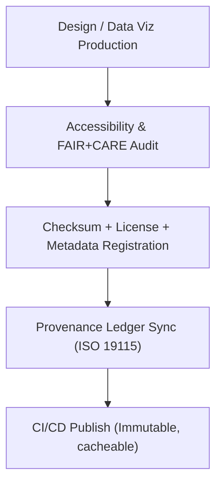

<div align="center">

# 🌐 **Kansas Frontier Matrix — Web Public Assets**
`web/public/README.md`

**Purpose:** Document the **public-facing static assets** for the KFM web application — icons, images, fonts, and PWA metadata — and define FAIR+CARE governance, accessibility, and telemetry requirements for open publication under **MCP v6.3**.

[](../../docs/README.md)
[](../../LICENSE)
[](../../docs/standards/faircare.md)
[]()

</div>

---

## 📘 Overview

This directory contains **immutable, cacheable** web assets that support the UI, governance visuals, and dataset communications.  
All assets are **licensed**, **checksum-verified**, and **a11y-reviewed**; metadata is linked to provenance ledgers and release telemetry.

---

## 🗂️ Directory Layout

```
web/public/
├── README.md
│
├── icons/                  # System, data, and app iconography (SVG/PNG)
│   └── metadata.json       # Icon registry (license, checksum, a11y tags)
│
├── images/                 # UI, maps, governance, and data visuals
│   ├── ui/
│   ├── maps/
│   ├── data/
│   ├── governance/
│   ├── archive/
│   └── metadata.json       # Image registry with FAIR+CARE annotations
│
├── fonts/                  # Open-source fonts (WOFF2) + typography tokens
├── manifest.json           # PWA manifest (name, theme, icons, scope)
└── metadata.json           # Root FAIR+CARE + provenance registry for assets
```

---

## 🧩 Governance & Publication Workflow



1. **Audit:** Axe/Lighthouse and CARE checks on new assets.  
2. **Register:** SHA-256 + SPDX license + alt text recorded in `metadata.json`.  
3. **Ledger:** Record asset provenance in governance ledgers.  
4. **Publish:** Deployed by CI; artifacts referenced in **SBOM/manifest**.

---

## 🧾 Example Asset Metadata

```json
{
  "id": "web_public_assets_v9.7.0",
  "category": "images/maps",
  "filename": "ks_topography_1890.png",
  "checksum_sha256": "ed92a2a3c4c6...b78dfcbbd7",
  "license": "CC-BY-4.0",
  "alt_text": "Topographic map of Kansas circa 1890",
  "fairstatus": "certified",
  "a11y_reviewed": true,
  "timestamp": "2025-11-05T18:55:00Z"
}
```

---

## ⚙️ FAIR+CARE Governance Matrix

| Principle | Implementation | Oversight |
|------------|----------------|------------|
| **Findable** | Asset registries searchable by checksum and category. | @kfm-data |
| **Accessible** | Alt text for all imagery; keyboard-visible focus for icon links. | @kfm-accessibility |
| **Interoperable** | Registries align with ISO 19115 + DCAT metadata. | @kfm-architecture |
| **Reusable** | MIT/CC-BY licensed; provenance included. | @kfm-design |
| **Collective Benefit** | Assets support transparent public education. | @faircare-council |
| **Authority to Control** | Council reviews sensitive imagery and narratives. | @kfm-governance |
| **Responsibility** | Designers ensure neutral, inclusive representations. | @kfm-ethics |

---

## ⚙️ Compliance & CI/CD

| Workflow | Function | Artifact |
|----------|----------|----------|
| `docs-lint.yml` | Validate README/front-matter structure | `reports/self-validation/docs/lint_summary.json` |
| `build-and-deploy.yml` | Bundle + publish assets | `../../releases/v9.7.0/manifest.zip` |
| `telemetry-export.yml` | Aggregate metrics | `../../releases/v9.7.0/focus-telemetry.json` |

---

## 🌱 Sustainability Targets

| Metric | Target | Verified By |
|-------|--------|-------------|
| Avg. Image Weight | ≤ 450 KB | Build metrics |
| Render Energy | ≤ 0.05 Wh | Telemetry |
| Carbon Output | ≤ 0.06 gCO₂e | Telemetry |
| Renewable Hosting | 100% RE100 | Infrastructure audit |

---

## 🕰️ Version History

| Version | Date | Author | Summary |
|----------|------|---------|----------|
| v9.7.0 | 2025-11-05 | KFM Core Team | Upgraded & aligned: metadata registries, telemetry schema v1, CI mapping, a11y requirements. |
| v9.6.0 | 2025-11-04 | KFM Core Team | Added sustainability telemetry and checksum traceability. |
| v9.5.0 | 2025-11-02 | KFM Core Team | Enhanced FAIR+CARE audit automation for assets. |
| v9.3.2 | 2025-10-28 | KFM Core Team | Established public asset governance and registries. |

---

<div align="center">

**© 2025 Kansas Frontier Matrix — MIT / CC-BY 4.0**  
Maintained under **Master Coder Protocol v6.3** · FAIR+CARE Certified · Diamond⁹ Ω / Crown∞Ω Ultimate Certified  
[Back to Web Folder](../README.md) · [Docs Index](../../docs/README.md)

</div>