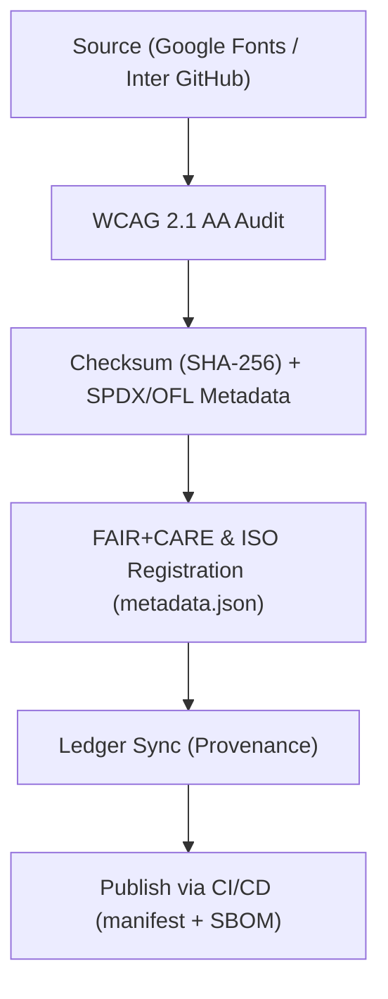

<div align="center">

# 🔤 **Kansas Frontier Matrix — Inter Typeface Family**
`web/public/fonts/Inter/README.md`

**Purpose:** Provide the official, FAIR+CARE-certified **Inter** typeface used across KFM web UI, documentation, and visualization.  
This registry guarantees **accessibility (WCAG 2.1 AA)**, **open licensing (SIL OFL 1.1)**, and **provenance** under **MCP v6.3** with sustainability telemetry.

[](../../../../../docs/README.md)
[](https://scripts.sil.org/OFL)
[](../../../../../docs/standards/faircare.md)
[]()

</div>

---

## 📘 Overview

**Inter** (by Rasmus Andersson) is KFM’s primary UI typeface for body copy, controls, and data visualizations.  
It is optimized for legibility, multilingual text, and small-size rendering — with **WOFF2** delivery, checksum lineage, and governance metadata.

---

## 🗂️ Directory Layout

```
web/public/fonts/Inter/
├── README.md
├── Inter-Regular.woff2
├── Inter-Medium.woff2
├── Inter-SemiBold.woff2
├── Inter-Bold.woff2
├── Inter-Italic.woff2
└── metadata.json            # License + checksum + FAIR+CARE + a11y metadata
```

---

## 🧩 Governance & Integration Workflow



1. **Source:** Fonts acquired only from verified open sources.  
2. **Audit:** Legibility tests across sizes, scripts, and contrast modes.  
3. **Register:** Hash + license + language coverage captured.  
4. **Ledger:** Governance log updated for provenance.  
5. **Publish:** CI attaches assets to **manifest** and references in **SBOM**.

---

## ⚙️ Contracts & Validation

| Contract | Purpose | Validator |
|----------|---------|-----------|
| Accessibility | Ensure WCAG AA text legibility & scaling | `accessibility_scan.yml` |
| FAIR+CARE | Audit inclusivity and ethical use | `faircare-validate.yml` |
| Telemetry | Track render energy & load metrics | `telemetry-export.yml` |
| Metadata | Validate SIL OFL + SPDX + ISO fields | CI schema checks |

Artifacts:
- `../../../../../releases/v9.7.0/focus-telemetry.json`  
- `../../../../../docs/reports/audit/data_provenance_ledger.json`

---

## 🧠 FAIR+CARE Governance Matrix

| Principle | Implementation | Oversight |
|------------|----------------|------------|
| **Findable** | Indexed by family/weight/checksum in `metadata.json`. | @kfm-data |
| **Accessible** | WCAG AA baseline, WOFF2 delivery, `font-display: swap`. | @kfm-accessibility |
| **Interoperable** | ISO 19115 metadata, SPDX license references. | @kfm-architecture |
| **Reusable** | SIL OFL 1.1 permits redistribution & modification. | @kfm-design |
| **Collective Benefit** | Inclusive typography for public science & education. | @faircare-council |
| **Authority to Control** | Council reviews a11y and ethics reports annually. | @kfm-governance |
| **Responsibility** | Telemetry monitors sustainability and performance. | @kfm-sustainability |
| **Ethics** | Neutral typographic tone; culturally respectful usage. | @kfm-ethics |

---

## 🔤 Usage Guidelines

| Weight | Purpose | Example Selectors | Notes |
|-------|---------|-------------------|-------|
| Regular | Body text | `p`, `li`, `.body` | Minimum 16px; responsive scaling |
| Medium | UI labels & nav | `label`, `nav a`, `.btn` | Improved contrast at small sizes |
| SemiBold | Subheads | `h4`, `h5` | Use weight for emphasis, not color alone |
| Bold | Section titles | `h1`, `h2`, `.alert-title` | Reserve for hierarchy, not decoration |
| Italic | Citations | `em`, `cite` | Avoid using color-only emphasis |

**Performance:** always set `font-display: swap` and preconnect to font origin when self-hosting is not used.

---

## 🧾 Example Font Metadata

```json
{
  "id": "inter_v9.7.0",
  "family": "Inter",
  "weights": ["Regular", "Medium", "SemiBold", "Bold", "Italic"],
  "license": "SIL Open Font License 1.1",
  "checksum_sha256": {
    "Inter-Regular.woff2": "b3c2eaabde42...02e74",
    "Inter-Bold.woff2": "e91d7f0c9a7a...a1f9c"
  },
  "wcag": "2.1 AA",
  "fairstatus": "certified",
  "energy_score": 99.2,
  "timestamp": "2025-11-05T19:25:00Z"
}
```

---

## ♿ Accessibility & Sustainability Standards

- Contrast ratio ≥ **4.5:1**; scalable line-height and spacing tokens.  
- Support user zoom and prefers-reduced-motion.  
- WOFF2 compression; subset fonts for language coverage where appropriate.  
- Energy-per-render tracked and published in telemetry.

---

## 🕰️ Version History

| Version | Date | Author | Summary |
|----------|------|---------|----------|
| v9.7.0 | 2025-11-05 | KFM Core Team | Upgraded & aligned: telemetry schema v1, governance contracts, WCAG checks, usage guidance. |
| v9.6.0 | 2025-11-04 | KFM Core Team | Added energy footprint and checksum lineage. |
| v9.5.0 | 2025-11-02 | KFM Core Team | Integrated automatic WCAG scoring and FAIR+CARE review. |
| v9.3.2 | 2025-10-28 | KFM Core Team | Established official Inter typeface registry for KFM UI. |

---

<div align="center">

**© 2025 Kansas Frontier Matrix — SIL OFL 1.1 / CC-BY 4.0**  
Maintained under **Master Coder Protocol v6.3** · FAIR+CARE Certified · Diamond⁹ Ω / Crown∞Ω Ultimate Certified  
[Back to Fonts Index](../README.md) · [Docs Index](../../../../../docs/README.md)

</div>