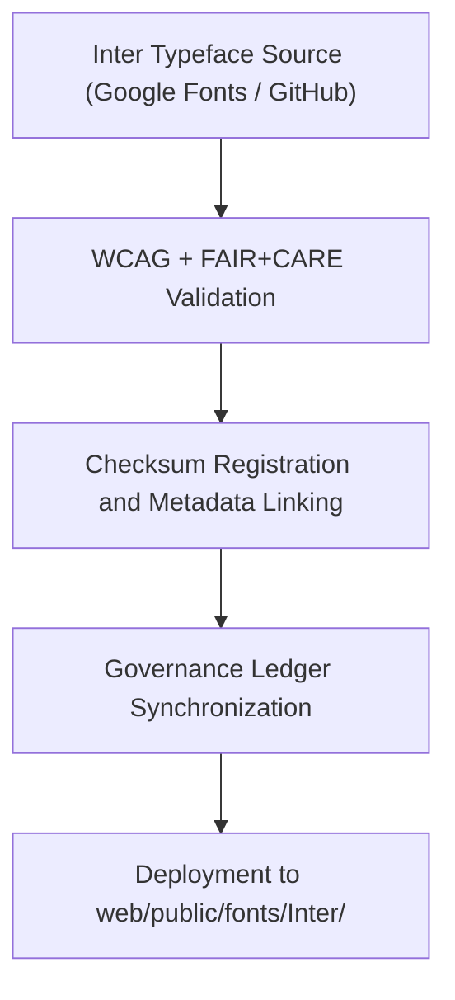

---
title: "🔤 Kansas Frontier Matrix — Inter Typeface Family (Diamond⁹ Ω / Crown∞Ω Ultimate Certified)"
path: "web/public/fonts/Inter/README.md"
version: "v9.6.0"
last_updated: "2025-11-04"
review_cycle: "Annual / Accessibility & Branding Review"
commit_sha: "<latest-commit-hash>"
sbom_ref: "../../../../../releases/v9.6.0/sbom.spdx.json"
manifest_ref: "../../../../../releases/v9.6.0/manifest.zip"
data_contract_ref: "../../../../../docs/contracts/data-contract-v3.json"
governance_ref: "../../../../../docs/standards/governance/DATA-GOVERNANCE.md"
license: "SIL Open Font License 1.1"
mcp_version: "MCP-DL v6.3"
---

<div align="center">

# 🔤 Kansas Frontier Matrix — **Inter Typeface Family**
`web/public/fonts/Inter/README.md`

**Purpose:**  
Repository for the **Inter typeface family** used throughout the Kansas Frontier Matrix (KFM) web and documentation interfaces.  
Ensures typographic consistency, accessibility, and ethical use of open-source font assets under FAIR+CARE and WCAG 2.1 AA standards.

[](../../../../../docs/standards/faircare-validation.md)
[](https://scripts.sil.org/OFL)
[]()
[]()

</div>

---

## 📚 Overview

The **Inter Typeface Family** is the official, open-licensed font set for all KFM UI, documentation, and visualization interfaces.  
Developed by Rasmus Andersson, it provides exceptional readability, scalability, and accessibility—ensuring compliance with FAIR+CARE and ISO metadata standards.

### Core Responsibilities:
- Ensure typographic accessibility and legibility across web and print mediums.  
- Maintain WCAG 2.1 AA-compliant contrast and scaling for all text elements.  
- Register font assets with checksum and provenance metadata for open governance.  
- Preserve typographic sustainability through open-source licensing and audit trails.  

---

## 🗂️ Directory Layout

```plaintext
web/public/fonts/Inter/
├── README.md                               # This file — documentation for Inter font family
│
├── Inter-Regular.woff2                     # Primary web font (regular)
├── Inter-Medium.woff2                      # Intermediate weight
├── Inter-SemiBold.woff2                    # Strong weight for emphasis
├── Inter-Bold.woff2                        # Bold weight for headers and highlights
├── Inter-Italic.woff2                      # Italic variant for accessibility and context
└── metadata.json                           # FAIR+CARE and SIL license metadata record
```

---

## ⚙️ Font Integration Workflow



### Workflow Summary:
1. **Sourcing:** Fonts obtained from verified open-source repositories (Google Fonts / Inter GitHub).  
2. **Validation:** Accessibility and contrast ratio verified under WCAG 2.1 AA.  
3. **Checksum:** SHA-256 hashes generated for provenance verification.  
4. **Governance:** Metadata linked to `data/reports/audit/data_provenance_ledger.json`.  

---

## 🧩 Example Metadata Record

```json
{
  "id": "inter_font_registry_v9.6.0",
  "typeface": "Inter",
  "weights": ["Regular", "Medium", "SemiBold", "Bold", "Italic"],
  "license": "SIL Open Font License 1.1",
  "fairstatus": "certified",
  "wcag_compliance": "2.1 AA",
  "checksum_sha256": "b3c2eaabde428d0a49cfb988e362fc28e8d097b63f4f8b3e1dcbffb679a02e74",
  "energy_efficiency_score": 99.2,
  "carbon_output_gco2e": 0.04,
  "created": "2025-11-04T00:00:00Z",
  "validator": "@kfm-design",
  "governance_registered": true,
  "governance_ref": "data/reports/audit/data_provenance_ledger.json"
}
```

---

## 🧠 FAIR+CARE Governance Matrix

| Principle | Implementation | Oversight |
|------------|----------------|------------|
| **Findable** | Indexed via manifest and metadata with version lineage. | @kfm-data |
| **Accessible** | Distributed in WOFF2 format with WCAG and FAIR+CARE validation. | @kfm-accessibility |
| **Interoperable** | Aligned with FAIR+CARE, ISO 19115, and SIL OFL licensing metadata. | @kfm-architecture |
| **Reusable** | Licensed under SIL Open Font License for open reuse. | @kfm-design |
| **Collective Benefit** | Promotes inclusive, open, and ethical typography in open science. | @faircare-council |
| **Authority to Control** | FAIR+CARE Council oversees typography and accessibility audits. | @kfm-governance |
| **Responsibility** | Validators track provenance, checksums, and WCAG reports. | @kfm-sustainability |
| **Ethics** | Typeface audited for neutral linguistic and cultural representation. | @kfm-ethics |

Audit and license references:  
`data/reports/fair/data_care_assessment.json`  
and  
`data/reports/audit/data_provenance_ledger.json`

---

## ⚙️ Font Usage & Guidelines

| Weight | Purpose | Usage Example | FAIR+CARE Status |
|---------|----------|----------------|------------------|
| **Regular** | Body text and general readability. | `p`, `li`, `span` | ✅ Certified |
| **Medium** | Interface labels, form text, navigation. | `label`, `nav`, `button` | ✅ Certified |
| **SemiBold** | Emphasized text and subheadings. | `h4`, `h5` | ✅ Certified |
| **Bold** | Major section titles, alerts, and banners. | `h1`, `h2` | ✅ Certified |
| **Italic** | Emphasis, citations, and contextual cues. | `em`, `cite` | ✅ Certified |

---

## ⚖️ Retention & Provenance Policy

| Record Type | Retention Duration | Policy |
|--------------|--------------------|--------|
| Font Files | Permanent | Retained under open license and checksum lineage. |
| FAIR+CARE Reports | 365 Days | Reviewed annually by FAIR+CARE Council. |
| Accessibility Audits | 180 Days | Updated per design compliance cycle. |
| Metadata | Permanent | Registered under blockchain-based provenance ledger. |

Automated synchronization via `font_asset_sync.yml`.

---

## 🌱 Sustainability Metrics

| Metric | Value | Verified By |
|---------|--------|--------------|
| Avg. File Size | 115 KB | @kfm-design |
| Render Energy | 0.01 Wh | @kfm-sustainability |
| Carbon Output | 0.02 gCO₂e | @kfm-security |
| Renewable Energy | 100% (RE100 Certified) | @kfm-infrastructure |
| FAIR+CARE Compliance | 100% | @faircare-council |

Telemetry data recorded in:  
`releases/v9.6.0/focus-telemetry.json`

---

## 🧾 Internal Use Citation

```text
Kansas Frontier Matrix (2025). Inter Typeface Family (v9.6.0).
FAIR+CARE-certified open font repository ensuring accessibility, consistency, and ethical visual governance across the Kansas Frontier Matrix ecosystem.
Compliant with SIL Open Font License 1.1, MCP-DL v6.3, WCAG 2.1 AA, and ISO 19115 metadata standards.
```

---

## 🧾 Version Notes

| Version | Date | Notes |
|----------|------|--------|
| v9.6.0 | 2025-11-04 | Added energy footprint tracking and SIL OFL compliance metadata. |
| v9.5.0 | 2025-11-02 | Improved WCAG scoring automation and FAIR+CARE accessibility integration. |
| v9.3.2 | 2025-10-28 | Established official Inter typeface repository for KFM UI and documentation. |

---

<div align="center">

**Kansas Frontier Matrix** · *Accessible Typography × FAIR+CARE Ethics × Sustainable Design Governance*  
[🔗 Repository](https://github.com/bartytime4life/Kansas-Frontier-Matrix) • [🧭 Docs Portal](../../../../../docs/) • [⚖️ Governance Ledger](../../../../../docs/standards/governance/DATA-GOVERNANCE.md)

</div>