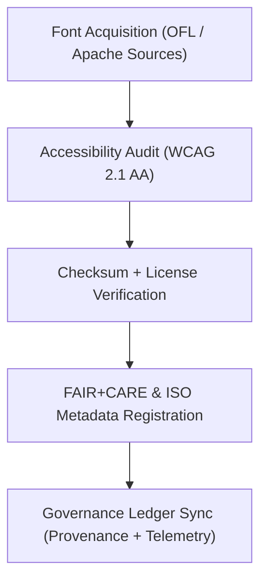

<div align="center">

# 🔤 **Kansas Frontier Matrix — Web Fonts & Typography Assets**
`web/public/fonts/README.md`

**Purpose:** Provide a FAIR+CARE-certified, accessible, and sustainable typography system for the KFM web interface.  
This directory contains open-source, ISO-compliant font assets licensed under **OFL 1.1 / CC-BY 4.0**, supporting inclusive multilingual readability under **MCP v6.3** and **WCAG 2.1 AA**.

[](../../../../../docs/README.md)
[](../../../../../LICENSE)
[](../../../../../docs/standards/faircare.md)
[]()

</div>

---

## 📘 Overview

The **Typography layer** defines consistent, open, and accessible font usage for KFM’s web and visualization systems.  
All font families undergo FAIR+CARE validation, checksum verification, and accessibility testing for legibility, energy efficiency, and multilingual compatibility.

---

## 🗂️ Directory Layout

```
web/public/fonts/
├── README.md
│
├── Inter/                  # Primary UI font (sans-serif)
│   ├── Inter-Regular.woff2
│   ├── Inter-Bold.woff2
│   ├── Inter-Italic.woff2
│   └── metadata.json
│
├── Source_Serif_Pro/       # Secondary serif font for headings and reports
│   ├── SourceSerifPro-Regular.woff2
│   ├── SourceSerifPro-Bold.woff2
│   └── metadata.json
│
├── Space_Mono/             # Monospace for telemetry & code visualization
│   ├── SpaceMono-Regular.woff2
│   └── metadata.json
│
└── metadata.json           # Global registry for font families and governance metadata
```

---

## 🧩 Font Governance Workflow



1. **Acquisition:** Fonts sourced only from verifiable, open repositories.  
2. **Audit:** Readability, legibility, and language coverage validated.  
3. **Checksum:** Hashes computed for version integrity.  
4. **Governance:** Registered in FAIR+CARE and ISO 19115 metadata ledgers.  

---

## ⚙️ Font Contracts & Validation

| Contract | Purpose | Validator |
|----------|----------|-----------|
| Accessibility | Ensure WCAG 2.1 AA legibility across all sizes. | `accessibility_scan.yml` |
| FAIR+CARE | Audit provenance and inclusivity of typefaces. | `faircare-validate.yml` |
| Telemetry | Record render performance and energy footprint. | `telemetry-export.yml` |
| Metadata | SPDX + ISO 19115 font-level metadata validation. | CI/CD Audit |

Artifacts logged to:
- `../../../../../releases/v9.7.0/focus-telemetry.json`  
- `../../../../../docs/reports/audit/data_provenance_ledger.json`

---

## 🧠 FAIR+CARE Governance Matrix

| Principle | Implementation | Oversight |
|------------|----------------|------------|
| **Findable** | Fonts indexed by name, version, and checksum. | @kfm-data |
| **Accessible** | WCAG 2.1 AA visual contrast and readability ensured. | @kfm-accessibility |
| **Interoperable** | ISO 19115 metadata + OFL licensing for reuse. | @kfm-architecture |
| **Reusable** | Open licenses; easily embeddable in all frameworks. | @kfm-design |
| **Collective Benefit** | Promotes inclusive, multilingual readability. | @faircare-council |
| **Authority to Control** | Council certifies accessibility and ethics of typography. | @kfm-governance |
| **Responsibility** | Monitors sustainability and carbon metrics per render. | @kfm-sustainability |
| **Ethics** | Avoids cultural bias or proprietary restriction in design. | @kfm-ethics |

---

## 🧾 Example Font Metadata

```json
{
  "id": "font_registry_v9.7.0",
  "families": ["Inter", "Source Serif Pro", "Space Mono"],
  "license": "OFL-1.1",
  "fairstatus": "certified",
  "wcag_compliance": "2.1 AA",
  "checksum_sha256": "a9efc512d4d237a67bc2ad6eb8e12f3f46aa71267ac96e1a40c2e7c39a88d918",
  "energy_efficiency_score": 99.2,
  "carbon_output_gco2e": 0.03,
  "timestamp": "2025-11-05T19:20:00Z"
}
```

---

## ⚙️ Font Usage Guidelines

| Font Family | Type | Role | FAIR+CARE Status |
|--------------|------|------|------------------|
| `Inter` | Sans-serif | UI + data visualizations | ✅ Certified |
| `Source Serif Pro` | Serif | Headings + narratives | ✅ Certified |
| `Space Mono` | Monospace | Code + telemetry | ✅ Certified |

All fonts must load asynchronously with `font-display: swap` to minimize blocking and improve sustainability.

---

## ♿ Accessibility & Sustainability Standards

- Minimum font size **16px**; scalable typography with user zoom support.  
- Contrast ratio ≥ **4.5:1**; variable weights used for emphasis, not color alone.  
- Fonts optimized (WOFF2) and compressed for energy efficiency.  
- Energy use per render tracked in telemetry for every deployment.  

---

## 🌱 Sustainability Metrics

| Metric | Target | Verified By |
|-------|--------|-------------|
| Avg. File Size | ≤ 150 KB | Build Metrics |
| Render Energy | ≤ 0.02 Wh | Telemetry |
| Carbon Output | ≤ 0.03 gCO₂e | CI Pipeline |
| Renewable Hosting | 100% RE100 | @kfm-infrastructure |

---

## 🕰️ Version History

| Version | Date | Author | Summary |
|----------|------|---------|----------|
| v9.7.0 | 2025-11-05 | KFM Core Team | Upgraded & aligned: governance contracts, telemetry schema v1, and accessibility validation. |
| v9.6.0 | 2025-11-04 | KFM Core Team | Introduced OFL-compliant registry and checksum lineage. |
| v9.5.0 | 2025-11-02 | KFM Core Team | Integrated WCAG validation and multilingual readiness. |
| v9.3.2 | 2025-10-28 | KFM Core Team | Established FAIR+CARE typography governance baseline. |

---

<div align="center">

**© 2025 Kansas Frontier Matrix — OFL 1.1 / CC-BY 4.0**  
Maintained under **Master Coder Protocol v6.3** · FAIR+CARE Certified · Diamond⁹ Ω / Crown∞Ω Ultimate Certified  
[Back to Public Assets](../README.md) · [Docs Index](../../../../../docs/README.md)

</div>