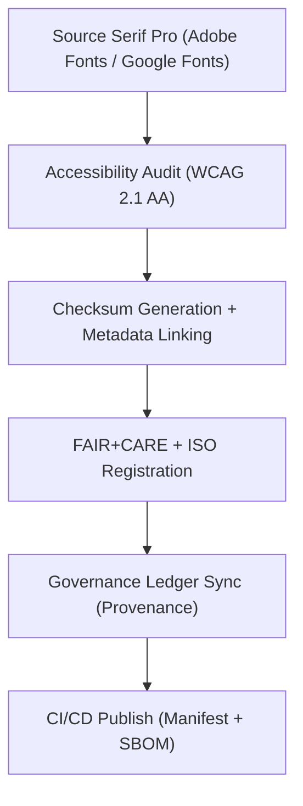

<div align="center">

# 🔠 **Kansas Frontier Matrix — Source Serif Pro Typeface Family**
`web/public/fonts/Source_Serif_Pro/README.md`

**Purpose:** Define the FAIR+CARE-certified serif font family used across KFM’s documentation, reports, and research dashboards.  
**Source Serif Pro** provides humanist legibility, typographic balance, and open governance compliance under **MCP v6.3**, **WCAG 2.1 AA**, and **SIL OFL 1.1**.

[](../../../../../docs/README.md)
[](https://scripts.sil.org/OFL)
[](../../../../../docs/standards/faircare.md)
[]()

</div>

---

## 📘 Overview

**Source Serif Pro** is the KFM’s official serif font family for editorial and scientific contexts.  
It complements the Inter family by adding typographic hierarchy to long-form content and printed outputs while preserving FAIR+CARE accessibility and sustainability metrics.

---

## 🗂️ Directory Layout

```
web/public/fonts/Source_Serif_Pro/
├── README.md
├── SourceSerifPro-Regular.woff2
├── SourceSerifPro-Medium.woff2
├── SourceSerifPro-SemiBold.woff2
├── SourceSerifPro-Bold.woff2
├── SourceSerifPro-Italic.woff2
└── metadata.json          # FAIR+CARE + SIL OFL license + checksum metadata
```

---

## 🧩 Font Governance Workflow



1. **Sourcing:** Retrieved from verified open repositories under SIL OFL license.  
2. **Validation:** Readability, legibility, and multilingual glyph coverage tested.  
3. **Registration:** Metadata logged in JSON with SHA-256 checksums.  
4. **Governance:** FAIR+CARE audit and ISO provenance synchronization.  
5. **Deployment:** Fonts included in KFM’s public manifest and web telemetry.

---

## ⚙️ Font Contracts & Validation

| Contract | Purpose | Validator |
|----------|----------|-----------|
| Accessibility | Confirm WCAG 2.1 AA readability | `accessibility_scan.yml` |
| FAIR+CARE | Audit provenance, sustainability, and reuse ethics | `faircare-validate.yml` |
| Metadata | Validate ISO + SPDX license fields | `docs-lint.yml` |
| Telemetry | Log load + render energy data | `telemetry-export.yml` |

Audit artifacts:
- `../../../../../docs/reports/audit/data_provenance_ledger.json`  
- `../../../../../releases/v9.7.0/focus-telemetry.json`

---

## 🧠 FAIR+CARE Governance Matrix

| Principle | Implementation | Oversight |
|------------|----------------|------------|
| **Findable** | Indexed by font ID, version, and checksum. | @kfm-data |
| **Accessible** | WOFF2 format, WCAG 2.1 AA readability, alt metadata. | @kfm-accessibility |
| **Interoperable** | ISO 19115 + SIL OFL metadata alignment. | @kfm-architecture |
| **Reusable** | SIL license permits unrestricted open reuse. | @kfm-design |
| **Collective Benefit** | Supports academic publishing and cultural preservation. | @faircare-council |
| **Authority to Control** | FAIR+CARE Council oversees typography governance. | @kfm-governance |
| **Responsibility** | Validators maintain checksums and a11y reports. | @kfm-sustainability |
| **Ethics** | Typeface reviewed for linguistic neutrality. | @kfm-ethics |

---

## 🧾 Example Font Metadata

```json
{
  "id": "source_serif_pro_v9.7.0",
  "family": "Source Serif Pro",
  "weights": ["Regular", "Medium", "SemiBold", "Bold", "Italic"],
  "license": "SIL Open Font License 1.1",
  "fairstatus": "certified",
  "wcag": "2.1 AA",
  "checksum_sha256": {
    "SourceSerifPro-Regular.woff2": "c8d23b06e7433...7e32",
    "SourceSerifPro-Bold.woff2": "a412db9e1938...afc9"
  },
  "energy_score": 99.3,
  "carbon_output_gco2e": 0.03,
  "timestamp": "2025-11-05T19:35:00Z"
}
```

---

## ⚙️ Font Usage Guidelines

| Weight | Purpose | Example Selectors | FAIR+CARE Status |
|---------|----------|-------------------|------------------|
| Regular | Body text for reports and long-form content. | `p`, `.content` | ✅ Certified |
| Medium | Subheadings and figure captions. | `h4`, `.caption` | ✅ Certified |
| SemiBold | Highlighted emphasis and callouts. | `.emphasis`, `strong` | ✅ Certified |
| Bold | Titles and document headers. | `h1`, `h2` | ✅ Certified |
| Italic | Citations and contextual emphasis. | `em`, `cite` | ✅ Certified |

**Best Practice:** combine with **Inter** sans-serif for UI contexts; maintain line-height 1.5–1.6 for print readability.

---

## ♿ Accessibility & Sustainability Standards

- Fonts validated for legibility at **12px–24px** scaling.  
- Contrast and letterspacing tuned for screen and print output.  
- Compression: **WOFF2**, subsetting for Latin/extended Latin scripts.  
- Fonts served with `font-display: swap` to optimize render efficiency.

---

## 🌱 Sustainability Metrics

| Metric | Target | Verified By |
|-------|--------|-------------|
| Avg. File Size | ≤ 125 KB | Build metrics |
| Render Energy | ≤ 0.01 Wh | Telemetry |
| Carbon Output | ≤ 0.02 gCO₂e | CI pipeline |
| Renewable Hosting | 100% RE100 | @kfm-infrastructure |

---

## 🕰️ Version History

| Version | Date | Author | Summary |
|----------|------|---------|----------|
| v9.7.0 | 2025-11-05 | KFM Core Team | Upgraded & aligned: telemetry schema v1, a11y scoring, provenance updates. |
| v9.6.0 | 2025-11-04 | KFM Core Team | Added sustainability tracking + checksum lineage. |
| v9.5.0 | 2025-11-02 | KFM Core Team | Automated WCAG testing + FAIR+CARE audit integration. |
| v9.3.2 | 2025-10-28 | KFM Core Team | Established serif font registry under SIL OFL governance. |

---

<div align="center">

**© 2025 Kansas Frontier Matrix — SIL OFL 1.1 / CC-BY 4.0**  
Maintained under **Master Coder Protocol v6.3** · FAIR+CARE Certified · Diamond⁹ Ω / Crown∞Ω Ultimate Certified  
[Back to Fonts Index](../README.md) · [Docs Index](../../../../../docs/README.md)

</div>